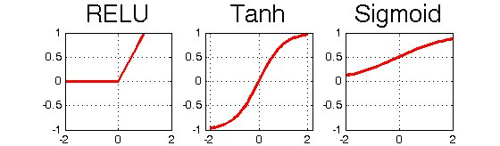
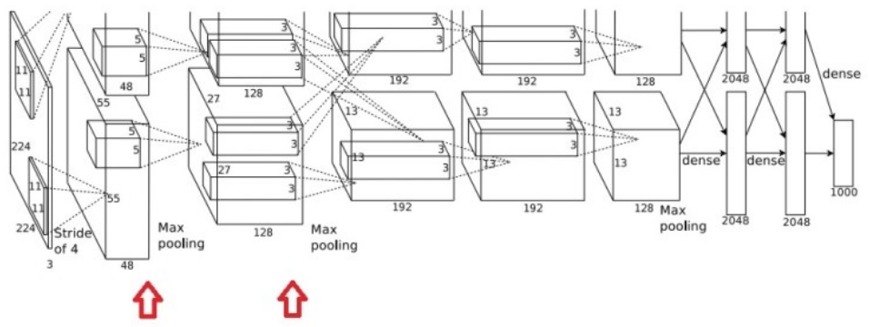
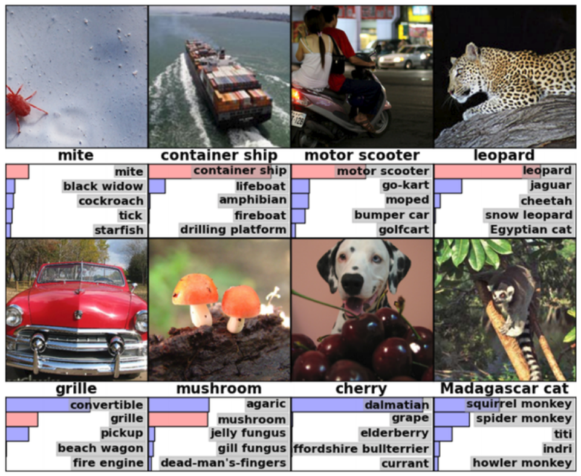

========
AlexNet
========

AlexNet은 Krizhevsky의 논문 "ImageNet classification with deep convolution neural network"에서 제안한 모델이다. AlexNet은 ImageNet ILVRC-2010의 120만 개 이미지를 1000개의 Class로 분류하는데 CNN을 사용했고 압도적인 성과를 얻었다. 아래 좌측 그림에서 SuperVision이 AlexNet이다.

.. figure:: ../img/cnn/alexnet/ilsvrc-2012.png
    :align: center
    :scale: 80%

.. rst-class:: centered

    출처: 라온피플 (Laon People) - `좌측 <https://laonple.blog.me/220654387455>`_, `우측 <https://laonple.blog.me/220667260878>`_

AlexNet은 LeNet-5와 크게 다르지 않지만 성능 개선을 위한 다양한 고려가 있었고 (Stride, 연속적인 Convolution), GPU 사용과 소스 코드 공개로 다른 연구자들에게 많은 영향을 끼쳤다. 이 후 많은 연구자들이 GPU를 사용하기 시작했다 (예: 알파고 → CPU 1,920개 / GPU 280개). 실제로 위의 우측 그래프처럼 GPU를 사용한 ILSVRC 참가자들이 증가하게 된다.

지금부터 이렇게 다른 연구자들에게 많은 영향을 끼친 AlexNet을 지금부터 하나씩 살펴보자.

Architecture
=============

AlexNet의 기본 구조는 아래와 같고, 2개의 GPU 사용을 위해 병렬적인 구조를 가지는 것 외에는 LeNet-5와 유사한 구조를 가진다.

.. figure:: ../img/cnn/alexnet/alexnet_architecture.png
    :align: center
    :scale: 80%

.. rst-class:: centered

    출처: `라온피플 (Laon People) <https://laonple.blog.me/220654387455>`_

AlexNet은 5개의 Convolution layer와 3개의 Fully connected layer로 구성되어 있다. 또한, AlexNet은 방대한 망(뉴런: 65만개, Trainable parameters: 6천만개, Connection: 6억 3천만개)을 학습하기 위해 2개의 GPU (GTX580, 메모리 3GB)를 사용했다.

AlexNet의 구조를 이해하기 위해서는 우선 블록에 대한 이해가 필요하다. 기존 LeNet은 Gray scale된 이미지였기 때문에 Depth를 고려하지 않아도 됐지만, 보통 Color 이미지는 RGB 3가지 색상을 가지기 때문에 첫 이미지의 Depth가 3이 된다. 그래서 당연히 Filter도 Depth가 3이 되고, 한 번의 Convolution은 이 Depth 3짜리 Filter로 Convolution되는 결과라고 생각하면 된다 (아래 그림 참고).

.. figure:: ../img/cnn/alexnet/3d_convolution.gif
    :align: center
    :scale: 70%

.. rst-class:: centered

    출처: `Medium <https://miro.medium.com/max/780/1*OXSVWF4zKJkSQEQNrZ1C-g.gif>`_

위와 같은 방법으로 AlexNet은 224x224x3 크기 이미지에 대해 5단계의 Convolution 또는 Subsampling을 적용시켰다.

    224x224x3 이미지 → **1단계 [11x11x3 Filter, Stride 4]** → 55x55 Feature map 96개 → **2단계 [Normalization and 5x5x48 max-pooling]** → 27x27 Feature map 256개 → **3단계 [3x3x128 Filter]** → 13x13 Feature map 384개 → **4단계 [3x3x192 Filter]** → 13x13 Feature map 384개 → **5단계 [3x3x192 Filter]** → 13x13 Feature map 256개

5단계 이후의 과정은 LeNet과 유사하다. 지금부터 이 내용을 각 Layer에 따라 조금 더 자세히 설명하려고 한다.

First layer
************

AlexNet의 입력 이미지는 크기가 227x227x3으로 크기 때문에, 11x11x3 Filter를 사용했고 Stride도 4로 했다. 그 결과 55x55 Feature map을 96개 생성했다. 이 때 Trainable parameters = Weight + Bias = (Width x Height x Depth) x Filter 수 + Bias = (11 x 11 x 3) x 96 + 96 = 34944이다.

Second layer
*************

Convolution 후 5x5x48 Max pooling을 통해 Feature map의 크기를 27x27로 줄이고 개수는 256개로 늘린다.

Third layer
************

다음으로 3x3x128 Max pooling으로 Feature map의 크기를 13x13으로 줄이고 개수는 384개로 늘린다. 이 때, GPU-1과 GPU-2의 결과를 모두 섞어 사용한다. 그리고 Response normalization도 실시하는데 그 부분은 아직 정확히 모르겠다.

Forth and fifth layer
**********************

여기서부터는 3x3x192 Filter를 적용하여 Convolution을 2번 진행한다.

Fully connected layer
**********************

위 과정을 거친 결과는 Pooling 과정으로 4096개의 Neuron을 가지는 Fully connected layer에 연결시키고, 마지막 Layer에서 1000개의 Class를 구별할 수 있도록 만든다.

AlexNet의 특징
==============

AlexNet이 성능 향상을 위해서 고려한 부분은 크게 ReLU, Overlapped pooling, Local response normalization, Data augmentation, Dropout, GPU 2개 사용 등이 있다. 지금부터 그 내용을 하나씩 살펴보려고 한다.

ReLU
*****

신경망의 활성함수로 Sigmoid, tanh 등이 많이 쓰였는데, 속도가 느리기 때문에 AlexNet처럼 망이 큰 경우에는 사용하기 어렵다. 그래서 AlexNet은 미분이 안되는 문제점이 있지만 조금 더 단순한 ReLU를 사용했다. ReLU가 속도가 더 빠른 이유는 이전 두 함수처럼 Saturated 하지 않고 Linear 하기 때문이다. 조금 더 자세한 내용은 Xaiver Glorot이 쓴 "Deep Sparse Rectifier Neural Network"나 추후 정리할 활성화 함수에서 다루려고 한다.

.. rst-class:: centered

    출처: `ResearchGate <https://www.researchgate.net/profile/Muhammad_Hamdan9/publication/327435257/figure/fig4/AS:742898131812354@1554132125449/Activation-Functions-ReLU-Tanh-Sigmoid_W640.jpg>`_

실제 논문에서 밝힌 실험결과로는 ReLU가 Sigmoid나 tanh 보다 학습속도가 약 6배 빠르다고 한다. 그래서 대량의 이미지를 학습하는 경우에 1장의 이미지를 학습하는데 걸리는 시간이 조금만 커져도 전체 학습시간은 큰 차이를 보일 수 있다. 그래서 활성함수의 선택은 매우 중요하다.

Overlapped pooling
*******************

CNN에서 Pooling은 주로 이미지 크기를 줄이기 위한 용도로 사용된다. LeNet에서는 Average pooling을 사용했지만 AlexNet에서는 Max pooling을 사용했고 이는 조금 더 생물학적인 특성과 유사하다. 그리고 아래의 빨간 화살표가 Max pooling 부분이다.

.. figure:: ../img/cnn/alexnet/pooling.png
    :align: center
    :scale: 60%

.. rst-class:: centered

    출처: `라온피플 (Laon People) <https://laonple.blog.me/220662317927>`_

일반적으로는 겹치지 않게 Pooling을 실시하는데, AlexNet에서는 Overlapped pooling 방식을 사용했다. LeNet에서 2x2 Window (Stride 1)를 사용했지만 AlexNet에서는 3x3 Window (Stride 2)를 사용했고, 논문에서는 Top-1, Top-5 에러율을 감소시켰고 Overfitting 가능성을 더 줄일 수 있다고 주장하고 있다.

Local response normalization
*****************************

활성함수로 Sigmoid나 tanh를 사용하는 경우에는 Saturation (포화)되는 구간이 있어 Overfitting을 피하기 위해 Normalization을 수행한다. 하지만 ReLU를 사용하면 이 Normalization 효과가 같이 일어나 따로 Normalization을 할 필요가 없다.

ReLU는 Linear한 함수이고, 결과값은 입력값에 비례한다. 따라서 생물학적 뉴런에서 Lateral inhibitation (강한 자극이 주변 약한 자극이 전달되는 것을 막는 효과)과 같은 효과가 있다. 즉, 기존 Sigmoid와 tanh는 0과 1 근처 부분에서 Saturated 되지만, ReLU는 Linear한 함수라 그런 구간이 없어 강한 자극은 강한 정도를 그대로 반영할 수 있게 된다는 의미다.

논문에서는 아래의 빨간 화살표 위치에서 ReLU를 사용하였고, 이를 통해 Top-1과 Top-5 에러율을 각각 1.4%, 1.2% 개선했다고 한다.

.. rst-class:: centered

    출처: `라온피플 (Laon People) <https://laonple.blog.me/220662317927>`_

Overfitting 해결책
*****************

AlexNet의 Trainable parameter는 약 6천만개이기 때문에 Overfitting 문제가 발생할 수 있다. AlexNet에서는 학습시킬 이미지 양을 늘리는 Data augmentation과 일부 Neuron을 생략하는 Dropout으로 이 문제를 해결했다.

------------------
Data augmentation
------------------

Overfitting 문제를 해결하는 가장 대표적인 방법이 데이터 양을 늘리는 것이다. 하지만 데이터 양을 늘리는 것이 쉽지 않고 늘어난 데이터만큼 학습 시간이 길어지기 때문에 효율성을 항상 고려해야 한다.

AlexNet에서는 데이터 양을 늘리기 위해 Data augmentation을 사용했고, 이를 위해 2가지 방법을 사용했다.

방법 1
------

첫 번째 방법은 256x256의 원본 이미지 중 **224x224 크기의 이미지를 무작위로 추출** 하는 것이다. 이 방법으로 1장의 이미지에서 2048개의 다른 이미지를 얻을 수 있게 된다.

:red:`Test 시에는 중앙, 상하좌우 코너를 기준으로 224x224 이미지 5개와 이를 수평으로 반전한 5개 이미지, 총 10개 이미지로부터 Softmax 출력을 평균내는 방식으로 했다 (이해 X).`

.. figure:: ../img/cnn/alexnet/data_augmentation.png
    :align: center
    :scale: 60%

.. rst-class:: centered

    출처: `라온피플 (Laon People) <https://laonple.blog.me/220662317927>`_

방법 2
------

또 다른 방법은 이미지 RGB 채널의 값을 변경시키는 방법이다. 그 방법은 **원래 픽셀 값** + **이미지의 RGB 픽셀에 대한 주성분 분석 (PCA)한 값** X **랜덤 변수 (평균: 0, 표준편차: 0.1)** 이고, 아래 내용이 실제 수식이다.

.. rst-class:: centered
    
    :math:`I_{xy} = [I_{xy}^R, I_{xy}^G, I_{xy}^B]^T + [p_1, p_2, p_3][\alpha_1 \lambda_1, \alpha_2 \lambda_2, \alpha_3 \lambda_3]^T,\ where\ \alpha_i \sim N(0, 0.1)`

이러한 2가지 방법을 이용해서 AlexNet에서는 Data augmentation을 진행했고, 실제로 Top-1 에러율을 1% 이상 줄였다고 한다.

--------
Dropout
--------

Dropout은 Voting 효과로 인한 Overfitting 문제를 개선할 수 있고, Co-adaptation을 피해 특정 Neuron의 영향력을 낮춤으로써 학습이 안되거나 학습 속도가 느려지는 문제를 개선할 수 있다. AlexNet에서는 처음 2개의 Fully connected layer에 Dropout (Rate = 50%)을 적용했다. 조금 더 자세한 내용은 2012년에 Hinton이 발표한 "Improving neural networks by preventing co-adaption of feature detectors"를 살펴보면 좋을 것 같다.

GPU 사용
********

AlexNet의 구조는 위/아래로 구분되어 있는데 이는 2개의 GPU를 사용하기 위함이다. 그렇다면 GPU를 왜 사용한 것일까? 그 이유는 :doc:`"GPU를 사용한 이유" <reason_of_gpu_usage>` 에서 확인할 수 있다.

GPU로 GTX580 (메모리 3GB)를 사용했기 때문에 모델 구조에 제약이 있었다. 지금은 더 많은 GPU를 사용하고 있고, AlexNet처럼 모델의 구조를 사용하지 않는다. 아래 그림은 첫 번째 Convolution layer에 대한 그림이다.

.. figure:: ../img/cnn/alexnet/alexnet_gpu.png
    :align: center
    :scale: 60%

.. rst-class:: centered

    출처: `라온피플 (Laon People) <https://laonple.blog.me/220654387455>`_

첫 번째 Convolution layer에서 GPU-1은 주로 컬러와 상관없는 48개의 Filter를 학습시키고, GPU-2에서는 주로 Color와 관련된 48개의 Filter를 학습시킨다. AlexNet 연구자들은 GPU 2개를 사용하여 Top-1과 Top-5 에러율을 각각 1.7%, 1.2% 줄일 수 있었다고 한다.

결과
====

지금까지 AlexNet의 특징들에 대해 살펴봤는데, 실제로 이미지 분류를 잘 할 수 있는지 한 번 확인해보자. 다음은 실제 이미지를 분류한 결과이고, Mite (진드기)가 한 쪽에 치우처져 있는 것도 잘 구별하는 것을 알 수 있다. 추정이 틀린 경우에도 보기에 따라 추정이 가능한 답변을 반환했다고 볼 수 있다.

.. rst-class:: centered

    출처: `라온피플 (Laon People) <https://laonple.blog.me/220667260878>`_

이런 결과가 SIFT (Scale Invariant Feature Transform)과 같은 Feature extractor를 사용하지 않고 나왔다는 것이 의미있는 부분이다. 실제로 당시 SIFT를 사용한 참가자의 모델은 성능이 더 낮게 나왔다. 결론적으로 데이터 양이 충분하고 좋은 CNN 구조를 가지면 좋은 결과를 낼 수 있다는 가능성을 보인 점에서 AlexNet의 의미는 크다고 할 수 있다.

해야 할 일
=========

* 라온피플 AlexNet 첫 번째 자료 다시 한 번 보고 이해 후 내용 수정

* Overlapped pooling이 왜 Overfitting을 줄일 수 있는지 이해 X + 목적이 Detail한 정보 Catch인지 아니면 Overfitting 극복인지 모르겠음

* Local response normalization 이해 X

    * ReLU를 사용하면 Sigmoid나 tanh와 다르게 Normalization을 할 필요가 없다고 하는데 이유를 모르겠음 (라온피플)
    * 원래 ReLU 이전에는 Normalization을 해야 되는 걸로 알고 있었음

Reference
==========

* 라온피플 - `Convolutional layer [1] <https://laonple.blog.me/220623406512>`_, `AlexNet [1] <https://laonple.blog.me/220654387455>`_, `AlexNet [2] <https://laonple.blog.me/220662317927>`_
* `Machine Learning Blog, Neural Network <https://nmhkahn.github.io/NN>`_
