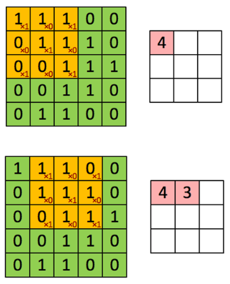

=============================
Convolutional Neural Network
=============================

Introduction
=============

위키피디아에 따르면, CNN을 아래와 같이 정의할 수 있다.

    In deep learning, a convolutional neural network (CNN, or ConvNet) is a class of deep neural networks (DNN), most commonly applied to analyzing visual imagery (출처: `Wikipedia <https://en.wikipedia.org/wiki/Convolutional_neural_network>`_).

즉, CNN은 이미지를 분석하는데 활용되는 Deep neural network라고 할 수 있다.

실제로 합성곱 신경망 (Convolutional Neural Network, CNN)은 1989년 LeCun의 논문 "Backpropagation applied to handwritten zip code recognition"에서 제안한 모델이다. CNN은 Zip code 인식을 위한 프로젝트로 개발되었다.

그렇다면 왜 기존 DNN을 사용하지 않고 CNN을 새로 개발했을까? DNN의 문제점을 살펴보면 다음과 같다.

DNN의 문제점
***********

필기체를 인식하는 예제를 통해 DNN의 문제점을 살펴보자.

.. figure:: ../img/cnn/problem_of_dnn.png
    :align: center
    :scale: 60%

DNN은 이미지 정보를 1차원 Vector로 표현하여 실제 위치 정보를 잃어버린다. 그러다보니, 글자 이미지의 위치를 조금만 이동시켜도 새롭게 학습이 필요하게 된다. 또한, 학습을 위한 Parameter의 수가 굉장히 많다. 그에 따라 학습 시간도 많이 걸린다. 그래서 이러한 문제점을 해결하기 위해 연구자들은 Visual cortex (`위키피디아 <https://ko.wikipedia.org/wiki/%EC%8B%9C%EA%B0%81%ED%94%BC%EC%A7%88>`_)의 Receptive field와 유사한 신경망을 만들고 싶어했고, 그것이 바로 CNN이다.

Receptive field
****************

Daum 백과에 따르면 Receptive field의 의미는
    
    **시각이나 체성감각 등 정보처리에 관계되는 세포의 감각수용 표면의 감각자극이 감각신경에 반응하여 충격을 일으키는 영역**
    
이다 (출처: `Daum 백과 <https://100.daum.net/encyclopedia/view/46XXX8912884>`_).

.. figure:: ../img/cnn/visual_cortex.gif
    :align: center
    :scale: 70%

    Nobel laureates David Hubel & Thorsten Wiesel discovered that there were cortical receptive fields that respond best when the stimulus was of a certain shape, had a given orientation and or moved in a given direction. For example, one receptive field might respond best when a vertical rectangle moves to the right, but not when it moves in other directions.

.. rst-class:: centered

    출처: `York university <http://www.yorku.ca/eye/cortfld.htm>`_

그림에서도 볼 수 있듯이, 외부 자극 전체 중 Receptive field는 특정 영역의 자극을 수용하는 것으로 보인다. 실제로 우리가 어떤 사물을 인식할 때도 중요한 특징들을 기반으로 인식한다. 이러한 특징을 기반으로 이미지를 인식할 때 전체가 아닌 특정 범위를 기준으로 처리하면 훨씬 더 효과적일 것이라고 추론할 수 있다. 그 결과물이 바로 CNN이고, 이를 이해하기 위해 먼저 Convolution에 대한 이해가 필요하다.

Convolution
************

Convolution은 이미지에서 특정 Feature를 추출하기 위한 필터를 구현할 때 사용된다.

위 이미지에서 빨간색으로 표기된 필터를 적용하여 이미지의 값과 필터의 값을 곱하고 더하여 왼쪽 상단 부분에 대한 Feature를 추출한다. 이 작업을 한 칸씩 이동하면서 이미지의 마지막 부분에 도착할 때까지 반복하면 필터에 해당하는 Feature를 추출해 낼 수 있게 된다.

어떤 필터를 적용하느냐에 따라 다양한 특징을 가진 이미지를 추출할 수 있다.

.. figure:: ../img/cnn/filtered_images.png
    :align: center
    :scale: 70%

CNN은 설명한 내용과 같이 Convolution을 사용하게 되면서 다음과 같은 특징을 가지게 된다.

* Locality

    * CNN은 Receptive field와 유사하게 필터를 이용하여 Local 정보를 활용함
    * 이러한 필터를 여러 개 사용 → 다양한 Local feature 추출
    * Convolution과 Subsampling 과정을 반복 → 더 넓은 이미지의 특징 추출 → Global feature 획득

* Shared weights

    * :red:`동일한 가중치를 가지는 필터를 이미지에 반복 적용함으로써 변수의 수를 줄일 수 있고, Topology 변화에 무관한 항상성을 가질 수 있다 (이해X).`

지금까지 Convolution에 대해 알아봤다. 이를 기반으로 전체적인 CNN의 구조를 살펴보자.

CNN 구조
========

.. figure:: ../img/cnn/cnn_structure.png
    :align: center
    :scale: 50%

CNN은 크게 3가지 과정으로 이루어져 있다.

* Feature extraction

    * 특징을 추출 단계
    * Filter와 Subsampling 실시

* Shift and distortion invariance

    * Topology에 영향 (Shift and distortion) 받지 않게 하는 단계
    * Feature extraction 과정을 반복하여 해결

* Classification

    * 분류기 단계

Reference
==========

* `라온피플, 1.CNN 개요 ~ 4.Convolutional layer <https://laonple.blog.me/220594258301>`_
