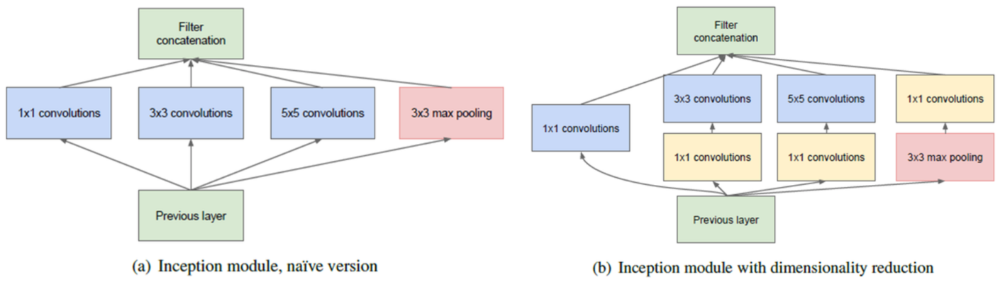
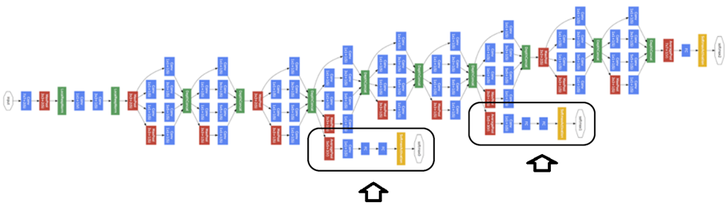
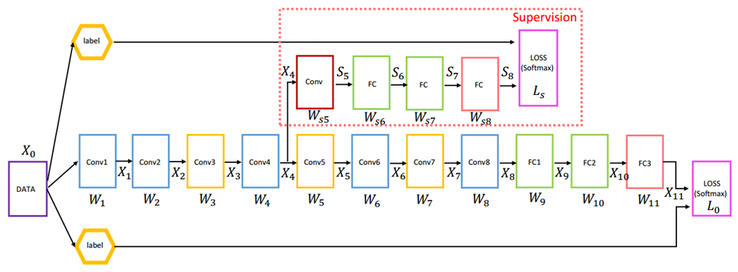
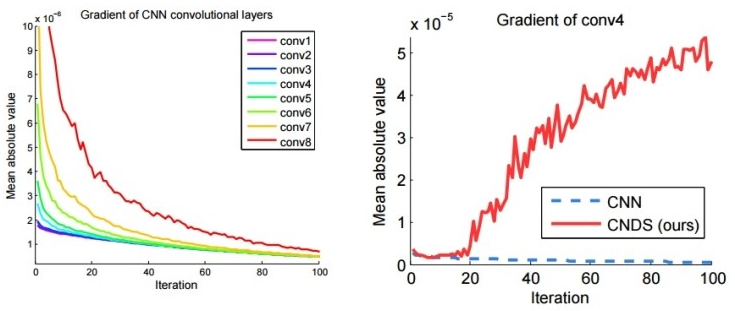

==========
GoogLeNet
==========

GoogLeNet은 2014년 ILSVRC에서 1위를 차지한 모델이고, 가장 큰 변화는 Network의 깊이다.

.. figure:: ../img/cnn/googlenet/revolution_of_depth.png
    :align: center
    :scale: 70%

.. rst-class:: centered

    출처: `라온피플 (Laon People) <https://laonple.blog.me/220686328027>`_

CNN의 성능을 향상시키는 가장 직접적인 방법은 Network 크기를 늘리는 방법이다. 2013년까지는 CNN network의 깊이가 10 미만이었지만, 2014년 GoogLeNet과 VGGNet이 각각 22 layer, 19 layer로 2배 이상 커졌다. 물론 Top-5 에러율도 각각 6.7%, 7.3% 낮아졌다. 이후 2015년에 우승한 ResNet은 152개의 Layer를 가지고 Top-5 에러율도 3.57%로 더 낮아진다.

하지만 Network가 깊어지면 Trainable parameter 수가 증가하게 되고, 그 결과 Overfitting 문제가 발생하거나 연산량이 급격히 늘어날 수 있다. AlexNet만 보더라도 Trainable parameter 수가 6천만개이고, GPU (GTX580) 2개를 사용하여 일주일 이상 학습시켰다. 단순히 Network를 깊게 만들면 학습시간이 엄청나게 길어질 수 있다.

따라서, 이러한 문제를 해결하기 위해서는 Network의 구조적인 변화에 대한 고민이 필요했고, Google에서 Inception이라는 모듈로 구성된 GoogLeNet으로 이를 해결했다. 여기서 Inception 모듈은 싱가포르 국립대학의 Min Lin이 2013년에 발표한 "Network in Network"의 구조를 더 발전시킨 형태이다. Network in Network (NIN) 구조는 :doc:`여기 <nin>` 에서 확인할 수 있다.

Inception
==========

Google 연구팀은 NIN을 기반으로 Network를 깊게 만들면서도 연산량의 수가 급격히 늘지 않는 Inception이라는 모듈을 만들었다. 또한, Local receptive field에서 더 다양한 Feature를 추출하기 위해 여러 개의 Convolution을 병렬적으로 사용했다.

.. figure:: ../img/cnn/googlenet/inception_module.png
    :align: center
    :scale: 70%

.. rst-class:: centered

    출처: `라온피플 (Laon People) <https://laonple.blog.me/220686328027>`_

Inception에서는 같은 Layer에 다른 크기를 가지는 Filter를 적용하여 다른 Scale의 Feature를 추출할 수 있게 만들었다. 그러면서 1x1 convolution을 적절히 사용하여 차원을 줄여 연산량 문제를 해결했다.

원래 초기에는 아래 그림처럼 1x1/3x3/5x5 Convolution, 3x3 Max pooling을 나란히 놓는 구조를 만들었다. 하지만 3x3과 5x5 Convolution은 연산량이 많아 Network가 깊어지면 치명적인 문제가 될 수 있다. 이러한 문제를 해결하기 위해 1x1 Convolution으로 Feature map의 차원 수를 줄였다. 

.. rst-class:: centered

    출처: `라온피플 (Laon People) <https://laonple.blog.me/220692793375>`_

GoogLeNet의 Inception은 기존 CNN 구조에서 크게 벗어나지 않으면서 NIN의 특징을 반영했다 (반면 NIN은 MLP로 Non-linear feature를 얻었으나, 결국 Fully connected 형태이고 구조적으로도 익숙하지 않음).

Parameters
***********

더욱 놀라운 것은 GoogLeNet이 Network가 더 깊은데 Trainable parameter 수는 AlexNet의 1/12 수준이라는 것이다.

.. figure:: ../img/cnn/googlenet/params_alexnet_googlenet.png
    :align: center
    :scale: 70%

.. rst-class:: centered

    출처: `라온피플 (Laon People) <https://laonple.blog.me/220686328027>`_

Google 연구팀은 Network를 더 깊게 하여 성능을 높이면서 연산량을 증가시키지 않는 연구를 진행했다. 그 결과 초기 CNN 구조의 문제점을 알았고, Inception 모듈로 구성된 GoogLeNet을 만들었다.

GoogLeNet
==========

다음은 GoogLeNet 그림이고, 9개의 Inception으로 구성되어 있다.

.. figure:: ../img/cnn/googlenet/googlenet.png
    :align: center
    :scale: 70%

.. rst-class:: centered

    출처: `라온피플 (Laon People) <https://laonple.blog.me/220704822964>`_

이미지에서 각 표기가 의미하는 바는 아래와 같다.

* :red:`빨간` 동그라미: Inception (위에 숫자: Feature map 수)
* :blue:`파란색` 모듈: Convolutional layer
* :red:`빨간색` 모듈: Max pooling
* :orange:`노란색` 모듈: Softmax layer
* :green:`녹색` 모듈: 기타 Function

그리고 아래 표가 GoogLeNet의 구조와 Paramter를 정리해 놓은 것이다. 복잡해 보이지만 이를 통해 그 구조를 정확히 이해할 수 있다.

============== ==================== ============ ====== ===== ============ ===== ============ ===== ============ ======= =====
Type           Patch size / Stride  Output size  Depth  #1x1  #3x3 reduce  #3x3  #5x5 reduce  #5x5  Pool / Proj  Params  Ops
============== ==================== ============ ====== ===== ============ ===== ============ ===== ============ ======= =====
convolution    7x7 / 2              112x112x64   1      -     -            -     -            -     -            2.7K    34M
max pool       3x3 / 2              56x56x64     0      -     -            -     -            -     -            -       -
convolution    3x3 / 1              56x56x192    2      -     64           192   -            -     -            112K    360M
max pool       3x3 / 2              28x28x192    0      -     -            -     -            -     -            -       -
inception (3a) -                    28x28x256    2      64    96           128   16           32    32           159K    128M
inception (3b) -                    28x28x480    2      128   128          192   32           96    64           380K    304M
max pool       3x3 / 2              14x14x480    0      -     -            -     -            -     -            -       -
inception (4a) -                    14x14x512    2      192   96           208   16           48    64           364K    73M
inception (4b) -                    14x14x512    2      160   112          224   24           64    64           437K    88M
inception (4c) -                    14x14x512    2      128   128          256   24           64    64           463K    100M
inception (4d) -                    14x14x528    2      112   144          288   32           64    64           580K    119M
inception (4e) -                    14x14x832    2      256   160          320   32           128   128          840K    170M
max pool       3x3 / 2              7x7x832      0      -     -            -     -            -     -            -       -
inception (5a) -                    7x7x832      2      256   160          320   32           128   128          1072K   54M
inception (5b) -                    7x7x1024     2      384   192          384   48           128   128          1388K   71M
avg pool       7x7 / 1              1x1x1024     0      -     -            -     -            -     -            -       -
dropout (40%)  -                    1x1x1024     0      -     -            -     -            -     -            -       -
linear         -                    14x14x480    1      -     -            -     -            -     -            1000K   1M
softmax        -                    14x14x480    0      -     -            -     -            -     -            -       -
============== ==================== ============ ====== ===== ============ ===== ============ ===== ============ ======= =====

우선 컬럼들이 무엇을 의미하는지 알아보자.

* Patch size / Stride

    * Filter의 크기와 Stride 값
    * 예) 7x7 / 2 → 7x7 Filter를 2 pixel씩 이동한다는 의미

* Output size

    * Convolution 후 생성되는 Feature map 크기 및 개수
    * 예) 112x112x64 → 224x224 이미지에 2 pixel 간격으로 7x7 Filter 적용 후 112x112 Feature map 64개를 얻었다는 의미

* Depth

    * 연속적인 Convolutional layer 개수
    * 예1) 첫 번째 Convolutional layer는 Depth는 1 → Convolution을 한 번만 함
    * 예2) 두 번째 Convolutional layer와 모든 Inception의 Depth는 2 → Convolution을 연속으로 두 번 함

* #1x1

    * 1x1 Convolution을 의미하고, 쓰여진 값은 1x1 Convolution 후 생기는 Feature map 개수
    * 예) Inception (3a)의 #1x1 값은 64 → Feature map 192개를 Feature map 64개로 맵핑

* #3x3 reduce

    * 3x3 Convolution 앞에 있는 1x1 Convolution을 의미하고 이를 통해 Feature map의 차원을 축소시킴
    * 예) inception (3a)의 96은 이전 Max pool layer의 192개를 1x1x192 Filter 96개를 이용해서 만든 Feature map 수를 의미

* #3x3

    * 위의 1x1 Convolution을 통해 줄어든 Feature map에 3x3 Convolution을 적용함
    * 예) Feature map 96개에 3x3 Convolution을 적용해 128개의 Feature map을 생성함

* #5x5 reduce

    * 5x5 Convolution 앞에 있는 1x1 Convolution을 의미하고 이를 통해 Feature map의 차원을 축소시킴 (#3x3 reduce와 같은 원리)
    * 예) inception (3a)의 16은 이전 Max pool layer의 192개를 1x1x192 Filter 16개를 이용해서 만든 Feature map 수를 의미

* #5x5

    * 위의 1x1 Convolution을 통해 줄어든 Feature map에 5x5 Convolution을 적용함 (#3x3과 동일한 원리)
    * 예) Feature map 96개에 3x3 Convolution을 적용해 128개의 Feature map을 생성함

* Pool / Proj

    * 3x3 Max pooling과 1x1 Convolution이 적용된 부분을 의미

    * 예

        * 먼저, 이전 Max pool layer의 28x28 Feature map 192개를 3x3 Max pooling을 통해 ?x? Feature map ?개를 만듦
        * 그 결과에 1x1x? Filter 256개를 이용해서 만든 Feature map 수가 32이고, 이 숫자가 inception (3a)에 적혀있음

* Params

    * 해당 Layer의 Trainable parameters를 의미
    * 입출력 Feature map 수에 비례
    * 예) inception 3(a)의 159K → 256개 Feature map을 만들기 위해 156K Trainable parameter가 필요함을 의미

* Ops

    * 각 Layer에서의 연산 수를 의미
    * 마찬가지로 입출력 Feature map 수에 비례
    * :red:`예) inception (3a)에서는 128M의 연산 수행 (?)`

inception (3a)를 통해 전체 흐름을 정리해보자.

이전 Max pooling의 결과로 28x28 Feature map의 192개가 만들어졌다. 이를 1x1 Convolution으로 64개, 1x1 and 3x3 Convolution으로 128개, 1x1 and 5x5 Convolution으로 32개, Max pooling and 1x1 Convolution으로 32개의 Feature map을 만들 수 있다. 그리고 그 결과를 Concatenate 해 총 256개의 Feature map을 만든다고 이해하면 된다.

Inception 모듈에서 사용되는 1x1 Convolution은 실제로 연산량을 크게 줄여준다. inception (3a)의 1x1 and 3x3 Convolution 부분에서 보면, 1x1 Convolution으로 Feature map이 192개에서 96개로 줄어 약 50% 정도의 연산량 감소를 가져온다. 1x1 and 5x5 Convolution의 경우, 192개에서 16개로 줄어 약 91.7%의 연산량을 줄일 수 있다.

추가로 3x3보다 5x5 Convolution의 결과로 얻는 Feature map 수가 작은 이유는 기본적으로 3x3이 크기가 작아 얻을 수 있는 정보가 더 많기 때문이다. 또한, 3x3보다 5x5에서 필요로 하는 연산량이 훨씬 많기 때문에 3x3 Convolution 결과의 Feature map 수가 더 작다.

Auxiliary classifier
=====================

GoogLeNet에 기존 CNN에서 사용하지 않았던 새로운 구조가 더 있다. 이는 Auxiliary Classifier (AuxClf)이고, 아래 그림에 표시된 부분이다.

.. rst-class:: centered

    출처: `라온피플 (Laon People) <https://laonple.blog.me/220710707354>`_

이는 `Gradient vanishing <../../machine_learning/optimization.html#gradient-vanishing>`_ 문제를 해결하기 위해 만들어진 구조이다. 조금 더 자세한 내용은 아래 논문에서 확인할 수 있다. 특히 두 번째 논문이 조금 더 체계적으로 참고하고 있으므로 확인하면 좋을 것 같다.

* `Deeply supervised nets, C. Y. Lee et al. <https://arxiv.org/abs/1409.5185>`_
* `Training Deeper Convolutional Networks with Deep SuperVision, Liwei Wang et al. <https://arxiv.org/abs/1505.02496>`_

우선, Leiwei 논문에 나오는 AuxClf를 먼저 이해해보자.

.. rst-class:: centered

    출처: `라온피플 (Laon People) <https://laonple.blog.me/220710707354>`_

위 그림에서 X4의 위치에 Supervision이라 부르는 AuxClf를 배치하고, Back propagation 시 X4 위치에서 AuxClf의 결과와 원래 Back propagation 결과를 결합시킨다. 이 방법으로 X4 위치에서 Gradient가 작아지는 문제를 해결할 수 있다.

GoogLeNet에서 AuxClf의 정확한 위치를 언급하지는 않았지만, 10 ~ 50번 Iteration에서 Gradient의 움직임을 파악한 후 그 위치를 결정하는 것이 좋다고 언급했다.

.. rst-class:: centered

    출처: `라온피플 (Laon People) <https://laonple.blog.me/220710707354>`_

위 그림에서 좌측 그림 (AuxClf X)에서 보면 X4 (conv4)와 그 다음 Layer에서 Gradient가 현저하게 떨어지는 경향을 보인다. 오른쪽 그림에서는 CNN (AuxClf X)은 Gradient가 0에 근접하여 학습이 더 진행되지 않지만, CNDS (AuxClf O)는 Gradient가 다시 증가하여 보다 학습이 안정적으로 진행되는 것을 알 수 있다.

2015년 후반에 GoogLeNet의 첫 번째 저자 Szegedy의 논문 "Rethinking the Inception Architecture for Computer Vision"에서, AuxClf는 Regularizer 역할을 하며 Batch normalization 또는 Dropout layer를 가지는 경우 성능이 조금 더 좋아진다고 언급했다.

그리고 AuxClf는 학습 시에만 사용되고, Test 할 때는 제거한다 (학습을 도와주기 위한 용도로만 사용).

Advanced GoogLeNet
===================

2014년 ILSVRC에서는 GoogLeNet이 ZFNet보다 성능이 2배 이상 좋았지만, 1년 후 2015년에 Microsoft가 GoogLeNet 성능보다 2배 좋은 ResNet으로 우승한다. 그 이후 기존 GoogLeNet을 개선한 Inception-V2, Inception-V3이 나왔고, 이 모델들은 3x3 Convolution만 사용하는 VGGNet에서 많은 힌트를 얻은 것으로 보인다. 자세한 내용은 :doc:`여기 <inception-v2,v3>` 에서 확인할 수 있다.

Reference
==========

* 라온피플 - `GoogLeNet [1] <https://laonple.blog.me/220686328027>`_, `GoogLeNet [2] <https://laonple.blog.me/220692793375>`_, `GoogLeNet [3] <https://laonple.blog.me/220704822964>`_, `GoogLeNet [4] <https://laonple.blog.me/220710707354>`_
* `YouTube, 최희정 - CNN Localization (ZFNet & Deep Taylor Decomposition) <https://www.youtube.com/watch?v=46TlWpZgKRE>`_
* `Training Deeper Convolutional Networks with Deep SuperVision, Liwei Wang et al. <https://arxiv.org/abs/1505.02496>`_
