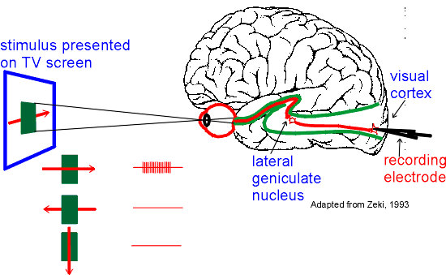

=============
Introduction
=============

위키피디아에 따르면, CNN을 아래와 같이 정의할 수 있다.

    In deep learning, a convolutional neural network (CNN, or ConvNet) is a class of deep neural networks (DNN), most commonly applied to analyzing visual imagery (출처: `Wikipedia <https://en.wikipedia.org/wiki/Convolutional_neural_network>`_).

즉, CNN은 이미지를 분석하는데 활용되는 Deep neural network라고 할 수 있다.

실제로 합성곱 신경망 (Convolutional Neural Network, CNN)은 1989년 LeCun의 논문 "Backpropagation applied to handwritten zip code recognition"에서 제안한 모델이다. CNN은 Zip code 인식을 위한 프로젝트로 개발되었다.

그렇다면 왜 기존 DNN을 사용하지 않고 CNN을 새로 개발했을까? DNN의 문제점을 살펴보면 다음과 같다.

DNN의 문제점
===========

필기체를 인식하는 예제를 통해 DNN의 문제점을 살펴보자.

.. figure:: ../img/cnn/intro/problem_of_dnn.png
    :align: center
    :scale: 60%

.. rst-class:: centered

    출처: `라온피플 (Laon People) <https://laonple.blog.me/220587920012>`_

DNN은 이미지 정보를 1차원 Vector로 표현하여 실제 위치 정보를 잃어버린다. 그러다보니, 글자 이미지의 위치를 조금만 이동시켜도 새롭게 학습이 필요하게 된다. 또한, 학습을 위한 Parameter의 수가 굉장히 많다. 그에 따라 학습 시간도 많이 걸린다. 그래서 이러한 문제점을 해결하기 위해 연구자들은 Visual cortex (`위키피디아 <https://ko.wikipedia.org/wiki/%EC%8B%9C%EA%B0%81%ED%94%BC%EC%A7%88>`_)의 Receptive field와 유사한 신경망을 만들고 싶어했고, 그것이 바로 CNN이다.

Receptive field
================

Daum 백과에 따르면 Receptive field의 의미는
    
    **시각이나 체성감각 등 정보처리에 관계되는 세포의 감각수용 표면의 감각자극이 감각신경에 반응하여 충격을 일으키는 영역**
    
이다 (출처: `Daum 백과 <https://100.daum.net/encyclopedia/view/46XXX8912884>`_).

    Nobel laureates David Hubel & Thorsten Wiesel discovered that there were cortical receptive fields that respond best when the stimulus was of a certain shape, had a given orientation and or moved in a given direction. For example, one receptive field might respond best when a vertical rectangle moves to the right, but not when it moves in other directions.

.. rst-class:: centered

    출처: `York university <http://www.yorku.ca/eye/cortfld.htm>`_

그림에서도 볼 수 있듯이, 외부 자극 전체 중 Receptive field는 특정 영역의 자극을 수용하는 것으로 보인다. 실제로 우리가 어떤 사물을 인식할 때도 중요한 특징들을 기반으로 인식한다. 이러한 특징을 기반으로 이미지를 인식할 때 전체가 아닌 특정 범위를 기준으로 처리하면 훨씬 더 효과적일 것이라고 추론할 수 있다. 그 결과물이 바로 CNN이고, 이를 이해하기 위해 먼저 Convolution에 대한 이해가 필요하다.

Convolution
============

Convolution은 이미지에서 특정 Feature를 추출하기 위한 Filter를 구현할 때 사용된다.

.. figure:: ../img/cnn/intro/convolution.png
    :align: center
    :scale: 70%

.. rst-class:: centered

    출처: `라온피플 (Laon People) <https://laonple.blog.me/220594258301>`_

위 이미지에서 빨간색으로 표기된 Filter를 적용하여 이미지의 값과 Filter의 값을 곱하고 더하여 왼쪽 상단 부분에 대한 Feature를 추출한다. 이 작업을 한 칸씩 이동하면서 이미지의 마지막 부분에 도착할 때까지 반복하면 Filter에 해당하는 Feature를 추출해 낼 수 있게 된다 (즉, Filter를 이용하여 Image의 특징이 나타나는 위치를 찾아내는 것이 핵심!!).

어떤 Filter를 적용하느냐에 따라 다양한 특징을 가진 이미지를 추출할 수 있다.

.. figure:: ../img/cnn/intro/filtered_images.png
    :align: center
    :scale: 70%

.. rst-class:: centered

    출처: `라온피플 (Laon People) <https://laonple.blog.me/220594258301>`_

CNN은 설명한 내용과 같이 Convolution을 사용하게 되면서 다음과 같은 특징을 가지게 된다.

* Locality

    * CNN은 Receptive field와 유사하게 Filter를 이용하여 Local 정보를 활용함
    * 다양한 Filter를 여러 개 사용 → 다양한 Local feature 추출
    * Convolution과 Subsampling 과정을 반복 → 더 넓은 이미지의 특징 추출 → Global feature 획득

* Shared weights

    * :red:`동일한 가중치를 가지는 Filter를 이미지에 반복 적용 → 변수 수 감소 + Topology 변화에 무관한 항상성 획득 (이해X)`

지금까지 Convolution에 대해 알아봤다. 이를 기반으로 전체적인 CNN의 구조를 살펴보자.

CNN 구조
========

.. figure:: ../img/cnn/intro/cnn_structure.png
    :align: center
    :scale: 60%

.. rst-class:: centered

    출처: `라온피플 (Laon People) <https://laonple.blog.me/220608018546>`_

CNN은 Feature extraction이 내부적으로 진행되기 때문에 특별한 전처리가 필요없고, 크게 3가지 단계로 구성된다.

1. Feature extraction

    * Filter와 Subsampling으로 통해 특징을 추출하는 단계

2. Shift and distortion invariance

    * Topology에 영향 (Shift and distortion) 받지 않게 하는 단계
    * Subsampling과 Feature extraction 과정의 반복으로 이동/변형에 무관한 Global한 특징을 추출할 수 있음

3. Classification

    * 분류기 단계
    * Global feature를 이용하여 원하는 목적을 이룰 수 있게 하는 부분
    * Neural network와 유사하고 기본적으로 Fully connected layer 사용

실제로 CNN은 아래 그림처럼 Convolution과 Subsampling Layer, Fully connected layer로 구성된다.

.. figure:: ../img/cnn/intro/lenet-5.png
    :align: center
    :scale: 60%

.. rst-class:: centered

    출처: `라온피플 (Laon People) <https://laonple.blog.me/220608018546>`_

간단하게 각 과정에 대해 언급했는데, Filter와 Subsampling에 대해 조금 더 자세히 알아보자.

Filter
*******

이전 Introduction에서 이미지에서 특징을 추출하기 위해 여러 가지 값이 `정해진 Filter <#convolution>`_ 를 사용했었다. 마찬가지로 CNN에서도 Filter를 사용하는데, 이전처럼 고정된 Filter가 아니라 학습을 통해 만들어지는 Filter를 사용한다는 점에서 다르다.

또한, 위에서 확인해 본 것처럼 하나의 이미지에도 다양한 Filter를 사용하면 다양한 특징들이 추출된다. 그렇다면 CNN에서는 몇 개의 Filter를 사용하는게 적절할까? 그리고 각 Filter의 크기는 어떤 것이 적절할까?

------------
Filter의 개수
------------

일반적으로는 입력 이미지 근처에서는 적게 사용하고, 멀어질수록 더 많이 사용하는 경향이 있다. 조금 더 정확한 규칙은 없을까?

Filter의 개수를 결정하는 일반적인 방법은 각 Layer에서 연산 시간/양을 일정하게 유지하여 시스템의 균형을 맞추는 방향으로 결정된다. 즉, 각 Layer에서 Feature map (Feature map은 보통 이미지를 Filter로 Convolution한 결과를 의미함)의 개수와 Pixel 수의 곱을 일정하게 유지할 수 있게 Filter 개수를 결정하면 된다.

예를 들면, Convolution layer에서 2x2 Subsampling을 하는 경우 Pixel 수가 1/4로 줄어들기 때문에 그 다음 Convolution 할 때는 Filter 수를 4배로 증가시켜 Feature map 수를 4배로 증가시키면 된다.

-------------
Filter의 크기
-------------

Filter의 크기는 여러 논문에서 다양한 형태로 나타나는데, 이미지의 크기가 클수록 더 큰 Filter를 사용한다. 그렇다면 큰 크기의 Filter를 하나 사용하는 것과 작은 크기의 Filter를 여러 개 사용하는 것 중에 뭐가 더 좋을까?

정답은 작은 크기의 Filter를 여러 개 사용하는 것이다. 여러 개를 사용하면 중간에 :red:`비선형화 과정을 통해 특징을 더 돋보이게 만들 수 있다 (?).` 또한, 연산량도 더 줄일 수 있다. 조금 더 자세한 내용은 추후에 다룰 예정이니 우선 결론을 알고 있자.

이 외에도 Filter로 Convolution 시 고려할 수 있는 Hyperparameter로 Stride와 Zero padding이 있다.

-------
Stride
-------

Stride는 Convolution 시 건너 뛸 픽셀 수를 의미한다. 아래의 이미지는 Stride가 1인 경우다.

.. figure:: ../img/cnn/intro/stride.jpg
    :align: center
    :scale: 70%

.. rst-class:: centered

    출처: `TAEWAN.KIM 블로그 <http://taewan.kim/post/cnn/>`_

그렇다면 Stride 값이 커지면 어떻게 될까? Stride 값이 커지면 중복되는 부분이 줄어들고 Convolution이 시도되는 범위가 줄어, Local feature의 특성을 다 고려하지 못한 Global feature가 만들어질 수도 있다.

그래서 통상적으로 Stride를 1로 두고 Subsampling 작업을 하지만, 입력 영상 크기가 큰 경우 연산량을 줄이기 위한 목적으로 입력 Layer 가까운 쪽에서 적용하기도 한다 (AlexNet).

-------------
Zero padding
-------------

Zero padding은 Convolution 후 Feature map의 크기가 입력 크기보다 작아지는 것을 막기 위해 사용하는 방법이다. 말 그대로 입력 이미지의 경계에 0을 추가해 Convolution 하더라도 크기가 유지되게 만드는 방법이다.

.. figure:: ../img/cnn/intro/zero_padding.gif
    :align: center
    :scale: 80%

.. rst-class:: centered

    출처: `PyImageSearch <https://s3-us-west-2.amazonaws.com/static.pyimagesearch.com/keras-conv2d/keras_conv2d_padding.gif>`_

위 그림에서 보는 것처럼 Zero padding을 추가하면, Convolution을 하더라도 기존 이미지와 크기가 동일한 Feature map이 만들어지는 것을 볼 수 있다. 그리고 Zero padding을 하는 이유는 Convolution 후 Feature map 크기를 입력 이미지 크기로 유지하는 것도 있지만, 경계면의 정보 획득할 수 있다는 점도 있다.

Subsampling
************

일반적인 Subsampling은 고정된 위치의 픽셀을 고르거나 Filter 내 픽셀의 평균을 계산하는 방식으로 진행된다. CNN에서도 유사한데, 크게 2가지 방법이 있다.

.. figure:: ../img/cnn/intro/pooling.png
    :align: center
    :scale: 70%

.. rst-class:: centered

    출처: `라온피플 (Laon People) <https://laonple.blog.me/220608018546>`_

* Max pooling

    * 실제 Neuron에서는 여러 자극 중 가장 큰 자극만 전달한다고 함
    * CNN에서는 Window 내의 가장 큰 값을 선택하는 방법
    * 여기서 Window는 이미지에서 Subsampling하는 범위를 의미함

* Average pooling

    * Window의 평균을 계산하는 방법

지금까지 CNN의 각 구조에 대해서 이해를 해봤다. 언급된 내용을 간단히 정리하면 다음과 같다.

.. rst-class:: centered

    **Filter를 이용한 Convolution 작업과 Subsampling과정을 반복적으로 진행**

    **↓**

    **Local feature로부터 Global feature 생성**
    
    **↓**

    **Global feature를 Fully connected layer를 통해 학습하여 분류 실시**

지금까지 CNN의 전체적인 구조를 살펴봤다. 그렇다면 이러한 CNN을 실제로 어떻게 구현했는지 지금부터 알아보려고 한다.

CNN architectures
==================

CNN에 대해 더 이해하기 위해서는 대표적인 CNN을 살펴보는 것이 좋다. 특히, 이미지넷 이미지 인식 대회인 ILSVRC (ImageNet Large Scale Visual Recognition Challenge)에서 수상했던 CNN architecture를 중심으로 언급하려고 한다.

* :doc:`lenet`

    * Yann LeCun이 1989년에 발표한 구조로 처음으로 CNN을 성공적으로 도입함
    * Zip code 인식 프로젝트를 통해 개발됨
    * CNN 역사의 고전

* AlexNet
* ZF Net
* GoogLeNet
* VGGNet
* ResNet

추가적으로 ImageNet과 ILSVRC가 무엇인지 간단하게 설명하면 다음과 같다.

ImageNet
*********

(작성 예정)

ILSVRC
*******

(작성 예정)

지금까지 CNN의 기본적인 내용과 대표 Architecture에 대해 간단히 알아보았다. 지금부터는 각각의 CNN architecture를 조금 더 자세히 알아보려고 한다.

Reference
==========

* 라온피플, Machine learning academy, Part IV. CNN

    * `1. CNN 개요 <https://laonple.blog.me/220594258301>`_
    * `2. Why CNN? <https://laonple.blog.me/220594258301>`_
    * `3. CNN의 구조 <https://laonple.blog.me/220608018546>`_

* 라온피플, Machine learning academy, Part V. Best CNN Architecture

    * `1. Overview <https://laonple.blog.me/220643128255>`_
