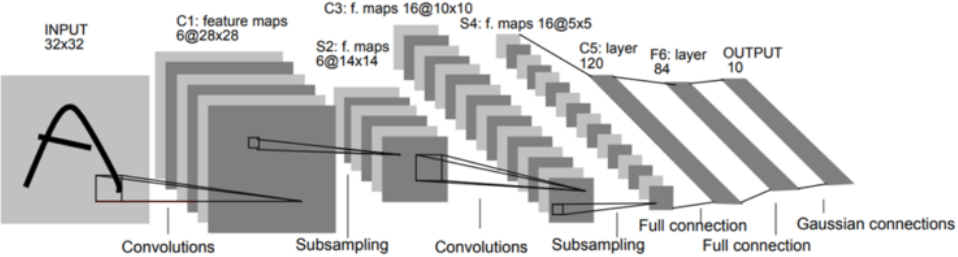

======
LeNet
======

LeNet은 Yann Lecun이 개발한 CNN architecture 이름이다. LeNet은 LeNet-1부터 LeNet-5까지 있고, 여기서는 LeNet-1과 LeNet-5만 다룰 예정이다.

LeNet-1
========

1990년에 처음으로 LeNet-1을 발표했고, Architecture는 아래와 같다.

.. figure:: ../img/cnn/lenet/lenet-1.png
    :align: center
    :scale: 60%

.. rst-class:: centered

    출처: `라온피플 (Laon People) <https://laonple.blog.me/220608018546>`_

먼저, LeNet-1은 입력 이미지에서 필터를 활용한 Convolution으로 Feature map을 만든다. 여기서 여러 다른 특징을 추출하기 위해 다양한 필터를 사용하여 여러 개의 Feature map을 만들 수 있다. 

다음으로 Subsampling으로 Feature map을 줄일 수 있고, 이를 통해 Topological invariance를 얻을 수 있다. 또한, 하나의 Feature map에서 Subsampling을 통해 하나의 Local feature를 얻고, 그 Local feature에서 다시 Convolution과 Subsampling으로 Feature를 얻는 과정을 통해 Global feature를 얻을 수 있다. 결국, 전체를 대표할 수 있는 강한 특징들만 남게 된다.

마지막으로 전체를 대표할 수 잇는 Global feature를 10개의 Class로 Convolution하여 Classification이 가능하게 만든다. 정리하면, LeNet-1은 크게 Convolutional layer, Subsampling layer로 구성되어 있다고 할 수 있다.

LeNet-5
========

그 이후로 계속 개선하여 최종적으로 1998년에 LeNet-5를 발표했다. LeNet-5에서는 여러 Hyperparameter가 변경됐다는 점과 Fully connected layer가 추가된 점이 다르다. 아래 그림이 "Gradient-based learning applied to document recognition"에서 제안했던 LeNet-5의 Architecture이다. 이 논문은 정체기에 빠졌던 신경망 연구의 돌파구 역할을 했다.

.. rst-class:: centered

    출처: `라온피플 (Laon People) <https://m.blog.naver.com/laonple/221218707503>`_

LeNet-5는 입력으로 32x32 크기 이미지를 받고, 5x5 필터로 Convolution하여 28x28 Feature map 6개를 생성한다. 그리고 이를 Subsampling으로 14x14 Feature map 6개를 만든다. 여기서 다시 5x5 필터로 Convolution하여 10x10 Feature map 16개를 만들고, 이를 Subsampling하여 5x5 Feature map 16개를 만든다.

이를 일렬로 쭉 나열한 후 크기가 120인 Fully connected layer에 연결한다. 그 후 크기가 84, 10인 Layer와 연결하여 최종적으로 10개의 Class를 구분할 수 있게 만들었다.

CNN 적용 결과
============

다음은 LeNet-5에서 C1, S2, C3, S4, C5, F6에서 이미지가 변환된 결과를 보여주는 그림이다.

.. figure:: ../img/cnn/lenet/lenet_cnn_result.png
    :align: center
    :scale: 60%

.. rst-class:: centered

    출처: `라온피플 (Laon People) <https://laonple.blog.me/220623406512>`_

여기서 C1과 C3는 Convolution 결과이고, S2와 S4는 Subsampling 결과이다. C1/S2, C3/S4 단계를 거치면서 Topology 변화에 강한 Feature를 생성한 후, C5/F6의 Fully connected layer를 지나면서 숫자를 인식하게 된다. 결론적으로 Noise가 상당한 경우에도 잘 구분하는 것을 볼 수 있다.

LeNet은 여러 CNN architecture의 기반이 되었고, 이후에는 이를 기반으로 한 AlexNet을 살펴볼 예정이다.

Reference
==========

* 라온피플, Machine learning academy, Part IV. CNN

    * `3. CNN의 구조 <https://laonple.blog.me/220608018546>`_
    * `4. Convolutional layer [1] <https://laonple.blog.me/220623406512>`_
    * `4. Convolutional layer [2] <https://laonple.blog.me/220624485850>`_
