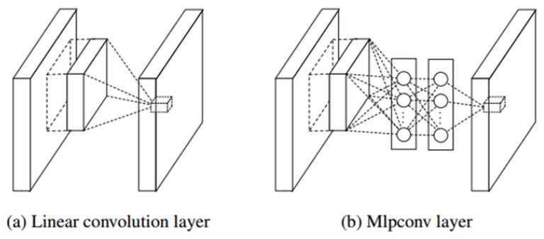

===================
Network in Network
===================

Network in Network (NIN)은 싱가포르 국립대학의 Min Lin이 2013년에 발표한 모델이다.

CNN의 Convolution layer가 Local receptive field에서 Feature를 추출할 때 Filter로 게산하므로 Linear한 문제가 있다. 기존에는 Feature map을 늘려서 이러한 문제를 극복하려고 했지만 Filter가 늘어남에 따라 연산량이 늘어나는 문제가 있다.

그래서 Lin은 Convolution을 할 때 Filter 대신에 MLP (Multi layer perceptron)을 사용하여 Feature를 추출하는 방법을 고안했다.

.. rst-class:: centered

    출처: `라온피플 (Laon People) <https://laonple.blog.me/220686328027>`_

기존 CNN에서는 Filter를 이용하여 Stride만큼 이동하면서 Convolution으로 Feature를 추출했다. NIN에서도 유사하게 진행되는데 Filter 대신에 MLP를 쓰는 부분만 다르다고 할 수 있다. :red:`조금 더 구체적인 내용은 검색 후 추가 정리할 예정이다.`

MLP를 이용했을 때 장점은 Filter를 사용할 때보다 Non-linear한 성질을 잘 활용할 수 있어 더 좋은 Feature를 추출할 수 있다는 점이다. 또한, 1x1 Convolution을 통해 Feature map을 줄일 수 있게 했다 (아래에서 설명).

(추가 작성 예정)

1x1 Convolution
================

(작성 예정)

Reference
==========

* `라온피플, GoogLeNet [2] <https://laonple.blog.me/220692793375>`_
