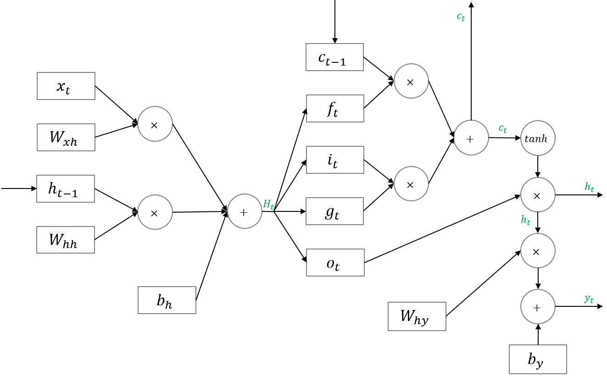

=====================================
Long Short-Term Memory models (LSTM)
=====================================

:doc:`Recurrent Neural Network (RNN) <rnn>` 은 관련 정보와 그 정보를 사용하는 지점 사이 거리가 멀 경우, 역전파 시 그래디언트가 점차 줄어 학습능력이 크게 저하되고 이를 **Vanishing gradient problem** 이라고 한다. 이 문제를 극복하기 위해서 고안된 것이 바로 Long Short-Term Memory models (LSTM)이고, LSTM은 RNN의 Hidden State에 Cell-state를 추가한 구조다.

.. figure:: ../img/sm/lstm_structure.png
  :align: center
  :scale: 40%

Gate
=====

LSTM은 2가지 Gate (Forget gate, Input gate)를 추가하여 과거 정보와 현재 정보의 기억 정도를 조절한다.

.. figure:: ../img/sm/gate.png
  :align: center
  :scale: 40%

Forget gate
************

Forget gate는 ‘과거 정보를 잊기’를 위한 게이트이다. :math:`h_{t−1}` 과 :math:`x_t` 를 받아 시그모이드를 취해준 값이 바로 forget gate가 내보내는 값이다. 시그모이드 함수의 출력 범위는 0에서 1 사이이기 때문에 그 값이 0이라면 이전 상태의 정보는 잊고, 1이라면 이전 상태의 정보를 온전히 기억하게 된다.

Input gate
***********

Input gate는 ‘현재 정보를 기억하기’ 위한 게이트이다. :math:`h_{t−1}` 과 :math:`x_t` 를 받아 시그모이드를 취하고, 또 같은 입력으로 하이퍼볼릭탄젠트를 취해준 다음 Hadamard product 연산을 한 값이 바로 input gate가 내보내는 값이다. :math:`i_t` 의 범위는 0~1, :math:`g_t` 의 범위는 -1~1이기 때문에 각각 강도와 방향을 나타낸다고 할 수 있다.
  

Propagation
============

Forward propagation
********************

Back propagation
*****************

.. figure:: ../img/sm/back_propagation.gif
  :align: center
  :scale: 70%

Bi-directional LSTM (BLSTM)
============================

기본적인 LSTM 모델은 이전 시간의 Step들이 다음 Step에 영향을 줄 것이라는 가정을 했다. 하지만 이후의 Step 또한 앞의 Step 에 영향을 줄 수 있다면 이 모델을 어떻게 적용시킬 수 있을까? 이후의 Step 의 영향도 반영한 모델이 Bidirectional LSTM (BLSTM) 모델이다.

BLSTM은 두 개의 LSTM 모델을 Concatenate하여 사용한다. Time step 이 1부터 :math:`t` 까지 있다고 가정할 때 Forward lstm model에서는 Input을 Time step이 1일때부터 :math:`t` 까지 순차적으로 주고 학습한다. 반대로 Backward lstm model에서 Input을 :math:`T = t` 일때부터 1까지 거꾸로 Input 주고 학습을 하게 된다. 결국 Time step 마다 두 모델에서 나온 2개의 Hidden vector는 학습된 가중치를 통해 하나의 Hidden vector로 만들어지게 된다.

.. figure:: ../img/sm/blstm_structure.png
  :align: center
  :scale: 70%

Reference
=========

* `Coursera <https://www.coursera.org/learn/nlp-sequence-models>`_
* `ratsgo's blog <https://ratsgo.github.io/natural%20language%20processing/2017/03/09/rnnlstm/>`_
* `colah's blog <http://colah.github.io/posts/2015-08-Understanding-LSTMs/>`_
* `Pozalabs github <https://pozalabs.github.io/blstm/>`_
