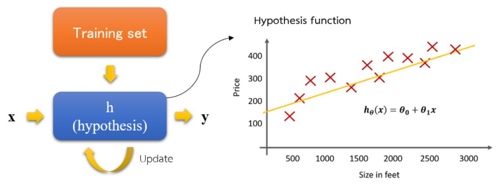
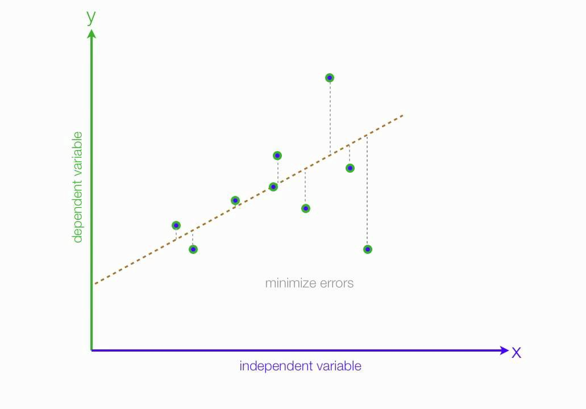
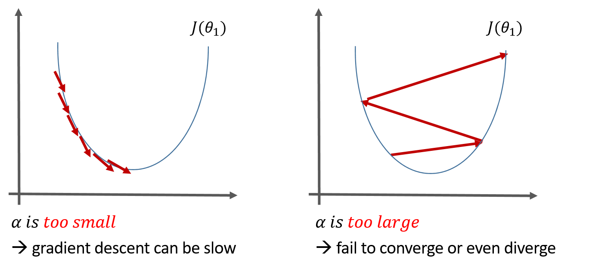

=================
Linear regression
=================

Linear regression is a **linear approach** to modeling the relationship between a scalar response (or dependent variable) which is **continuous** and one or more explanatory variables (or independent variables) (Ref.: `Wikipedia <https://en.wikipedia.org/wiki/Linear_regression>`_).

쉽게 설명하면 주어진 데이터를 가장 잘 설명하는 직선 하나를 찾는 것이 Linear regression이다.

I will explain linear regression using a **housing price prediction** example.

Univariate linear regression
============================

Univariate linear regression is the linear regression with **one variable**. → 즉, 하나의 설명 변수로 선을 찾는 것이 Univariate linear regression이다.

A below figure describes housing price prediction with univariate linear regression.

.. figure:: img/lr/univariate_lr_ex.png
  :align: center
  :scale: 40%

Process
*******

A hypothesis function is a prediction model trained by a cost function using training set.

This is a training set example.

.. figure:: img/lr/notation_of_training_set.png
  :align: center
  :scale: 40%

* :math:`m = \text{The number of training examples (samples)}`
* :math:`x's = \text{Input variables (Features)}`
* :math:`y's = \text{Output variables (Target variables)}`
* :math:`(x, y) = \text{One training example}`
* :math:`(x_i, y_i) = i_{th} \text{training example}`

결론적으로 주어진 데이터로 :math:`\theta_0` 와 :math:`\theta_1` 을 찾는 것이다.

Cost function
*************

To find the best parameters, we should minimize costs for training examples. So, we need a cost function to calculate losses between predictions and answers.

.. rst-class:: centered

    Source: `towards data science <https://miro.medium.com/max/1664/1*F4JzgiTIUfFePLBj4A_JPw.jpeg>`_

**Idea:**

* Choose :math:`\theta_0, \theta_1` so that :math:`h_{\theta} (x)` is close to :math:`y` for training samples

* Examples:

    .. figure:: img/lr/cost_function_ex.png
        :align: center
        :scale: 50%

This is one of the methods called Mean Suqared Error (MSE or L2 loss) for the cost function and the goal is to minimize the squared error function.

.. figure:: img/lr/cost_function_equation.png
    :align: center
    :scale: 40%

Besides the MSE function, there are many cost functions (:doc:`Link <loss_func>`).

결국, 우리의 목적은 이러한 MSE가 최소화가 되도록 :math:`\theta_0,\ \theta_1` 을 구하는 것이고, 단순히 최적의 :math:`\theta_1` 을 구하는 방법은 :math:`\theta_1 = (x^T x)^{-1} x^T y` (수식 이해 안감)를 푸는 것이다. 하지만 데이터가 커짐에 따라 시간 복잡도가 :math:`O(n^3)` 로 증가하여 비효율적이다. 그래서 이러한 문제를 해결하는 방법이 Gradient descent이다.

----------------
Gradient descent
----------------

Gradient descent is a first-order iterative optimization algorithm for finding the minimum of a function. To find a local minimum of a function using gradient descent, one takes steps proportional to the negative of the gradient (or approximate gradient) of the function at the current point (Ref.: `Wikipedia <https://en.wikipedia.org/wiki/Gradient_descent>`_).

즉, Gradient descent는 기존 Weight에 Error function의 미분값을 빼주면서 Weight를 업데이트하는 방법이다.

This is how to update weights using gradient descent for all training dataset:

.. rst-class:: centered

    :math:`\displaystyle w:=w-\eta \nabla Q(w)=w-\eta \sum _{i=1}^{n}\nabla Q_{i}(w)/n,`

Anyway, we talk about all from now step by step.

**Idea:**

* Make arbitrary function :math:`J(\theta_0, \theta_1)`
* Find :math:`min_{\theta_0, \theta_1} J(\theta_0, \theta_1)`

**Process:**

* Start with some :math:`\theta_0, \theta_1`
* Keep changing :math:`\theta_0, \theta_1` to reduce :math:`J(\theta_0, \theta_1)` until we hopefully end up at a minimum

.. figure:: img/lr/gradient_descent_process.png
  :align: center
  :scale: 80%

Types
-----

* Batch gradient descent

    * Each step of gradient descent uses all the training set.

* Stochastic gradient descent (SGD)

    * Each step of gradient descent uses partial of the training set called mini-batch.

* Others (:doc:`Link <optimization>`)

Algorithm
---------

.. figure:: img/lr/gradient_descent_algorithm.png
  :align: center
  :scale: 40%

Linear equation movement
------------------------

.. figure:: img/lr/gradient_descent_move.png
  :align: center
  :scale: 40%

In the cost function, a gradient speed can be decided by the learning rate.

Also, we don't need to decrease the learning rate because gradient will be getting smaller in every step.

.. figure:: img/lr/gradient_descent_fixed_learning_rate.png
  :align: center
  :scale: 40%

While being trained, the model can be stuck in a **local minimum problem**:

.. figure:: img/lr/local_minimum_problem.png
  :align: center
  :scale: 40%

Multivariate linear regression
==============================

Multivariate linear regression is the linear regression with multi variable.

Features and hypothesis function
*********************************

**Univariate linear regression:**

* Features

    =====  ======
    Size   Price
    =====  ======
    2,104  460
    1,416  232
    1,534  315
    ...    ...
    =====  ======

* Hypothesis function

    .. rst-class:: centered

        :math:`h_{\theta}(x) = \theta_{0} + \theta_{0}x`

**Multiple linear regression:**

* Features

    =====  ====== ========== =========== ===
    Size   Price  # of rooms # of floors Age
    =====  ====== ========== =========== ===
    2,104  460    5          1           45
    1,416  232    3          2           40
    1,534  315    3          2           30
    ...    ...    ...        ...         ...
    =====  ====== ========== =========== ===

* Hypothesis function

    .. rst-class:: centered

        :math:`h_{\theta}(x) = \displaystyle\sum_{i=0}^{n} \theta_{i}x_{i}\ \ where\ \theta_{i}=weight,\ x_{0}=1`

Gradient descent for multiple variables
****************************************

----------
Algorithm
----------

Should be update simultaneously!!

.. figure:: img/lr/gradient_descent_algorithm_abstract.png
  :align: center
  :scale: 40%

----------------
Feature scaling
----------------

All features have different scale, so we need to make all features are on a similar scale

* Before:

    * A lots of iterations are needed
    * :math:`x_{1} = size,\ (0 - 2000)`
    * :math:`x_{2} = \#\ of\ rooms,\ (1 - 5)`

    .. figure:: img/lr/feature_scaling_before.png
        :align: center
        :scale: 60%

* After:

    * A few interations are nedded
    * :math:`x_{1} = \frac{size}{2000}, (0 - 1)`
    * :math:`x_{2} = \frac{\#\ of\ rooms}{5}, (0.2 - 1)`

    .. figure:: img/lr/feature_scaling_after.png
        :align: center
        :scale: 60%

Types
-----

* Mean normalization

    * :math:`x_{i\_mean} = \frac{x_{i} - average(x_{i})}{range(x_{i})}, (-1 \leq x_{i\_mean} \leq 1)`

* Standardization

    * :math:`x_{i\_std} = \frac{x_{i} - min(x_{i})}{range(x_{i})}, (-1 \leq x_{i\_std} \leq 1)`

Normal equation
***************

* Alternative method to get weight value

* Don’t need iteration

* Method:

    :math:`\text{For every } n, \text{training data } m \\ \frac{\partial J}{\partial \theta_{n}} = \displaystyle\sum_{i=1}^{m} (\theta_{0} + \theta_{1}x_{i} + \cdots + \theta_{1}x_{i}^{n} - y_{i}) \\ \Rightarrow \theta = (X^{T}X)^{-1}X^{T}Y`

-------------------------------------
Gradient descent vs. Normal equation
-------------------------------------

=============================  ==================================
Gradient descent               Normal equation
=============================  ==================================
Should decide learning rate    Don‘t need to decide learning rate
Many iteration                 No iteration
Relatively little calculation  A lot of calculation
=============================  ==================================

Summary
=======

* Linear regression is an regression analysis method by making a regression model with cost function and gradient decent using training set

* Multivariate linear regression can be performed like univariate linear regression

* There are two method for multivariate liner regression
  
    * Gradient descent
    * Normal equation

* Each method has its own benefit

  
Reference
==========

* `One page summary <https://docs.google.com/document/d/1ny6PDoaOVNjn6BzjRoBFeowanWeAUlJaj8yVXDStpDI/edit?usp=sharing>`_
* `Coursera, Machine Learning <https://www.coursera.org/learn/machine-learning>`_
