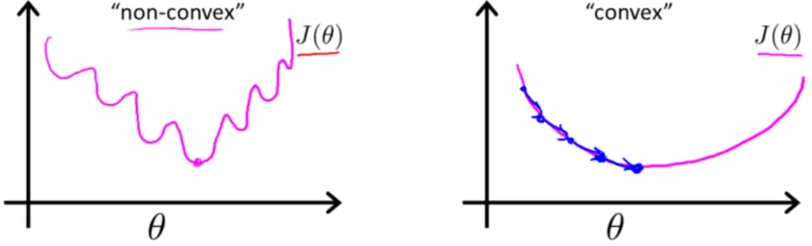
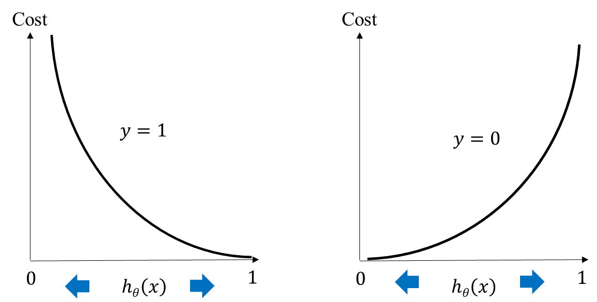

====================
Logistic regression
====================

Logistic model (or logit model) is used to **model the probability of a certain class or event** existing such as pass/fail, win/lose, alive/dead or healthy/sick (Ref.: `Wikipedia <https://en.wikipedia.org/wiki/Logistic_regression>`_). 
In other words, logistic regression is a method of classification and the classification problem is just like the regression problem, except that the values we now want to predict take on only a small number of **discrete values**.

Binary classification
=====================

Binary classification problem is that :math:`y` can take on **only two values**, 0 and 1 (Most of what we say here will also generalize to the multiple-class case). To attempt classification, one method is to use linear regression and map all predictions **greater than 0.5 as a 1** and all **less than 0.5 as a 0**. However, this method doesn't work well because classification is not actually a linear function.

* If :math:`h_{\theta} > 0.5,\ predict\ y = 1`
* If :math:`h_{\theta} < 0.5,\ predict\ y = 0`
* :math:`0 \leq h_{\theta}(x) \leq 1` (Linear regression: :math:`h_{\theta}(x) > 1\ or < 0`).

These are examples of classification problems:

* Email

    * Spam / Not spam?
    * :math:`x^{(i)}` may be some features of a piece of email
    * :math:`y` may be 1 if it is a piece of spam mail, and 0 otherwise

* Online transactions: Fraudulent (Yes / No)?

* Tumor: Malignant / Benign?

    .. figure:: img/logistic_regression/classification.png
        :align: center
        :scale: 40%

Hence, :math:`y \in {0,1}`. 0 is also called the negative class (e.g. benign tumor), and 1 the positive class (e.g. malignant tumor), and they are sometimes also denoted by the symbols “:math:`-`” and “:math:`+`”. Given :math:`x^{(i)}`, the corresponding :math:`y^{(i)}` is also called the label for the training example.

Additionally, logistic regression is a classification, but people confused that it is a regression because of its name.

.. toggle-header::
    :header: **Check**

    Which of the following statements is true?

    \(X\) If linear regression doesn't work on a classification task as in the previous example shown in the video, applying feature scaling may help.

    \(X\) If the training set satisfies :math:`0 \leq y^{(i)} \leq 1`  for every training example :math:`(x^{(i)},y^{(i)})`, then linear regression's prediction will also satisfy :math:`0 \leq h_\theta(x) \leq 1` for all values of :math:`x`.

    \(X\) If there is a feature :math:`x` that perfectly predicts :math:`y`, i.e. if :math:`y=1` when :math:`x\geq c` and :math:`y=0` whenever :math:`x < c` (for some constant :math:`c`), then linear regression will obtain zero classification error.

    \(O\) None of the above statements are true.

|

Hypothesis Representation
*************************

We could approach the classification problem ignoring the fact that :math:`y` is discrete-valued, and use our old linear regression algorithm to try to predict :math:`y` given :math:`x`. However, it is easy to construct examples where this method performs very poorly.
    
Intuitively, it also doesn’t make sense for :math:`h_\theta (x)` to take values larger than 1 or smaller than 0 when we know that :math:`y \in {0, 1}`. To fix this, let’s change the form for our hypotheses :math:`h_\theta (x)` to satisfy :math:`0 \leq h_\theta (x) \leq 1`. This is accomplished by plugging :math:`\theta^{T}x` into the Logistic Function.

Our new form uses the "Sigmoid Function," also called the "Logistic Function":

.. rst-class:: centered

    :math:`h_{\theta}(x) = g(\theta^{T}x)\ where\ 0 \leq h_{\theta}(x) \leq 1`

    :math:`g(z) = \frac{1}{1 + e^{−z}},\ z = \theta^{T}x`

The following image shows us what the sigmoid function looks like:

.. rst-class:: centered

    :math:`h_{\theta}(x) = \frac{1}{1 + e^{-\theta^{T}x}}`

.. figure:: img/logistic_regression/sigmoid_function.png
    :align: center
    :scale: 80%

The function :math:`h_{\theta}(x)`, shown here, maps any real number to the (0, 1) interval, making it useful for transforming an arbitrary-valued function into a function better suited for classification.

-----------------------------------
Interpretation of hypothesis output
-----------------------------------

:math:`h_\theta(x)` will give us the probability that our output is 1.

.. rst-class:: centered

    :math:`h_{\theta}(x) = P(y=1|x;θ) = 1 − P(y=0|x;θ)`
    
    :math:`P(y=0|x;θ) + P(y=1|x;θ) = 1`

* :math:`h_{\theta}(x)` is estimated probability that :math:`y=1`, given :math:`x`, parameterized by :math:`\theta` (:math:`y` has two cases 0 or 1)

Example: Tumor classfication problem
-------------------------------------

.. rst-class:: centered
    
    :math:`X = \begin{pmatrix} x_{0} \\ x_{1} \end{pmatrix} = \begin{pmatrix} 1 \\ tumor\ size \end{pmatrix}`

Let's assumed that :math:`h_{\theta}(x) = 0.7`. Then it tells us that 70% chance to be classified to 1 (Malignant tumor). The probability of 0 is 30% because it is just the complement of the probability of 1.

.. toggle-header::
    :header: **Check**

    Suppose we want to predict, from data :math:`x` about a tumor, whether it is malignant (:math:`y=1`) or benign (:math:`y=0`). Our logistic regression classifier outputs, for a specific tumor, :math:`h_{\theta}(x)=P(y=1|x;θ)=0.7`, so we estimate that there is a 70% chance of this tumor being malignant. What should be our estimate for :math:`P(y=0|x;θ)`, the probability the tumor is benign?

    \(O\) :math:`P(y=0|x;\theta) = 0.3`

    \(X\) :math:`P(y=0|x;\theta) = 0.7`

    \(X\) :math:`P(y=0|x;\theta) = 0.7^{2}`

    \(X\) :math:`P(y=0|x;\theta) = 0.3 \times 0.7`

| 

Decision Boundary
*****************

In order to get discrete 0 or 1 classification, we can translate the output of the hypothesis function as follows:

.. rst-class:: centered

    :math:`h_{\theta}(x) = g(\theta^{T}x)`

    :math:`h_{\theta}(x) \geq 0.5 \rightarrow y = 1`
    
    :math:`h_{\theta}(x) < 0.5 \rightarrow y = 0`

Logistic function :math:`g` behaves is that when its input is greater than or equal to zero, its output is greater than or equal to 0.5:

.. rst-class:: centered
    
    :math:`g(z) = \frac{1}{1 + e^{−z}},\ z = \theta^{T}x`

    :math:`g(z) \geq 0.5\ when\ z \geq 0`

    :math:`z=0,\ e^0 = 1 \Rightarrow g(z) = 0.5`

    :math:`z \rightarrow \infty,\ e^{−\infty} \rightarrow \theta \Rightarrow g(z) = 1`
    
    :math:`z \rightarrow −\infty,\ e^{\infty} \rightarrow \infty \Rightarrow g(z) = 0`

So if our input to g is :math:`\theta^T X`, then that means:

.. rst-class:: centered

    :math:`h_{\theta}(x) = g(\theta^T x) \geq 0.5\ when\ \theta^T x \geq 0`

    :math:`\theta^T x \geq 0 \Rightarrow y = 1`
    
    :math:`\theta^T x < 0 \Rightarrow y = 0`

As a result, we can predict ":math:`y = 1`" if :math:`h_{\theta} \geq 0.5` and predict ":math:`y = 0`" if :math:`h_{\theta} < 0.5.`

------------------------
Linear decision boundary
------------------------

Decision boundary or decision surface is a hypersurface that partitions the underlying vector space into two sets, one for each class (Ref.: `Wikipedia <https://en.wikipedia.org/wiki/Decision_boundary>`_). So, the decision boundary is the line that separates the area where :math:`y = 0` and where :math:`y = 1`. It is created by our hypothesis function.

**Example:**

.. rst-class:: centered

    :math:`y = 1\ if\ 5 + (−1) \cdot x_1 + 0 \cdot x_2 \geq 0,\ θ = \begin{bmatrix} 5 \\[0.3em] −1 \\[0.3em] 0 \end{bmatrix}`

    :math:`5 − x+1 \geq 0`

    :math:`−x_1 \geq −5`
    
    :math:`x_1 \leq 5`

In this case, our decision boundary is a straight vertical line placed on the graph where :math:`x_1 = 5`, and everything to the left of that denotes :math:`y = 1`, while everything to the right denotes :math:`y = 0`.

.. figure:: img/logistic_regression/decision_boundary.png
  :align: center
  :scale: 50%

.. rst-class:: centered

    :math:`h_{\theta}(x) = g(\theta_0 + \theta_1 x_1 + \theta_2 x_2)`

In this model, we can predict ":math:`y = 1`" if :math:`-3 + x_1 + x_2 \geq 0.`

------------------------------
Non-linear decision boundaries
------------------------------

Again, the input to the sigmoid function :math:`g(z)` (e.g. :math:`\theta^T X`) doesn't need to be linear, and could be a function that describes a circle (e.g. :math:`z = \theta_0 + \theta_1 x_1^2 +\theta_2 x_2^2`) or any shape to fit our data.

.. figure:: img/logistic_regression/non-linear_decision_boundaries.png
    :align: center
    :scale: 50%

.. rst-class:: centered

    :math:`h_{\theta}(x) = g(\theta_0 + \theta_1 x_1 + \theta_2 x_2 + \theta_03 x_1^2 + \theta_4 x_2^2)`
    
In this model, we can predict ":math:`y = 1 if -1 + x_1^2 + x_2^2 \geq 0.`

Also, we can get more complex non-linear decision boundaries:

.. rst-class:: centered

    :math:`h_{\theta}(x) = g(\theta_0 + \theta_1 x_1 + \theta_2 x_2 + \theta_03 x_1^2 + \theta_4 x_2^2 + \theta_5 x_1^3 + \theta_6 x_2^3 + ...)`

.. toggle-header::
    :header: **Check**

    Consider logistic regression with two features :math:`x_1` and :math:`x_2`. Suppose :math:`\theta_0 = 5,\ \theta_1 = -1,\ \theta_2 = 0`, so that :math:`h_\theta(x) = g(5 - x_1)`. Which of these shows the decision boundary of :math:`h_\theta(x)`?

    .. figure:: img/logistic_regression/decision_boundary_check.png
        :align: center
        :scale: 50%

|

Cost Function
*************

We cannot use the same cost function that we use for linear regression because the Logistic Function will cause the output to be wavy, causing many local optima. In other words, it will not be a convex function.

Let's asuume that we have :math:`m` training samples and :math:`h_{\theta}` with parameters :math:`\theta` which are chosen by a cost function:

.. rst-class:: centered

    :math:`{(x^{(1)},\ y^{(1)}),\ (x^{(2)},\ y^{(2)}),\ ...,\ (x^{(m)},\ y^{(m)})},\ x \in \begin{bmatrix} x_9 \\[0.3em] x_1 \\[0.3em] ... \\[0.3em] x_n \end{bmatrix},\ x_0 = 1,\ y \in {0, 1}`

    :math:`h_{\theta} (x) = \frac{1}{1} + e^{-\theta^T x}`

-----------------
Linear regression
-----------------

.. rst-class:: centered

    :math:`J(\theta) = \frac{1}{m} \sum_{i=1}^{m} \frac{1}{2} (h_\theta (x^{(i)}) - y^{(i)})^2`

    :math:`Cost(h_\theta (x^{(i)}),\ y) = \frac{1}{2} (h_\theta (x^{(i)}) - y^{(i)})^2`

In logistic regression :math:`h_{\theta} (x^{(i)}) = \frac{1}{1 + e^{-\theta^T x}}` and the cost function is non-convex. So, above cost function is not working well in logistic regression because it is hard to find global optimum.

-------------------
Logistic regression
-------------------

Instead, our cost function for logistic regression looks like:

.. math::

    Cost(h_\theta (x^{(i)}),\ y) = 
        \begin{cases}
        -\log (h_\theta (x)) & if\ y = 1 \\
        -\log (1 - h_\theta (x)) & if\ y = 0 
        \end{cases}

This is a plot for :math:`J(\theta)` vs :math:`h_\theta (x)` when :math:`y = 1\ or\ 0`:

If our correct answer :math:`y` is 0, then the cost function will be 0 if our hypothesis function also outputs 0. If our hypothesis approaches 1, then the cost function will approach infinity. If our correct answer :math:`y` is 1, then the cost function will be 0 if our hypothesis function outputs 1. If our hypothesis approaches 0, then the cost function will approach infinity.

.. rst-class:: centered

    :math:`Cost(h_\theta (x),y) = 0\ if\ h_\theta (x) = y`

    :math:`Cost(h_\theta (x),y) \rightarrow \infty \ if\ y = 0\ and\ h_\theta (x) \rightarrow 1`

    :math:`Cost(h_\theta (x),y) \rightarrow \infty \ if\ y = 1\ and\ h_\theta (x) \rightarrow 0`

Note that writing the cost function in this way guarantees that :math:`J(\theta)` is convex for logistic regression.

.. rst-class:: centered

    :math:`Cost = 0\ if\ y = 1, h_\theta (x) = 1`

But if :math:`h_\theta (x) = 0`, (predict :math:`P(y = 1|x;\theta) = 0)`, but :math:`y = 1`, we'll penalize learning algorithm by a very large cost.

.. rst-class:: centered

    :math:`h_\theta (x) \rightarrow 0,\ Cost \rightarrow \infty`

.. toggle-header::
    :header: **Check**

    In logistic regression, the cost function for our hypothesis outputting (predicting) h_\theta(x)h θ​	 (x) on a training example that has label y∈{0,1} is:

    :math:`cost(h_{\theta}(x),y) = −\log h_{\theta}(x) − log(1−h_{\theta}(x))\ if\ y = 1\ if\ y = 0`

    Which of the following are true? Check all that apply.

    \(O\) If :math:`h_\theta(x) = y`, then :math:`\text{cost}(h_\theta(x),y) = 0` (for :math:`y=0` and :math:`y=1`).

    \(O\) If :math:`y=0`, then :math:`\text{cost}(h_\theta(x),y)\rightarrow\infty` as :math:`h_\theta(x)\rightarrow 1`.

    \(X\) If :math:`y=0`, then :math:`\text{cost}(h_\theta(x),y)\rightarrow\infty` as :math:`h_\theta(x)\rightarrow 0`.

    \(O\) Regardless of whether :math:`y=0` or :math:`y=1`, if :math:`h_\theta(x)=0.5`, then :math:`\text{cost}(h_\theta(x),y) > 0`.

| 

Optimization
*************

------------------------
Simplified cost function
------------------------

We can compress our cost function's two conditional cases into one case:

.. rst-class:: centered

    :math:`Cost(h_\theta (x),\ y) = −y \log (h_\theta (x)) − (1 − y) \log (1 − h_\theta (x))`

Notice that when :math:`y` is equal to 1, then the second term :math:`(1 - y) \ \log (1 - h_\theta (x))(1 − y) \log (1 − h_\theta (x))` will be zero and will not affect the result. If :math:`y` is equal to 0, then the first term :math:`-y \log(h_\theta (x)) − y \log(h_\theta (x))` will be zero and will not affect the result.

We can fully write out our entire cost function as follows:

.. rst-class:: centered

    :math:`J(\theta) = - \frac{1}{m} \displaystyle \sum_{i=1}^m [y^{(i)}\log (h_\theta (x^{(i)})) + (1 - y^{(i)}) \log (1 - h_\theta(x^{(i)}))]`

    :math:`J(\theta) = \frac{1}{m} (−y^T \log (h) − (1 − y)^T \log (1 − h)),\ h = g(X_\theta)`

----------------
Gradient descent
----------------

Remember that the general form of gradient descent is:

:math:`Repeat\ \{ \\ \ \ \ \ \theta_j := \theta_j − \alpha \frac{\sigma}{\sigma \theta_j} J(\theta) \\ \}`

We can work out the derivative part using calculus to get:

:math:`Repeat\ \{ \\ \ \ \ \ \theta_j := \theta_j − \frac{\alpha}{m} \sum{i=1}^{m} (h_\theta (x^{(i)}) − y^{(i)}) x_j^{(i)} \\ \}`

Notice that this algorithm is identical to the one we used in linear regression. We still have to simultaneously update all values in theta. Also, we can describe this as a vectorized implementation:

.. rst-class:: centered

    :math:`\theta := \theta - \frac{\alpha}{m} X^{T} (g(X \theta ) - \vec{y})`

---------------------
Advanced optimization
---------------------

"Conjugate gradient", "BFGS", and "L-BFGS" are more sophisticated, faster ways to optimize :math:`\theta` that can be used instead of gradient descent. We suggest that you should not write these more sophisticated algorithms yourself (unless you are an expert in numerical computing) but use the libraries instead, as they're already tested and highly optimized. Octave provides them.

We first need to provide a function that evaluates the following two functions for a given input value θ:

.. rst-class:: centered

    :math:`J(\theta),\ \ \frac{\sigma}{\sigma \theta_j} J(\theta)`

We can write a single function that returns both of these:

.. code-block:: octave

    function [jVal, gradient] = costFunction(theta)
        jVal = [...code to compute J(theta)...];
        gradient = [...code to compute derivative of J(theta)...];
    end

Then we can use octave's "fminunc()" optimization algorithm along with the "optimset()" function that creates an object containing the options we want to send to "fminunc()".

.. code-block:: octave

    options = optimset('GradObj', 'on', 'MaxIter', 100);
    initialTheta = zeros(2,1);
    [optTheta, functionVal, exitFlag] = fminunc(@costFunction, initialTheta, options);

We give to the function "fminunc()" our cost function, our initial vector of theta values, and the "options" object that we created beforehand.

Multiclass classification: one-vs-all
======================================

Now we will approach the classification of data when we have more than two categories. Instead of :math:`y = {0,1}` we will expand our definition so that :math:`y = {0,1...n}`.

Since :math:`y = {0,1...n}`, we divide our problem into :math:`n+1` (+1 because the index starts at 0) binary classification problems; in each one, we predict the probability that ':math:`y`' is a member of one of our classes.

.. math::

    y \in {0,1...n} \\
    h_\theta^{(0)} \theta(x) = P(y = 0|x;\theta) \\
    h_\theta^{(1)}(x) = P(y = 1|x;\theta) \\
    ⋯ \\
    h_\theta^{(n)}(x) = P(y = n|x;\theta) \\
    prediction = \max_{i}(h_\theta^{(i)}(x))

We are basically choosing one class and then lumping all the others into a single second class. We do this repeatedly, applying binary logistic regression to each case, and then use the hypothesis that returned the highest value as our prediction.

The following image shows how one could classify 3 classes:

.. figure:: img/logistic_regression/multiclass_classification.png
    :align: center
    :scale: 100%

* Train a logistic regression classifier :math:`h_\theta (x)` for each class to predict the probability that :math:`y = i`
* To make a prediction on a new :math:`x`, pick the class that maximizes :math:`h_\theta (x)`

Reference
==========

* `One page summary <https://docs.google.com/document/d/1h7mUOpjHSMGnawOXZAkBeb0Zv2iTHO7E1JRUD126qDE/edit?usp=sharing>`_
* `Coursera, Machine Learning <https://www.coursera.org/learn/machine-learning>`_
