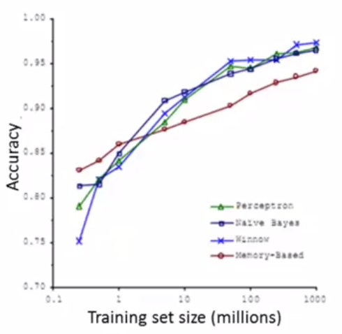

============
Optimization
============

Optimization이라는 단어는 수학적으로 많이 사용되는 단어다. 수리 계획 또는 수리 계획 문제라고도 하고 물리학이나 컴퓨터에서의 최적화 문제는 생각하고 있는 함수를 모델로 한 시스템의 에너지를 나타낸 것으로 여김으로써 에너지 최소화 문제라고도 부르기도 한다. 

딥러닝에서 Optimization 은 학습속도를 빠르고 안정적이게 하는 것이라고 말할 수 있다. 가장 기본적인 Optimization 방법은 Gradient descent (:doc:`Gradient descent <linear_regression>`)다. 하지만 Dataset의 크기가 커지면서 기존 Gradient descent로는 학습하는데 한계가 생겼다.

Learning with large datasets
=============================

One of the best ways to get a **high performance** machine learning system, is if you take a low-bias learning algorithm, and train that on **a lot of data**. So, we want to use a lot of dataset.

Example: classification between confusable words
*************************************************

.. rst-class:: centered

  For breakfast I ate _____ eggs.

We can choose one of {to, two, too} for above sentence and below figure describe how some algorithms performed through the dataset size. In conclusion, "It's not who has the best algorithm that wins. It's who has the most data".

Large dataset
*************

**Problem:**

When :math:`M` is a hundred million, you need to carry out a summation over a hundred million terms, in order to compute these derivatives terms and to perform a single step of decent. There are many methods to compute this derivative such as Stochastic Gradient Descent (SGD).

.. rst-class:: centered

  :math:`\theta_j := \theta_j - \alpha \frac{1}{m} \sum_{i=1}^{m} (h_\theta (x^{(i)}) - y^{(i)}) x_j^{(i)}`

----------------------------
Why a lot of data is better?
----------------------------

How can you tell if using all of the data is likely to perform much better than using a small subset of the data? The answer is to plot a learning curve for a range of values of m and verify that the algorithm has high variance when m is small.

Like below left figure, when m is big, the algorithm has high variance. But when m is small, the algorithm has high bias like below right figure (:doc:`Bias vs. Variance <advice_for_applying_ml>`). So, we will be more confident that adding extra training examples would improve performance.

.. figure:: img/optimization/why_a_lot_of_data_is_better.png
  :align: center
  :scale: 80%
  
.. toggle-header::
    :header: **Check: Advantage of large dataset**
    
    |
    Suppose you are facing a supervised learning problem and have a very large dataset (m = 100,000,000). How can you tell if using all of the data is likely to perform much better than using a small subset of the data (say m = 1,000)?

    \[　\] There is no need to verify this; using a larger dataset always gives much better performance.

    \[　\] Plot :math:`J_\text{train}(\theta)` as a function of the number of iterations of the optimization algorithm (such as gradient descent).

    \[　\] Plot a learning curve (:math:`J_\text{train}(\theta)` and :math:`J_\text{CV}(\theta),` plotted as a function of m) for some range of values of m (say up to m = 1,000) and verify that the algorithm has bias when m is small.

    \[　\] Plot a learning curve for a range of values of m and verify that the algorithm has high variance when m is small.

|

Various optimization methods
*****************************

이러한 Large dataset을 이용하여 Optimization하는 방법은 다양하고 그 관계는 아래 그림과 같다.

.. figure:: img/optimization/optimization_overview.png
  :align: center
  :scale: 40%

.. figure:: img/optimization/optimization_eq.png
  :align: center
  :scale: 20%

* :doc:`Gradient descent <linear_regression>`
* `Stochastic Gradient Descent (SGD)`_
* `Momentum`_
* `AdaGrad`_
* `RMSProp`_
* `Adam`_

Stochastic Gradient Descent (SGD)
=================================

Gradient Descent로 Loss Function을 계산할 때 전체 Train set을 사용하는 것을 **Batch Gradient Descent** 라고 한다. 그러나 이렇게 계산을 할 경우 한번 step을 내딛을 때 전체 데이터에 대해 Loss Function을 계산해야 하므로 너무 많은 계산량이 필요하다. 이를 방지하기 위해 보통은 **Stochastic Gradient Descent (SGD)** 라는 방법을 사용한다.

이 방법에서는 Loss function을 계산할 때 전체 데이터 (Batch) 대신 일부 조그마한 데이터의 모음 (Mini-batch)에 대해서만 Loss function을 계산한다. 이 방법은 Batch gradient descent 보다 다소 부정확할 수는 있지만, **훨씬 계산 속도가 빠르기 때문에** 같은 시간에 더 많은 Step을 갈 수 있으며 **여러 번 반복할 경우 보통 Batch의 결과와 유사한 결과로 수렴한다**. 또한, SGD를 사용할 경우 Batch Gradient Descent에서 빠질 Local minima에 빠지지 않고 더 좋은 방향으로 수렴할 가능성도 있다.

.. figure:: img/optimization/bgd_vs_sgd.png
  :align: center
  :scale: 60%

.. toggle-header::
    :header: **Check: Stochastic Gradient Descent (SGD)**
    
    |
    Which of the following statements about stochastic gradient descent are true? Check all that apply.

    \[　\] When the training set size m is very large, stochastic gradient descent can be much faster than gradient descent.

    \[　\] The cost function :math:`J_\text{train}(\theta) = \frac{1}{2m}\sum_{i=1}^m (h_\theta(x^{(i)}) - y^{(i)})^2` should go down with every iteration of batch gradient descent (assuming a well-tuned learning rate \alphaα) but not necessarily with stochastic gradient descent.

    \[　\] Stochastic gradient descent is applicable only to linear regression but not to other models (such as logistic regression or neural networks).

    \[　\] Before beginning the main loop of stochastic gradient descent, it is a good idea to "shuffle" your training data into a random order.

|

Momentum
========

Momentum 방식은 말 그대로 Gradient Descent를 통해 이동하는 과정에 일종의 ‘관성’을 주는 것이다. 현재 Gradient를 통해 이동하는 방향과는 별개로, 과거에 이동했던 방식을 기억하면서 그 방향으로 일정 정도를 추가적으로 이동하는 방식이다.

.. rst-class:: centered

    :math:`v_t = \gamma v_{t-1} + \eta \nabla_{\theta}J(\theta)`

AdaGrad 
=======

AdaGrad(Adaptive Gradient)는 변수들을 Update할 때 각각의 변수마다 Step size를 다르게 설정해서 이동하는 방식이다. 이 알고리즘의 기본적인 아이디어는

.. rst-class:: centered

    *‘지금까지 많이 변화하지 않은 변수들은 Step size를 크게 하고, 지금까지 많이 변화했던 변수들은 Step size를 작게 하자’*

라는 것이다. 자주 등장하거나 변화를 많이 한 변수들의 경우 optimum에 가까이 있을 확률이 높기 때문에 작은 크기로 이동하면서 세밀한 값을 조정하고, 적게 변화한 변수들은 optimum 값에 도달하기 위해서는 많이 이동해야할 확률이 높기 때문에 먼저 빠르게 loss 값을 줄이는 방향으로 이동하려는 방식이라고 생각할 수 있겠다.

.. rst-class:: centered

    :math:`G_{t} = G_{t-1} + (\nabla_{\theta}J(\theta_t))^2`

    :math:`\theta_{t+1} = \theta_t - \frac{\eta}{\sqrt{G_t + \epsilon}} \cdot \nabla_{\theta}J(\theta_t)`

RMSProp
=======

RMSProp은 딥러닝의 대가 제프리 힌톤이 제안한 방법으로서, AdaGrad의 단점을 해결하기 위한 방법이다. AdaGrad의 식에서 Gradient의 제곱값을 더해나가면서 구한 :math:`G_t` 부분을 합이 아니라 지수평균으로 바꾸어서 대체한 방법이다. 이렇게 대체를 할 경우 AdaGrad처럼 :math:`G_t` 가 무한정 커지지는 않으면서 최근 변화량의 변수간 상대적인 크기 차이는 유지할 수 있다.

.. rst-class:: centered

    :math:`G = \gamma G + (1-\gamma)(\nabla_{\theta}J(\theta_t))^2`

    :math:`\theta = \theta - \frac{\eta}{\sqrt{G + \epsilon}} \cdot \nabla_{\theta}J(\theta_t)`

Adam
=====

Adam (Adaptive Moment Estimation)은 RMSProp과 Momentum 방식을 합친 것 같은 알고리즘이다. 이 방식에서는 Momentum 방식과 유사하게 지금까지 계산해온 기울기의 지수평균을 저장하며, RMSProp과 유사하게 기울기의 제곱값의 지수평균을 저장한다.

.. rst-class:: centered

    :math:`m_t = \beta_1 m_{t-1} + (1-\beta_1)\nabla_\theta J(\theta)`

    :math:`v_t = \beta_2 v_{t-1} + (1-\beta_2)(\nabla_\theta J(\theta))^2`

Reference
==========

* `One page summary <https://docs.google.com/document/d/1qNFSVIP2z0CJikiZgzJwbSIPCFe0lAntxxfcE2ypsg4/edit?usp=sharing>`_
* `Coursera, Machine Learning <https://www.coursera.org/learn/machine-learning>`_
* `shuuki4's blog <http://shuuki4.github.io/deep%20learning/2016/05/20/Gradient-Descent-Algorithm-Overview.html>`_
* `gomguard's blog <https://gomguard.tistory.com/187>`_
* `ruder's blog <http://ruder.io/optimizing-gradient-descent/index.html>`_
* `BEOMSU KIM's BLOG <http://shuuki4.github.io/deep%20learning/2016/05/20/Gradient-Descent-Algorithm-Overview.html>`_
