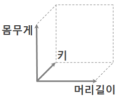
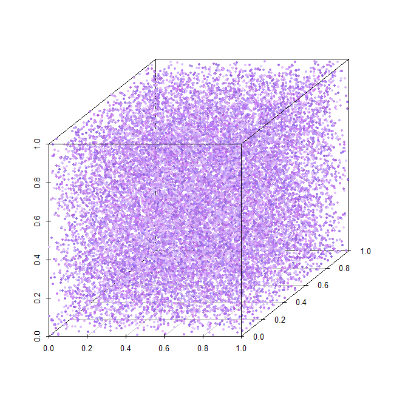
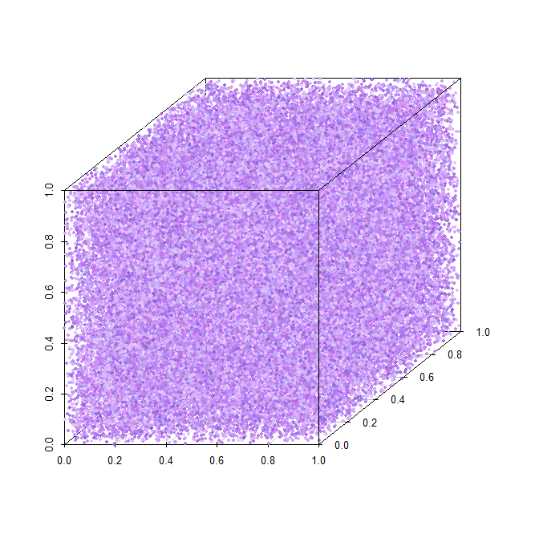

===========
차원의 저주
===========

위키피디아에서 차원의 저주 (Curse of dimensionality)는

    "The curse of dimensionality refers to various phenomena that arise when analyzing and organizing data in high-dimensional spaces (often with hundreds or thousands of dimensions) that do not occur in low-dimensional settings such as the three-dimensional physical space of everyday experience."
    
라고 언급했다. 즉, 고차원 공간에 있는 데이터를 분석할 때 발생하는 여러 가지 현상을 차원의 저주라고 한다. 차원의 저주를 이해하기 위해서는 먼저 차원을 정확히 이해해야 한다.

차원
=====

==== ====== ========
키   몸무게  머리길이
==== ====== ========
168  58     10
162  55     30
159  49     25
165  45     40
==== ====== ========

위와 같은 데이터는 변수 3개 (키, 몸무게, 머리길이)를 가진 3차원 데이터이다. 즉, 변수의 개수가 몇 개인지가 몇 차원인지를 의미하게 되고, 정리해서 **차원 = 변수의 수** 라고 이해하면 접근이 조금 더 쉽다. 다음 그래프로 조금 더 살펴보자.

  
.. rst-class:: centered

    출처: `꼬낄콘의 분석일지, Dimension / 차원 / 차원의 저주 / 차원축소 <https://kkokkilkon.tistory.com/127>`_

위 그래프처럼 데이터를 그래프로 표현하기 위해서는 각 차원 (변수의 수)만큼 축이 필요하다. 그래서 **차원 = 변수의 수 = 축의 개수** 이라고 생각할 수 있다. 그렇다면 차원이 늘어난다는 것은 어떤 의미일까? 여기서 정리한 내용을 기반으로 하면 **차원이 늘어난다 = 변수의 수가 많아진다 = 축의 개수가 많아진다 = 데이터의 공간이 커진다** 로 받아들일 수 있다.

자, 그러면 이렇게 차원, 변수, 축, 데이터 공간에 대한 이해를 기반으로 차원이 늘어나면 어떤 문제가 생기는지 살펴보자.

차원의 저주
===========

예를 들어 우리가 사람에 대해 이해하려고 한다고 하자.

먼저, 사람을 나이로만 나타냈을 때 1차원으로 표현할 수 있다 (0에서 1사이로 정규화함). 1000명의 사람을 나이에 대해서 표현하면 다음 그래프처럼 나타낼 수 있다.

.. figure:: img/regularization/cod/cod_1d.png
    :align: center
    :scale: 80%
  
.. rst-class:: centered

    출처: `데이터 과학, 차원의 저주 <https://m.blog.naver.com/PostView.nhn?blogId=plasticcode&logNo=221485061322&categoryNo=6&proxyReferer=https%3A%2F%2Fwww.google.com%2F>`_

1000명만 있어도 사람들이 어떤 나이의 분포를 이루고 있는지 충분히 알 수 있다. 그렇다면 이번에는 나이와 몸무게로 2000명의 사람을 표현해보자 (몸무게도 0에서 1사이로 정규화함).

.. figure:: img/regularization/cod/cod_2d_sparse.png
    :align: center
    :scale: 80%
  
.. rst-class:: centered

    출처: `데이터 과학, 차원의 저주 <https://m.blog.naver.com/PostView.nhn?blogId=plasticcode&logNo=221485061322&categoryNo=6&proxyReferer=https%3A%2F%2Fwww.google.com%2F>`_

사람 수를 2배로 늘렸는데 나이와 몸무게 조합의 모든 경우를 다 확인하기 어렵다. 그래서 사람의 수를 10배로 늘려 2만명의 사람을 표현해보면 다음 그래프와 같다.

.. figure:: img/regularization/cod/cod_2d_dense.png
    :align: center
    :scale: 80%
  
.. rst-class:: centered

    출처: `데이터 과학, 차원의 저주 <https://m.blog.naver.com/PostView.nhn?blogId=plasticcode&logNo=221485061322&categoryNo=6&proxyReferer=https%3A%2F%2Fwww.google.com%2F>`_

사람 수를 10배로 더 늘렸지만 아직 다 확인하지 못하는 부분이 생긴다. 이번에는 나이, 몸무게, 키로 2만명의 사람을 표현해보자 (키도 0에서 1 사이로 정규화함).

  
.. rst-class:: centered

    출처: `데이터 과학, 차원의 저주 <https://m.blog.naver.com/PostView.nhn?blogId=plasticcode&logNo=221485061322&categoryNo=6&proxyReferer=https%3A%2F%2Fwww.google.com%2F>`_

2만명으로는 나이, 몸무게, 키 조합에 해당하는 모든 사람의 정보를 확인하기는 어려워 보인다. 여기서 사람 수를 5배 더 늘려 10만명을 표현해보자.

  
.. rst-class:: centered

    출처: `데이터 과학, 차원의 저주 <https://m.blog.naver.com/PostView.nhn?blogId=plasticcode&logNo=221485061322&categoryNo=6&proxyReferer=https%3A%2F%2Fwww.google.com%2F>`_

10만명을 표현해도 나이, 몸무게, 키 조합의 모든 경우를 확인하지 못한다. 지금까지 언급한 내용이 차원의 저주에 대한 내용이다. 즉, **"차원이 커짐"** 에 따라 **"변수의 수가 증가"** 하고, 그에 따라 **"데이터를 표현할 수 있는 경우의 수가 기하급수적으로 증가"** 하여, **"데이터를 충분히 이해하기 위해서는 많은 데이터가 필요"** 한 상황이 차원의 저주이다.

그렇다면 차원의 저주를 피하기 위해서는 어떻게 해야할까? 그 방법에 대해서는 추후에 살펴볼 예정이다.

Reference
==========

* `Wikipedia, Curse of dimensionality <https://en.wikipedia.org/wiki/Curse_of_dimensionality#Optimization>`_
* `Time Traveler, 7. Curse of Dimension, Reduction of input dimension (차원의 저주) <https://89douner.tistory.com/31?category=868069>`_
* `꼬깔콘, Dimension / 차원 / 차원의 저주 / 차원 축소 <https://kkokkilkon.tistory.com/127>`_
* `데이터 과학, 차원의 저주 <https://m.blog.naver.com/PostView.nhn?blogId=plasticcode&logNo=221485061322&categoryNo=6&proxyReferer=https%3A%2F%2Fwww.google.com%2F>`_
