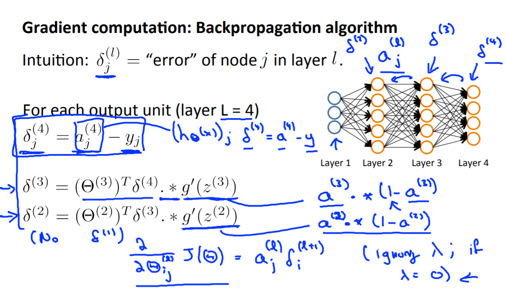

==========================
Neural networks: Learning
==========================

Cost function
==============

.. figure:: ../img/neural_networks/nn_learning/neural_networks.png
  :align: center
  :scale: 80%

  **Neural network (Classification)**

Let's first define a few variables that we will need to use:

* :math:`L` = total number of layers in the network
* :math:`s_l` = number of units (not counting bias unit) in layer :math:`l`
* :math:`K` = number of output units/classes

Recall that in neural networks, we may have many output nodes. We denote :math:`h_\theta (x)_k` as being a hypothesis that results in the :math:`k^{th}` output. Our cost function for neural networks is going to be a generalization of the one we used for logistic regression. Recall that the cost function for regularized logistic regression was:

.. rst-class:: centered
  
  :math:`J(\theta) = - \frac{1}{m} \sum_{i=1}^m [ y^{(i)}\ \log (h_\theta (x^{(i)})) + (1 - y^{(i)})\ \log (1 - h_\theta(x^{(i)}))] + \frac{\lambda}{2m}\sum_{j=1}^n \theta_j^2`

For neural networks, it is going to be slightly more complicated:

.. rst-class:: centered
  
  :math:`J(\theta) = −\frac{1}{m} \sum_{i=1}^m \sum_{k=1}^{K} \big[ y(i)k \log((h_\theta (x^{(i)})_k) + (1 − y_k^{(i)}) \log(1 − (h_\theta (x^{(i)}))_k) \big] + \frac{\lambda}{2m} \sum_{l=1}^{L−1} \sum_{i=1}^{s_l} \sum_{j=1}^{s_l+1} (\theta_{j,i}^{(l)})^2`

We have added a few nested summations to account for our multiple output nodes. In the first part of the equation, before the square brackets, we have an additional nested summation that loops through the number of output nodes.

In the regularization part, after the square brackets, we must account for multiple theta matrices. The number of columns in our current theta matrix is equal to the number of nodes in our current layer (including the bias unit). The number of rows in our current theta matrix is equal to the number of nodes in the next layer (excluding the bias unit). As before with logistic regression, we square every term.

Additionally, suppose we want to try to minimize :math:`J(\theta)` as a function of :math:`\theta` , using one of the advanced optimization methods (fminunc, conjugate gradient, BFGS, L-BFGS, etc.). What do we need to supply code to compute (as a function of :math:`\theta` )? We need to add :math:`J(\theta)` and the (partial) derivative terms :math:`\frac{\partial}{\partial \theta_{ij}^{(l)}}` for every :math:`i, j, l` .

Note:

* The double sum simply adds up the logistic regression costs calculated for each cell in the output layer
* The triple sum simply adds up the squares of all the individual :math:`\theta s` in the entire network
* The :math:`i` in the triple sum does not refer to training example :math:`i`

Backpropagation
===============

"Backpropagation" is neural-network terminology for minimizing our cost function, just like what we were doing with gradient descent in logistic and linear regression. Our goal is to compute:

.. rst-class:: centered

    :math:`min_{\theta} J(\theta)`

That is, we want to minimize our cost function :math:`J` using an optimal set of parameters in theta. In this section we'll look at the equations we use to compute the partial derivative of :math:`J(\theta)`:

.. rst-class:: centered
    
    :math:`\frac{\delta}{\delta \theta_{i, j}^{(l)}} J(\theta)`

Back propagation algorithm
**************************

To do so, we use the following algorithm:

.. figure:: ../img/neural_networks/nn_learning/backpropagation_algo.png
  :align: center
  :scale: 60%

Given training set :math:`{(x(1),y(1)) \cdots (x(m),y(m))}` and set :math:`\Delta^{(l)}_{i,j} := 0` for all :math:`(l,i,j),` (hence you end up having a matrix full of zeros).

For training example :math:`t` = 1 to :math:`m`:

1. Set :math:`a^{(1)} := x^{(t)}`
 
2. Perform forward propagation to compute :math:`a^{(l)}\ for\ l=2,3,\cdots,L`

.. figure:: ../img/neural_networks/nn_learning/propagation_computation.png
  :align: center
  :scale: 100%

3. Using :math:`y^{(t)},` compute :math:`\delta^{(L)} = a^{(L)} - y^{(t)}`

Where :math:`L` is our total number of layers and :math:`a^{(L)}` is the vector of outputs of the activation units for the last layer. So our "error values" for the last layer are simply the differences of our actual results in the last layer and the correct outputs in y. To get the delta values of the layers before the last layer, we can use an equation that steps us back from right to left:

4. Compute :math:`\delta^{(L-1)}, \delta^{(L-2)},\dots,\delta^{(2)}` using :math:`\delta^{(l)} = ((\Theta^{(l)})^T \delta^{(l+1)}) ∗ a^{(l)} ∗ (1 − a^{(l)})`

The delta values of layer :math:`l` are calculated by multiplying the delta values in the next layer with the theta matrix of layer :math:`l.` We then element-wise multiply that with a function called :math:`g',` or :math:`g`-prime, which is the derivative of the activation function :math:`g` evaluated with the input values given by :math:`z^{(l)}.`

The :math:`g`-prime derivative terms can also be written out as:

.. rst-class:: centered

    :math:`g'(z^{(l)}) = a^{(l)}\ *\ (1 - a^{(l)})`
    
5. :math:`\Delta^{(l)}_{i,j} := \Delta^{(l)}_{i,j} + a_j^{(l)} \delta_i^{(l+1)}` or with vectorization, :math:`\Delta^{(l)} := \Delta^{(l)} + \delta^{(l+1)}(a^{(l)})^T`

Hence we update our new :math:`\Delta` matrix.

* :math:`D_{i,j}^{(l)} := \frac{1}{m} (\Delta_{i,j}^{(l)} + \lambda \Theta_{i,j}^{(l)}),\ if\ j \neq 0`
* :math:`D^{(l)}_{i,j} := \frac{1}{m} \Delta^{(l)}_{i,j},\ if\ j = 0`

The capital-delta matrix :math:`D` is used as an "accumulator" to add up our values as we go along and eventually compute our partial derivative. Thus we get :math:`\frac{\delta}{\delta \theta_{i, j}^{(l)}} J(\theta) = D_{ij}^{(l)}.`

Reference
===========

* `One page summary <https://docs.google.com/document/d/1DOJYmWn7jlNlxm3g7EHtK760stTL4fwuUMzFWiRDZkk/edit?usp=sharing>`_
* `Coursera, Machine Learning <https://www.coursera.org/learn/machine-learning>`_
