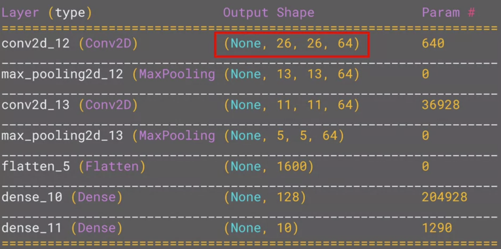
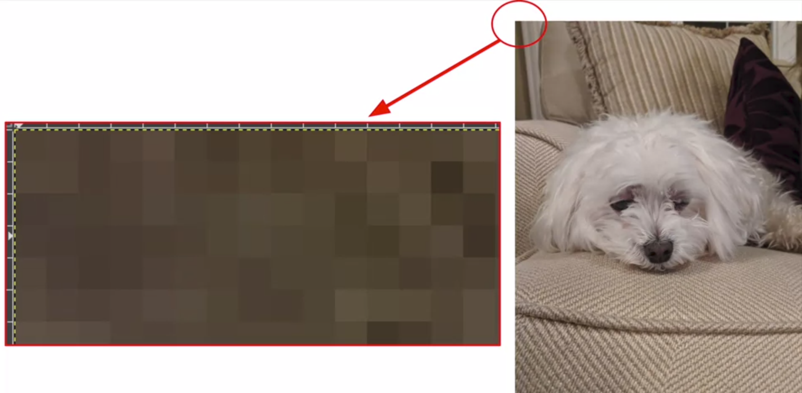
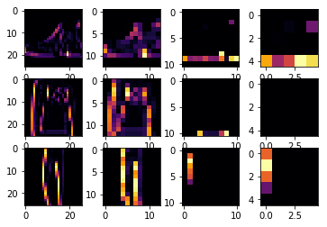
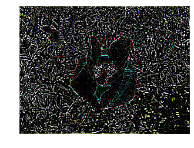

===============
Computer vision
===============

Computer vision is the field of having a computer understand and label what is present in an image.

Deep neural network
===================

Example: classify fashion images
********************************

We can construct a fashion image classification model using `Fashion MNIST <https://github.com/zalandoresearch/fashion-mnist>`_ dataset which can be loaded by Tensorflow API and this is a description of Fashion MNIST dataset:

* 70k images
* 10 categories
* Images are 28 x 28

We classify categories as numbers (0 to 9) to avoid bias -- instead of labelling it with words in a specific language and excluding people who don’t speak that language! You can learn more about bias and techniques to avoid it `here <https://developers.google.com/machine-learning/fairness-overview/>`_.

-------------------------------
Classfication of fashion images
-------------------------------

Classification is working like this:

.. figure:: ../img/tip/computer_vision/how_to_work.png
    :align: center
    :scale: 40%

If you want to know neural network and deep learning more detaily, then you can see these videos (`Link <https://www.youtube.com/watch?v=CS4cs9xVecg&list=PLkDaE6sCZn6Ec-XTbcX1uRg2_u4xOEky0>`_).

Code
----

This is a whole `code <https://colab.research.google.com/github/lmoroney/dlaicourse/blob/master/Course%201%20-%20Part%204%20-%20Lesson%202%20-%20Notebook.ipynb#scrollTo=WzlqsEzX9s5P>`_ to classify 9 categories of images from Fashion MNIST dataset:

.. code-block:: python

    import tensorflow as tf
    print(tf.__version__)

    mnist = tf.keras.datasets.fashion_mnist
    
    (training_images, training_labels), (test_images, test_labels) = mnist.load_data()

    import matplotlib.pyplot as plt
    plt.imshow(training_images[0])
    print(training_labels[0])
    print(training_images[0])

    training_images  = training_images / 255.0
    test_images = test_images / 255.0

    model = tf.keras.models.Sequential([tf.keras.layers.Flatten(), 
                                        tf.keras.layers.Dense(128, activation=tf.nn.relu), 
                                        tf.keras.layers.Dense(10, activation=tf.nn.softmax)])

    model.compile(optimizer = tf.train.AdamOptimizer(),
                  loss = 'sparse_categorical_crossentropy',
                  metrics=['accuracy'])

    model.fit(training_images, training_labels, epochs=5)

    model.evaluate(test_images, test_labels)

**Callback function**

We can stop training using callback function. Callback function is called the end of each epoch and this code is the method for how to use callback function:

.. code-block:: python

    import tensorflow as tf

    class myCallback(tf.keras.callbacks.Callback):
        def on_epoch_end(self, epoch, logs={}):
            if(logs.get('acc')>0.6):
                print("\nReached 60% accuracy so cancelling training!")
                self.model.stop_training = True

    mnist = tf.keras.datasets.fashion_mnist

    (x_train, y_train),(x_test, y_test) = mnist.load_data()
    x_train, x_test = x_train / 255.0, x_test / 255.0

    callbacks = myCallback()

    model = tf.keras.models.Sequential([
        tf.keras.layers.Flatten(input_shape=(28, 28)),
        tf.keras.layers.Dense(512, activation=tf.nn.relu),
        tf.keras.layers.Dense(10, activation=tf.nn.softmax)
    ])

    model.compile(optimizer='adam',
                  loss='sparse_categorical_crossentropy',
                  metrics=['accuracy'])

    model.fit(x_train, y_train, epochs=10, callbacks=[callbacks])

Example: classify 9 digit images
********************************

This is another exmaple of the image classification example. We can use MNIST which has items of handwriting -- the digits 0 through 9 and this is a code:

.. code-block:: python

    import tensorflow as tf

    class myCallback(tf.keras.callbacks.Callback):
        def on_epoch_end(self, epoch, logs={}):
            if(logs.get('acc') > 0.99):
                print("\nReached 99% accuracy so cancelling training!")
                self.model.stop_training = True

    def train_mnist():
        mnist = tf.keras.datasets.mnist

        (x_train, y_train),(x_test, y_test) = mnist.load_data()

        x_train  = x_train / 255.0
        x_test = x_test / 255.0

        model = tf.keras.models.Sequential([tf.keras.layers.Flatten(),
                                            tf.keras.layers.Dense(128, activation=tf.nn.relu),
                                            tf.keras.layers.Dense(10, activation=tf.nn.softmax)])

        model.compile(optimizer='adam',
                    loss='sparse_categorical_crossentropy',
                    metrics=['accuracy'])

        history = model.fit(x_train, y_train, epochs=10, callbacks=[myCallback()])

        return history.epoch, history.history['acc'][-1]

    train_mnist()

Quiz: Introduction to computer vision
**************************************

.. toggle-header::
    :header: **Quiz list**

    |
    **Question 1**

        What’s the name of the dataset of Fashion images used in this week’s code?

        \[　\] Fashion Tensors

        \[　\] Fashion MNIST

        \[　\] Fashion Data

        \[　\] Fashion MN

    **Question 2**

        What do the above mentioned Images look like?

        \[　\] 82x82 Greyscale

        \[　\] 100x100 Color

        \[　\] 28x28 Color

        \[　\] 28x28 Greyscale

    **Question 3**

        How many images are in the Fashion MNIST dataset?

        \[　\] 42

        \[　\] 60,000

        \[　\] 0,000

        \[　\] 70,000

    **Question 4**
        
        Why are there 10 output neurons?

        \[　\] To make it classify 10x faster

        \[　\] Purely arbitrary

        \[　\] To make it train 10x faster

        \[　\] There are 10 different labels

    **Question 5**

        What does Relu do?

        \[　\] It only returns x if x is less than zero

        \[　\] It only returns x if x is greater than zero

        \[　\] For a value x, it returns 1/x

        \[　\] It returns the negative of x

    **Question 6**

        Why do you split data into training and test sets?

        \[　\] To make testing quicker

        \[　\] To train a network with previously unseen data

        \[　\] To test a network with previously unseen data

        \[　\] To make training quicker

    **Question 7**

        What method gets called when an epoch finishes?

        \[　\] On_training_complete

        \[　\] on_end

        \[　\] on_epoch_finished

        \[　\] on_epoch_end

    **Question 8**

        What parameter to you set in your fit function to tell it to use callbacks?

        \[　\] callback=

        \[　\] oncallback=

        \[　\] callbacks=

        \[　\] oncallbacks=

|

Convolutional neural network
============================

We can improve computer vision accuracy using convolutions and poolings.

Convolution and pooling
***********************

We can do convlutions using filters such as 3x3 and then we can extract highlighted features from an image.

.. figure:: ../img/tip/computer_vision/convolution.png
  :align: center
  :scale: 30%

There are many filters and this is one of example called vertical filter:

.. figure:: ../img/tip/computer_vision/v_filter.png
  :align: center
  :scale: 30%

Also, we can select max values from convolution results to compress the data by pooling.

.. figure:: ../img/tip/computer_vision/pooling.png
  :align: center
  :scale: 30%

Code
****

This is a whole code for convolutions and pooling and I will explain this code step by step.

.. code-block:: python

    import tensorflow as tf
    print(tf.__version__)

    mnist = tf.keras.datasets.fashion_mnist
    (training_images, training_labels), (test_images, test_labels) = mnist.load_data()
    training_images = training_images.reshape(60000, 28, 28, 1)
    training_images = training_images / 255.0
    test_images = test_images.reshape(10000, 28, 28, 1)
    test_images = test_images/255.0
    
    model = tf.keras.models.Sequential([
        tf.keras.layers.Conv2D(64, (3,3), activation='relu', input_shape=(28, 28, 1)),
        tf.keras.layers.MaxPooling2D(2, 2),
        tf.keras.layers.Conv2D(64, (3,3), activation='relu'),
        tf.keras.layers.MaxPooling2D(2,2),
        tf.keras.layers.Flatten(),
        tf.keras.layers.Dense(128, activation='relu'),
        tf.keras.layers.Dense(10, activation='softmax')
    ])
    
    model.compile(optimizer='adam', loss='sparse_categorical_crossentropy', metrics=['accuracy'])
    
    model.summary()
    
    model.fit(training_images, training_labels, epochs=5)
    
    test_loss = model.evaluate(test_images, test_labels)

-----------------------
Step 1: gather the data
-----------------------

You'll notice that there's a bit of a change here in that the training data needed to be reshaped. That's because the first convolution expects a single tensor containing everything, so instead of 60,000x28x28 items in a list, we have a single 4D list that is 60,000x28x28x1, and the same for the test images.

.. code-block:: python

    import tensorflow as tf
    print(tf.__version__)

    mnist = tf.keras.datasets.fashion_mnist
    (training_images, training_labels), (test_images, test_labels) = mnist.load_data()
    training_images = training_images.reshape(60000, 28, 28, 1)
    training_images = training_images / 255.0
    test_images = test_images.reshape(10000, 28, 28, 1)
    test_images = test_images/255.0

------------------------
Step 2: define the model
------------------------

Now, we construct the model with parameters:

* The number of convolutions you want to generate. Purely arbitrary, but good to start with something in the order of 32
* The size of the Convolution, in this case a 3x3 grid
* The activation function to use -- in this case we'll use relu, which you might recall is the equivalent of returning x when x>0, else returning 0
* In the first layer, the shape of the input data.

You'll follow the Convolution with a MaxPooling layer which is then designed to compress the image, while maintaining the content of the features that were highlighted by the convlution. By specifying (2,2) for the MaxPooling, the effect is to quarter the size of the image.

Without going into too much detail here, the idea is that it creates a 2x2 array of pixels, and picks the biggest one, thus turning 4 pixels into 1. It repeats this across the image, and in so doing halves the number of horizontal, and halves the number of vertical pixels, effectively reducing the image by 25%.

You can call model.summary() to see the size and shape of the network, and you'll notice that after every MaxPooling layer, the image size is reduced in this way.

Here, we can see that the output shape is 26 x 26 x 64. The reason is that we can't do covolution with edge pixels of an image.

.. figure:: ../img/tip/computer_vision/edge_of_image_02.png
  :align: center
  :scale: 50%

Add one convolution.

.. code-block:: python

    model = tf.keras.models.Sequential([
        tf.keras.layers.Conv2D(32, (3,3), activation='relu', input_shape=(28, 28, 1)),
        tf.keras.layers.MaxPooling2D(2, 2),

Add another convolution.

.. code-block:: python

    tf.keras.layers.Conv2D(64, (3,3), activation='relu'),
    tf.keras.layers.MaxPooling2D(2,2)

Now flatten the output. After this you'll just have the same DNN structure as the non convolutional version

.. code-block:: python

    tf.keras.layers.Flatten(),

The same 128 dense layers, and 10 output layers as in the pre-convolution example:

.. code-block:: python

        tf.keras.layers.Dense(128, activation='relu'),
        tf.keras.layers.Dense(10, activation='softmax')
    ])

Now compile the model, call the fit method to do the training, and evaluate the loss and accuracy from the test set.

.. code-block:: python

    model.compile(optimizer='adam', loss='sparse_categorical_crossentropy', metrics=['accuracy'])
    model.fit(training_images, training_labels, epochs=5)
    test_loss, test_acc = model.evaluate(test_images, test_labels)
    print(test_acc)

If you try running it for more epochs -- say about 20, and explore the results! But while the results might seem really good, the validation results may actually go down, due to something called 'overfitting'.

Additionally, if you want to know more about Convolutional Neural Network (CNN), you can see `videos <https://bit.ly/2UGa7uH>`_ on Youtube.

-----------
Experiments
-----------

* Try editing the convolutions. Change the 32s to either 16 or 64. What impact will this have on accuracy and/or training time.

    * There is no big different with training and test accuracy along to the number of kernels.

* Remove the final Convolution. What impact will this have on accuracy or training time?

    * Training time was reduced and the accuracy was improved.

* How about adding more Convolutions? What impact do you think this will have? Experiment with it.

    * The accuracy was reduced when I add more convolutions.

* Remove all convolutions but the first. What impact do you think this will have? Experiment with it.

    * It is same as a second question.

* In the previous lesson you implemented a callback to check on the loss function and to cancel training once it hit a certain amount. See if you can implement that here!

    * Code

    .. code-block:: python

        class myCallback(tf.keras.callbacks.Callback):
            def on_epoch_end(self, epoch, logs={}):
                if(logs.get('acc') > 0.95):
                    print("\nReached 95% accuracy so cancelling training!")
                    self.model.stop_training = True
                    
        import tensorflow as tf
        print(tf.__version__)
        mnist = tf.keras.datasets.fashion_mnist
        (training_images, training_labels), (test_images, test_labels) = mnist.load_data()
        training_images=training_images.reshape(60000, 28, 28, 1)
        training_images=training_images / 255.0
        test_images = test_images.reshape(10000, 28, 28, 1)
        test_images=test_images / 255.0

        model = tf.keras.models.Sequential([
            tf.keras.layers.Conv2D(16, (3,3), activation='relu', input_shape=(28, 28, 1)),
            tf.keras.layers.MaxPooling2D(2, 2),
            tf.keras.layers.Flatten(),
            tf.keras.layers.Dense(128, activation='relu'),
            tf.keras.layers.Dense(10, activation='softmax')
        ])

        model.compile(optimizer='adam', loss='sparse_categorical_crossentropy', metrics=['accuracy'])

        model.summary()

        model.fit(training_images, training_labels, epochs=10, callbacks=[myCallback()])

        test_loss = model.evaluate(test_images, test_labels)

    * Result

        .. figure:: ../img/tip/computer_vision/experiments_callback.png
            :align: center
            :scale: 70%

Visualizing convolutions and pooling
*************************************

This code will show us the convolutions graphically. The print (test_labels[;100]) shows us the first 100 labels in the test set, and you can see that the ones at index 0, index 23 and index 28 are all the same value (9). They're all shoes.

Let's take a look at the result of running the convolution on each, and you'll begin to see common features between them emerge. Now, when the DNN is training on that data, it's working with a lot less, and it's perhaps finding a commonality between shoes based on this convolution/pooling combination.

.. code-block:: python

    import matplotlib.pyplot as plt
    f, axarr = plt.subplots(3,4)

    FIRST_IMAGE = 0
    SECOND_IMAGE = 23
    THIRD_IMAGE = 28
    CONVOLUTION_NUMBER = 1
    
    from tensorflow.keras import models
    layer_outputs = [layer.output for layer in model.layers]
    activation_model = tf.keras.models.Model(inputs = model.input, outputs = layer_outputs)
    
    for x in range(0,4):
        f1 = activation_model.predict(test_images[FIRST_IMAGE].reshape(1, 28, 28, 1))[x]
        axarr[0,x].imshow(f1[0, : , :, CONVOLUTION_NUMBER], cmap='inferno')
        axarr[0,x].grid(False)
        f2 = activation_model.predict(test_images[SECOND_IMAGE].reshape(1, 28, 28, 1))[x]
        axarr[1,x].imshow(f2[0, : , :, CONVOLUTION_NUMBER], cmap='inferno')
        axarr[1,x].grid(False)
        f3 = activation_model.predict(test_images[THIRD_IMAGE].reshape(1, 28, 28, 1))[x]
        axarr[2,x].imshow(f3[0, : , :, CONVOLUTION_NUMBER], cmap='inferno')
        axarr[2,x].grid(False)

This is first convolution results for shoes images and we can detect common features of shoes:

.. figure:: ../img/tip/computer_vision/conv_results_shoes.png
    :align: center
    :scale: 100%

If we change the images (SECOND_IMAGE = 1 (Hand bag), THIRD_IMAGE = 2 (Trouser)), then we can detect different feature of images:

.. code-block:: python

    import matplotlib.pyplot as plt
    f, axarr = plt.subplots(3,4)

    FIRST_IMAGE = 0
    SECOND_IMAGE = 1
    THIRD_IMAGE = 2
    CONVOLUTION_NUMBER = 1
    
    from tensorflow.keras import models
    layer_outputs = [layer.output for layer in model.layers]
    activation_model = tf.keras.models.Model(inputs = model.input, outputs = layer_outputs)
    
    for x in range(0,4):
        f1 = activation_model.predict(test_images[FIRST_IMAGE].reshape(1, 28, 28, 1))[x]
        axarr[0,x].imshow(f1[0, : , :, CONVOLUTION_NUMBER], cmap='inferno')
        axarr[0,x].grid(False)
        f2 = activation_model.predict(test_images[SECOND_IMAGE].reshape(1, 28, 28, 1))[x]
        axarr[1,x].imshow(f2[0, : , :, CONVOLUTION_NUMBER], cmap='inferno')
        axarr[1,x].grid(False)
        f3 = activation_model.predict(test_images[THIRD_IMAGE].reshape(1, 28, 28, 1))[x]
        axarr[2,x].imshow(f3[0, : , :, CONVOLUTION_NUMBER], cmap='inferno')
        axarr[2,x].grid(False)

If I change CONVOLUTION_NUMBER to 4 for trouser images, we can detect simplified vertical features from the images:

.. code-block:: python

    import matplotlib.pyplot as plt
    f, axarr = plt.subplots(3,4)

    FIRST_IMAGE = 2
    SECOND_IMAGE = 3
    THIRD_IMAGE = 5
    CONVOLUTION_NUMBER = 4
    
    from tensorflow.keras import models
    layer_outputs = [layer.output for layer in model.layers]
    activation_model = tf.keras.models.Model(inputs = model.input, outputs = layer_outputs)
    
    for x in range(0,4):
        f1 = activation_model.predict(test_images[FIRST_IMAGE].reshape(1, 28, 28, 1))[x]
        axarr[0,x].imshow(f1[0, : , :, CONVOLUTION_NUMBER], cmap='inferno')
        axarr[0,x].grid(False)
        f2 = activation_model.predict(test_images[SECOND_IMAGE].reshape(1, 28, 28, 1))[x]
        axarr[1,x].imshow(f2[0, : , :, CONVOLUTION_NUMBER], cmap='inferno')
        axarr[1,x].grid(False)
        f3 = activation_model.predict(test_images[THIRD_IMAGE].reshape(1, 28, 28, 1))[x]
        axarr[2,x].imshow(f3[0, : , :, CONVOLUTION_NUMBER], cmap='inferno')
        axarr[2,x].grid(False)

.. figure:: ../img/tip/computer_vision/conv_results_trousers.png
    :align: center
    :scale: 100%

Manual convolution and pooling
******************************

Let's explore how convolutions work by creating a basic convolution on a 2D Grey Scale image. First we can load the image by taking the 'ascent' image from scipy. It's a nice, built-in picture with lots of angles and lines.

---------
Load data
---------

.. code-block:: python

    import cv2
    import numpy as np
    from scipy import misc
    i = misc.ascent()
    size_x = i.shape[0]
    size_y = i.shape[1]

    import matplotlib.pyplot as plt
    plt.grid(False)
    plt.gray()
    plt.axis('off')
    plt.imshow(i)
    plt.show()

-----------
Convolution
-----------

Now, we can create a filter as a 3x3 array.

.. code-block:: python

    size_x = i.shape[0]
    size_y = i.shape[1]

    # This filter detects edges nicely
    # It creates a convolution that only passes through sharp edges and straight
    # lines.

    # Just for fun
    # filter = [ [0, 1, 0], [1, -4, 1], [0, 1, 0]]

    # Vertical filter
    filter = [ [-1, -2, -1], [0, 0, 0], [1, 2, 1]]

    # Horizontal filter
    # filter = [ [-1, 0, 1], [-2, 0, 2], [-1, 0, 1]]

    # If all the digits in the filter don't add up to 0 or 1, 
    # you should probably do a weight to get it to do so
    # so, for example, if your weights are 1,1,1 1,2,1 1,1,1
    # They add up to 10, so you would set a weight of .1 if you want to normalize them
    weight  = 1

Now let's create a convolution. We will iterate over the image, leaving a 1 pixel margin, and multiply out each of the neighbors of the current pixel by the value defined in the filter. Then, we'll load the new value into the transformed image.

.. code-block:: python

    i_transformed = np.copy(i)
    for x in range(1, size_x-1):
        for y in range(1, size_y-1):
            convolution = 0.0
            convolution = convolution + (i[x - 1, y-1] * filter[0][0])
            convolution = convolution + (i[x, y-1] * filter[0][1])
            convolution = convolution + (i[x + 1, y-1] * filter[0][2])
            convolution = convolution + (i[x-1, y] * filter[1][0])
            convolution = convolution + (i[x, y] * filter[1][1])
            convolution = convolution + (i[x+1, y] * filter[1][2])
            convolution = convolution + (i[x-1, y+1] * filter[2][0])
            convolution = convolution + (i[x, y+1] * filter[2][1])
            convolution = convolution + (i[x+1, y+1] * filter[2][2])
            convolution = convolution * weight

            if(convolution < 0):
                convolution = 0
            elif(convolution > 255):
                convolution = 255
            i_transformed[x, y] = convolution

    # Plot the image. Note the size of the axes -- they are 512 by 512
    plt.gray()
    plt.grid(False)
    plt.imshow(i_transformed)
    #plt.axis('off')
    plt.show()

These are results using each filter:

* filter = [[0, 1, 0], [1, -4, 1], [0, 1, 0]]

.. figure:: ../img/tip/computer_vision/filtered_result_01.png
    :align: center
    :scale: 100%

* Vertical filter

.. figure:: ../img/tip/computer_vision/filtered_result_02.png
    :align: center
    :scale: 100%

* Horizontal filter

.. figure:: ../img/tip/computer_vision/filtered_result_03.png
    :align: center
    :scale: 100%

Here, we used different filters but there are many other filters. This is a `link <https://lodev.org/cgtutor/filtering.html>`_ for other filters and I tested them. This is a code for using other filters:

.. code-block:: python

    import numpy as np
    from skimage import io

    im = io.imread('https://lodev.org/cgtutor/images/photo3.jpg')
    size_x = im.shape[0]
    size_y = im.shape[1]

    import matplotlib.pyplot as plt
    plt.grid(False)
    plt.gray()
    plt.axis('off')
    plt.imshow(im)
    plt.show()

    # filter = np.array([[0.0, 0.2,  0.0], [0.2, 0.2,  0.2], [0.0, 0.2,  0.0]]) # Blur
    # filter = np.array([[-1, -1, -1], [-1,  8, -1], [-1, -1, -1]]) # Edge
    # filter = np.array([[-1, -1, -1], [-1,  9, -1], [-1, -1, -1]]) # Sharpen
    filter = np.array([[-1, -1,  0], [-1,  0,  1], [0,  1,  1]]) # Emboss

    im_transformed = np.copy(im)
    for x in range(1, size_x-1):
        for y in range(1, size_y-1):
            for c in range(3):
                convolution = 0.0
                k = filter.shape[0] - 2
                for i, fs in enumerate(filter):
                    for j, f in enumerate(fs):
                        convolution = convolution + (im[x - (i-k), y - (j-k), c] * f)
                
                if(convolution < 0):
                    convolution = 0
                elif(convolution > 255):
                    convolution=255
                im_transformed[x, y, c] = convolution

    plt.gray()
    plt.grid(False)
    plt.imshow(im_transformed)
    plt.axis('off')
    plt.show()

These are filtered results:

* Original

.. figure:: ../img/tip/computer_vision/filter_ori.png
    :align: center
    :scale: 100%

* Blur

.. figure:: ../img/tip/computer_vision/filter_blur.png
    :align: center
    :scale: 100%

* Edge

* Sharpen

.. figure:: ../img/tip/computer_vision/filter_sharpen.png
    :align: center
    :scale: 100%

* Emboss

.. figure:: ../img/tip/computer_vision/filter_emboss.png
    :align: center
    :scale: 100%

-------
Pooling
-------

This code will show a (2, 2) pooling. The idea here is to iterate over the image, and look at the pixel and it's immediate neighbors to the right, beneath, and right-beneath. Take the largest of them and load it into the new image. Thus the new image will be 1/4 the size of the old -- with the dimensions on X and Y being halved by this process. You'll see that the features get maintained despite this compression!

.. code-block:: python

    new_x = int(size_x/2)
    new_y = int(size_y/2)
    newImage = np.zeros((new_x, new_y))
    for x in range(0, size_x, 2):
        for y in range(0, size_y, 2):
            pixels = []
            pixels.append(i_transformed[x, y])
            pixels.append(i_transformed[x+1, y])
            pixels.append(i_transformed[x, y+1])
            pixels.append(i_transformed[x+1, y+1])
            newImage[int(x/2),int(y/2)] = max(pixels)

    # Plot the image. Note the size of the axes -- now 256 pixels instead of 512
    plt.gray()
    plt.grid(False)
    plt.imshow(newImage)
    #plt.axis('off')
    plt.show()

This is a result of pooling with the vertical filter:

.. figure:: ../img/tip/computer_vision/pooling_result.png
    :align: center
    :scale: 100%

Example: classify 9 digit images
********************************

.. code-block:: python

    import tensorflow as tf

    class myCallback(tf.keras.callbacks.Callback):
        def on_epoch_end(self, epoch, logs={}):
            if(logs.get('acc') > 0.998):
                print("\nReached 99.8% accuracy so cancelling training!")
                self.model.stop_training = True

    # GRADED FUNCTION: train_mnist_conv
    def train_mnist_conv():
        mnist = tf.keras.datasets.mnist
        (training_images, training_labels), _ = mnist.load_data()
        training_images = training_images.reshape(60000, 28, 28, 1)
        training_images = training_images / 255.0

        model = tf.keras.models.Sequential([
            tf.keras.layers.Conv2D(64, (3,3), activation='relu', input_shape=(28, 28, 1)),
            tf.keras.layers.MaxPooling2D(2, 2),
            tf.keras.layers.Conv2D(64, (3,3), activation='relu'),
            tf.keras.layers.MaxPooling2D(2,2),
            tf.keras.layers.Flatten(),
            tf.keras.layers.Dense(128, activation='relu'),
            tf.keras.layers.Dense(10, activation='softmax')
        ])

        model.compile(optimizer='adam', loss='sparse_categorical_crossentropy', metrics=['accuracy'])
        # model fitting
        history = model.fit(training_images, training_labels, epochs=20, callbacks=[myCallback()])
        # model fitting
        return history.epoch, history.history['acc'][-1]

    _, _ = train_mnist_conv()

Quiz: Improving the Fashion classifier with convolutions
********************************************************

.. toggle-header::
    :header: **Quiz list**

    |
    **Question 1**

        What is a Convolution?

        \[　\] A technique to filter out unwanted images

        \[　\] A technique to make images smaller

        \[　\] A technique to isolate features in images

        \[　\] A technique to make images bigger

    **Question 2**

        What is a Pooling?

        \[　\] A technique to combine pictures

        \[　\] A technique to isolate features in images

        \[　\] A technique to reduce the information in an image while maintaining features

        \[　\] A technique to make images sharper

    **Question 3**

        How do Convolutions improve image recognition?

        \[　\] They make the image clearer

        \[　\] They isolate features in images

        \[　\] They make processing of images faster

        \[　\] They make the image smaller

    **Question 4**

        After passing a 3x3 filter over a 28x28 image, how big will the output be?

        \[　\] 26x26

        \[　\] 31x31

        \[　\] 28x28

        \[　\] 25x25

    **Question 5**

        After max pooling a 26x26 image with a 2x2 filter, how big will the output be?

        \[　\] 26x26

        \[　\] 28x28

        \[　\] 56x56

        \[　\] 13x13

    **Question 6**

        Applying Convolutions on top of our Deep neural network will make training:

        \[　\] Stay the same

        \[　\] Faster

        \[　\] Slower

        \[　\] It depends on many factors. It might make your training faster or slower, and a poorly designed Convolutional layer may even be less efficient than a plain DNN!

|

Reference
=========

* https://www.coursera.org/learn/introduction-tensorflow
