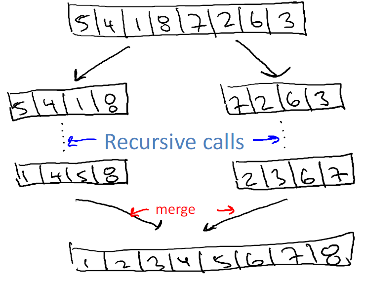
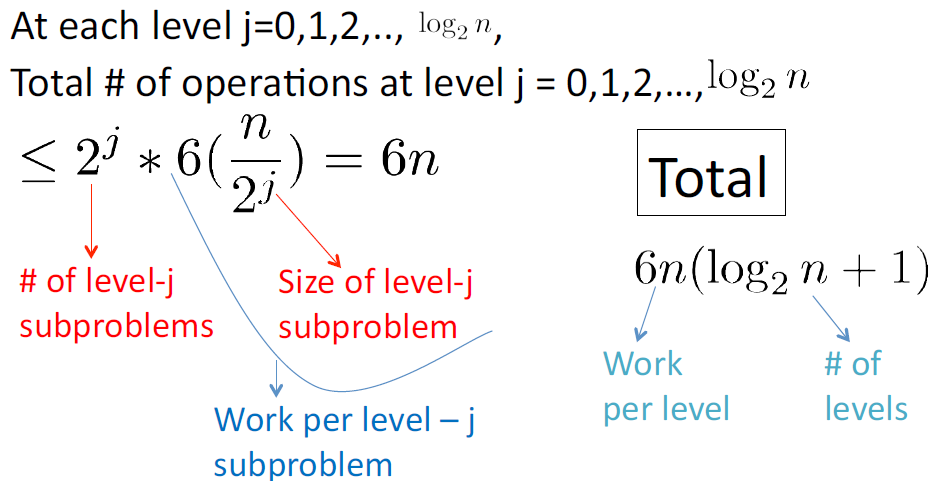

Introduction
=============

======================
Why study algorithms?
======================

* Important for all other branches of computer science
* Plays a key role in modern technological innovation
* Provides novel "lens" on processes outside of computer science and technology
* Challenging
* Fun

================================
Example: Integer multiplication
================================

Input: two n-digit numbers x and y
Output: product x * y

**Primitive operation**

Add or mulitply two single-digit numbers

**Karatsuba multiplication**

Step 1: Write x = 10^(n/2) * a + b and y = 10^(n/2) * c + d, where a, b, c, d are n/2-digit numbers
Step 2: Then x * y = (10^(n/2) * a + b)(10^(n/2) * c + d) = 10^n * ac + 10^(n/2) * (ad + bc) + bd

Step 2 pseudo code:

For step 2, we should calculate ac, bd, ad + bc

1. Recursively compute ac
2. Recursively compute bd
3. Recursively compute (a+b)(c+d) = ac + bd + ad + bc

Gauss' Trick: (3) - (1) - (2) = ad + bc

==========
Merge sort
==========

**Example**

**Pseudo code**

[Divide]

- Recursively sort 1st half of the input array
- Recursively sort 2nd half of the input array
- Merge two sorted sublists into one

[Merge]

.. code-block:: python

    # C = output [length = n]
    # A = 1st sorted array [n/2]
    # B = 2nd sorted array [n/2]

    i = 1; j = 1
    for k in range(n):
        if A(i) < B(j):
            C(k) = A(i)
            i += 1
        else:
            C(k) = B(j)

**Running time**

Running time of merge <= 4m + 2 <= 6m (Since m >= 1)

Running time of merge sort <= 6nlogn + 6n

[Proof]

=================
Guding principles
=================

**Guding principle #1**

* "Worst-case analysis": Our running time bound holds for every input of length n.
    * Particularly appropriate for "General-purpose" routines
    * "Average-case" analysis requires domain knoledge
    * Worst-case is usually easier to analyze

**Guding principle #1**

* Won't pay much attention to constant factors, lower order terms
* Justification
    * Way easier
    * Constnats depend on architecture, compiler, programmer anyways, and so on
    * Lose very little predictive power

**Guding principle #1**

* Asymptotic analysis: focus on running time for large input sizes n
    * Example: 6nlogn + 6n is better than 1/2 * n^2
    * Only big problems are interesting!!

.. figure:: img/bigo_performances.jpeg
    :align: center
    :scale: 40%

**What is a "Fast" algorithm?**

* Fast algorithms can be as worst-case running time grows slowly with input sizes
* Usually, we want as close to linear O(n) as possible

===========
References
===========

* https://www.coursera.org/learn/algorithms-divide-conquer