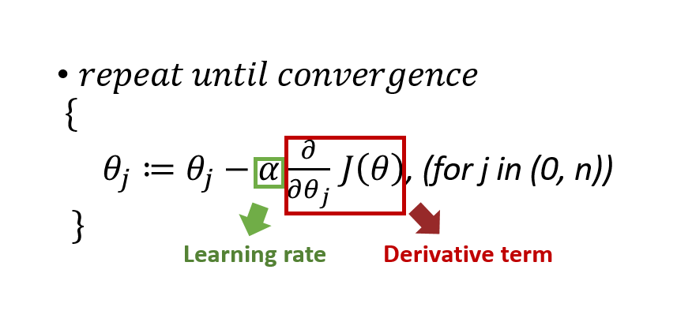

Multivariate linear regression
==============================

=================
Multiple features
=================

**Univariate linear regression**

Features

=====  ======
Size   Price
=====  ======
2,104  460
1,416  232
1,534  315
...    ...
=====  ======

Hypothesis function

:math:`h_{\theta}(x) = \theta_{0} + \theta_{0}x`

**Multiple linear regression**

Features

=====  ====== ========== =========== ===
Size   Price  # of rooms # of floors Age
=====  ====== ========== =========== ===
2,104  460    5          1           45
1,416  232    3          2           40
1,534  315    3          2           30
...    ...    ...        ...         ...
=====  ====== ========== =========== ===

Hypothesis function

:math:`h_{\theta}(x) = \displaystyle\sum_{i=0}^{n} \theta_{i}x_{i},  \theta_{i}: weight, x_{0} = 1`

========================================
Gradient descent for multiple variables
========================================

**Algorithm**

Should be update simultaneously!!

================
Feature scaling
================

All features have different scale, so we need to make all features are on a similar scale

* Before:

  * A lots of iterations are needed
  * :math:`x_{1} = size (0 - 2000)`
  * :math:`x_{2} = # of rooms (1 - 5)`

  .. figure:: ../img/multvariate_lr/feature_scaling_before.png
    :align: center
    :scale: 70%

* After:

  * A few interations are nedded
  * :math:`x_{1} = \frac{size}{2000} (0 - 1)`
  
  * :math:`x_{2} = \frac{# of rooms}{5} (0.2 - 1)`

  .. figure:: ../img/multvariate_lr/feature_scaling_after.png
    :align: center
    :scale: 70%

**Types**

* Mean normalization

  * :math:`x_{i_mean} = \frac{x_{i} - average(x_{i})}{range(x_{i}) (-1 \leq x_{i_mean} \leq 1)`

* Standardization

  * :math:`x_{i_std} = \frac{x_{i} - min(x_{i})}{range(x_{i}) (-1 \leq x_{i_std} \leq 1)`

================
Normal equation
================

* Alternative method to get weight value
* Don’t need iteration

*For every* :math:`n`, *training data* :math:`m`

.. math::

  \frac{\partial J}{\partial \theta_{n}} = \displaystyle\sum_{i=1}^{m} (\theta_{0} + \theta_{1}x_{i} + \cdots + \theta_{1}x_{i}^{n} - y_{i}\\
  \Rightarrow \theta = (X^{T}X)^{-1}X^{T}Y

=============================  ==================================
Gradient descent               Normal equation
=============================  ==================================
Should decide learning rate    Don‘t need to decide learning rate
Many iteration                 No iteration
Relatively little calculation  A lot of calculation
=============================  ==================================

===========
Summary
===========

* Multivariate linear regression can be performed like univariate linear regression

* There are two method for multivariate liner regression
  
  * Gradient descent
    
    * Feature scaling
    * Learning rate
  
  * Normal equation

* Each method has its own benefit

  
===========
Reference
===========

* https://www.coursera.org/learn/machine-learning