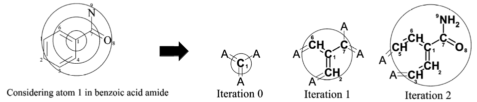

=================================
Extended connectivity fingerprint
=================================

Extended connectivity fingerprint (ECFP) is generated by Morgan algorithm and a hash function based on :doc:`SMILES <smiles>`.

Algorithm
==========

Morgan algorithm
*****************

* Numbering invariant atom information into an initial atom identifier

* Identifiers are generated independently of previous identifiers and intermediate results are discarded

* The iteration process is continued until every atom identifier is unique

ECFP algorithm
***************

* ECFP is based on Morgan algorithm, but its generation terminates after a predetermined number of iteration and keep intermediate results

* The collision is solved by hash function

Pros and cons
=============

ECFP is better at representing structure information than substructure-based fingerprints (e.g. para-substitution)

.. figure:: img/ecfp/advantage_of_ecfp.png
  :align: center
  :scale: 50%

It has limitation that each atom invariant is located in specific integer by hash function, so it is less meaningful

References
===========

* Rogers, D., et al. Extended-Connectivity Fingerprints. Journal of Chemical Information and Modeling. 2010.
