========
AlexNet
========

AlexNet은 Alex Krizhevsky, Ilya Sutskever, Geoffrey E. Hinton의 논문 "ImageNet classification with deep convolution neural network"에서 제안한 모델이다. 또한, AlexNet은 ImageNet ILVRC-2010의 120만 개 이미지를 1000개의 Class로 분류하는데 CNN을 사용했고 압도적인 성과를 얻었다. 아래 좌측 그림에서 SuperVision이 AlexNet이다.

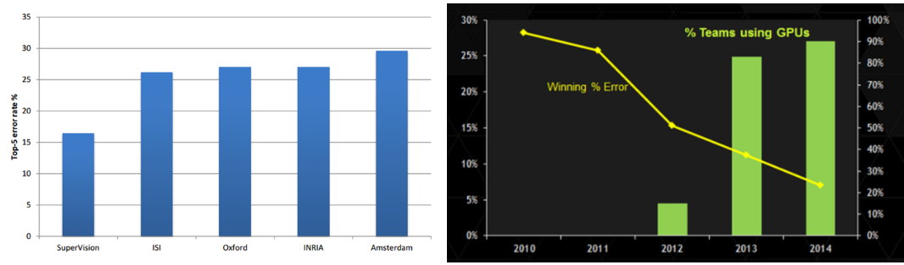

.. rst-class:: centered

    출처: 라온피플 (Laon People) - `좌측 <https://laonple.blog.me/220654387455>`_, `우측 <https://laonple.blog.me/220667260878>`_

또한, AlexNet의 GPU 사용과 소스 코드 공개로 이후 많은 연구자들이 GPU를 사용하기 시작했다 (예: 알파고 → CPU 1,920개 / GPU 280개). 위 우측 그래프를 보면 알 수 있듯이 ILSVRC에 참여자의 GPU 사용률이 높아졌고, 그에 따라 Error rate가 낮아지는 것을 볼 수 있다.

이러한 AlexNet은 5개의 Convolutional layer (일부 Max pooling), 3개의 Fully connected layer로 구성되어 있는데, LeNet-5와 유사하다. 특히, 성능 개선을 위해 크게 5가지를 고려했다.

* ReLU + Local response normalization
* Multiple GPU
* Overlapping pooling
* Dropout

위와 같은 방법을 적용하여 AlexNet은 ILSVRC 2012에서 Top-5 error rate 15.3%로 우승했다 (2위: 26.2%). 그럼 지금부터 AlexNet에 대해 자세히 알아보자.

Materials
==========

AlexNet은 학습과 테스트를 위해 ILSVRC에서 제공하는 일부 ImageNet 데이터를 사용했다. 원래 ImageNet에는 22,000개 Category를 갖는 15 million개의 이미지가 있다. 하지만 이 중에서 하나의 Category에 약 1,000개의 이미지를 추출하여, Training에 1.2 million개, Validation에 50,000개, 테스트에 150,000개의 이미지를 사용했다.

이러한 ImageNet의 이미지를 바로 AlexNet을 학습하고 테스트 하는데 사용할 수 없다. 그 이유는 이미지 크기가 다양하고 그 개수가 부족해 여러 가지 문제가 생길 수 있기 때문이다. 지금부터 자세히 알아보자.

Resize & Crop
**************

우선, ImageNet의 각 이미지 크기가 다르기 때문에 그 크기를 같게 만들어야 한다. 만약, 이미지의 크기가 모두 다르면 그에 따라 AlexNet의 Filter 크기 및 개수, Fully connected layer의 Neuron 개수 등 여러 가지 Hyperparamter를 바꿔줘야 하기 때문이다.

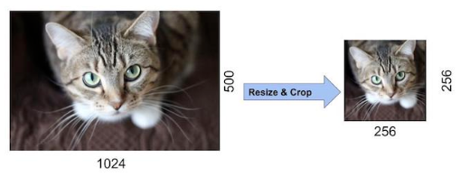

.. rst-class:: centered

    출처: `Time Travler, AlexNet <https://89douner.tistory.com/60?category=873854>`_

따라서 각 이미지를 Width와 Height 중 더 작은 값을 가지는 부분을 256에 맞게 **Rescale** 한다. 그리고 나서 이미지의 가운데를 기준으로 256x256 크기만큼만 **잘라낸다 (Crop).** 가운데를 기준으로 자르는 이유는 ImageNet 이미지는 가운데에 가장 중요한 Object를 표현하고 있을거라고 가정하기 때문이다. 그 결과 우리는 **256x256 크기를 가지는 이미지** 를 추출할 수 있고 이렇게 처리된 이미지들을 학습이나 테스트에 사용하게 된다.

추가로 이미지에 특정 픽셀의 R, G 또는 B 값이 너무 커서 나머지 픽셀의 R, G 또는 B 값의 영향력이 사라지는 것을 막기 위해, **이미지의 R, G, B의 평균을 각 픽셀의 값에 빼줌으로써 Normalization** 한다.

Data augmentation
******************

AlexNet은 학습할 Parameter 수가 약 60 million개이기 때문에 1.2 million개의 이미지로 학습하면 `과적합 <../../ai/ml/regularization.html#advanced_overfitting>`_ 이 발생할 수 있다.

예를 들어 충주시 내 집 10채에 대한 집 정보 (하나의 집에 평수, 방 개수, ... 집값 정보를 가지고 있음)로 집 값을 예측하면 잘못된 예측을 할 가능성이 높다. 그 이유는 아직 충주시의 집들에 대한 요인을 다 알기에 집 10채 정보는 부족하기 때문이다.

마찬가지로 AlexNet에서 학습해야 할 Parameter 수에 비해 데이터 수가 부족하기 때문에 과적합 문제가 생길 수 있는 것이다.

이를 해결하기 위해 AlexNet에서는 학습시킬 이미지 양을 늘리는 **Data augmentation** 과 일부 Neuron을 생략하는 **Dropout** 을 사용했다 (Dropout은 구조 부분에서 설명함). AlexNet에서는 데이터 양을 늘리기 위해 2가지 Data augmentation을 사용했고, 사용하기 전보다 Top-1 에러율을 1% 이상 줄였다고 한다.

-------------
방법 1: Crop
-------------

첫 번째 방법은 Crop을 통한 Data augmentation이다.

Training
---------

Training 시 256x256의 원본 이미지 중 **224x224 크기의 이미지를 무작위로 추출** 하고, 추출된 이미지를 **좌우 반전** 시켜 사용했다. 이 방법으로 1장의 이미지에서 **32 x 32 x 2 = 1024 x 2 = 2048개** 의 다른 이미지를 얻을 수 있게 된다.

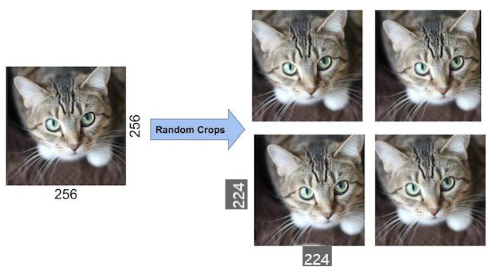

.. rst-class:: centered

    출처: `Time Travler, AlexNet <https://89douner.tistory.com/60?category=873854>`_

Test
-----

Test 시에는 중앙, 상하좌우 코너를 기준으로 224x224 이미지 5개와 이를 수평으로 반전한 5개 이미지, **총 10개 이미지** 를 추출하여 사용했다. 이 작업은 간단한 작업이기 때문에 GPU로 학습되고 있을 때 병렬적으로 CPU로 실행할 수 있다.

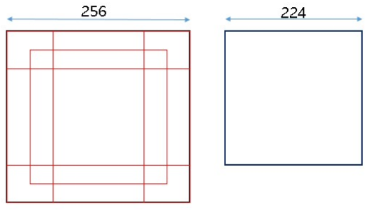

.. rst-class:: centered

    출처: `라온피플 (Laon People) <https://laonple.blog.me/220662317927>`_

Label-preserving transformation
--------------------------------

추가로 Data augmentation 할 때 주의해야 할 점이 하나 있는데, 변형한 이미지가 기존의 이미지의 Label을 그대로 가지고 있어야 된다는 점이다. 예를 들어 아래 그림처럼 상하를 반전시켜 데이터 수를 늘린다고 가정해보자. 

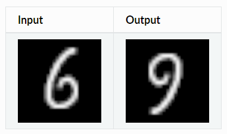

.. rst-class:: centered

    출처: `Augmentor.jl, Label-preserving Transformations <https://augmentorjl.readthedocs.io/en/latest/introduction/background.html>`_

상하 반전된 이미지는 실제로 9이지만 Data augmentation을 자동화 한 경우 6으로 간주할 수 있고, 이는 잘못된 학습으로 이어질 수 있다. 그래서 기존의 Label을 유지하면서 이미지를 변형하여 그 수를 늘리는 것이 중요하다. 이를 Label-preserving transformation이라고 하고, AlexNet에서 이를 사용했다고 한다.

------
방법 2
------

또 다른 방법은 이미지 RGB 채널의 값을 변경시키는 방법이다. 그 방법은 **원래 픽셀 값** + **이미지의 RGB 픽셀에 대한 주성분 분석 (PCA)한 값** X **랜덤 변수 (평균: 0, 표준편차: 0.1)** 이고, 아래 내용이 실제 수식이다.

.. rst-class:: centered
    
    :math:`I_{xy} = [I_{xy}^R, I_{xy}^G, I_{xy}^B]^T + [p_1, p_2, p_3][\alpha_1 \lambda_1, \alpha_2 \lambda_2, \alpha_3 \lambda_3]^T,\ where\ \alpha_i \sim N(0, 0.1)`

지금까지 Data 전처리 과정에 대해 언급했다. 지금부터는 어떤 구조를 가지는 AlexNet이 위 데이터를 이용하여 학습, 테스트를 진행했는지 보려고 한다.

Architecture
=============

이전에 언급한 것처럼, AlexNet의 전체 구조는 5개의 Convolutional layer와 3개의 Fully connected layer로 구성되어 있고, 첫 번째/두 번째/다섯 번째 Convolutional layer 다음에 Max pooling을 사용한다. 또한, AlexNet은 방대한 Network (Neuron: 65만개, Parameters: 6천만개, Connection: 6억 3천만개)를 학습하기 위해 2개의 GPU (GTX580, 메모리 3GB)를 병렬로 사용했다.

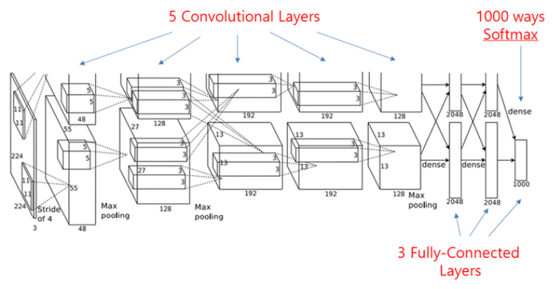

.. rst-class:: centered

    출처: `라온피플 (Laon People) <https://laonple.blog.me/220654387455>`_

우선, AlexNet에서 LeNet과 다르게 성능 개선을 위해 고려한 5가지에 대해 살펴보자.

* ReLU + Local response normalization
* Multiple GPU
* Overlapping pooling
* Dropout

ReLU
*****

AlexNet은 LeNet에 비해 Network가 크기 때문에 활성화 함수 (Activation function)로 시그모이드 (sigmoid)나 하이퍼볼릭 탄젠트 (tanh)가 아닌 학습 속도가 빠른 `ReLU <../../ai/ml/nn/act_func.html#relu>`_ 를 처음으로 선택했다. 기존 sigmoid나 tanh 함수는 포화되는 구간에서 Gradient 값이 작아져 학습 속도가 느려지며, 이를 **Vanishing gradient** 문제라고 한다.

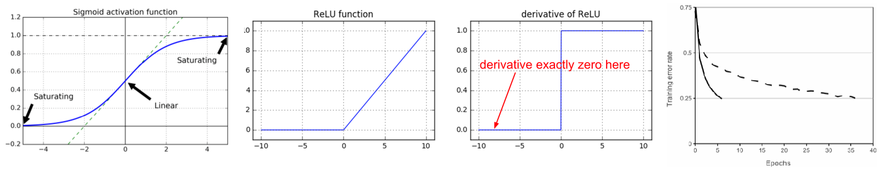

.. rst-class:: centered

    출처: `라온피플 (Laon People) <https://laonple.blog.me/220654387455>`_

하지만 ReLU는 미분해도 그 값이 항상 1 아니면 0이기 때문에 Gradient가 작아지지 않아 Vanishing gradient 문제를 해결할 수 있고, 논문에서는 ReLU는 포화되는 구간이 없어 tanh보다 학습 속도가 **6배 정도 더 빠르다** 고 한다. 그래서 대량의 이미지를 학습하는 경우에 1장의 이미지를 학습하는데 걸리는 시간이 조금만 커져도 전체 학습시간은 큰 차이를 보일 수 있다. 그래서 AlexNet에서는 **ReLU** 를 선택한 것으로 보인다.

Local response normalization
*****************************

ReLU를 Saturated 부분이 없지만 그 값이 무한히 커질 가능성이 있어 너무 큰 값이 주변 값들을 무시할 수도 있다. 이러한 현상은 생물학적 뉴런에서 강한 자극이 주변 약한 자극이 전달되는 것을 막는 현상과 유사하고, 이를 **Lateral inhibitation** 이라고 한다. 그래서 AlexNet에서는 ReLU 결과 값을 Normalization 하여 일반화 된 모델을 만들기 위해 **Local Response Normalization (LRN)** 을 사용했다. LRN 수식은 다음과 같다.

.. rst-class:: centered
    
    :math:`b_{x,y}^i = a_{x,y}^i / \Bigg( k + \alpha \sum\limits_{j=max(0, i-n/2)}^{min(N-1, i+n/2)} (a_{x,y}^i)^2 \Bigg)^{\beta}`

* :math:`b_{x,y}^i`: LRN한 Activation 결과
* :math:`a_{x,y}^i`: Activation 결과
* :math:`i`: 현재 Filter
* :math:`n`: 고려해야 하는 Filter 개수
* :math:`N`: 총 Filter 개수
* :math:`k,\ \alpha,\ \beta`: Hyperparameters

예를 들어 :math:`n=5,\ i=5` 라고 해보자. 여기서 :math:`n` 은 현재 :math:`i` 번째 Filter 결과값을 기준으로 Normalization 할 Filter의 개수이다. 따라서 Filter 5를 기준으로 앞뒤로 2개씩 고려하면 **Filter 3, 4, 5, 6, 7 값을 고려하여 Normalization** 한 값을 Filter 5의 값으로 사용하게 된다. 이렇게 하면 원래 Filter 5의 결과값이 엄청 크다고 해도 주변 값들을 고려해서 그 값을 조금 더 줄여주는 효과가 생긴다. 그 결과 Lateral inhibitation 효과를 줄일 수 있게 된다.

논문에서는 LRN의 각 Hyperparameter는 Validation을 통해 찾았고, LRN을 사용하여 Top-1과 Top-5 에러율을 각각 1.4%, 1.2% 개선했다고 하고 (참고: AelxNet 이후에는 Local response normalization 대신 Batch normalization을 사용한다고 함), LRN은 첫 번째, 두 번째 Convolutional layer에서 사용했고 그 위치는 아래 그림과 같다.

.. figure:: ../img/cnn/alexnet/local_response_norm.png
    :align: center
    :scale: 60%

.. rst-class:: centered

    출처: `라온피플 (Laon People) <https://laonple.blog.me/220662317927>`_

Multiple GPU
*************

AlexNet의 구조는 위/아래로 구분되어 있는데 이는 2개의 GPU를 병렬적으로 사용하기 위함이다. 그렇다면 왜 AlexNet에서는 GPU 2개를 병렬적으로 사용한 것일까?

첫 번째 이유는 GPU 사용 시 학습 속도가 빨라지기 때문이다. GPU를 사용하면 CPU보다 **실수 연산 속도가 더 빠르고**, CNN의 Convolution 작업처럼 **병렬적인 연산** 이 가능한 경우에는 GPU가 더 적합하다. 더 자세한 이유는 :doc:`"GPU를 사용한 이유" <reason_of_gpu_usage>` 에서 확인할 수 있다.

두 번째 이유는 AlexNet이 GPU (GTX580, 메모리 3GB) 하나로 학습하기에는 **메모리 제한** 이 있었기 때문이다. 그래서 AlexNet이 원주형의 독특한 구조를 띄고 있다. 하지만 이후에는 Computing power가 높아지면서 이러한 구조를 사용하지 않았다.

AlexNet은 두 개의 GPU가 병렬적인 형태의 구조를 가지면서 각 GPU에서 학습된 Filter가 다른 특징을 가지게 된다. 아래 그림은 첫 번째 Convolution layer에 대한 그림이다.

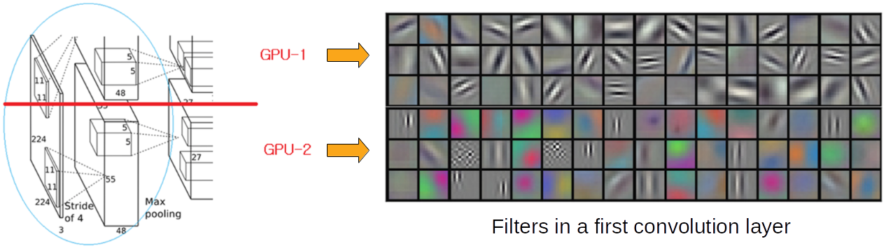

.. rst-class:: centered

    출처: `라온피플 (Laon People) <https://laonple.blog.me/220654387455>`_

첫 번째 Convolution layer에서 GPU-1은 주로 컬러와 상관없는 48개의 Filter로 학습됐고, GPU-2에서는 주로 Color와 관련된 48개의 Filter를 학습되었다고 한다. 또한, 두 번째 Convolutional layer와 세 번째 Convolutional layer 사이에서는 GPU-1과 GPU-2의 Convolution 결과만 서로 연결시켰다. 저자는 Validation을 통해 서로 연결시킬 부분을 찾았다고 한다.

.. rst-class:: centered

    출처: `라온피플 (Laon People) <https://laonple.blog.me/220654387455>`_

결론적으로 AlexNet은 GPU 2개를 병렬적으로 사용하여 Top-1과 Top-5 에러율을 각각 1.7%, 1.2% 줄일 수 있었다.

.. toctree::
    :hidden:

    reason_of_gpu_usage

Overlapping pooling
********************

CNN에서 Pooling은 주로 이미지 크기를 줄이기 위한 용도로 사용된다. LeNet에서는 Average pooling을 사용했지만 AlexNet에서는 Max pooling을 사용했고 이는 조금 더 생물학적인 특성과 유사하다. 그리고 아래의 빨간 화살표가 Max pooling 부분이다.

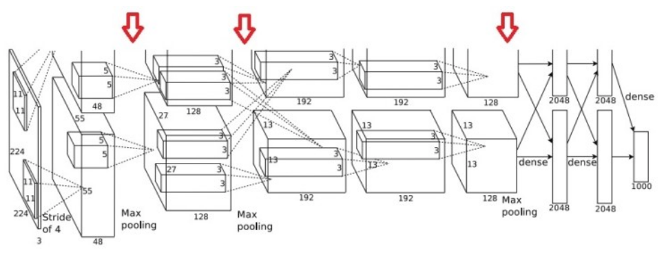

.. rst-class:: centered

    출처: `라온피플 (Laon People) <https://laonple.blog.me/220662317927>`_

그리고 일반적으로는 겹치지 않게 Pooling을 실시하는데, AlexNet에서는 Overlapping pooling 방식을 사용했다. LeNet에서 2x2 Window (Stride 1)를 사용했지만 AlexNet에서는 3x3 Window (Stride 2)를 사용했고, 논문에서는 Top-1, Top-5 에러율을 각각 0.4%, 0.3%씩 감소시켰고 Overfitting 가능성을 더 줄일 수 있다고 주장하고 있다.

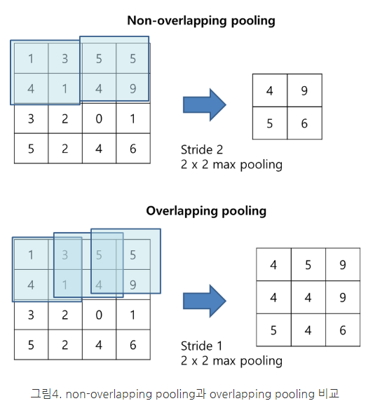

.. rst-class:: centered

    출처: `bskyvision, [CNN 알고리즘들] AlexNet의 구조 <https://bskyvision.com/421>`_

Dropout
********

:doc:`dropout` 은 Voting 효과로 인한 Overfitting 문제를 개선할 수 있다. 또한, Co-adaptation (동조화)을 피해 특정 Neuron의 영향력을 낮춤으로써 그 외 다른 Neuron이 학습 되지 않거나 학습 속도가 느려지는 문제를 개선할 수 있다.

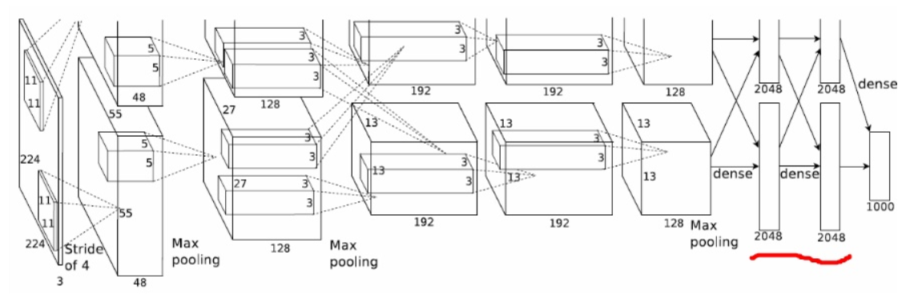

.. rst-class:: centered

    출처: `Time Travler, AlexNet <https://89douner.tistory.com/60?category=873854>`_

AlexNet에서는 처음 2개의 Fully connected layer에 Dropout (Rate = 50%)을 적용했다. 조금 더 자세한 내용은 2012년에 Hinton이 발표한 "Improving neural networks by preventing co-adaption of feature detectors"를 살펴보면 좋을 것 같다.

Detail architecture
********************

이번에는 각 Layer에서의 구조적인 특징들에 대해 조금 더 자세히 살펴 볼 예정이다.

.. rst-class:: centered

    출처: `라온피플 (Laon People) <https://laonple.blog.me/220654387455>`_

------------
Input layer
------------

AlexNet은 RGB 3가지 색상을 가지는 Image를 Input으로 사용하는 것이 LeNet과 다르다. 그래서 이미지의 Depth가 3이고 이를 Convolution 하기 위해 Filter의 Depth도 3이 된다.

---------------
1st conv layer
---------------

AlexNet의 Input image는 224x224x3으로 크기 때문에 각 GPU에 대해 11x11x3 Filter 48개 (Stride 4)로 Convolution 했고  (LeNet-5: 5x5 Filter), 이 때 Convolution 결과에 ReLU를 적용시켰다. 그 결과로 각 GPU에서 55x55 Feature map을 48개 (총 96개)를 생성했다. 여기에 3x3 Max pooling (Stride: 2)과 Local response normalization를 적용시켜, 각 GPU에 27x27 Feature map 48개 (총 96개)를 만든다.

---------------
2nd conv layer
---------------

마찬가지로 각 GPU의 27x27 Feature map 48개 (총 96개)에 각각 5x5x48 Filter 128개로 Convolution 했고, 여기에 ReLU를 적용시켰다. 그 결과로 각 GPU에서 27x27 Feature map 128개 (총 256개)를 생성했고, 여기에 3x3 Max pooling (Stride: 2)과 Local response normalization을 적용시켜 각 GPU에 13x13 Feature map 128개 (총 256개)를 만든다.

---------------
3rd conv layer
---------------

세 번째 Layer에서는 각 GPU의 13x13 Feature map을 128개 (총 256개)에 각각 3x3x128 Filter 192개로 Convolution 했고, 여기에 ReLU를 적용시켰다. 그 결과로 각 GPU에서 13x13 Feature map 192개 (총 384개)를 생성했다. 세 번째 Layer는 다른 Layer와 다르게 두 GPU에서 Convolution한 결과를 연결했다. 저자에 따르면 Validation을 통해 세 번째 Conv layer에서 두 GPU의 Convolution 결과를 연결하는 것으로 선택했다고 한다. 또한, 이번 Layer에서는 Max pooling과 Local response normalization을 하지 않는다.

---------------
4th conv layer
---------------

네 번째 Layer에서는 각 GPU의 13x13 Feature map 192개 (총 384개)에 3x3x192 Filter 192개로 Convolution 했고, 여기에 ReLU를 적용시켰다. 그 결과로 각 GPU의 13x13 Feature map 192개 (총 384개)를 생성했다.

---------------
5th conv layer
---------------

다섯 번째 Layer에서는 각 GPU의 13x13 Feature map 192개 (총 384개)에 3x3x192 Filter 128개로 Convolution 했고, 여기에 ReLU를 적용시켰다. 그 결과로 각 GPU에서 13x13 Feature map 128개 (총 256개)를 생성했고, 여기에 3x3 Max pooling (Stride: 1)을 적용시켜 각 GPU에 6x6 Feature map 128개 (총 256개)를 만든다.

----------------------
Fully connected layer
----------------------

Fully connected layer (FC layer)와 연결하기 위해 각 GPU의 6x6 Feature map 128개 (총 256개)를 Faltten 시킨다. Flatten은 아래 그림처럼 좌측 상단 값부터 순차적으로 추출하여 일렬로 나열하면 된다.

.. figure:: ../img/cnn/alexnet/flatten.png
    :align: center
    :scale: 70%

.. rst-class:: centered

    출처: `SuperDataScience, Step3: Flattening <https://www.superdatascience.com/blogs/convolutional-neural-networks-cnn-step-3-flattening>`_

각 GPU의 6x6 Feature map 128개 (총 256개)를 모두 Faltten 하면 9216개의 Neuron을 가지는 Layer를 만들 수 있다. 이렇게 Flatten된 Layer는 4096개의 Neuron을 가지는 첫 번째 FC layer에 연결시킨다. 또한, 4096개의 Neuron을 가지는 첫 번째 FC layer와 마찬가지로 4096개의 Neuron을 가지는 두 번째 FC layer를 연결한다.

-------------
Output layer
-------------

마지막으로 4096개의 Neuron을 가지는 두 번째 FC layer와 1000개의 Class를 구별할 수 있게 1000개의 Neuron을 가지는 Output layer와 연결한다. 여기서 1000개의 Neuron은 각 Category를 의미한다.

그리고 이 때 Softmax를 사용하여 Output layer로 전달되는 모든 값의 합이 1이 되게 값들을 변경해준다. 이는 각 1000개 Neuron (Category)이 나타나는 정도를 확률적으로 표현하여 해석하기 용이하게 만들기 위해서이다 (출처: `몽이몽이몽몽이의 블로그, Softmax <https://mongxmongx2.tistory.com/30>`_).

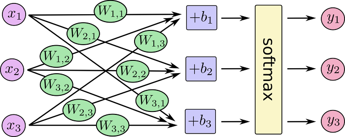

.. rst-class:: centered

    출처: `몽이몽이몽몽이의 블로그, Softmax <https://mongxmongx2.tistory.com/30>`_

지금까지 설명한 구조를 가지는 AlexNet에 이미지가 입력되어 마지막 Output layer까지 전달되었을 때, 가장 큰 값을 가지는 Neuron이 입력된 이미지의 Category가 된다. 지금까지 설명한 구조의 모든 Parameter를 정리하면 다음과 같다.

---------------
All parameters
---------------

============ ========== ====================================
Size         Layer      Detail
============ ========== ====================================
[224x224x3]  INPUT      -
[55x55x96]   CONV1      96 11x11 filters at stride 4, pad 0
[27x27x96]   MAX POOL1  3x3 filters at stride 2
[27x27x96]   NORM1      Normalization layer
[27x27x256]  CONV2      256 5x5 filters at stride 1, pad 2
[13x13x256]  MAX POOL2  3x3 filters at stride 2
[13x13x256]  NORM2      Normalization layer
[13x13x384]  CONV3      384 3x3 filters at stride 1, pad 1
[13x13x384]  CONV4      384 3x3 filters at stride 1, pad 1
[13x13x256]  CONV5      256 3x3 filters at stride 1, pad 1
[6x6x256]    MAX POOL3  3x3 filters at stride 1, pad 1
[4096]       FC6        4096 neurons
[4096]       FC7        4096 neurons
[1000]       FC8        1000 neurons (class scores)
============ ========== ====================================

These are more details:

* first use of ReLU
* used Norm layers (not common anymore)
* heavy data augmentation
* dropout 0.5
* batch size 128
* SGD Momentum 0.9
* Learning rate 1e-2, reduced by 10 mannualy when val accuracy palteaus
* L2 weight decay 5e-4
* 7 CNN ensemble: 18.2% → 15.4%

Results
========

지금까지 AlexNet의 특징들에 대해 살펴봤는데, 실제로 이미지 분류를 잘 할 수 있는지 한 번 확인해보자. 다음은 실제 이미지를 분류한 결과이고, Mite (진드기)가 한 쪽에 치우처져 있는 것도 잘 구별하는 것을 알 수 있다. 추정이 틀린 경우에도 보기에 따라 추정이 가능한 답변을 반환했다고 볼 수 있다.

.. figure:: ../img/cnn/alexnet/alexnet_results.png
    :align: center
    :scale: 60%

.. rst-class:: centered

    출처: `라온피플 (Laon People) <https://laonple.blog.me/220667260878>`_

이런 결과가 SIFT (Scale Invariant Feature Transform)과 같은 Feature extractor를 사용하지 않고 나왔다는 것이 의미있는 부분이다. 실제로 당시 SIFT를 사용한 참가자의 모델은 성능이 더 낮게 나왔다.

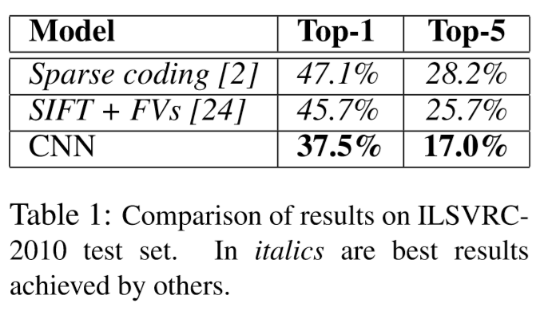

.. rst-class:: centered

    출처: ImageNet Classification with Deep ConvolutionalNeural Networks

결론적으로 데이터 양이 충분하고 좋은 CNN 구조를 가지면 좋은 결과를 낼 수 있다는 가능성을 보인 점에서 AlexNet의 의미는 크다고 할 수 있다.

Abstract
=========

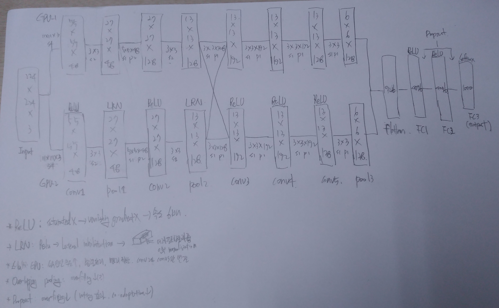

:h2:`출처`

* 라온피플 - `Convolutional layer [1] <https://laonple.blog.me/220623406512>`_, `AlexNet [1] <https://laonple.blog.me/220654387455>`_, `AlexNet [2] <https://laonple.blog.me/220662317927>`_
* `Machine Learning Blog, Neural Network <https://nmhkahn.github.io/NN>`_
* `데이터 사이언스 스쿨, AlexNet <https://datascienceschool.net/view-notebook/d19e803640094f76b93f11b850b920a4/>`_
