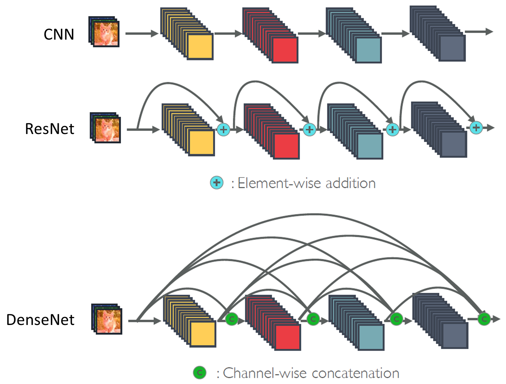
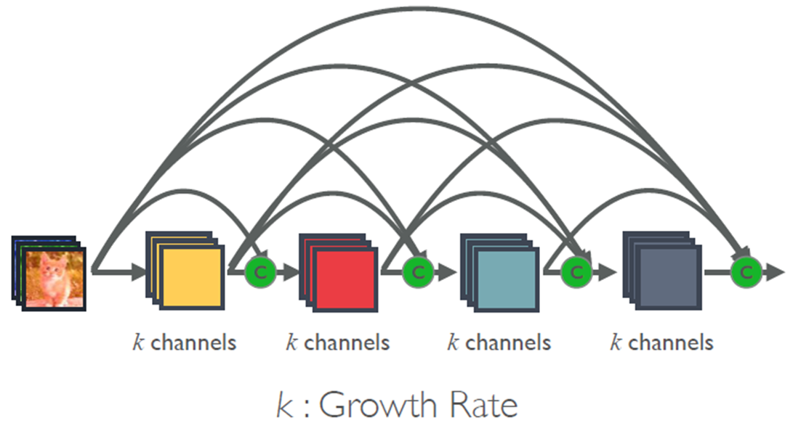
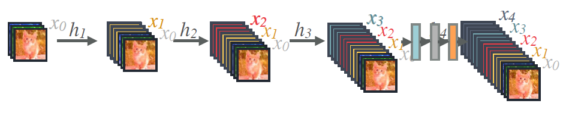
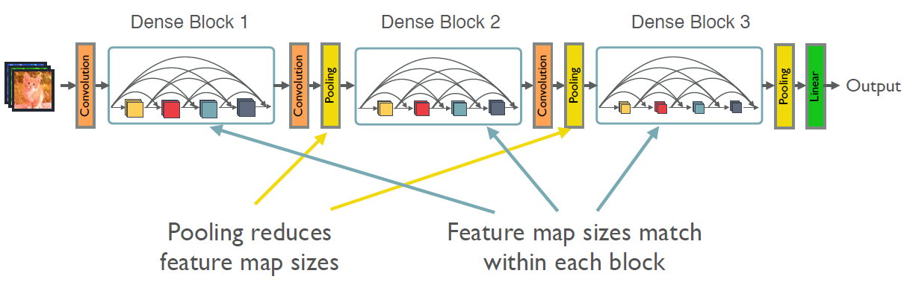
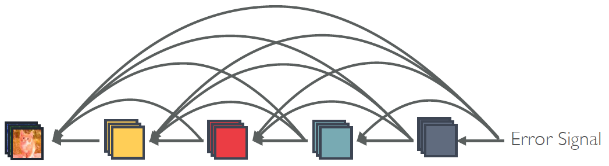
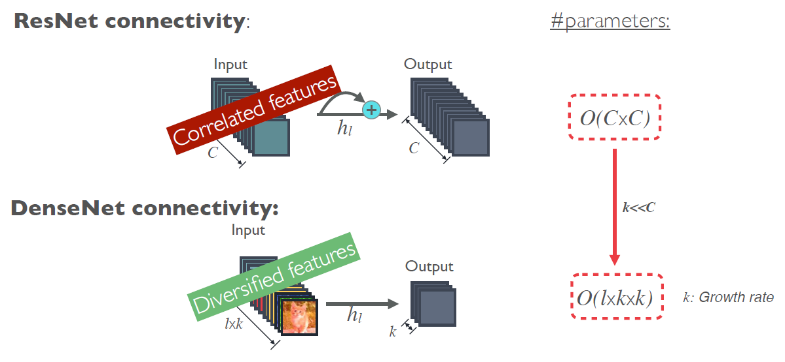
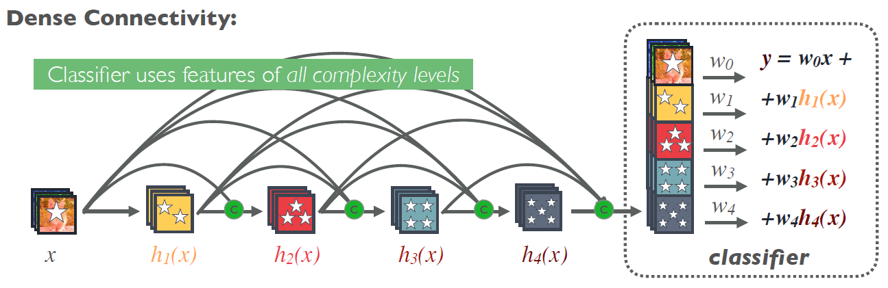

=========
DenseNet
=========

DenseNet은 기존의 LeNet, AlexNet, VGG, Inception, ResNet의 장점을 살려 만든 CNN architecture라고 한다.

구조
=====

크게 기본적인 CNN과 ResNet, DenseNet의 구조를 비교해보면 다음 그림과 같다.

.. rst-class:: centered

    출처: `SemanticScholar <https://pdfs.semanticscholar.org/c3d9/26a85d85a83126f405ad40ff453611148c15.pdf>`_

ResNet은 이전 결과와 현재 결과를 Summation으로 이어주는 구조였다면, DenseNet은 모든 결과를 Concatenation으로 다 연결시키는 구조라고 볼 수 있다. 그래서 ResNet은 결국 최종적으로 마지막 Layer의 결과로 Classification을 하는데, DenseNet은 전체 Layer 결과를 모두 반영하여 Classification을 할 수 있다. 그렇기 때문에 저자들은 DenseNet이 더 좋은 성능을 낼 수 있다고 주장한다.

하지만 모든 Layer를 다 연결하면 Parameter 수가 급격하게 늘어나기 때문에, DenseNet은 각 Layer의 Channel 수 (= Depth)를 줄인다. Channel 수를 많이 늘리지 않아도 모든 Layer를 고려하기 때문에 성능에 문제가 없다는 것이다. 이를 그림으로 나타내면 아래와 같다.

.. rst-class:: centered

    출처: `SemanticScholar <https://pdfs.semanticscholar.org/c3d9/26a85d85a83126f405ad40ff453611148c15.pdf>`_

세부 구조
=========

그렇다면 실제로 어떻게 이전 Layer의 정보를 가져오는지 그 방법을 살펴보자.

.. rst-class:: centered

    출처: `SemanticScholar <https://pdfs.semanticscholar.org/c3d9/26a85d85a83126f405ad40ff453611148c15.pdf>`_

위 그림처럼 Convolution한 결과와 이전 Layer 결과를 Concatenate 해주는 방식으로 DenseNet 구조가 이루어져있다.

:strike:`그리고 그 사이에 2가지 세부 구조가 더 있는데 이 부분은 추후에 작성할 예정이다.`

지금까지 언급한 내용을 하나의 구조로 표현하면 다음과 같다.

.. rst-class:: centered

    출처: `SemanticScholar <https://pdfs.semanticscholar.org/c3d9/26a85d85a83126f405ad40ff453611148c15.pdf>`_

장단점
=======

* 모든 Layer를 다 연결하기 때문에 Gradient의 전달이 잘 이루어짐

.. rst-class:: centered

    출처: `SemanticScholar <https://pdfs.semanticscholar.org/c3d9/26a85d85a83126f405ad40ff453611148c15.pdf>`_

* Parameter 수가 적음

.. rst-class:: centered

    출처: `SemanticScholar <https://pdfs.semanticscholar.org/c3d9/26a85d85a83126f405ad40ff453611148c15.pdf>`_

* Low한 Feature도 반영 가능

.. rst-class:: centered

    출처: `SemanticScholar <https://pdfs.semanticscholar.org/c3d9/26a85d85a83126f405ad40ff453611148c15.pdf>`_

Reference
==========

* `Youtube, PR-028: Densely Connected Convolutional Networks <https://youtu.be/fe2Vn0mwALI>`_
