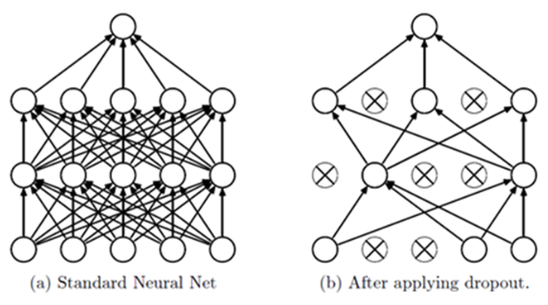

========
Dropout
========

Dropout은 아래 그림처럼 Network 학습 시 일부 Neuron을 생략하고 학습시키는 것을 의미한다.

.. rst-class:: centered

    출처: `라온피플, Dropout <https://laonple.blog.me/220542170499>`_

Dropout을 사용하면 Overfitting 문제를 해결할 수 있다. 그 이유는 무엇일까?

Voting 효과
===========

Dropout을 사용하면 Network의 Neuron이 랜덤하게 생략되기 때문에, 매번 학습할 때마다 랜덤하게 생략된 Network에 Overfitting 된다. 이 과정을 계속 반복하게 되면 랜덤하게 생략된 다양한 Network에 적합하게 학습이 되고, 이는 마치 여러 개의 다른 모델에서 Voting 하는 것과 유사한 형태를 띈다. 따라서 Dropout을 사용하면 조금 더 일반화된 Network를 생성하여 Overfitting을 줄이는 효과를 발휘한다.

Co-adaptation 효과
===================

특정 Neuron의 Weight나 Bias가 커지면 그 영향이 커져 다른 Neuron의 학습 속도가 느려지는 동조화 (Co-adaptation) 현상이 발생한다. 하지만 Dropout을 사용하면 랜덤하게 Neuron이 생략되기 때문에 특정 Neuron으로 동조화 되는 현상이 줄어들게 된다.

그 결과 특정 Neuron만 학습되는 것이 아니라 다른 Neuron도 학습될 수 있는 정도가 늘어나게 된다. 그러면 Dropout 사용 전에 동조화로 인해 학습이 느리거나 되지 않던 Neuron들의 학습 속도가 개선될 수 있다.

:h2:`참조`

* `라온피플, Dropout <https://laonple.blog.me/220542170499>`_
