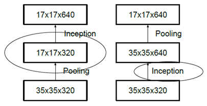

====================
Inception-V2 and V3
====================

Inception-V2, Inception-V3는 3x3 Convolution만 사용하는 VGGNet에서 많은 힌트를 얻은 것으로 보인다. 그렇다면 Inception-V2와 Inception-V3가 이전 CNN 모델과 다르게 기여한 부분은 무엇일까?

Contribution
=============

* Inception-V2

    * Factorizing convolutions

        * 5x5 1개 → 3x3 2개로 분해
        * 3x3 1개 → 1x3 1개 + 3x1 1개로 분해

    * Reducing grids

        * Convolution과 Pooling의 Stride를 2로 변경

* Inception-V3

    * Inception-V2와 구조는 동일한데 Hyperparameter만 변경

        * Optimizer: SGD → RMSProp
        * Label smoothing
        * :strike:`Factorizing convolution: 7x7 Convolution 1개 → 3x3 Convolution 3개 (확실하지 않음)`
        * BN-auxiliary

New architectures
==================

Inception-V2에서는 기존 GoogLeNet (Inception-V1)에서 연산량을 더 줄이기 위해 기존 Filter를 나누어 (Factorizing) 사용했다. 또한, Pooling은 Feature map의 크기를 줄여주지만 작은 정보를 손실하는 문제가 있는데, 이를 조금 더 효율적으로 할 수 있는 방법에 대해 고민했다. 하나씩 살펴보자.

Factorizing convolution
************************

큰 Filter를 인수분해하면 작은 Filter 여러 개로 구성된 Deep network를 만들 수 있다. 그 결과 Parameter 수가 줄면서 Network가 깊어지는 효과를 동시에 얻을 수 있다.

---------------
5x5 to two 3x3
---------------

아래 그림은 5x5 Convolution을 2개의 3x3 Convolution으로 구현한 예시이다. 이를 통해 Parameter 수를 줄일 수 있는데, 실제로 25개에서 9+9=18개로 약 28% 줄어든다.

.. figure:: ../img/cnn/inception-v2,v3/5x5_to_two_3x3.png
    :align: center
    :scale: 70%

.. rst-class:: centered

    출처: `라온피플 (Laon People) <https://laonple.blog.me/220710707354>`_

----------------------
Factorizing inception
----------------------

Inception 모듈도 위 방법을 이용하여 Parameter 수를 줄일 수 있다.

.. figure:: ../img/cnn/inception-v2,v3/factorizing_inception_5x5_7x7.png
    :align: center
    :scale: 80%

.. rst-class:: centered

    출처: `라온피플 (Laon People) <https://laonple.blog.me/220710707354>`_

여기서도 **5x5 Convolution은 2개의 3x3 Convolution으로** 대체 가능하다. 또한, **7x7 Convolution은 3개의 3x3 Convolution으로** 대체하여, Parameter 수를 49개에서 9+9+9=27로 약 45% 줄일 수 있다.

지금까지는 5x5 또는 7x7 Convolution을 Symmetry가 유지된 2개 또는 3개의 3x3 Convolution으로 **인수분해 (Factorization)** 했다. 하지만 반드시 그렇게 해야 되는 것은 아니다. 아래 그림처럼 3x3 Convolution을 1x3 그리고 3x1 Convolution으로 분해할 수 있다. 그 결과 Paramter 수를 9개에서 3+3=6개로 약 33% 줄일 수 있게 된다.

.. figure:: ../img/cnn/inception-v2,v3/3x3_to_1x3_and_3x1.png
    :align: center
    :scale: 80%

.. rst-class:: centered

    출처: `라온피플 (Laon People) <https://laonple.blog.me/220710707354>`_

위 과정을 좀 더 일반화하면 **nxn Convolution은 1xn과 nx1 Convolution으로 분해** 할 수 있고, n이 커질수록 Parameter를 더 많이 줄일 수 있게 된다.

지금까지 분해한 방법을 모두 사용하여 Inception 모듈을 개선하면 다음과 같다.

.. figure:: ../img/cnn/inception-v2,v3/factorizing_inception_3x3.png
    :align: center
    :scale: 80%

.. rst-class:: centered

    출처: `라온피플 (Laon People) <https://laonple.blog.me/220710707354>`_

정리해보면, 큰 Filter를 3x3 Convolution으로 나누어 (Factorizing) 표현하는 것이 VGGNet의 핵심 아이디어이고, 이는 Inception-V2와 V3의 기반 아이디어가 된다.

Reducing resolutions
*********************

기존에 해상도 (Resolution, Grid size)를 줄이는 방법은 Convolution 시 Stride를 1보다 큰 값으로 두거나 Pooling을 사용하는 것이었다. 그렇다면 다음 두 가지 방법 중 어떤 방법이 더 효과적인 방법일까? Inception을 Convolution으로 생각해도 상관없다.

.. rst-class:: centered

    출처: `라온피플 (Laon People) <https://laonple.blog.me/220716782369>`_

왼쪽 방식은 Pooling으로 크기를 먼저 줄이고, Inception을 적용하여 Feature map을 얻는다. 연산량 관점에서는 효율적이지만 Pooling으로 인해 기존 Feature map에 숨어 있는 정보가 사라질 수 있기 때문에 최적이라고 하기는 어렵다.

반면, 오른쪽 방식은 Inception을 먼저 적용하여 Feature map을 생성한 후 Pooling으로 Feautre map의 크기를 줄이는 방법이다. 당연히 연산량은 약 4배 늘어나지만 줄이지 않은 상태에서 Feature를 추출했기 때문에 숨은 Feature를 더 잘 찾아낼 수 있게 된다.

기존의 방법은 아직 연산량이 많은데 어떻게 하면 더 효과적으로 연산량을 줄일 수 있을까? Google이 제안한 구조는 다음 그림과 같다.

.. figure:: ../img/cnn/inception-v2,v3/reducing_grid.png
    :align: center
    :scale: 90%

.. rst-class:: centered

    출처: `라온피플 (Laon People) <https://laonple.blog.me/220710707354>`_

먼저, 우측 이미지처럼 **Convolution과 Pooling의 Stride를 2로 변경** 하여 Representation bottleneck이 없는 구조를 제시했다. 그리고 좌측 이미지처럼 5x5 Convolution을 3x3 Convolution 2개로 Factorization 하여 연산량을 줄인다. 결론적으로 구조 변경으로 효율성과 연산량 절감을 모두 얻을 수 있었다.

Inception-V2
=============

지금까지 이야기한 방법들을 고려하여 Szegedy (GoogLeNet 설계자)는 "Rethinking the inception architecture for computer vision"에서 다음과 같은 구조의 Inception-V2를 제안했다.

.. figure:: ../img/cnn/inception-v2,v3/inception-v2.png
    :align: center
    :scale: 70%

.. rst-class:: centered

    출처: `norman3.github.io, Google Inception Model <https://norman3.github.io/papers/docs/google_inception.html>`_

그리고 아래 표가 Factorizing convolution을 적용한 최종 Inception-V2 구조를 나타내고 있다.

===========  ====================  ===========
Type         Patch size / Stride   Input size
===========  ====================  ===========
conv         3x3 / 2               299x299x3
conv         3x3 / 1               149x149x32
conv padded  3x3 / 1               147x147x32
pool         3x3 / 2               147x147x64
conv         3x3 / 1               73x73x64
conv         3x3 / 2               71x71x80
conv         3x3 / 1               35x35x192
3xInception  As in figure 5        35x35x288
5xInception  As in figure 6        17x17x768
2xInception  As in figure 7        8x8x1280
pool         8x8                   8x8x2048
linear       logits                1x1x2048
softmax      classifier            1x1x1000
===========  ====================  ===========

Inception-V2에서는 기존 GoogLeNet에서 입력으로 사용한 224x224x3 이미지 보다 더 큰 299x299x3 이미지를 입력으로 사용했다. 또한, 위 표에서 알 수 있듯이 처음에 3x3 Filter를 사용한 Convolution layer가 3개 있다. 이는 원래 GoogLeNet에서 7x7 Filter 하나 쓴 것을 Factorization convolution을 적용한 결과이다.

.. figure:: ../img/cnn/inception-v2,v3/inception-a,b,c.png
    :align: center
    :scale: 60%

.. rst-class:: centered

    출처: `norman3.github.io, Google Inception Model <https://norman3.github.io/papers/docs/google_inception.html>`_

위 그림은 변경된 3가지 Inception의 형태이다. 첫 번째 Inception만 살펴보면 기존 Inception과 다르게 1x1/3x3/3x3 Convolution, 1x1/3x3 Convolution, Pooling 형태로 구현했고 마지막 Layer의 Stride는 2로 했다. 그리고 Inception 모듈 3개를 연속적으로 사용했다.

결과적으로 보면 기존의 GoogLeNet과 구조적으로 유사하지만 Network가 더 깊어지고 연산량이 줄어들었다.

Inception-V3
=============

Inception-V3는 Inception-V2를 만들고 나서, 여러 가지를 수정해보다가 결과가 좋게 나온 것들을 합친 모델이다. 그래서 기존 Inception-V2와 구조는 동일하다. 변경된 사항은 아래에 요약했다.

* Optimizer 변경

    * RMSProp으로 변경

* Label Smoothing

    * Target 값을 one-hot encoding을 사용 X
    * 값이 0 인 레이블에 대해서도 아주 작은 값 :math:`e` 를 배분
    * 정답은 :math:`1−(n−1) \times e` 로 값을 반영하여 사용

* Factorized 7-7

    * :strike:`맨 앞쪽 Conv 7x7 → Conv 3x3 2개로 Factorization (확실하지 않음)`

* BN-auxiliary

    * 마지막 Fully Conntected layer에 Batch Normalization (BN) 적용

정리가 다 되지 않은 부분은 추후에 정리할 예정이다.

Experiment results
===================

다음은 Inception-V2를 다양하게 실험해 본 결과이다 (Single-crop). Regularizaiton 효과 극대화를 위해 Batch noramlized auxiliary classifier를 적용하면 Top-5 error가 5.6%까지 줄어드는 것을 확인할 수 있다.

===============================  ===========  ===========  ============
Network                          Top-1 error  Top-5 error  Cost Bn Ops
===============================  ===========  ===========  ============
GoogLeNet                        29%          9.2%         1.5
BN-GoogLeNet                     26.8%        ―            1.5
BN-Inception                     25.2%        7.8%         2.0
Inception-V2                     23.4%        ―            3.8
Inception V2 & RMSProp           23.1%        6.3%         3.8
Inception V2 & Label smoothing   22.8%        6.1%         3.8
Inception V2 & Factorized 7x7    21.6%        5.8%         4.8
Inception-V2 & BN-auxiliary      21.2%        5.6%         4.8
===============================  ===========  ===========  ============

추가로 Inception-V3에서는 Multi-crop을 144개 적용시켜 Top-1 error가 4.1%까지 낮아졌다.

Conclusion
===========

Inception-V2에서는 기존 GoogLeNet의 구조 일부를 Factorization하여 연산량을 줄였고, 단순히 Pooling을 적용시키는 게 아니라 Convolution과 나란히 적용시키는 것이 효과적이라고 밝혔다. 또한, Inception-V3에서는 기존 구조에서 다양한 실험 후 조금 더 개선된 모델을 제시했다.

:h2:`Reference`

* 라온피플 - `GoogLeNet [4] <https://laonple.blog.me/220710707354>`_, `GoogLeNet [5] <https://laonple.blog.me/220716782369>`_
* `norman3.github.io, Google Inception Model <https://norman3.github.io/papers/docs/google_inception.html>`_
