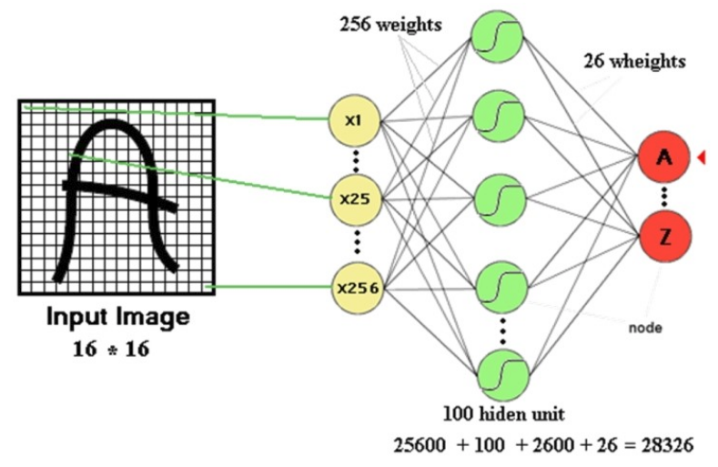
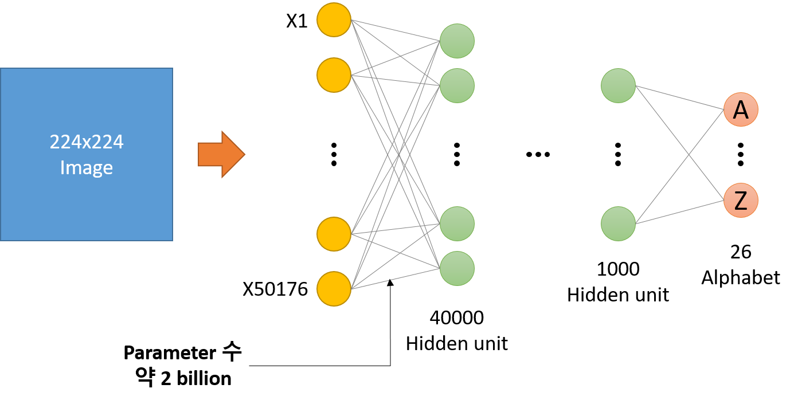
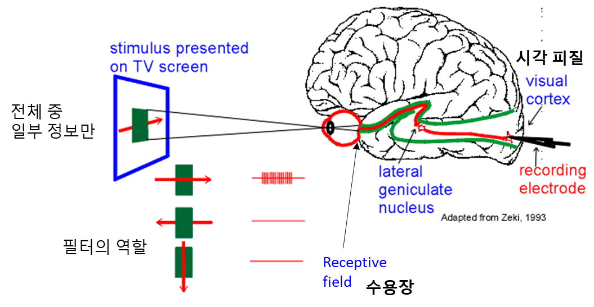
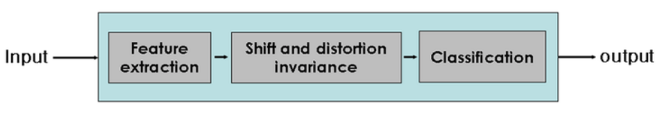
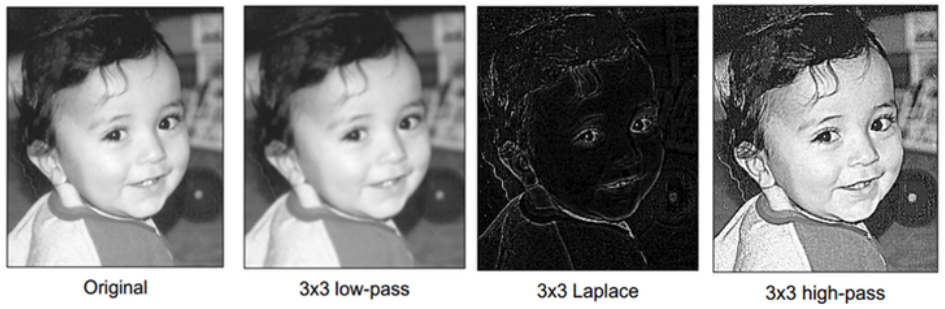
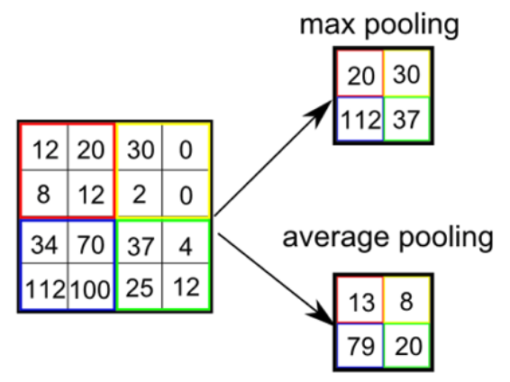

=============
Introduction
=============

위키피디아에 따르면, CNN을 아래와 같이 정의할 수 있다.

    In deep learning, a convolutional neural network (CNN, or ConvNet) is a class of deep neural networks (DNN), most commonly applied to analyzing visual imagery (출처: `Wikipedia <https://en.wikipedia.org/wiki/Convolutional_neural_network>`_).

즉, CNN은 이미지를 분석하는데 활용되는 Deep neural network라고 할 수 있다.

실제로 합성곱 신경망 (Convolutional Neural Network, CNN)은 1989년 LeCun의 논문 "Backpropagation applied to handwritten zip code recognition"에서 제안한 모델이다. CNN은 Zip code 인식을 위한 프로젝트로 개발되었다.

그렇다면 이미지를 인식할 때 왜 기존 DNN을 사용하지 않고 CNN을 새로 개발했을까? DNN의 문제점을 살펴보면 다음과 같다.

DNN의 문제점
===========

필기체를 인식하는 예제를 통해 DNN의 문제점을 살펴보자.

.. rst-class:: centered

    출처: `라온피플 (Laon People) <https://laonple.blog.me/220587920012>`_

위치 정보 손실
**************

첫 번째 문제는 DNN은 이미지 정보를 입력으로 받을 때 그 위치의 중요도는 모두 동일하다고 간주하고 1차원 Vector로 표현하여 실제 위치 정보를 잃어버리는 것이다. 그러다보니, 글자 이미지의 위치를 조금만 이동시키거나 크기가 달라지거나 회전 또는 변형 (Distortion)이 조금만 생겨도 모델이 다른 이미지라고 판단할 수 있기 때문에 변형된 이미지로 새롭게 학습해야 한다. 이처럼 많은 데이터로 학습시켜야 하기 때문에 그 시간이 오래 걸린다.

Parameter 수 ↑
***************

두 번째 문제는 위처럼 간단한 모델에서도 학습을 위한 Parameter의 수가 약 3만개다. 만약, Image 크기가 커지고 Hidden layer 개수가 많아지면 Parameter 수는 급격하게 늘어날 수 있다. 예를 들어 Image 크기가 224x224로 커지고 Hidden layer 수가 늘어난 아래와 같은 DNN이 있다고 했을 때, Input image와 첫 번째 Hidden layer 사이의 Parameter 수만 약 2 billion개이다 (152 layer ResNet: 3.6 billion). 이처럼 Parameter 수가 많아짐에 따라, 학습 시간도 오래 걸리고 :doc:`과적합 </ai/ml/intro>` 문제도 발생할 수도 있다.

그래서 이러한 문제점을 해결하기 위해 연구자들은 사람이 사물을 인식할 때 활용되는 수용 영역 (Receptive field)의 원리를 반영한 신경망을 만들었고, 그것이 바로 CNN이다. 그렇다면 수용 영역에 대해 먼저 이해해보자.

수용 영역
==========

생명과학 대백과사전에 따르면 수용 영역 (Receptive field)의 의미는 다음과 같다.
    
    정보처리와 관계되는 세포에 대해 응답을 일으키는 자극의 영역. 감각기의 수용 표면에서 감각자극이 단일 감각신경에 반응, 즉 충격발생을 일으키는 영역이다. 특히 눈의 망막면 광자극에 관계되는 것을 말하며, 개구리 망막에서 미세조사법을 이용한 연구결과에 의해 명명된 용어이다. 넓이는 자극광 강도에 의존하고 역자극은 가장 민감한 중앙의 작은 부분에 한정되지만, 그 10^2 ~ 10^3배 강도에서는 2배 면적 (1mm)으로 확대된다.
    
요약하면, 수용 영역은 전체 자극 중 일부 자극에만 반응하는 영역을 의미한다. 수용 영역이 전체 중 일부 자극에만 반응하게 만들어진 이유는 무엇일까? 실제 이미지에서 특정 위치의 픽셀들은 주변에 있는 픽셀과 관련있고 멀어질수록 그 영향력이 낮아지기 때문에 수용 영역처럼 전체 중 일부 자극만 받아들여 처리하는게 사물 인식 시 더 효과적이다.

.. rst-class:: centered

    출처: `York university <http://www.yorku.ca/eye/cortfld.htm>`_

그림에서도 볼 수 있듯이, 사람은 먼저 외부 자극 **전체 중 일부분** 에 대한 정보를 받아들이고, 이를 수용 영역을 이용해 중요한 **특징을 기반으로 필터링** 한다. 그리고 그 결과들을 시각 피질로 전달하여 사람이나 사물을 인식한다. 마찬가지로 컴퓨터가 이미지를 인식할 때도 전체가 아닌 특정 범위에 대해 여러 가지 특징 정보를 필터링하고, 그 결과를 기반으로 이미지를 인식하는 프로세스로 모델을 만들 수 있다. 이러한 모델이 CNN이고, 지금부터 CNN에 대해 하나씩 알아보려고 한다.

CNN 구조
=========

CNN은 먼저 Filter로 Convolution하는 과정과 Subsampling을 통해 특징을 추출하고, 추출한 특징을 기반으로 기존 Fully connected layer로 이미지를 분류한다. 이 과정을 조금 더 자세하게 표현하면 아래 그림과 같다.

.. figure:: ../img/cnn/intro/lenet-5.png
    :align: center
    :scale: 60%

.. rst-class:: centered

    출처: `라온피플 (Laon People) <https://laonple.blog.me/220608018546>`_

자, 그러면 지금부터 CNN의 각 구조에 대해서 알아보자.

Convolution
************

Convolution은 이미지에서 Filter로 원하는 특징을 추출할 때 사용되는 연산 방법이다. 그리고 Filter는 말 그대로 Image에서 내가 얻고자 하는 특징들만 걸러낼 수 있게 하는 거름망 같은 역할을 한다. 아래의 이미지로 조금 더 자세히 알아보자.

.. figure:: ../img/cnn/intro/convolution.png
    :align: center
    :scale: 70%

.. rst-class:: centered

    출처: `라온피플 (Laon People) <https://laonple.blog.me/220594258301>`_

위 첫 번째 그림은 Image의 좌측 상단에서 3x3 Filter로 원하는 특징만 추출하는 과정을 나타낸 것이다 (Filter의 값은 빨간색으로 표기됨). 우리는 여기서 Filter에 해당하는 특징을 추출하기 위해, 각 픽셀 값과 Filter의 값을 곱하고 곱한 모든 값을 더한다. 그 결과값이 왼쪽 상단 부분에서 Filter의 특징을 가지는 정보를 추출한 것이다. 이 때, **각 값들을 곱하고 그 모든 값을 더하는 연산이 바로 Convolution** 이다.

그리고 이러한 Convolution을 한 칸씩 이동하면서 이미지의 마지막 부분에 도착할 때까지 반복하면, 주어진 Image에서 Filter에 해당하는 특징들을 모두 추출할 수 있게 된다 (:strike:`이는 결국 Filter를 이용하여 Image의 특징이 나타나는 위치를 찾아내는 것과 같은 효과를 가진다 (아직 이해 X).`). 이 때 Convolution하고 이동하는 거리를 **Stride** 라고 하고, 일정한 간격으로 Convolution하여 새롭게 얻어낸 결과를 **Feature map** 이라고 부른다.

따라서 어떤 Filter를 적용하느냐에 따라 이미지에서 다양한 특징을 가진 이미지를 추출할 수 있다.

.. rst-class:: centered

    출처: `라온피플 (Laon People) <https://laonple.blog.me/220594258301>`_

지금까지 Convolution을 설명했고, 이를 설명하면서 Filter에 대해서 간단하게 이야기 했는데 조금 더 자세히 알아보자.

Filter
*******

위에서 Convolution을 설명할 때 이미지에서 특징을 추출하기 위해 여러 가지 값이 `정해진 Filter <#convolution>`_ 를 사용했었다. 마찬가지로 CNN에서도 Filter를 사용하는데, 이전처럼 고정된 Filter가 아니라 학습을 통해 만들어지는 Filter를 사용한다는 점에서 다르다. 그래서 CNN을 적용하고자 하는 문제에 따라 Filter 값이 달라질 수 있다.

또한, 위에서 확인해 본 것처럼 하나의 이미지에도 다양한 Filter를 사용하면 다양한 특징들이 추출된다. 그렇다면 CNN에서는 몇 개의 Filter를 사용하는게 적절할까? 그리고 각 Filter의 크기는 어떤 것이 적절할까?

------------
Filter의 개수
------------

일반적으로는 입력 이미지 근처에서는 적게 사용하고, 멀어질수록 더 많이 사용하는 경향이 있다. 조금 더 정확한 규칙은 없을까?

Filter의 개수를 결정하는 일반적인 방법은 각 Layer에서 연산 시간/양을 일정하게 유지하여 시스템의 균형을 맞추는 방향으로 결정된다. 즉, 각 Layer에서 Feature map (Feature map은 보통 이미지를 Filter로 Convolution한 결과를 의미함)의 개수와 Pixel 수의 곱을 일정하게 유지할 수 있게 Filter 개수를 결정하면 된다.

예를 들면, Convolution layer에서 2x2 Subsampling을 하는 경우 Pixel 수가 1/4로 줄어들기 때문에 그 다음 Convolution 할 때는 Filter 수를 4배로 증가시켜 Feature map 수를 4배로 증가시키면 된다.

-------------
Filter의 크기
-------------

Filter의 크기는 여러 논문에서 다양한 형태로 나타나는데, 이미지의 크기가 클수록 더 큰 Filter를 사용한다. 그렇다면 큰 크기의 Filter를 하나 사용하는 것과 작은 크기의 Filter를 여러 개 사용하는 것 중에 뭐가 더 좋을까?

정답은 작은 크기의 Filter를 여러 개 사용하는 것이다. 여러 개를 사용하면 중간에 :strike:`비선형화 과정을 통해 특징을 더 돋보이게 만들 수 있다 (이해 X).` 또한, 연산량도 더 줄일 수 있다. 조금 더 자세한 내용은 추후에 다룰 예정이니 우선 결론을 알고 있자.

이 외에도 Filter로 Convolution 시 고려할 수 있는 Hyperparameter로 Stride와 Zero padding이 있다.

-------
Stride
-------

Stride는 Convolution 시 건너 뛸 픽셀 수를 의미한다. 아래의 이미지는 Stride가 1인 경우다.

.. figure:: ../img/cnn/intro/stride.jpg
    :align: center
    :scale: 70%

.. rst-class:: centered

    출처: `TAEWAN.KIM 블로그 <http://taewan.kim/post/cnn/>`_

그렇다면 Stride 값이 커지면 어떻게 될까? Stride 값이 커지면 중복되는 부분이 줄어들고 Convolution이 시도되는 범위가 줄어, Local feature의 특성을 다 고려하지 못한 Global feature가 만들어질 수도 있다.

그래서 통상적으로 Stride를 1로 두고 Subsampling 작업을 하지만, 입력 영상 크기가 큰 경우 연산량을 줄이기 위한 목적으로 입력 Layer 가까운 쪽에서 적용하기도 한다 (AlexNet).

-------------
Zero padding
-------------

Zero padding은 Convolution 후 Feature map의 크기가 입력 크기보다 작아지는 것을 막기 위해 사용하는 방법이다. 말 그대로 입력 이미지의 경계에 0을 추가해 Convolution 하더라도 크기가 유지되게 만드는 방법이다.

.. figure:: ../img/cnn/intro/zero_padding.gif
    :align: center
    :scale: 80%

.. rst-class:: centered

    출처: `PyImageSearch <https://s3-us-west-2.amazonaws.com/static.pyimagesearch.com/keras-conv2d/keras_conv2d_padding.gif>`_

위 그림에서 보는 것처럼 Zero padding을 추가하면, Convolution을 하더라도 기존 이미지와 크기가 동일한 Feature map이 만들어지는 것을 볼 수 있다. 그리고 Zero padding을 하는 이유는 Convolution 후 Feature map 크기를 입력 이미지 크기로 유지하는 것도 있지만, 경계면의 정보 획득할 수 있다는 점도 있다.

Subsampling
************

Feature를 추출할 때 Convolution 후에 Subsampling이라는 과정을 거친다. Subsampling은 Convolution으로 특징이 어느 정도 추출되었으면, 모든 특징을 다 사용하지 않고 중요한 부분만 사용하는 방법이다. 우리가 고해상도 이미지를 보고 사물을 판단할 수 있지만, 저해상도 사진으로도 사물을 구분할 수 있는 경우를 생각하면 이해에 도움이 된다.

그리고 Subsampling을 하면 Feature map의 크기가 줄어들어 연산량을 감소시켜주는 효과도 있다.원리와 유사하게 생각하면 된다. 또한, Subsampling을 하면 중요한 정보만 추출해내기 때문에 Feature map의 크기를 줄여주는 효과도 있다. 지금까지 설명한 Subsampling에는 크게 2가지 방법이 있다.

.. rst-class:: centered

    출처: `라온피플 (Laon People) <https://laonple.blog.me/220608018546>`_

* Max pooling

    * 실제 Neuron에서는 여러 자극 중 가장 큰 자극만 전달한다고 함
    * CNN에서는 Window 내의 가장 큰 값을 선택하는 방법
    * 여기서 Window는 이미지에서 Subsampling하는 범위를 의미함

* Average pooling

    * Window의 평균을 계산하는 방법

Fully connected layer
**********************

Fully connected layer는 Convolution과 Subsampling으로 추출한 특징으로 분류하는 부분이다. 크게 Feature map을 Flatten화 하는 부분, Fully connected layer, 최종 분류하는 Softmax layer로 구성된다.

.. figure:: ../img/cnn/intro/lenet-5.png
    :align: center
    :scale: 60%

.. rst-class:: centered

    출처: `라온피플 (Laon People) <https://laonple.blog.me/220608018546>`_

위 이미지에서 S4 → C5로 전달되는 과정이 Feature map을 Flatten화 하는 부분이다. 여기서는 5x5 Convolution 작업을 120번 반복해서 Faltten화 한다. F6 부분은 기존 DNN처럼 C5의 모든 노드와 연결시키는 Fully connected layer이다.

그리고 마지막 Layer가 Softmax layer인데 이전 Fully connected layer의 값을 0과 1 사이의 값으로 변환해 주는 부분이다. 이 때 모든 노드의 합은 1이 되게한다. 그래서 가장 높은 값을 가지는 Class로 분류가 된다.

요약
*****

지금까지 CNN의 각 구조에 대해서 이해를 해봤다. 언급된 내용을 간단히 정리하면 다음과 같다.

.. rst-class:: centered

    **Filter를 이용한 Convolution 작업과 Subsampling과정을 반복적으로 진행하여 Feature 추출**
    
    **↓**

    **추출한 Feature를 Fully connected layer를 이용해 분류**

CNN을 사용해야 하는 이유
========================

지금까지 CNN의 구조에 대해 설명했는데, 그렇다면 왜 이미지 인식 문제에서 DNN을 사용하지 않고 CNN을 사용하는 걸까? 이전에 언급했던 내용을 다시 리마인드 해보면, 이미지를 인식할 때 DNN을 사용하면 크게 2가지 문제가 있었다.

* 위치 정보를 상실하여 약간의 변형에도 다시 학습해야 되는 문제
* Parameter 수가 많음 → 학습 속도가 느려지고 과적합 발생 가능성이 높아짐

CNN은 구조적인 특징으로 위 2가지 문제를 해결했다.

* Locality

    * CNN은 수용 영역과 유사하게 Filter를 이용하여 Local 정보를 활용함
    * 다양한 Filter를 여러 개 사용 → 다양한 Local feature 추출

    .. figure:: ../img/cnn/intro/cnn_locality.png
        :align: center
        :scale: 40%

    .. rst-class:: centered

        출처: `Convolutional Neural Networks (CNN) By Prof. Seungchul Lee in Industrial AI Lab <http://i-systems.github.io/HSE545/machine%20learning%20all/Workshop/180208_COSEIK/image_files/cnn_locality.png>`_

* Shared weights

    * 이미지에서 Local 정보를 추출할 때 가중치가 동일한 Filter를 반복 적용함 → Parameter 수 감소
    * :strike:`위 과정을 통해 위상 변화에 무관한 항상성 획득 (이해 X)`

    .. figure:: ../img/cnn/intro/cnn_shared_weights.png
        :align: center
        :scale: 40%

    .. rst-class:: centered

        출처: `Convolutional Neural Networks (CNN) By Prof. Seungchul Lee in Industrial AI Lab <http://i-systems.github.io/HSE545/machine%20learning%20all/Workshop/180208_COSEIK/image_files/cnn_invariance.png>`_

정리하면, 이미지 인식할 때 CNN을 사용하면 Local 정보를 추출하기 때문에 이미지가 약간 변형돼도 적절한 특징을 추출할 수 있고, 동일한 Filter를 사용하여 Parameter 수를 줄일 수 있다. 그래서 이미지 인식할 때는 DNN보다 CNN을 사용하는 것이 더 좋다.

코드
=====

지금까지 CNN의 전체적인 구조를 살펴봤다. 이해한 내용을 실제로 구현해보면 더 이해가 잘 될 것 같아 CNN의 각 개념을 구현했고, `여기 <#>`_ 에서 확인할 수 있다.

CNN architectures
==================

CNN에 대해 더 이해하기 위해서는 대표적인 CNN을 살펴보는 것이 좋다. 특히, 이미지넷 이미지 인식 대회인 ILSVRC (ImageNet Large Scale Visual Recognition Challenge)에서 수상했던 CNN architecture를 중심으로 언급하려고 한다.

* :doc:`lenet`

    * Yann LeCun이 1989년에 발표한 구조로 처음으로 CNN을 성공적으로 도입함
    * Zip code 인식 프로젝트를 통해 개발됨
    * CNN 역사의 고전

* :doc:`alexnet`

* :doc:`zfnet`

* :doc:`googlenet`

* :doc:`inception-v2,v3`

* :doc:`vggnet`

* :doc:`resnet`

* :doc:`densenet`

추가적으로 `ImageNet <../dataset.html#imagenet>`_ 과 ILSVRC는 각각 링크를 통해 설명하려고 한다.

지금까지 CNN의 기본적인 내용과 대표 Architecture에 대해 간단히 알아보았다. 지금부터는 각각의 CNN architecture를 조금 더 자세히 알아보려고 한다.

Reference
==========

* 라온피플 - `CNN 개요 <https://laonple.blog.me/220587920012>`_, `Why CNN? <https://laonple.blog.me/220594258301>`_, `CNN의 구조 <https://laonple.blog.me/220608018546>`_, `Overview <https://laonple.blog.me/220643128255>`_
* `조대협의 블록, 딥러닝 - 초보자를 위한 컨볼루셔널 네트워크를 이용한 이미지 인식의 이해 <https://bcho.tistory.com/1149>`_
