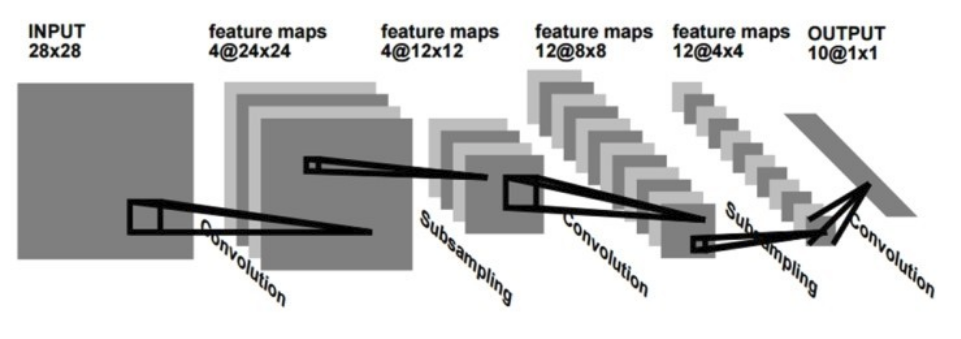

======
LeNet
======

LeNet은 Yann LeCun이 개발한 CNN architecture 이름이다. 프랑스 사람인 Yann LeCun은 CNN 개념을 최초로 개발한 사람이다. LeNet은 LeNet-1부터 LeNet-5까지 있고, 여기서는 LeNet-1과 LeNet-5만 다룰 예정이다.

LeNet-1
========

LeCun 연구팀은 기존 DNN의 문제점을 해결하기 위해 Local receptive field, Shared weights, Subsampling 개념을 도입한 CNN 개념을 만들었다 (:doc:`Link <intro>`). 1990년에 처음으로 CNN 개념이 반영된 LeNet-1을 발표했고, 그 Architecture는 아래와 같다.

.. rst-class:: centered

    출처: `라온피플 (Laon People) <https://laonple.blog.me/220608018546>`_

먼저, LeNet-1은 입력 이미지에서 Filter를 활용한 Convolution으로 Feature map을 만든다. 여기서 여러 다른 특징을 추출하기 위해 다양한 Filter를 사용하여 여러 개의 Feature map을 만들 수 있다. 그리고 각 Filter는 모든 이미지에 대해 동일하게 사용하여 Shared weights 개념도 반영되었다.

다음으로 Subsampling으로 Feature map에서 특정 Window 크기의 값들의 평균들만 추출하여 Feature map을 만들 수 있다. 그 결과, Feature의 크기를 줄이면서 동시에 Topological invariance를 얻을 수 있다. 또한, 하나의 Feature map에서 Subsampling을 통해 하나의 Local feature를 얻고, 그 Local feature에서 다시 Convolution과 Subsampling으로 Feature를 얻는 과정을 통해 Global feature를 얻을 수 있다. 결국, 전체를 대표할 수 있는 강한 특징들만 남게 된다.

마지막으로 전체를 대표할 수 잇는 Global feature를 10개의 Class로 Convolution하여 Classification이 가능하게 만든다. 정리하면, LeNet-1은 크게 Convolutional layer, Subsampling layer로 구성되어 있다고 할 수 있다.

LeNet-5
========

그 이후로 계속 개선하여 최종적으로 1998년에 LeNet-5를 발표했다. LeNet-5에서는 입력 이미지의 크기가 커졌고, Fully connected layer가 추가되었다. 

LeNet-1에서는 16x16로 이미지를 줄이고 28x28 중앙에 위치시켰지만, LeNet-5에서는 28x28 이미지를 32x32의 중앙에 위치시켰다. 이처럼 LeNet-5에서 LeNet-1 보다 더 큰 이미지를 사용했기 때문에 이미지의 Detail한 부분까지 고려하여 성능이 더 높아진 부분도 있다.

또한, LeNet-5는 Network가 크기 때문에 Parameter 수는 6만개에 달한다 (DNN: 약 12만개, LeNet-1: 약 3천개). Parameter에 대한 자세한 내용은 :ref:`trainable-parameters` 에서 다룰 예정이다.

Architecture
*************

아래 그림이 "Gradient-based learning applied to document recognition"에서 제안했던 LeNet-5의 Architecture이다. 이 논문은 정체기에 빠졌던 신경망 연구의 돌파구 역할을 했다.

.. figure:: ../img/cnn/lenet/lenet-5.png
    :align: center
    :scale: 60%

    C: Covolution, S: Subsampling, F: Fully connected layer

.. rst-class:: centered

    출처: `라온피플 (Laon People) <https://m.blog.naver.com/laonple/221218707503>`_

LeNet-5는 Convolution layer 3개, Subsampling layer 2개, Fully connected layer 1개로 구성되며 조금 더 상세한 구성은 다음과 같다.

**C1, S2 (Convolution and subsampling)**

LeNet-5는 입력으로 32x32 크기 이미지를 받고, 5x5 Filter로 Convolution하여 28x28 Feature map 6개를 생성한다. 그리고 이를 2x2 Subsampling (Average pooling 사용)으로 14x14 Feature map 6개를 만든다.

**C3, S4 (Convolution and subsampling)**

여기서 다시 5x5 Filter로 Convolution하여 10x10 Feature map 16개를 만들고, 이를 2x2 Subsampling (Average pooing 사용)하여 5x5 Feature map 16개를 만든다. 참고로 여기서 각 Filter의 값들은 지정하는 것이 아니라 학습을 통해 결정된다.

**C5, F6 (Convolution and fully connection)**

한 번 더 5x5 Feature map 16개를 5x5 Filter로 Convolution 하여 1x1 Feature map 120개를 만든다. 이렇게 만들어진 120개의 Feature map을 크기가 84인 Fully connected layer에 연결한다. 마지막으로 크기가 10인 Layer와 연결하여 최종적으로 10개의 Class를 구분할 수 있게 만들었다.

.. _trainable-parameters:

Trainable parameters
*********************

그렇다면 각 단계에서 학습되어야 하는 파라미터 수는 몇 개나 될까?

------------
First layer
------------

C1에서는 각 5x5 Filter 6개를 사용했기 때문에 Bias까지 고려하면 Trainable parameters = Weight + Bias = 5 x 5 x 필터 수 + Bias = 5 x 5 x 6 + 6 = 156이다.

.. figure:: ../img/cnn/lenet/params_c1.jpg
    :align: center
    :scale: 100%

.. rst-class:: centered

    출처: `engMRK <https://engmrk.com/wp-content/uploads/2018/09/LeNet_Layer1.jpg>`_

-------------
Second layer
-------------

다음으로 S2는 Average pooling을 실시하여 각 Subsampling layer는 Coefficient와 Bias에 해당하는 2개의 Trainable parameter를 가졌다. 따라서, Trainable parameters = (Coefficient + Bias) x 필터 수 = (1 + 1) x 6 = 12이다.

.. figure:: ../img/cnn/lenet/params_s2.jpg
    :align: center
    :scale: 100%

.. rst-class:: centered

    출처: `engMRK <https://engmrk.com/wp-content/uploads/2018/09/LeNet_Layer2.jpg>`_

------------
Third layer
------------

C3는 C1과 유사한데, 6개 Feature map을 모두 16개의 Feature map으로 연결하는 것이 아니라 선택적으로 10개만 연결했다 (아래 그림).

.. figure:: ../img/cnn/lenet/params_c3_selected.png
    :align: center
    :scale: 100%

.. rst-class:: centered

    출처: `engMRK <https://engmrk.com/wp-content/uploads/2018/09/image.png>`_

따라서, Trainable parameters = Weight + Bias = (5 x 5 x 이전 Feature map 수) x 전달되는 Feature map 수 + Bias = (5 x 5 x 6) x 10 + 16 = 1516이다.

.. figure:: ../img/cnn/lenet/params_c3.jpg
    :align: center
    :scale: 100%

.. rst-class:: centered

    출처: `engMRK <https://engmrk.com/wp-content/uploads/2018/09/LeNet_Layer3.jpg>`_

-------------
Fourth layer
-------------

S4도 S2와 마찬가지로 Average pooling을 사용했고, Trainable parameters = (Coefficient + Bias) x 필터 수 = (1 + 1) x 16 = 32이다.

.. figure:: ../img/cnn/lenet/params_s4.jpg
    :align: center
    :scale: 100%

.. rst-class:: centered

    출처: `engMRK <https://engmrk.com/wp-content/uploads/2018/09/LeNet_Layer4.jpg>`_

------------
Fifth layer
------------

C5는 5x5 Feature map 16개를 5x5 Filter로 Convolution하여 1x1 Feature map 120개를 생성한다. 따라서, Trainable parameters = Weight + Bias = (5 x 5 x 이전 Feature map 수) x 전달되는 Feature map 수 + Bias = (5 x 5 x 16) x 120 + 120 = 48120이다.

.. figure:: ../img/cnn/lenet/params_c5.jpg
    :align: center
    :scale: 100%

.. rst-class:: centered

    출처: `engMRK <https://engmrk.com/wp-content/uploads/2018/09/LeNet_Layer5.jpg>`_

------------
Sixth layer
------------

F6는 C5의 결과를 84개의 Unit에 연결하기 때문에, Trainable parameters = (120 x 84) + 84 = 10164이다.

.. figure:: ../img/cnn/lenet/params_f6.jpg
    :align: center
    :scale: 100%

.. rst-class:: centered

    출처: `engMRK <https://engmrk.com/wp-content/uploads/2018/09/LeNet_Layer6.jpg>`_

지금까지 언급한 Trainable parameter를 종합해 보면, Trainable parameters = C1 + S2 + C3 + S4 + C5 + F6 = 156 + 12 + 1516 + 32 + 48120 + 10164 = 60000개이다.

CNN 적용 결과
************

다음은 LeNet-5에서 C1, S2, C3, S4, C5, F6에서 이미지가 변환된 결과를 보여주는 그림이다.

.. figure:: ../img/cnn/lenet/lenet_cnn_result.png
    :align: center
    :scale: 60%

.. rst-class:: centered

    출처: `라온피플 (Laon People) <https://laonple.blog.me/220623406512>`_

여기서 C1과 C3는 Convolution 결과이고, S2와 S4는 Subsampling 결과이다. C1/S2, C3/S4, C5 단계를 거치면서 Topology 변화에 강한 Feature를 생성한 후, F6의 Fully connected layer를 지나 Output layer로 전달되어 최종적으로 숫자를 인식하게 된다. 이러한 Convolution과 Subsampling 과정으로 Topological 변화에 강한 Global feature를 얻었기 때문에 Noise가 상당한 경우에도 잘 구분하는 것을 볼 수 있다.

Code
=====

지금까지 LeNet에 대해 정리해봤는데 그렇다면 실제로 어떻게 구현할 수 있을까? 조금 더 확실한 이해를 위해 Tensorflow 기반으로 LeNet을 구현했고 그 내용은 `LeNet 구현 <https://github.com/hwkim89/cnn/blob/master/lenet/lenet-5_with_keras.ipynb>`_ 에서 확인할 수 있다.

결론
====

지금까지 LeNet의 이론적인 부분과 실질적 코드 구현에 대해서 알아보았다. LeNet은 여러 CNN architecture의 기반이 되었고, 이후에는 이를 기반으로 한 AlexNet을 살펴볼 예정이다.

해야 할 일
=========

* LeNet-5 > Trainable parameters

    * C1에서 Bias가 뭘 의미하는지 잘 모르겠음
    * C2에서 Coefficient와 Bias가 뭘 의미하는지 모르겠음 (평균에 상관계수?)
    * C3에서 선택적으로 매핑한 이유

* Code

    * Keras 코드 설명
    
        * np.pad에서 두 번째 항목의 의미
        * Conv2D의 Activation function을 사용하는 정확한 이유

    * Tensorflow 버전 만들기

    * PyTorch 버전 만들기

Reference
==========

* 라온피플 - `CNN의 구조 <https://laonple.blog.me/220608018546>`_, `Convolutional layer [1] <https://laonple.blog.me/220623406512>`_, `Convolutional layer [2] <https://laonple.blog.me/220624485850>`_
* `engMRK, LeNet-5 – A Classic CNN Architecture <https://engmrk.com/lenet-5-a-classic-cnn-architecture/>`_
