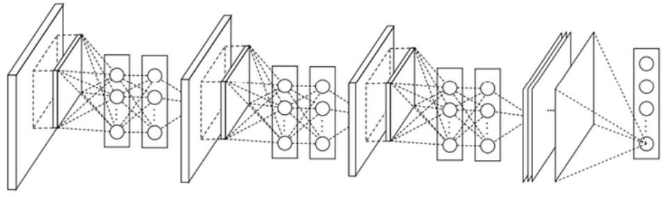
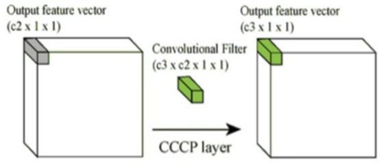
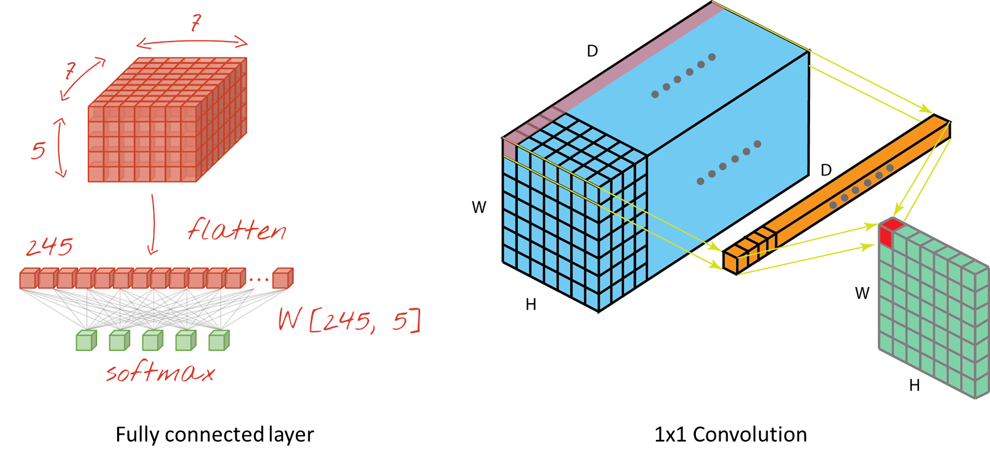
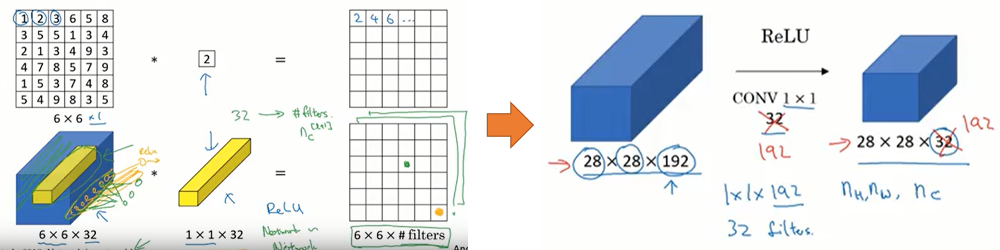

===================
Network in Network
===================

Network in Network (NIN)은 싱가포르 국립대학의 Min Lin이 2013년에 발표한 모델이다. Lin은 CNN의 Convolution layer가 Local receptive field에서 **Feature를 추출할 때 Filter로 계산하여 Linear한 문제** 를 해결하려고 했다. 기존에는 Feature map을 늘려서 이러한 문제를 극복하려고 했지만 Filter가 늘어남에 따라 연산량이 늘어나는 문제가 있었다.

그래서 Lin은 Convolution을 할 때 **Filter 대신에 MLP (Multi layer perceptron)를 사용** 하여 Feature를 추출하는 방법을 고안했다.

.. figure:: ../img/cnn/nin/nin_in_mlp.png
    :align: center
    :scale: 70%

.. rst-class:: centered

    출처: `라온피플 (Laon People) <https://laonple.blog.me/220692793375>`_

기존 CNN에서는 Filter를 이용하여 Stride만큼 이동하면서 Convolution으로 Feature를 추출했다. NIN에서도 유사하게 진행되는데 Filter 대신에 MLP를 쓰는 부분만 다르다고 할 수 있고, 이를 Mlpconv layer라고 부른다. 조금 더 구체적인 내용은 검색 후 추가 정리할 예정이다.

MLP를 이용했을 때 장점은 Filter를 사용할 때보다 **Non-linear한 Activation function을 더 추가하여 Non-linear한 성질로 인해 더 좋은 Feature를 추출** 할 수 있다는 점이다. 또한, **1x1 Convolution** 을 통해 Feature map 개수를 줄임으로써 **Parameter 수를 줄일 수** 있었다 (아래에서 다시 설명).

NIN에서는 이러한 Mlpconv layer를 여러 개 쌓아서 사용했고, 그래서 네트워크 안에 네트워크가 있다는 개념으로 NIN이라는 이름이 만들어졌다 (GoogLeNet도 Inception 모듈 9개 → NIN과 흐름이 유사). 아래 그림이 Mlpconv layer 3개를 사용한 NIN 구조이다.

.. rst-class:: centered

    출처: `라온피플 (Laon People) <https://laonple.blog.me/220692793375>`_

NIN과 기존 CNN의 또 다른 점은 Fully connected layer (FC layer)가 없다는 점이다. NIN에서는 **FC layer 대신에 Global Average Pooling (GAP)을 사용** 했다. Lin은 앞에서 충분히 효과적인 Feature를 추출했고, Average pooling만으로 Classifier 역할을 할 수 있다고 주장했다. 또한 이를 통해 Overfitting과 연산량을 줄이는 효과가 있다.

실제로 **FC layer의 Parameter 수는 전체의 90%에 가깝기 때문에 Overfitting 문제가 발생** 하기 쉽다. 그래서 보통 Dropout을 사용하는데, NIN에서는 Average pooling 결과로 Classification을 할 수 있기 때문에 이러한 문제를 해결할 수 있게 된다 (GoogLeNet도 GAP 사용).

1x1 Convolution
================

지금부터는 위에서 잠깐 언급했던 1x1 Convolution에 대해 설명하려고 한다. **1x1 Convolution을 사용하는 가장 큰 이유는 차원을 줄이는 것** 이다. :strike:`GoogLeNet 논문에 나오는 것처럼 Hebbian principle (Neurons that fire together, wire together)에 의해 차원을 줄일 수 있다 (추후 조사 예정)`.

1x1 Convolution을 사용하면 여러 개의 Feature map에서 비슷한 성질을 추출하여 Feature map 크기를 줄일 수 있다. Feature map 크기가 줄어들면 연산량이 줄어 Network를 더 깊게 만들 수 있다. 아래 그림으로 1x1 Convolution이 어떻게 동작하는지 알 수 있다.

.. rst-class:: centered

    출처: `라온피플 (Laon People) <https://laonple.blog.me/220692793375>`_

위 그림처럼 "c2 > c3"의 관계를 만들면 함축적인 의미를 가지는 더 작은 Feature map을 얻을 수 있고, 이는 차원의 감소로 이어진다.

1x1 Convolution을 조금 더 직관적으로 이해해보자. **1x1 Convolution은 1-layer fully connected neural network** 라고도 하는데 그 이유는 같은 원리로 동작하기 때문이다. 아래에 예를 통해 살펴보자.

.. figure:: ../img/cnn/nin/1x1_conv_detail.png
    :align: center
    :scale: 70%

.. rst-class:: centered

    출처: `라온피플 (Laon People) <https://laonple.blog.me/220692793375>`_

위 그림은 A1, A2, A3, A4 Feature map을 B1, B2 Feature map으로 1x1 Convolution한 예시이다. 이는 마치 4개의 Neuron을 2개의 Neuron으로 Fully connected한 경우와 유사한 형태를 띈다. NIN에서는 이러한 과정을 통해 차원을 감소시키고 연산량을 줄일 수 있었다. 여기에 **활성함수 (예: ReLU)를 추가하면 Non-linear한 성질도 추가** 로 얻을 수 있다.

이번에는 실제 Feature map을 1x1 Convolution 하는 과정을 살펴보면서 이해도를 높여보자.

.. rst-class:: centered

    출처: `Convolutional neural networks, with Keras and TPUs <https://codelabs.developers.google.com/codelabs/keras-flowers-convnets/index.html?index=..%2F..index#5>`_, `A Comprehensive Introduction to Different Types of Convolutions in Deep Learning <https://towardsdatascience.com/a-comprehensive-introduction-to-different-types-of-convolutions-in-deep-learning-669281e58215>`_

먼저 위 좌측 그림은 Feature map을 Flatten 한 후, FC layer의 모든 노드와 연결한 그림이다. 이 때, Feature map의 모든 값 하나하나가 각기 다른 Weight 값과 곱해져 FC layer로 전달된다. 이러한 과정 자체가 Fully connected 하게 연결되는 상황이고, 그래서 Fully connected layer라고 부른다.

1x1 Convolution도 그 과정이 유사하다. 위 우측 그림은 Feature map의 좌측 상단 값들 하나하나와 1x1 Convolution의 각 Filter 값 (FC layer의 Weight에 해당) 하나하나가 곱해져 새로운 Feature map이 만들어지는 과정이다. 결국 **Feature map의 모든 값들이 1x1 Convolution 내 각 값들과 곱해져 새로운 Feature map으로 전달되는 과정이 Fully connected 하게 연결** 되므로 FC layer가 생성되는 과정과 유사하다고 할 수 있다.

deeplearning.ai에서는 아래와 같이 설명한다.

.. rst-class:: centered

    출처: `YouTube, Neural Networks - Networks in Networks and 1x1 Convolutions <https://youtu.be/vcp0XvDAX68>`_

여기서도 마찬가지로 1x1 Convolution의 각 값들이 이전 Feature map의 값들과 곱해져 동일한 크기의 새로운 Feature map을 생성한다고 설명하고 있다. 결국 1x1 Convolution을 n개 사용하면 이전 Feature map의 크기와 동일한 Feature map을 n개 생성한므로, Feature map의 개수를 늘리거나 줄이는 활용할 수 있게 된다.

Conclusion
===========

:h2:`Reference`

* `라온피플, GoogLeNet [2] <https://laonple.blog.me/220692793375>`_
* `Medium, A Comprehensive Introduction to Different Types of Convolutions in Deep Learning <https://towardsdatascience.com/a-comprehensive-introduction-to-different-types-of-convolutions-in-deep-learning-669281e58215>`_
* `YouTube, Neural Networks - Networks in Networks and 1x1 Convolutions <https://youtu.be/vcp0XvDAX68>`_
