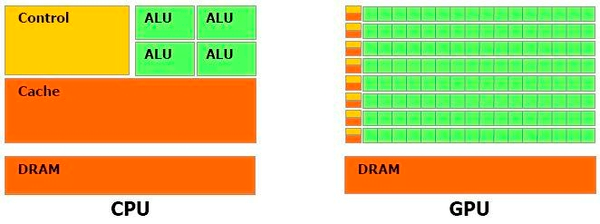

===================
GPU를 사용하는 이유
===================

GPU는 AlexNet이 성공하면서 많은 CNN (Convolutional Neural Network) 관련 연구자들의 관심을 얻었다.

.. figure:: ../img/cnn/alexnet/ilsvrc_gpu.png
    :align: center
    :scale: 80%

.. rst-class:: centered

    출처: `라온피플 (Laon People) - AlexNet [3] <https://laonple.blog.me/220667260878>`_

그렇다면 CNN 모델을 학습할 때 CPU보다 GPU가 더 좋은걸까? 먼저, CPU와 GPU의 차이를 살펴보자.

CPU vs. GPU
=============

CPU는 명령어가 입력된 순서대로 데이터를 처리하는 직렬 (순차) 처리 방식에 특화된 구조를 가지고 있다. 따라서 한 번에 한 가지의 명령어만 처리기 때문에 연산을 담당하는 ALU의 개수가 많을 필요가 없다.

또한 CPU의 내부 면적의 절반 이상은 캐시 메모리로 채워져 있다. 캐시 메모리는 CPU와 램(RAM)과의 속도차이로 발행하는 병목현상을 막기 위한 장치이며 처리할 데이터를 미리 RAM에서 불러와 CPU 내부 캐시 메모리에 임시로 저장해 처리 속도를 높일 수 있다.

반대로 GPU는 여러 명령어를 동시에 처리하는 병렬 처리 방식을 가지고 있다. 위와 같이 캐시 메모리 비중이 크지 않고 연산을 할 수 있는 ALU가 1개의 코어에 수백, 수천 개가 장착돼 있다.

.. rst-class:: centered

    출처: `소프트웨어 검증 전문 기업 Suresofttech, 딥러닝과 GPU <https://m.blog.naver.com/suresofttech/221151961585>`_

따라서 CPU는 정수나 고정소수점 데이터를 많이 사용하는 인터넷 서핑, 문서 작성 등 일상생활의 작업을 보다 빠르게 수행에 적합하다. 반면에 GPU는 시간이 많이 걸리는 멀티미디어, 특히 3차원 그래픽 처리 작업을 등을 빠르게 수행하도록 설계된다.

---------------------------------
참고: 고정 소수점 vs. 부동 소수점
---------------------------------

컴퓨터는 데이터를 디지털인 0, 1의 수로 구분하여 저장하는데, 간단한 정수 외의 실생활에서 널리 사용되는 실수를 디지털로 저장하기 위해 고정소수점 혹은 부동소수점이라는 데이터 저장방식을 활용한다.

고정소수점은 10비트(bit)를 기준으로 0~1023까지 총 1024개의 숫자를 표현할 수 있다. 하지만 부동소수점은 2bit로 자릿수를 표현해 최대 25만5000개의 숫자 표현이 가능하다. 같은 비트임에도 부동소수점이 고정소수점에 비해 정밀한 표현이 가능한 셈이다. 또 고정소수점은 더하기, 빼기 연산을 빨리 수행할 수 있고, 부동소수점은 그래픽, 음성 등 멀티미디어 데이터를 상대적으로 빨리 처리할 수 있다.

결론
=====

CNN에서 Convolution 연산 시 동일한 Parameter를 갖는 Filter를 이용하여 픽셀의 위치를 옮기면서 반복적인 Matrix multiplication을 실시한다. 이는 구조적으로 아주 좋은 병렬적인 특징을 가지고 있다. 또한, CNN에서 학습되는 값들이 실수이다. 그래서 이 2가지 사항을 봤을 때, 순차적인 단순 연산을 하는 CPU보다 병렬적으로 복잡한 연산을 하는 GPU를 사용하는 것이 CNN 학습 시 더 유리하다고 할 수 있다.

:h2:`참조`

* `라온피플, AlexNet [3] <https://laonple.blog.me/220667260878>`_
* `소프트웨어 검증 전문 기업 Suresofttech, 딥러닝과 GPU <https://m.blog.naver.com/suresofttech/221151961585>`_
