=======
ResNet
=======

ResNet (Residual Net)은 2015년에 Microsoft의 Kaiming He가 제안한 모델이다 (현재는 Facebook에서 근무). 그는 2015년에 R-CNN의 속도 문제를 개선한 SPPNet (Spatial Pyramid Pooling in Deep Convolutional Networks for Visual Recognition)으로 Detection 분야 성능을 개선시켰다. 그리고 ResNet은 Classification 뿐만 아니라 Localization, Detection 분야에서도 압도적인 성능을 보였고 이는 SPPNet과 같은 선행 연구가 많이 있었기 때문인 것 같다.

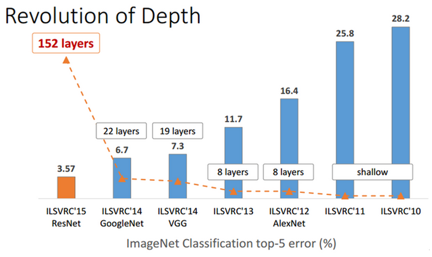

.. rst-class:: centered

    출처: `라온피플 (Laon People) <https://laonple.blog.me/220761052425>`_

ResNet은 Classification에서 152 Layer를 사용하여 Top-5 Error가 3.57%가 나왔고, 이는 훈련 받은 사람의 이미지 분류 오차율인 5%보다 더 좋은 결과다. 2014년 우승한 GoogLeNet보다 성능이 두 배 정도 좋았고, Network 깊이는 7배 이상 깊어졌다. 그럼, 지금부터 하나씩 차근차근 알아보자.

Motivation
===========

이전 CNN architecture들에서도 언급했지만, Network가 깊어지면 `Gradient vanishing/exploding <../../ai/machine_learning/optimization.html#gradient-vanishing-exploding>`_, Overfitting 등의 문제가 생긴다. ResNet 팀은 VGGNet의 Layer 수를 19보다 더 크게 하여 실험했고, 예상대로 학습 결과가 더 나빠졌다.

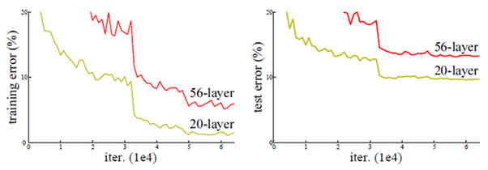

.. rst-class:: centered

    출처: `라온피플 (Laon People) <https://laonple.blog.me/220761052425>`_

위 그림처럼 Network가 깊어지는데 성능이 더 나빠지는 문제를 해결하기 위해 ResNet 팀은 Residual learning 개념을 언급했다.

Residual learning
==================

기존 CNN은 아래 좌측 그림처럼 x를 입력받고 2개의 Weight layer를 거친 후 H(x)라는 출력을 내며, 학습을 통해 최적의 H(x)를 찾기 위해 Weight의 값들을 수정한다.

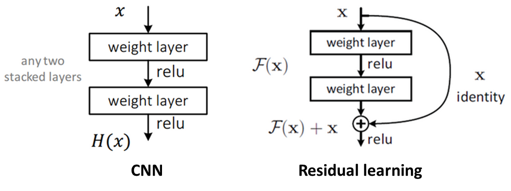

.. rst-class:: centered

    출처: `라온피플 (Laon People) <https://laonple.blog.me/220761052425>`_

하지만 최적의 H(x)를 찾는 것이 아니라 H(x) - x를 찾는 것으로 변경하면, 최적의 출려과 입력의 차를 찾도록 학습되는 것이다. 이 때, F(x) = H(x) - x 라고 하면, 출력 H(x) = F(x) + x가 된다. 즉, 우측 상단 그림처럼 입력에서 출력으로 연결되는 Shorcut이 생기고, 이는 덧셈만 추가되어 연산량의 차이가 거의 없어 Forward/Backward path가 단순해지는 효과를 얻는다. 이것이 Residual learning의 기본 Block이다.

여기서 최적의 F(x) = 0이므로, 학습할 방향이 미리 결정되어 있따고 해서 Pre-conditioning 구실을 한다고 말한다. 그리고 F(x)가 거의 0이 되는 방향으로 학습하게 되면 입력의 작은 움직임 (Fluctuation)을 쉽게 검출할 수 있게 된다. 이 때 여기서 F(x)의 작은 움직임, 나머지 (Residual)을 학습한다는 관점에서 Residual learning이라고 불리게 된다.

결론적으로 이와 같은 Residual learning을 사용해서 더 Deep한 Network를 쉽게 최적화 할 수 있게 되고, 깊이가 늘어난만큼 정확도도 향상될 수 있다.

Architecture
=============

ResNet은 VGGNet처럼 3x3 Convolution을 사용했고, 연산량을 줄이기 위해 Max pooling만 한 번 사용하고 Hidden FC, Dropout을 사용하지 않았다. 그리고 아래와 같은 2가지 원칙을 지켰다.

* 출력 Feature map 크기가 같은 경우, 해당 모든 Layer는 동일한 수의 Filter를 가짐

* Feature map의 크기가 1/2배인 경우, Filter 수 2배로 늘림
  
    * Feature map 줄일 때 Pooling 대신 Convolution 시 Stride를 2로 함
    * 위 작업은 연산량 균형을 맞추기 위해 실시함

위와 같은 방법을 적용하여 Plain network와 ResNet을 만들었다. 34 Layer를 가지는 Plain network의 경우 19 Layer를 가지는 VGGNet보다 연산량이 20% 작다 (VGGNet: 19.6 billion, ResNet: 3.6 billion). ResNet은 Plain network에서 2개 Convolution마다 Shortcut connection을 만들었고, 그 구조는 다음과 같다.

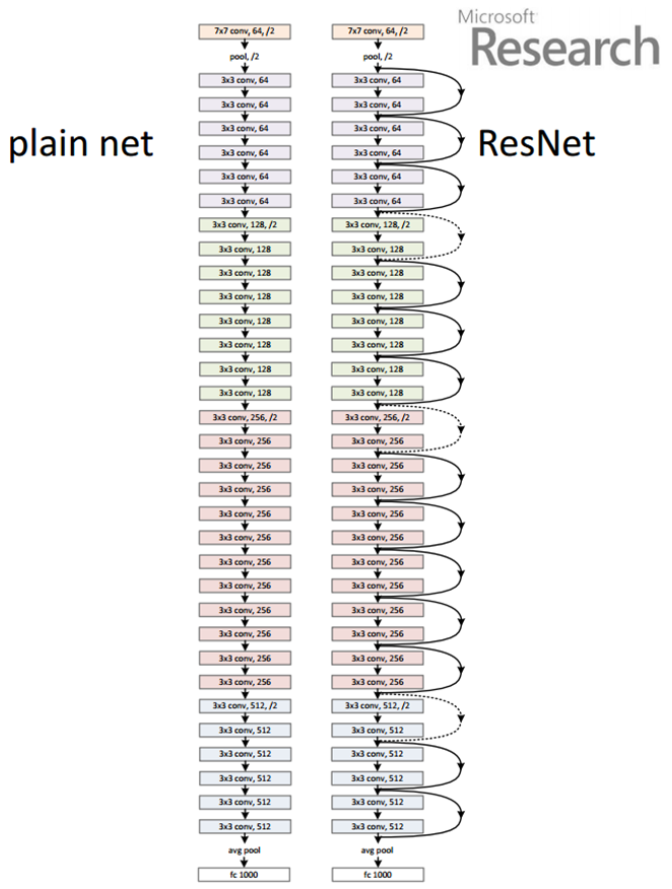

.. rst-class:: centered

    출처: `라온피플 (Laon People) <https://laonple.blog.me/220764986252>`_

ResNet팀은 18, 34, 50, 101, 152 Layer인 ResNEt을 만들었고, 그 구성은 아래 표와 같다.

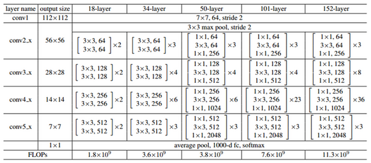

.. rst-class:: centered

    출처: `라온피플 (Laon People) <https://laonple.blog.me/220764986252>`_

위 표에 나와 있는 것처럼, 18/34 Layer는 같은 구조인데, Convolutional layer 수만 다르다. 50/101/152 Layer는 Bottleneck이라는 구조로 변경했고 이를 조금 더 자세히 살펴보자.

Deeper bottleneck architecture
*******************************

지금까지 ResNet의 구조를 설명했는데, 이제는 각 구조로 테스트한 결과를 살펴보려고 한다.

실험 결과
==========

ImageNet
*********

------------
18/34 Layer
------------

Plain network는 34-layer 결과가 18-layer 결과보다 약간 안좋지만, ResNet은 34-layer 결과가 18-layer보다 좋다. 그리고 그래프에서 확인할 수 있는 것처럼, 학습 초기 단계에서 ResNet의 수렴 속도가 Plain network 보다 빠르다.

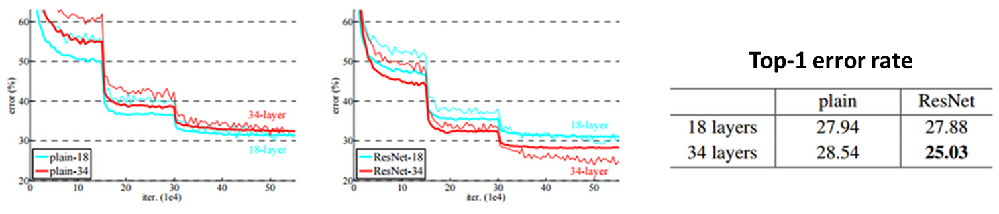

.. rst-class:: centered

    출처: `라온피플 (Laon People) <https://laonple.blog.me/220764986252>`_

-----------------
50/101/152 Layer
-----------------

Single 모델에서는 152-layer ResNet에서 Top-5 error rate를 4.49까지 낮췄다.

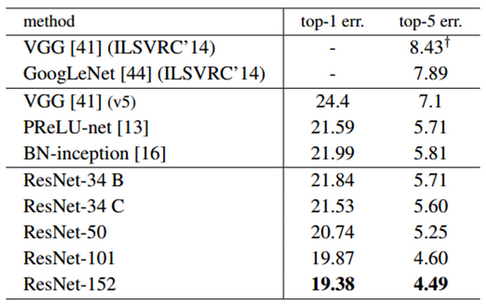

.. rst-class:: centered

    출처: `라온피플 (Laon People) <https://laonple.blog.me/220764986252>`_

ILSVRC 2015에 제출 시에는 2개의 152-layer ResNet을 조합한 결과를 제출했고, 추후에 Depth가 다른 6개 모델을 Ensemble했다.

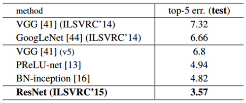

.. rst-class:: centered

    출처: `라온피플 (Laon People) <https://laonple.blog.me/220764986252>`_

CIFAR-10
*********

ResNet팀은 :doc:`CIFAR-10 <../dataset>` 의 이미지가 32x32로 작기 때문에 Network 구성을 약간 변형시켰다. ImageNet 데이터에서는 처음 Convolution의 Filter를 7x7로 했지만, CIFAR-10에서는 이미지 크기가 작아 3x3 Filter를 사용했다.

그 다음에 위치하는 6n개의 3x3 Convolution 중 각각의 2n에 대해 Feature map의 크기가 {32, 16, 8}이 되도록 했고, Filter 개수는 연산량의 균형을 맞추기 위해 {16, 32, 64}로 했다.

================ ======= ====== ====
Output map size  32x32   16x16  8x8
================ ======= ====== ====
# layers         1 + 2n  2n     2n
# filters        16      32     64
================ ======= ====== ====

마지막에는 Global average pooling과 10-way softmax를 배치하여, 최종적인 전체 Layer 수는 6n + 2개이다. 지금까지 언급한 내용을 전체적인 구조 관점에서 14-layer Plain network와 ResNet으로 이해해보자.

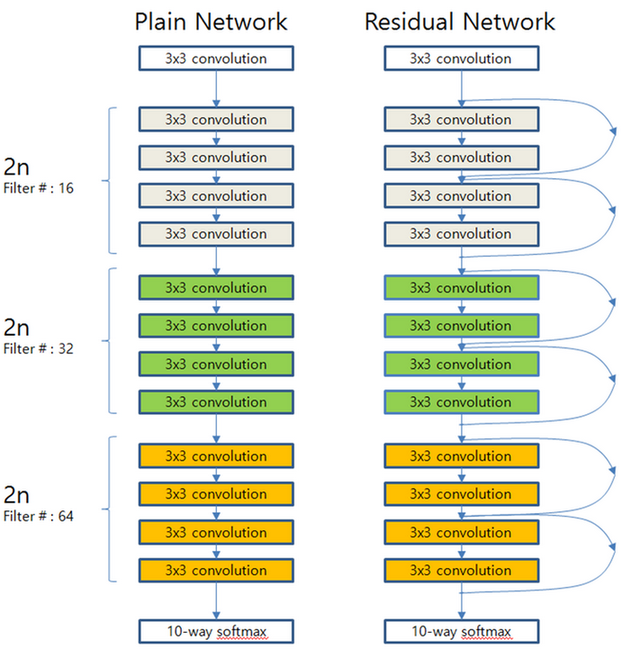

.. rst-class:: centered

    출처: `라온피플 (Laon People) <https://laonple.blog.me/220764986252>`_

여기서 n = {3, 5, 7, 9}일 때, 20/32/44/56 Layer를 얻을 수 있고, 테스트 결과는 ImageNet의 경우와 거의 유사하다.

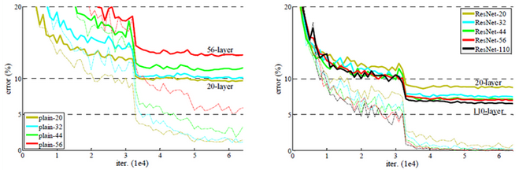

.. rst-class:: centered

    출처: `라온피플 (Laon People) <https://laonple.blog.me/220764986252>`_

Plain network는 일정 Layer 수 이후에는 Layer 수 증가에 따라 성능이 나빠지지만, ResNet은 Layer 수가 증가해도 성능이 좋아진다.

---------------------
Layer별 response 분석
---------------------

이번에는 각 Layer별 Response의 표준편차를 비교했다. 첫 번째 그래프는 Batch noramlization을 실행하고 ReLU 및 Addtion을 실행하기 전을 비교한 것이다. 두 번째 그래프는 첫 번째 그래프 결과를 표준편차 크기 별로 정렬한 결과를 표현하고 있다.

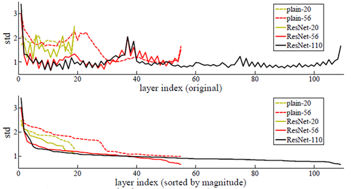

.. rst-class:: centered

    출처: `라온피플 (Laon People) <https://laonple.blog.me/220764986252>`_

위 결과를 보면 전반적으로 ResNet이 Plain network에 비해 표준편차가 작은 것을 알 수 있다. 즉, ResNet은 Layer 별 Response가 크게 흔들리지 않아 Network가 깊어져도 문제가 적게 발생한다는 것을 알 수 있다.

------------
1000+ layer
------------

추가 실험으로 n = 200으로 설정하여 1202-layer ResNet을 테스트 했는데, 110-layer ResNet보다 성능이 약간 안좋게 나왔다. 하지만 1000-layer가 넘어도 최적화에 큰 어려움이 없음을 언급했다. 그리고 성능이 낮게 나오는 이유는 Network 깊이에 비해 데이터 수가 부족하여 Overfitting이 발생했기 때문이라고 생각한다.

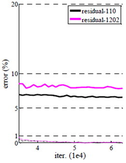

.. rst-class:: centered

    출처: `라온피플 (Laon People) <https://laonple.blog.me/220764986252>`_

여기서는 단순히 Network를 더 깊게 했을 때 결과만 확인했고, 실제로 Maxout이나 Dropout과 같은 Regularization 기법을 사용하면 성능이 개선될 수 있다. 실제로 2016년에 Kaming He가 발표한 "Idnetity Mappings in Deep Residual Networks"에서 Pre-activation 기법을 이용하여 성능을 개선했다 (추후 다룰 예정).

CIFAR-100
**********

위에서 언급한 2016년에 Kaming He가 발표한 논문에서 CIFAR-100에 대해 실험했고, 이는 단지 경향성을 확인하기 위함이라 적당한 수준의 Data augmentation만 사용했다고 한다. 그리고 실제로 1001-layer에서 Pre-activation을 통해 ResNet 성능이 개선됨을 아래 표와 그림으로 알 수 있다.

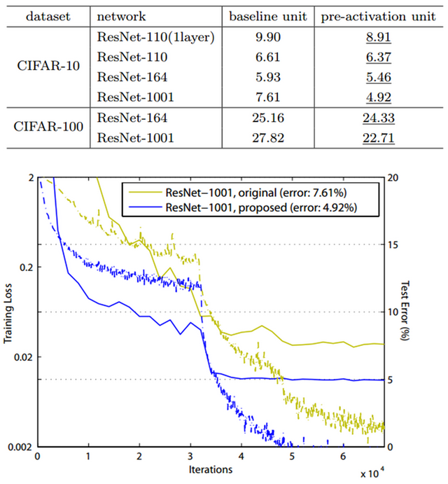

.. rst-class:: centered

    출처: `라온피플 (Laon People) <https://laonple.blog.me/220764986252>`_

Reference
==========

* 라온피플 (Laon People) - `ResNet [1] <https://laonple.blog.me/220761052425>`_, `ResNet [2] <https://laonple.blog.me/220764986252>`_, `ResNet [3] <https://laonple.blog.me/220770760226>`_
