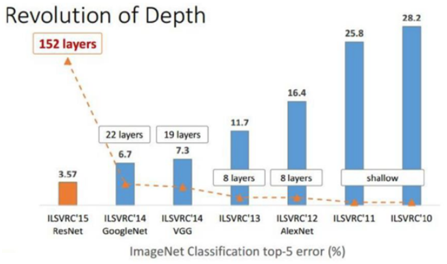
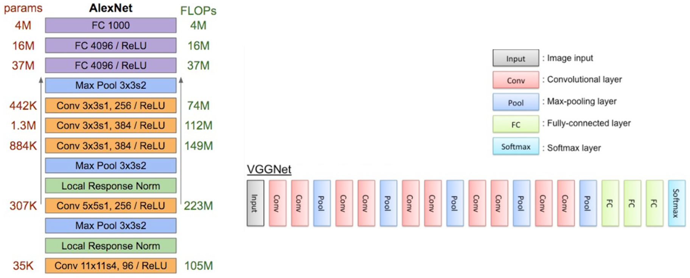
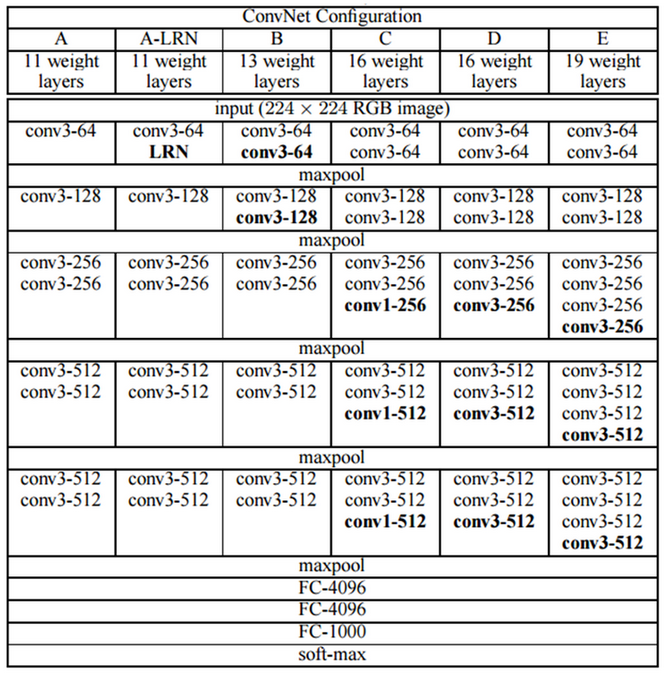
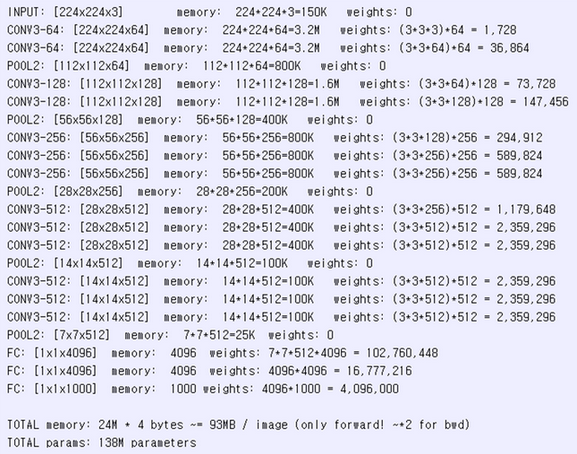
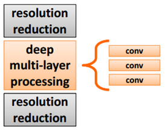
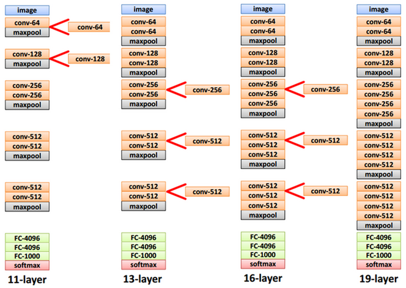
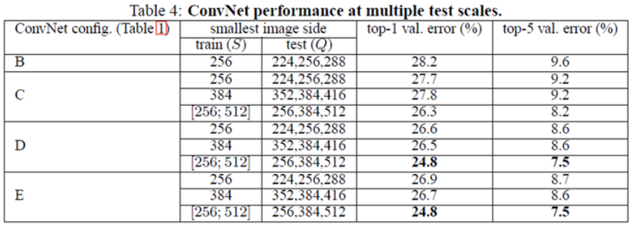
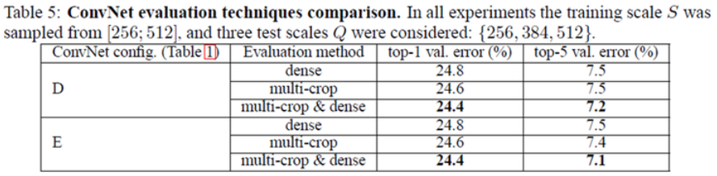

=======
VGGNet
=======

VGGNet은 2014년 ILSVRC에서 Oxford 대학교의 Visual Geometry Group에서 제안한 모델이고, GoogLeNet에 이어 2위를 차지했다. 하지만 GoogLeNet보다 구조적으로 간단하여 이해가 쉽고 테스트가 용이하기 때문에 더 많이 사용되었다. 그래서 추후에 나온 Inception-V2나 Inception-V3에서 VGGNet의 단순한 구조를 일부 적용했다.

또한 이들은 Deep CNN에 대해 많은 연구를 했고, 다음 두 논문이 매우 훌륭한 논문이고 참고하면 좋을 것 같다.

* Deep Inside Convolution Networks: Visualising Image Classification Models and Sailency Maps
* Understanding Deep Image Representations by Inverting Them

그러면 지금부터 VGGNet에 대해 알아보자.

Architecture
=============

VGGNet은 "Very deep convolutional networks for large-scale image recognition"에서 언급된 것처럼 Network의 깊이 (Depth)가 어떤 영향을 주는지 알아보기 위해 개발된 것 같다.

.. rst-class:: centered

    출처: `라온피플 (Laon People) <https://laonple.blog.me/220738560542>`_

위 그림에서 볼 수 있듯이 VGGNet도 GoogLeNet처럼 이전보다 Network (AlexNet: 8-layers) 깊이가 훨씬 깊은 19개의 Layer를 가진다. 아래 그림에서도 확인할 수 있듯이 VGGNet은 LeNet-5, AlexNet과 구조적으로 유사한데 Network의 깊이가 다르다.

.. rst-class:: centered

    출처: `라온피플 (Laon People) <https://laonple.blog.me/220738560542>`_

실제로 오직 깊이가 주는 영향력을 밝히기 위해 **3x3 Filter (Stride, Pad: 1)와 2x2 Max pooling (Stride: 2)만 사용** 하여 6개의 구조로 테스트했다. GoogLeNet에서 언급했던 것처럼 3x3 Filter 사용하면 5x5 또는 7x7 Filter를 인수분해하여 Network는 깊어지면서 Parameter 수는 줄일 수 있다 (:math:`3 \times (3^2 C^2)` vs. :math:`7^2 C^2` for :math:`C` channels). 6개의 구조는 아래의 그림과 표로 확인할 수 있다.

.. rst-class:: centered

    출처: `Medium, Review: VGGNet <https://medium.com/coinmonks/paper-review-of-vggnet-1st-runner-up-of-ilsvlc-2014-image-classification-d02355543a11>`_, `라온피플 (Laon People) <https://laonple.blog.me/220738560542>`_

위 표에서 보는 것처럼 VGGNet은 기존 AlexNet, ZFNet처럼 224x224x3 이미지를 입력받아 Convolution, Max pooling의 반복 후 마지막에 Fully connected layer가 오는 구조를 가지고 있다.

VGGNet의 단점은 Parameter 수가 많다는 점이다 (GoogLeNet 저자 Szegedy도 언급함). GoogLeNet의 Parameter 수가 약 5 million인 것에 비하면 VGGNet의 Parameter 수 (가장 작은 것이 133 million)는 굉장히 많다. 자세한 내용은 아래 표에서 볼 수 있다 (단위: Million).

============ ========= ==== ==== ==== ====
Network      A, A-LRN  B    C    D    E
============ ========= ==== ==== ==== ====
# of params  133       133  134  138  144
============ ========= ==== ==== ==== ====

이렇게 Parameter 수가 많은 결정적 이유는 Fully connected layer이다. VGGNet의 3개 Fully connected layer의 Parameter 수는 120 million 이나 된다 (참고로 GoogLeNet은 FC layer X).

추가로 VGGNet의 Parameter 메모리 소요량을 살펴보면 다음과 같다 (VGGNet D 구조).

.. rst-class:: centered

    출처: `라온피플 (Laon People) <https://laonple.blog.me/220738560542>`_

지금까지 간단한게 VGGNet의 구조와 단점 등을 살펴봤는데, 이 외에 VGGNet만의 특이점이 있다.

* VGGNet에서는 Local Response Normalization이 효과가 없어 사용 X (A-LRN을 통해 테스트함)
* 1x1 Convolution 주요 목적은 ReLU를 활용한 Non-linearity 확보임 (GoogLeNet, NIN 등에서는 Parameter 수 감소가 목적이었음)
* Deep한 Network 학습 시 Vanishing/Exploding gradient 문제로 학습이 어려운 문제 발생 → 비교적 간단한 11 Layer짜리 구조를 학습 후 이후 구조에서 학습된 Parameter 값을 초기값으로 사용하여 해결 (참고로 GoogLeNet에서는 Auxiliary classifier로 해결함)

조금 더 Network를 깊게한 부분에 대해 알아보자.

GoogLeNet에서는 Network를 깊게하면서 Parameter 수를 줄이기 위해 Inception이라는 구조와 Auxiliary classifier를 이용했다. VGGNet에서는 이러한 새로운 구조보다는 망의 깊이 자체가 끼치는 영향에 더 집중했다. 그래서 단순히 3x3 Convolution을 겹치는 구조를 만들어 어느 이상이 되면 성능 개선 효과가 미미함을 밝혔다 (ILSVRC-2012는 16 Layer부터 효과가 없음을 밝힘).

VGGNet 구조의 기본 개념은 기존에 한 번 Convolution 하던 것을 연속으로 여러 번 하는 것이다.

.. rst-class:: centered

    출처: `라온피플 (Laon People) <https://laonple.blog.me/220749876381>`_

위 그림처럼 3개의 Convolution을 쌓으면 7x7 Convolution과 동일한 효과를 얻으면서 Parameter의 수는 줄어든다 (학습 속도 ↑). 또한, Layer 수가 많아질수록 Non-linearity가 증가하여 더 유용한 Feature를 추출할 수 있다. 그래서 실제로 5x5 Filter 1개보다는 3x3 Filter 2개가 성능이 더 좋다.

앞서 언급한 것처럼 Network가 깊어질수록 Vanishing/Exploding gradient 문제가 발생할 수 있어 11-layer VGGNet을 먼저 학습시키고, 아래처럼 기존에 학습된 Parameter를 기반으로 중간에 Convolutional layer를 추가하여 학습시키는 방법으로 나머지 구조를 만들었다 (학습 시간도 줄임).

.. rst-class:: centered

    출처: `라온피플 (Laon People) <https://laonple.blog.me/220749876381>`_

Data augmentation
==================

지금까지 VGGNet의 Architecture에 대해 설명했는데, 구조가 단순하기 때문에 VGGNet 연구팀에서는 Train/Test dataset 만드는데 많이 신경썼다. ILSVRC-2012는 약 1000장의 이미지를 제공하는데 1000개 Class를 구분하기에는 부족한 양이어서 Data augmentation 기법을 활용했다.

Training
*********

Training data를 Augmentation하기 위해 기존 AlexNet과 GoogLeNet은 다음과 같은 방법을 사용했다.

* AlexNet

    * 모든 이미지를 256x256 크기로 만듦 (Single scale)
    * 256x256 이미지에서 224x224 이미지를 랜덤하게 추출하여 이미지 수를 2048배 늘림 
    * RGB 값을 주성분 분석하여 RGB 데이터 조작

* GoogLeNet

    * 가로/세로 비를 [3/4, 4/3] 범위를 유지하며 원 이미지의 8% ~ 100%를 포함하는 Patch 추출 후 학습에 사용
    * Photometric distortion으로 학습 데이터 늘림

VGGNet에서는 Single scale과 Multi scale을 모두 사용했다. Training scale을 S로 표현했을 때, Single scale에서는 AlexNet처럼 하나의 Scale (S = 256)으로 고정시키는 경우와 두 개의 Scale (S = 256 또는 S = 384)을 지원하는 경우가 있다.

Multi scale의 경우에는 :math:`S_{min}` 과 :math:`S_{max}` 범위에서 랜덤하게 선택할 수 있게 하고, 이 때 :math:`S_{min} = 256` 이고 :math:`S_{max} = 512` 이다. 이처럼 256과 512 사이에서 랜덤하게 Scale을 정할 수 있어 다양한 크기의 이미지에 대응 가능하다 (정확도 ↑). 실제로 Multi scale은 S = 384로 학습 시킨 후 S를 무작위로 선택하며 Fine tuning 하고, 이를 Scale jittering이라고 한다.

이렇게 Scale을 통해 얻은 이미지를 AlexNet처럼 랜덤하게 224x224 이미지를 추출했고, RGB 값에 대해서도 주성분 분석으로 값을 조작했다.

Test
*****

Test 이미지는 주로 Training 이미지에서 여러 개의 Patch 또는 Crop으로 가능한 많은 이미지를 추출한 후 결과를 Voting하여 가장 기대되는 것을 최종 Test 결과로 한다. 이러한 작업을 AlexNet과 GoogLeNet에서는 다음과 같이 진행했다.

* AlexNet

    * 이미지를 256x256으로 Scale하고 4 코너와 중앙에서 224x224 크기로 Crop하여 5개 이미지 생성
    * 위 결과를 좌우 반전하여 5개 이미지를 더 생성하여 총 10개 이미지 생성
    * 10개 이미지를 모델에 입력해 나온 10개의 결과를 평균하여 최종 결과 생성
    * Softmax 결과가 숫자로 나오므로 이를 평균하여 최종 Class 결정

* GoogLeNet

    * 이미지를 4개의 Scale (256, 288, 320, 352)로 생성
    * 각 Scale 결과에서 3장의 정사각형 이미지 선택 
    * 위 결과의 각 이미지에서 4개 코너, 2개 중앙을 추출해 6장의 224x224 이미지 추출
    * 위 결과를 좌우 반전하여 이미지 추출
    * 최종적으로 하나의 이미지에서 4x3x6x2 = 144개의 이미지를 추출
    * 결과는 AlexNet처럼 Voting 활용

VGGNet에서는 사전 정의한 Q (Test scale)로 크기를 조절한다. 이 때, Q는 S와 같을 필요가 없고, 각 S에 대해 여러 개의 Q를 사용하면 학습 결과는 좋아진다.

GoogLeNet과 같은 Multi-crop (GoogLeNet: 144장, VGGNet: 150장)을 사용하여 Data augmentation을 했다. 그리고 연산량 감소를 위해 :doc:`overfeat` 구조에서 사용한 Dense evaluation 개념을 적용시켰다.

Dense evaluation은 Crop처럼 원 이미지를 잘라 ConvNet에 적용시키는 것이 아니라, 원 이미지에 바로 ConvNet을 적용한 후 일정한 픽셀 간격 (Grid)으로 마치 Sliding window를 적용하듯이 이미지를 추출한다. 이는 연산량을 감소시키지만, Grid 크기 문제로 학습이 잘 안될 수 있다. 그래서 Crop과 Dense evaluation을 적절히 잘 섞어 (?) 사용하면 성능이 더 좋아진다고 한다.

결과
====

Single test scale
******************

.. figure:: ../img/cnn/vggnet/vggnet_results_single_scale.png
    :align: center
    :scale: 80%

.. rst-class:: centered

    출처: `라온피플 (Laon People) <https://laonple.blog.me/220749876381>`_

위 그림에서 볼 수 있듯이, Network가 깊어질수록 Scale jittering을 사용할수록 Error 값이 작아짐을 확인할 수 있다.

그리고 5x5 Convolution 대신에 3x3 Convolution을 두 번 사용하는 경우 그 성능이 약 7% 향상됐다고 한다. 이는 Network를 더 깊게 만들고 Parameter 수를 줄이는 효과만 있는 것이 아니라, Neuron의 Non-linearity 활성함수 사용으로 Feature 추출이 더 잘 되는 것을 증명하는 것이다.

Multi test scale
******************

.. rst-class:: centered

    출처: `라온피플 (Laon People) <https://laonple.blog.me/220749876381>`_

S가 고정된 경우에는 {S-32, S, S+32}로 Q 값을 변화시켜 테스트했다 (S와 Q의 차이가 큰 경우 결과가 더 좋지 못함). Scale jittering을 적용한 경우에는 [256, 384, 512]로 테스트 이미지를 정했다. 위 표에서 확인할 수 있는 것처럼 Scale jittering을 적용하고 Multi scale인 경우가 성능이 더 좋았다.

Multi-crop and dense evaluation
********************************

.. rst-class:: centered

    출처: `라온피플 (Laon People) <https://laonple.blog.me/220749876381>`_

Multi-crop과 Dense evaluation을 각각 적용한 경우에는 Multi-crop이 약간 성능이 더 좋고 (Grid 크기 문제), 같이 적용하는 경우에 성능이 조금 더 개선됨을 위 표에서 확인할 수 있다. 실제 Test 데이터로 검증한 경우에는 Top-5 error가 7.3%가 나왔고, 이는 ZFNet (11.7%)에 비해 에러율이 4.4%나 낮다.

결론
====

VGGNet은 Network depth의 영향력을 확인하기 위해 3x3 Convolution을 활용한 단순한 구조의 모델이고, 구조가 단순하여 이해나 변경이 용이하여 GoogLeNet보다 더 많이 활용됐다. 하지만 Fully connected layer로 인해 Parameter 수가 많아 학습 시간이 오래 걸리는 문제점이 있다. 또한, 다양한 Test를 통해 Deep CNN 이해에 많은 기여를 했다.

Reference
==========

* 라온피플 (Laon People) - `VGGNet [1] <https://laonple.blog.me/220738560542>`_, `VGGNet [2] <https://laonple.blog.me/220749876381>`_