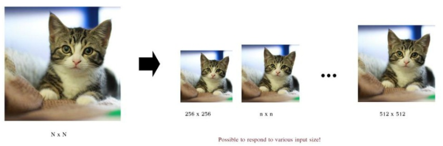
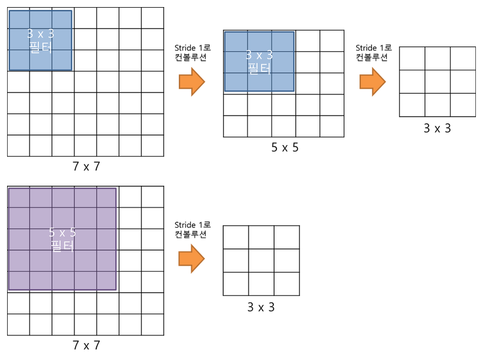
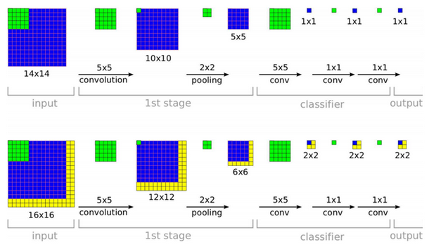
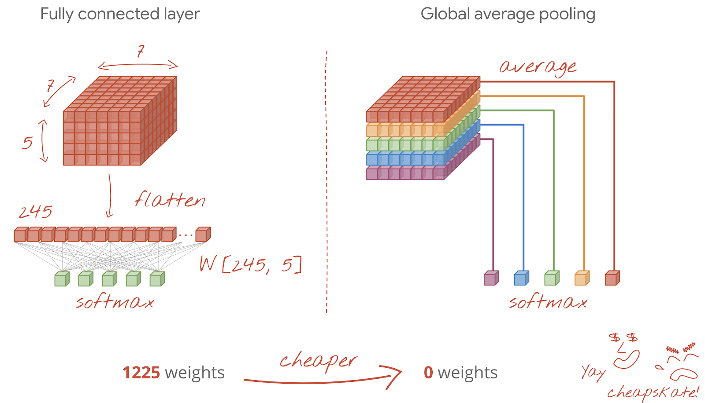
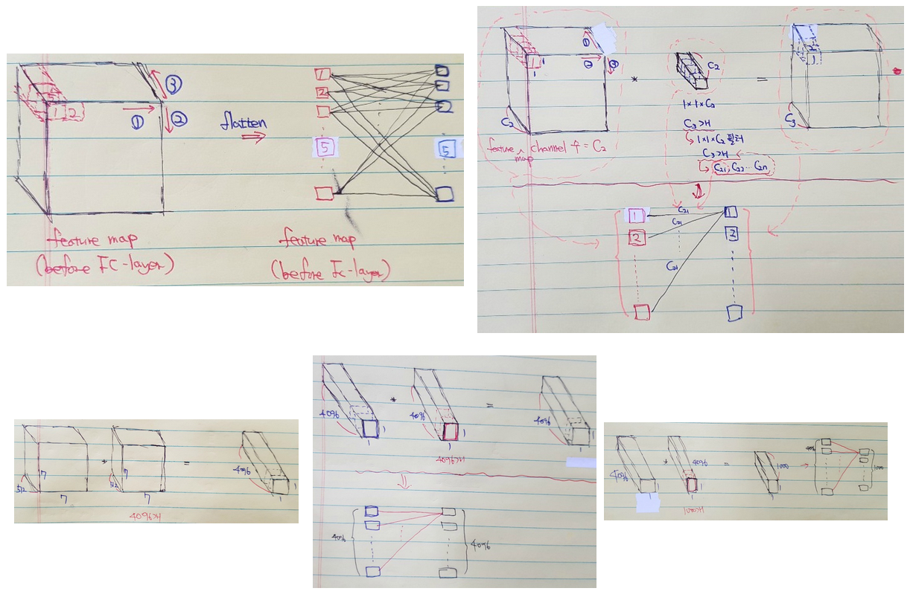
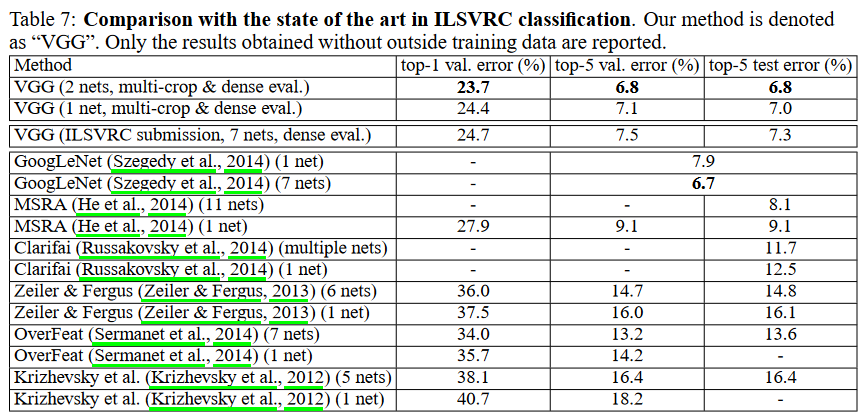
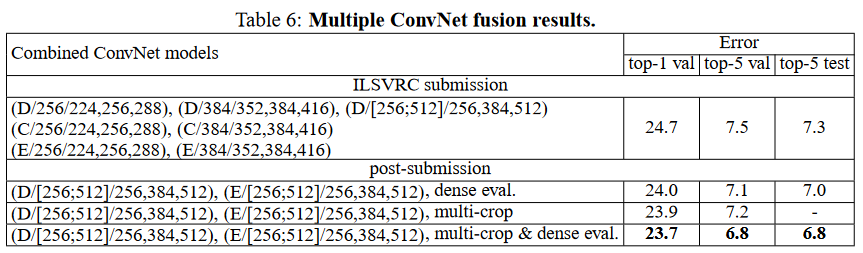
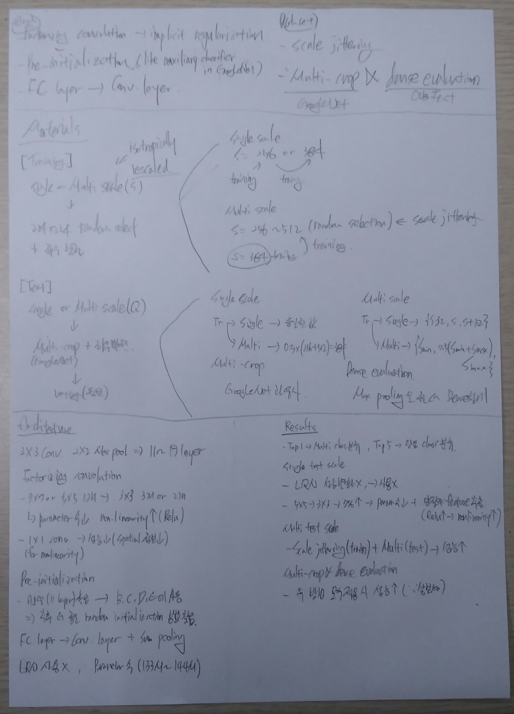

=======
VGGNet
=======

VGGNet은 2014년 ILSVRC에서 Oxford 대학교 Visual Geometry Group의 Karen Simonyan과 Andrew Zisserman이 제안한 모델이고, GoogLeNet에 이어 2위를 차지했다. 하지만 GoogLeNet보다 구조적으로 간단하여 이해가 쉽고 테스트가 용이하기 때문에 더 많이 사용되었다. 그래서 추후에 나온 Inception-V2나 Inception-V3에서 VGGNet의 단순한 구조를 일부 적용했다.

또한 이들은 Deep CNN에 대해 많은 연구를 했고, 다음 두 논문이 매우 훌륭한 논문이고 참고하면 좋을 것 같다.

* Deep Inside Convolution Networks: Visualising Image Classification Models and Sailency Maps
* Understanding Deep Image Representations by Inverting Them

그러면 지금부터 VGGNet에 대해 알아보자.

Contribution
=============

VGGNet은 "Very deep convolutional networks for large-scale image recognition"에서 언급된 것처럼 CNN 성능에 Network의 깊이 (Depth)가 어떤 영향을 주는지에 초점을 맞췄다. 아래 그림에서 볼 수 있듯이 VGGNet은 이전 CNN 모델보다 깊이가 훨씬 깊은 19개의 Layer를 가진다 (GoogLeNet 제외).

.. figure:: ../img/cnn/googlenet/revolution_of_depth.png
    :align: center
    :scale: 70%

.. rst-class:: centered

    출처: `라온피플 (Laon People) <https://laonple.blog.me/220738560542>`_

그렇다면 VGGNet이 Network 깊이가 깊은 것 외에 다른 CNN 모델과 비교했을 때 차별화 된 Contribution은 무엇일까? VGGNet의 핵심적인 Contribution은 Architecture와 Dataset과 관련해 각각 5가지로 정리할 수 있다.

* Architecture

    * Factorizing convolution → Implicit regularization
    * Pre-initialization (Like auxiliary classifier in GoogLeNet)
    * FC layer → Conv. layer

* Dataset
    
    * Scale jittering
    * Multi-crop (GoogLeNet) and dense evalutation (OverFeat)

그럼 지금부터 하나씩 살펴보자.

Materials
==========

VGGNet 구조가 단순하기 때문에 VGGNet 연구팀에서는 Train/Test dataset 만드는데 많이 신경썼다. ILSVRC-2012는 각각의 Class에 약 1,000장의 이미지를 3개의 Dataset으로 나눠서 사용했다. 각 Dataset의 수는 아래와 같다.

* Training: 1.3M images
* Validation: 50K images
* Testing: 100K images with held-out class labels

하지만 VGGNet 중 가장 Shallow한 모델 (VGG-11)의 Parameter 수가 133M 개인데 Training dataset 개수가 1.3M 개 뿐이라 과적합이 발생할 수 있고, 이를 해결하기 위해 Data augmentation 기법을 활용했다. 그리고 이 논문에서는 대부분의 실험에서 Validation dataset을 Test dataset으로 사용했고, 일부 실험에서만 ILSVRC 서버에서 제공하는 Test dataset을 사용한 결과를 표기했다고 한다.

Training
*********

VGGNet은 AlexNet과 유사하게 이미지를 다양한 방법으로 **Scaling** 한 후, **"224x224 크기로 랜덤하게 선택 → 좌우반전 (Horizontal flipping)"** 하거나 **RGB 값을 조작** 하여 이미지 수를 늘렸다. 추가로 각 RGB 값에 각각의 RGB mean 값을 빼주는 전처리를 했다. VGGNet에 대해 살펴보기 전에 다른 CNN 모델의 Data augmentation 방법을 정리해보면 아래와 같다.

* AlexNet

    * Scaling
    
        * 모든 이미지를 256x256 크기로 만듦 (Single scale)

    * Data augmentation
    
        * 256x256 이미지에서 224x224 이미지를 랜덤하게 추출 (1개 → 2048개)
        * RGB 값을 주성분 분석하여 RGB 데이터 조작

* GoogLeNet

    * 가로/세로 비를 [3/4, 4/3] 범위를 유지하며 원 이미지의 8% ~ 100%를 포함하는 Patch 추출 후 학습에 사용
    * Photometric distortion으로 학습 데이터 늘림

VGGNet은 Scale 방법이 AlexNet과 조금 다른데, 그 이유는 Single scale 외에도 **Multi scale** 을 사용하기 때문이다. 또한, 논문에서 이미지를 Aspect ratio를 유지하면서 Scaling 하는데 이를 **Isotropically-rescaled** 됐다고 표현했다.

-------------
Single scale
-------------

Training scale을 S로 표현했을 때, **S를 256이나 384 중 하나를 선택** 해서 사용하는 방법을 Single scale이라고 한다. 이는 AlexNet에서도 사용된 방법이다. 그리고 학습을 더 효율적으로 하기 위해 **S = 256으로 학습한 후 이를 기반으로 S = 384로 학습시킨다**. 이미 S = 256에서 학습이 많이 되었기 때문에 S = 384로 학습할 때는 Learning rate를 줄이고 학습시킨다.

------------
Multi scale
------------

Multi scale은 S를 :math:`S_{min} = 256` 과 :math:`S_{max} = 512` 범위에서 랜덤하게 선택할 수 있게 하는 방법이고, 이를 **Scale jittering** 이라고 한다. 보통 Object들이 다양한 크기를 가질 수 있기 때문에, Scale jittering으로 모델이 다양한 크기의 이미지에 대응 가능하게 하면 예측 정확도를 더 높일 수 있다. 그리고 학습을 더 효율적으로 하기 위해 **S = 384로 학습 시킨 후, S를 무작위로 선택하여 Fine tuning** 한다.

.. rst-class:: centered

    출처: `Time Traveler, VGGNet <https://89douner.tistory.com/61?category=873854>`_

Test
*****

VGGNet은 이전 AlexNet과 GoogLeNet 방법들과 유사하게 **Scaling 후 Crop과 좌우 반전** 으로 Test 이미지 수를 늘렸다. 그리고 하나의 이미지에서 추출한 **여러 개의 이미지를 모델에 입력하여 나오는 결과의 평균으로 최종 Class를 결정** 한다. VGGNet에 대해 살펴보기 전에 AlexNet과 GoogLeNet이 Test data를 늘리고 예측하는 법을 확인해보자.

* AlexNet

    * Data augmentation

        * 이미지를 256x256으로 Scale하고 4 코너와 중앙에서 224x224 크기로 Crop하여 5개 이미지 생성
        * 위 결과를 좌우 반전하여 5개 이미지를 더 생성하여 총 10개 이미지 생성

    * Prediction

        * 10개 이미지를 모델에 입력해 나온 10개의 결과를 평균하여 최종 결과 생성
        * Softmax 결과가 숫자로 나오므로 이를 평균하여 최종 Class 결정

* GoogLeNet

    * Data augmentation

        * 이미지를 4개의 Scale (256, 288, 320, 352)로 생성
        * 각 Scale 결과에서 3장의 정사각형 이미지 선택 
        * 위 결과의 각 이미지에서 4개 코너, 2개 중앙을 추출해 6장의 224x224 이미지 추출
        * 위 결과를 좌우 반전하여 이미지 추출
        * 최종적으로 하나의 이미지에서 4x3x6x2 = 144개의 이미지를 추출
    
    * Prediction
    
        * 결과는 AlexNet처럼 Voting 활용

VGGNet은 Scale 하는 방법이 조금 다르고, Crop은 GoogLeNet과 같은 **Multi-crop** 방법을 사용했다고 한다. 또한, 추가적으로 :doc:`overfeat` 에서 사용한 **Dense evaluation** 을 적용했고다. 이 때, Multi-crop과 Dense evaluation은 서로 상보성을 가져 최종적으로는 Multi-crop과 Dense evaluation을 적절히 섞어 사용했다고 한다. 하나씩 살펴보자.

------
Scale
------

:math:`Q` 를 Test scale이라고 했을 때, :math:`Q` 는 :math:`S` 와 같을 필요가 없고 각 :math:`S` 에 대해 여러 개의 :math:`Q` 를 사용하면 결과가 더 좋아진다.

* Single scale

    * Training scale :math:`S` 가 256 또는 384로 고정된 경우에는 :math:`Q` 도 동일하게 256 또는 384로 사용했다.
    * 하지만 :math:`S` 가 Multi-scale인 경우에는 :math:`0.5(256 + 512) = 384` 로 :math:`Q` 를 고정시켰다.

* Multi scale

    * Training scale :math:`S` 가 Single-scale인 경우에는 :math:`Q = \{S - 32, S, S + 32\}` 이고, Multi-scale인 경우에는 :math:`Q = \{S_{min}, 0.5(S_{min} + S_{max}), S_{max}\}` 이다.

--------------------------------
Multi-crop and dense evaluation
--------------------------------

Multi-crop
-----------

VGGNet은 GoogLeNet과 같은 Multi-crop 방식을 사용하여 **하나의 이미지에서 150장의 이미지를 추출** 했다 (GoogLeNet: 144장). 이미지 수는 늘렸지만 그만큼 연산량이 늘어날 수 있다. 상세한 방법은 GoogLeNet의 Multi-crop을 이해한 후 추후 정리할 예정이고, 이 논문에서 관련하여 언급한 내용은 아래와 같다.

    While we believe that in practice the increased computation time of multiple crops does not justify the potential gains in accuracy, for reference we also evaluate our networks using 50 crops per scale (5×5 regular grid with 2 flips), for a total of 150 crops over 3 scales, which is comparable to 144crops over 4 scales used by Szegedy et al. (2014)

Dense evaluation
-----------------

기존 Max pooling을 사용하면 지정한 Window 내의 가장 큰 값만 추출하기 때문에 표현력이 떨어진다. 그래서 VGGNet에서는 :doc:`overfeat` 구조에서 사용한 Dense evaluation 이라는 기법을 이용하여 이 한계를 극복하려고 했다. Dense evaluation은 FC layer로 전달하기 전에 Max pooling으로 대표적인 정보만 추출할 때 표현력이 떨어지므로 **Max pooling을 Densely하게 적용** 하면 Resolution이 많이 떨어지지 않게 하는 방법이다 (예: Stirde 2 → 1). 조금 더 자세한 내용은 `"여기" <https://dhhwang89.tistory.com/135>`_ 에서 확인할 수 있다.

.. toctree::
    :hidden:

    overfeat

Multi-crop & dense evaluation
------------------------------

그렇다면 Multi-crop evaluation과 Dense evaluation을 동시에 사용할 수는 없을까? Multi-crop evaluation과 Dense evaluation은 Convolution boundary가 다르기 때문에 상보성 (Complementary)을 가진다. 좀 더 상세한 이유는 다음과 같다.

    When applying a ConvNet to a crop, the convolved feature maps are padded with zeros, while in the case of dense evaluation the padding for the same crop naturally comes from the neighbouring parts of an image (due to both the convolutions and spatial pooling), which substantially increases the overall network receptive field, so more context is captured.

따라서 Multi-crop과 Dense evaluation은 서로 상보성을 가지므로 적절히 잘 섞어 사용하면 성능이 더 좋아진다고 한다.

Architecture
=============

VGGNet은 LeNet-5, AlexNet과 구조적으로 유사한데 Network의 깊이가 다르다.

.. figure:: ../img/cnn/vggnet/alexnet_vs_vggnet.png
    :align: center
    :scale: 40%

.. rst-class:: centered

    출처: `라온피플 (Laon People) <https://laonple.blog.me/220738560542>`_

실제로 오직 깊이가 주는 영향력을 밝히기 위해 **3x3 Filter (Stride, Pad: 1)와 2x2 Max pooling (Stride: 2)만 사용** 하여 **Layer 수가 11 ~ 19개인 6개의 구조** 로 테스트했다. 각 모델을 A ~ E로 언급하고 있고, 그 내용은 아래의 그림과 표와 같다.

.. figure:: ../img/cnn/vggnet/vggnet_architecture.png
    :align: center
    :scale: 60%

.. rst-class:: centered

    출처: `Medium, Review: VGGNet <https://medium.com/coinmonks/paper-review-of-vggnet-1st-runner-up-of-ilsvlc-2014-image-classification-d02355543a11>`_, `라온피플 (Laon People) <https://laonple.blog.me/220738560542>`_

위 표에서 보는 것처럼 VGGNet은 기존 AlexNet, ZFNet처럼 224x224x3 이미지를 입력받아 Convolution, Max pooling의 반복 후 마지막에 Fully connected layer가 오는 구조를 가지고 있다.

그리고 FC layer 중 첫 번째와 두 번째는 Channel 수가 4096이고, 마지막 Layer의 Channel 수는 1000이다 (1000개의 Class를 구분하기 위함). 추가로 모든 Conv. layer와 FC layer에서 Activation function으로 ReLU가 사용되었고, 마지막 FC layer에서만 Softmax를 사용했다. 아래의 이미지를 보면 조금 더 쉽게 이해할 수 있다.

.. figure:: ../img/cnn/vggnet/vgg-19.jpg
    :align: center
    :scale: 90%

.. rst-class:: centered

    출처: `Breast cancer screening using convolutional neural network and follow-up digital mammography <https://www.researchgate.net/figure/llustration-of-the-network-architecture-of-VGG-19-model-conv-means-convolution-FC-means_fig2_325137356>`_

VGGNet은 ZFNet, AlexNet과 유사하지만 VGGNet만의 특이점이 있다.

* Factorizing convolution

    * 기존 7x7 또는 5x5 Convolution과 동일한 효과를 내면서 Parameter 수를 줄여주는 방법 (+ Non-linearity ↑)
    * 종류: 3x3 Convolution, 1x1 Convolution

* Pre-initialization

    * Deep한 Network 학습 시 Vanishing/Exploding gradient 문제로 학습이 어려운 문제 발생함
    * 비교적 간단한 11 Layer짜리 구조를 학습 후 이후 구조에서 학습된 Parameter 값을 초기값으로 사용하여 해결 (참고로 GoogLeNet에서는 Auxiliary classifier로 해결함)

* FC layer → Conv. layer

    * Image scale과 상관없이 Class를 구분할 수 있게

* Local Response Normalization (LRN) 사용 X

    * 효과가 없고 오히려 메모리 소모와 연산량을 증가시켜 사용 X (A-LRN을 통해 테스트함)

논문에서는 Factorizing convolution으로 인한 Implicit regularization과 Pre-initialization으로, AlexNet보다 Parameter 수가 더 많고 Network가 더 깊어졌음에도 더 작은 Epoch에 수렴했다고 주장했다. 각각에 대해 더 자세히 알아보자.

Factorizing convolution
************************

GoogLeNet에서는 Network를 깊게 하면서 Parameter 수를 줄이기 위해 Inception이라는 구조와 Auxiliary classifier를 이용했다. VGGNet에서는 이러한 새로운 구조보다는 **Network의 깊이 자체가 끼치는 영향** 에 더 집중했다. 그래서 **단순히 3x3 Convolution을 겹치는 구조** 를 만들어 어느 이상이 되면 성능 개선 효과가 미미함을 밝혔다 (ILSVRC-2012는 16 Layer부터 효과가 없음을 밝힘). 또한, **Non-linearity를 높이기 위해 1x1 Convolution도 사용** 했는데 실제로 성능이 떨어졌다고 한다. 지금부터 3x3 Convolution과 1x1 Convolution에 대해 조금 더 자세히 알아보자.

----------------
3x3 Convolution
----------------

VGGNet 구조의 기본 개념은 기존에 한 번 Convolution 하던 것을 연속으로 여러 번 하는 것이다.

.. figure:: ../img/cnn/vggnet/convolution_stack.png
    :align: center
    :scale: 80%

.. rst-class:: centered

    출처: `라온피플 (Laon People) <https://laonple.blog.me/220749876381>`_

위 그림처럼 3개의 3x3 Convolution을 쌓으면 7x7 Convolution과 동일한 효과를 얻으면서 **Parameter의 수는 줄어든다** (학습 속도 ↑). GoogLeNet에서 언급했던 것처럼 5x5 또는 7x7 Filter를 인수분해하여 (Factorizing) 2개 또는 3개의 3x3 Filter를 사용하면, Network는 깊어지면서 Parameter 수는 줄일 수 있다 (:math:`3 \times (3^2 C^2)` vs. :math:`7^2 C^2` for :math:`C` channels).

또한, 아래 그림처럼 Layer 수가 많아질수록 더 많은 Non-linear activation function인 **ReLU** 를 사용할 수 있고, 그에 따라 **Non-linearity가 증가** 하여 더 유용한 Feature를 추출할 수 있다. 그래서 실제로 7x7 Filter 1개보다는 3x3 Filter 3개가 성능이 더 좋다.

.. rst-class:: centered

    출처: `bskyvision, [CNN 알고리즘들] VGGNet의 구조 (VGG16) <https://bskyvision.com/504>`_

3x3 Convolution을 사용한 이유를 하나만 더 얘기하자면, 3x3이 Up, Down, Left, Right를 고려할 수 있는 최소한의 Receptive field이기 때문이다.

----------------
1x1 Convolution
----------------

추가로 Non-linearity를 증가시키기 위해 1x1 Conv. filter를 사용했는데 (GoogLeNet, NIN 등에서는 Parameter 수 감소가 목적이었음), 3x3 Conv. filter를 사용한 경우보다 오히려 **성능이 더 안 좋아졌다** (뒤에 결과에 나옴). 결과에서 다시 언급하겠지만, 논문에서는 1x1 Conv. filter를 사용하면 Non-linearity는 높아지지만 **Spatial한 Context 정보를 놓치기 때문** 에 오히려 성능이 더 낮아졌다고 언급했다.

Pre-initialization
*******************

앞서 언급한 것처럼 Network가 깊어질수록 Vanishing/Exploding gradient 문제가 발생할 수 있어 11-layer VGGNet을 먼저 학습시키고, 아래처럼 기존에 학습된 Parameter를 기반으로 중간에 Convolutional layer를 추가하여 학습시키는 방법으로 나머지 구조를 만들었다 (학습 시간도 줄임).

.. figure:: ../img/cnn/vggnet/vggnet_11_13_16_19_layer.png
    :align: center
    :scale: 90%

.. rst-class:: centered

    출처: `라온피플 (Laon People) <https://laonple.blog.me/220749876381>`_

A 모델에서는 Parameter를 랜덤하게 초기화해서 사용했고, B, D, D, E 모델에서는 A 모델에서 학습된 Parameter로 초기화 한 후 학습시켰다 (초기 4개 Conv. layer와 3개 FC layer 사용). 하지만 논문 제출 이후에 Pre-training을 하지 않고, Random 하게 Parameter를 초기화 하는 방법을 찾았다고 언급했다 (Glorot & Bengio, 2010).

FC layer → Conv. layer
***********************

기존 CNN에서 FC layer를 사용할 때는 FC layer의 Neuron (Node) 개수가 Hyperparameter로 정해져 있기 때문에 Convolution으로 Feature를 추출한 후 FC layer로 전달할 때 사용되는 Parameter (Weight) 수도 정해져 있다. 그래서 **Image 크기가 변경 되면 Conv. layer와 FC layer 사이에 필요한 Parameter 개수가 변해 학습을 할 수 없다**.

이러한 문제점을 VGGNet에서는 Test 시에 **Image scale과 상관없이 Class를 구분** 할 수 있게 **FC layer를 Conv. layer로 변경** 하여 해결했다. 만약 Image scale이 증가하여 최종 Feature map이 1x1이 아니더라도 **Sum-pooled (Averaged)** 작업을 통해 1x1 Feature map으로 변경하여 Class를 구분할 수 있다. 아래 그림을 통해 조금 더 자세히 이해해보자.

.. rst-class:: centered

    출처: `라온피플 (Laon People), VGGNet <https://laonple.blog.me/220752877630>`_

위 그림은 Classifier에 위치했던 FC layer를 Conv. layer로 변경한 예제이다. 그림에서 볼 수 있듯이 입력 Image의 크기에 따라 Classifier에 위치하는 Feature map의 크기가 달라질 수 있다. 예를 들어 14x14 Image가 입력되면 첫 번째 Fully conv. layer의 Feature map 크기가 1x1이 된다. 하지만 16x16 Image가 입력되면 첫 번째 Fully conv. layers의 Feature map 크기가 2x2가 된다.

여기서 문제는 최종 Feature map이 1x1 Feature map이 아니라는 점이다. 그래서 이 문제를 해결하기 위해 각 Feature map들을 **Sum-pooled (averaged)** 하여 1x1 Feature map을 만들었다. 위 예제로 예를 들면 10개의 Class를 구분하려고 할 때 마지막 Conv. layer의 Feature map이 2x2인 경우, 각 2x2 Feature map 10개를 평균내어 1x1 Feature map 10개로 만든 후 10개의 Class를 구분할 수 있게 만들면 된다. 이 방법을 사용하면 모델이 Input image의 Scale에 상관없이 Class를 구분할 수 있게 된다.

.. rst-class:: centered

    출처: `Codelabs, Convolutional neural networks, with Keras and TPUs <https://codelabs.developers.google.com/codelabs/keras-flowers-convnets/index.html?index=..%2F..index#5>`_

논문에 나와있는 Feature map을 Sum-pooled (Averaged)하는 방법은 우리가 알고 있는 Global average pooling일 것이라는 추측을 여러 블로그에서 확인했다. 논문에는 자세한 설명이 없어 현재는 이렇게 이해하고 있다. :strike:`또한, FC layer에서 Conv. layer로 변경하면 Overfitting 가능성도 더 낮출 수 있다고 하는데 그 이유는 정확히 모르겠다 (?).`

VGGNet에서는 첫 번째 FC layer를 7x7 Conv. layer로, 나머지 2개의 FC layer를 1x1 Conv. layer로 변경했다. 아래 그림을 통해 조금 더 알아보자.

.. figure:: ../img/cnn/vggnet/vgg16.png
    :align: center
    :scale: 100%

.. rst-class:: centered

    출처: `Jiwon Jun, Deep Learning Study & Reviews <https://junjiwon1031.github.io/2017/09/08/Single-Shot-Multibox-Detector.html>`_

FC layer가 바뀌는 부분만 얘기해보면, Max pooling 결과로 생성된 7x7x512 Feature map을 7x7x512 Filter 4096개로 Convolution 하면 1x1x4096 Feature map을 생성할 수 있다. 마찬가지로 1x1x4096 Feature map에 1x1x4096 Filter 4096개로 Convolution 하여 1x1x4096 Feature map을 생성할 수 있다. 마지막으로 1x1x4096 Filter 1000개로 Convolution 하여 1x1x1000 Feature map을 만들 수 있고, 여기서 각 Feature map은 하나의 Class에 해당한다고 보면 된다.

지금까지 FC layer를 Conv. layer로 변환한 부분에 대해 알아봤다. 이 작업이 가능한 이유는 FC layer와 1x1 Conv. filter가 연산하는 구조가 유사하기 때문이다. 아래 그림을 통해 살펴보자.

.. rst-class:: centered

    출처: `Time Traveler, VGGNet <https://89douner.tistory.com/61?category=873854>`_

(설명 작성 예정)

Parameters
***********

VGGNet에서는 AlexNet과 유사한 Hyperparameter를 사용하고 있고, 구조가 단순하지만 Network가 깊고 FC layer를 사용하기 때문에 학습해야 할 Parameter 수가 많다.

-----------------
Hyper-parameters
-----------------

여기에서는 Training에 사용했던 Hyperparameter에 대해 정리했다.

* Cost function: Multinomial logistic regression (= Cross entropy)
* Batch size: 256
* Optimizer: Momentum = 0.9
* Regularization: L2 regularization = :math:`5 \cdot 10^{-4}`, Dropout = 0.5
* Learning rate: :math:`10^{-2}` → Validation accuracy가 향상되지 않을 때 1/10씩 감소시킴 (관련 `링크 <https://ell.stackexchange.com/questions/52706/what-does-reduce-by-a-factor-of-10-mean-in-terms-of-percentage-in-the-followin/129493#129493>`_)

---------------------
Trainable parameters
---------------------

VGGNet의 단점은 Parameter 수가 많다는 점이다 (GoogLeNet 저자 Szegedy도 언급함). GoogLeNet의 Parameter 수가 약 5 million인 것에 비하면 VGGNet의 Parameter 수 (**가장 작은 것이 133 million**)는 굉장히 많다. 자세한 내용은 아래 표에서 볼 수 있다 (단위: Million).

============ ========= ==== ==== ==== ====
Network      A, A-LRN  B    C    D    E
============ ========= ==== ==== ==== ====
# of params  133       133  134  138  144
============ ========= ==== ==== ==== ====

이렇게 Parameter 수가 많은 결정적 이유는 Fully connected layer이다. VGGNet의 3개 **Fully connected layer의 Parameter 수는 120 million** 이나 된다 (참고로 GoogLeNet은 FC layer X). 그래도 기존 :doc:`overfeat` 의 더 얕은 Network와 비교했을 때는 Parameter 수가 그렇게 크지 않은 것을 볼 수 있다 (5/6 Layer: 144M weights).

추가로 VGGNet의 Parameter 메모리 소요량을 살펴보면 다음과 같다 (VGGNet D 구조).

.. figure:: ../img/cnn/vggnet/vggnet_params_memory.png
    :align: center
    :scale: 90%

.. rst-class:: centered

    출처: `라온피플 (Laon People) <https://laonple.blog.me/220738560542>`_

Results
========

논문에서는 VGGNet을 이용해 ILSVRC에서 제공한 ImageNet dataset으로 다양한 Classification 실험을 했다. Top-1 결과는 Multi-class classfication error이고, Top-5는 예측한 상위 5개 결과 중 정답이 없는 비율을 의미한다.

Single test scale
******************

.. figure:: ../img/cnn/vggnet/vggnet_results_single_scale.png
    :align: center
    :scale: 80%

.. rst-class:: centered

    출처: `라온피플 (Laon People) <https://laonple.blog.me/220749876381>`_

위 그림에서 볼 수 있듯이, Network가 깊어질수록 Scale jittering을 사용할수록 Error 값이 작아짐을 확인할 수 있다. 또한, A-LRN처럼 **Local Response Normalization (LRN)을 사용해도 성능에 변화가 없어** B 모델부터는 LRN을 사용하지 않았다.

그리고 **5x5 Convolution 대신에 3x3 Convolution을 두 번 사용** 하는 경우 그 성능이 약 **7% 향상** 됐다고 한다. 이는 Network를 더 깊게 만들고 **Parameter 수를 줄이는 효과** 만 있는 것이 아니라, Neuron의 **Non-linearity 활성함수 사용 횟수가 늘어남에 따라 Feature 추출이 더 잘 되는 것을 증명** 하는 것이다.

마지막으로 위에서도 언급했지만, 1x1 Conv. filter를 사용하는 C 모델보다 3x3 Conv. filter를 사용한 D 모델의 성능이 더 좋게 나왔다. 그 이유는 1x1 Conv. filter가 Non-linearity는 더 잘 표현할 수 있지만, **상대적으로 3x3 Conv. filter가 Spatial context (공간 정보)를 더 잘 추출하기 때문** 이다. 그래서 논문에서는 3x3 Conv. filter를 사용하는 것이 더 좋다고 언급하고 있다.

.. figure:: ../img/cnn/vggnet/vggnet_arch_table.png
    :align: center
    :scale: 80%

.. rst-class:: centered

    출처: `라온피플 (Laon People) <https://laonple.blog.me/220738560542>`_

Multi test scale
******************

.. figure:: ../img/cnn/vggnet/vggnet_results_multi_scale.png
    :align: center
    :scale: 80%

.. rst-class:: centered

    출처: `라온피플 (Laon People) <https://laonple.blog.me/220749876381>`_

S가 고정된 경우에는 {S-32, S, S+32}로 Q 값을 변화시켜 테스트했다 (S와 Q의 차이가 큰 경우 결과가 더 좋지 못함). Scale jittering을 적용한 경우에는 [256, 384, 512]로 테스트 이미지를 정했다. 위 표에서 확인할 수 있는 것처럼 **Scale jittering을 적용하고 Multi scale인 경우가 성능이 더 좋았다**.

Multi-crop and dense evaluation
********************************

.. figure:: ../img/cnn/vggnet/multi-crop_and_dense_eval.png
    :align: center
    :scale: 80%

.. rst-class:: centered

    출처: `라온피플 (Laon People) <https://laonple.blog.me/220749876381>`_

Multi-crop과 Dense evaluation을 각각 적용한 경우에는 Multi-crop이 약간 성능이 더 좋고 (Grid 크기 문제), **같이 적용하는 경우에 성능이 조금 더 개선됨** 을 위 표에서 확인할 수 있다. 실제 Test 데이터로 검증한 경우에는 Top-5 error가 7.3%가 나왔고, 이는 ZFNet (11.7%)에 비해 에러율이 4.4%나 낮다.

Comparison with the state of the art
***********************************

VGGNet을 ILSVRC 2014에 최종 제출할 때는 **7개 모듈의 Ensemble한 결과를 제출** 했고 최종 성적은 2등이다.

.. rst-class:: centered

    출처: Very deep convolutional networks for large-scale image recognition

위 표의 상단에 2개 결과가 대회 이후에 자체적으로 실험한 결과이고, 여러 가지 실험을 통해 **2개 모델 (D, E)만 Ensemble한 결과가 더 좋았다** 고 언급했다.

.. rst-class:: centered

    출처: Very deep convolutional networks for large-scale image recognition

Concolusion
============

VGGNet은 Network depth의 영향력을 확인하기 위해 3x3 Convolution을 활용한 단순한 구조의 모델이고, 구조가 단순하여 이해나 변경이 용이하여 GoogLeNet보다 더 많이 활용됐다. 물론, Fully connected layer로 인해 Parameter 수가 많아 학습 시간이 오래 걸리는 문제점이 있지만, 다양한 Test를 통해 Deep CNN 이해에 많은 기여를 했다.

Abstract
=========

:h2:`Reference`

* 라온피플 (Laon People) - `VGGNet [1] <https://laonple.blog.me/220738560542>`_, `VGGNet [2] <https://laonple.blog.me/220749876381>`_
* `Time Traveler, VGGNet <https://89douner.tistory.com/61?category=873854>`_
* Very deep convolutional networks for large-scale image recognition, K Simonyan et al., 2014
