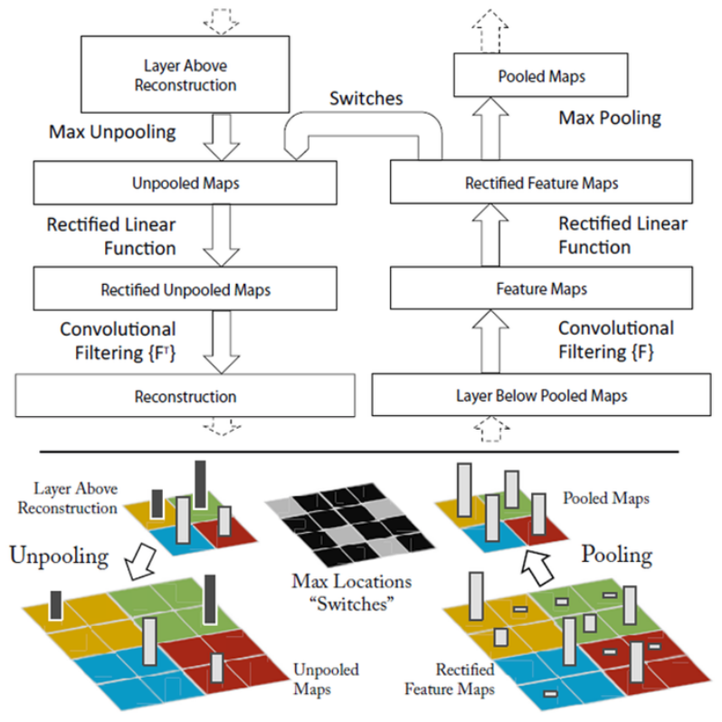
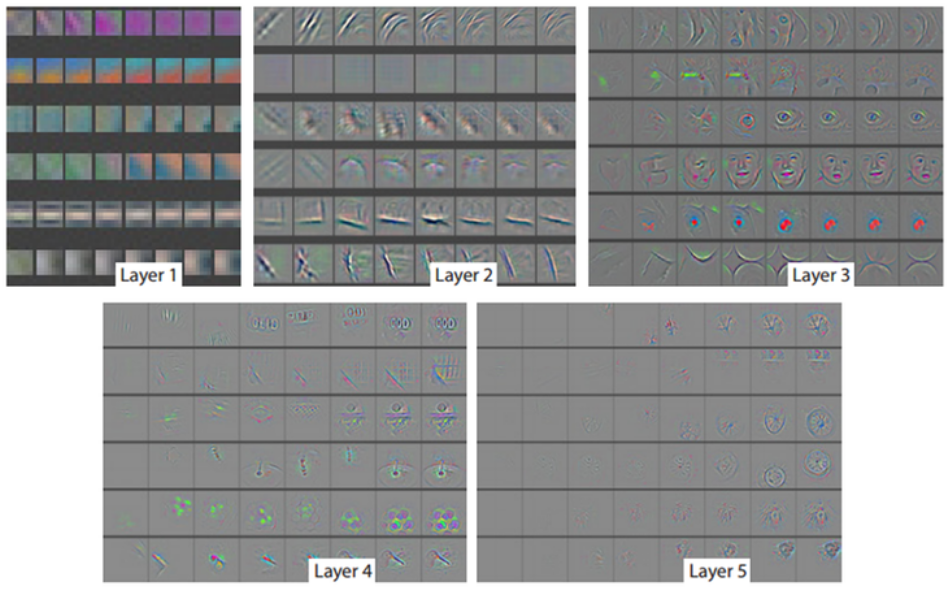
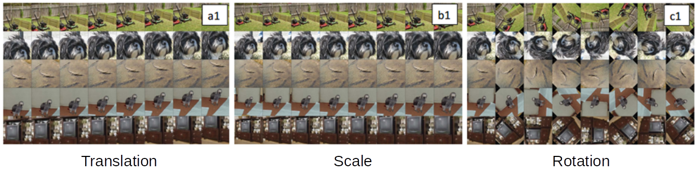
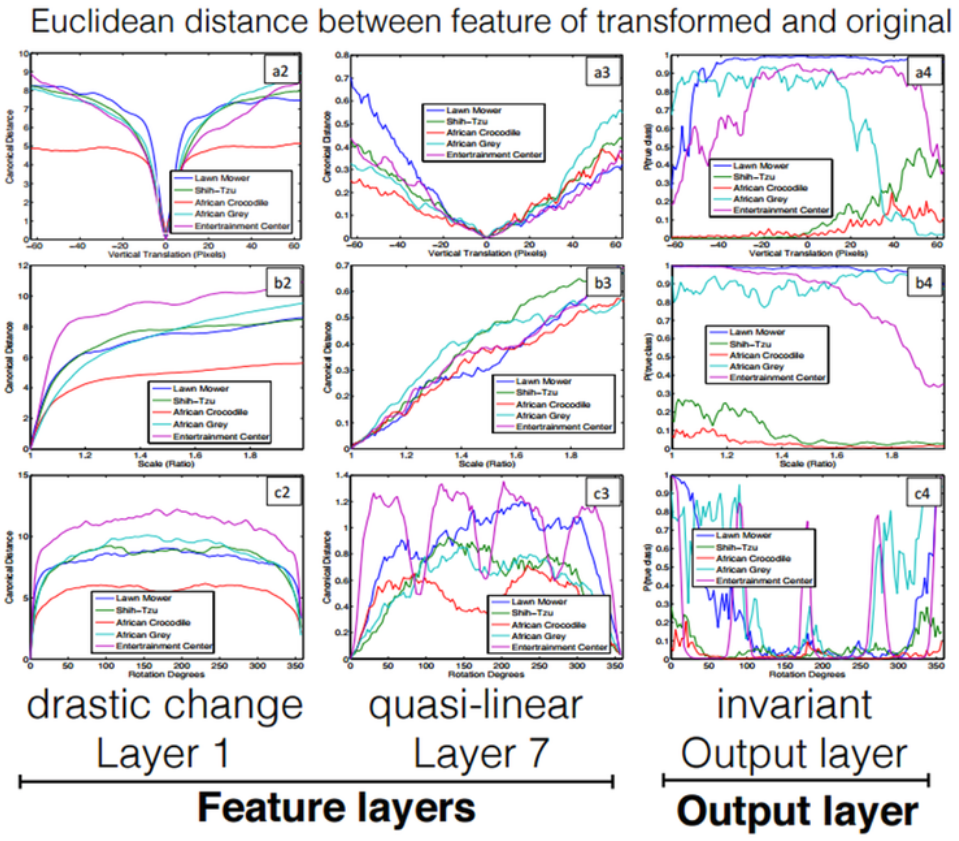
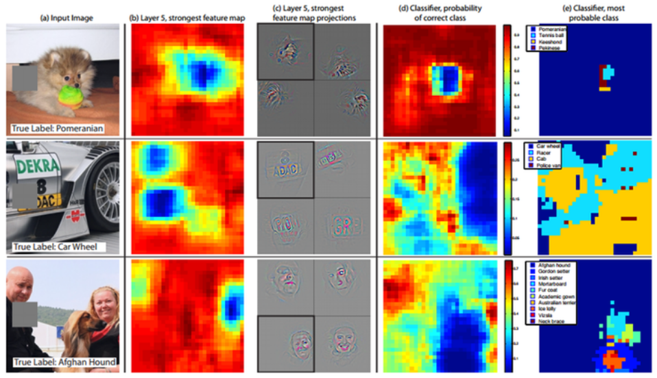

======
ZFNet
======

AlexNet에 이어 2013년에는 ILSVRC에서 Matthew Zeiler (뉴욕대 박사)가 Clarifai로 11.7% 에러율로 우승했다. 하지만 Clarifai에 대한 자료가 없고, Zeiler가 발표한 다른 CNN 모델인 ZFNet은 잘 소개 되어 있다. 같은 연구자가 만든 모델이기 때문에 Clarifai와 같은 흐름일 것으로 추정된다.

Zeiler는 뉴욕대에서 CNN을 더 잘 이해할 수 있게 하는 Visualizing 기법을 최초로 개발했고, 이와 관련 내용을 "Adaptive Deconvolutional Network for Mid and High-level Feature Learning"에 발표한다. 또한, 2013년에 "Visualizing and Understanding Convoultional Networks"라는 논문 발표 후 ILSVRC에 참여하여 우승했다.

어떤 부분이 ILSVRC 2013에서 Clarifai를 우승시키게 만들었는지 ZFNet과 Visualizing에 대해 지금부터 알아보려고 한다.

ZFNet이란
=========

CNN의 구조를 결정하는 Hyperparameter를 어떻게 설정할 것인지는 매우 중요한 문제다. 하지만 어떤 값이 최적의 조합인지 판단하기 어렵다. 그래서 이러한 문제를 Zeiler는 Visualizing 기법을 통해 해결하려 했다. 앞에 언급한 것처럼 Visualizing에 대한 중요한 개념은 2011년에 발표했고, 2012년에 AlexNet의 결과를 Reference로 해서 Visualizing 기법이 효과적임을 입증했다.

이후 Zeiler의 Visualizing 기법을 기반으로 발전된 논문을 발표했고, 아래 두 논문이 대표적인 예이다.

* Visualizing Convolutional Neural Networks for Image Classification, Danel Brukner, 2015
* Delving Deep into Convolutional Nets, Ken Chatfield, 2014

결론적으로 ZFNet에서 새로운 구조를 제안하기 보다는 AlexNet의 구조를 Visualizing 기법으로 Hyperparameter를 변경하여 성능을 더 개선시킬 수 있음을 보였다고 할 수 있다.

Visualization
==============

CNN의 큰 흐름은 "Feature map → Convolution (by filter) → Activation → Pooling" 과정의 반복이라고 할 수 있다. Visualizing은 기법은 중간 Layer의 값을 확인하여 학습이 잘 되고 있는지 확인하는 방법이고, 그래서 위 순서의 반대 작업을 했을 때 Convolution 각 Layer에서 어떤 값을 가지는지 이해할 수 있다.

아래 이미지가 Convolution과 Deconvolution 과정을 나타내고 있고, Deconvolution은 크게 3단계로 나누어 볼 수 있다.

.. rst-class:: centered

    출처: `라온피플 (Laon People) <https://laonple.blog.me/220673615573>`_

Unpooling
**********

Max pooling에서 강한 자극만 전달되기 때문에 반대로 진행 시 그 위치를 알기 어렵다. 그래서 ZFNet에서는 강한 자극의 위치를 Flag 형태로 저장하여 Unpooling 시 활용했다. 하지만 이 방법의 단점은 약한 자극의 영향력은 알 수 없다는 점이다. 아래 그림이 Unpooling 과정을 잘 나타내고 있다.

.. figure:: ../img/cnn/zfnet/unpooling.png
    :align: center
    :scale: 70%

.. rst-class:: centered

    출처: `라온피플 (Laon People) <https://laonple.blog.me/220673615573>`_

ReLU
*****

ReLU를 통해 음수 값은 모두 0으로 변경되어 되돌릴 방법이 없다. 하지만 Zeiler 팀은 연구 결과에 따르면 그 영향이 미미하다고 언급했다.

Deconvolution
**************

마지막으로 Weight 값을 Transpose하여 Deconvolution을 실시하면 강한 자극이 어떻게 구성되어 있는지 확인할 수 있다. 자세한 Deconvolution 방법은 `YouTube, 최희정 - CNN Localization (ZFNet & Deep Taylor Decomposition) <https://www.youtube.com/watch?v=46TlWpZgKRE>`_ 을 보고 정리할 계획이다.

Visualization results
======================

지금부터는 위 과정을 통해 Visualization한 결과를 보려고 한다. ZFNet은 AlexNet처럼 5개의 Convolution layer를 가지고 있고 여기서는 각 Feature map의 가장 강한 특징 9개를 시각화 한 결과를 보여주려고 한다.

Layer 1 and 2
**************

Layer 1이나 2에서는 이미지의 코너, Edge, Color와 같은 Low level feature를 보여준다.

.. figure:: ../img/cnn/zfnet/zfnet_layer_1_2.png
    :align: center
    :scale: 70%

.. rst-class:: centered

    출처: `라온피플 (Laon People) <https://laonple.blog.me/220673615573>`_

각 Layer를 조금 더 살펴보자.

--------
Layer 1
--------

아래 그림의 왼쪽은 AlexNet이고, 오른쪽은 ZFNet이다. ZFNet에서는 AlexNet의 Stride와 Filter의 크기를 바꿨고, 그림을 보면 ZFNet의 결과가 훨씬 더 다양한 Feature를 검출할 수 있다는 것을 알 수 있다.

.. figure:: ../img/cnn/zfnet/alexnet_vs_zfnet_layer_1.png
    :align: center
    :scale: 70%

.. rst-class:: centered

    출처: `라온피플 (Laon People) <https://laonple.blog.me/220676812642>`_

--------
Layer 2
--------

마찬가지로 왼쪽은 AlexNet이고, 오른쪽은 ZFNet이다. AelxNet은 Feature가 몰리거나 Aliasing 문제가 생기는데, ZFNet은 Feature가 고르게 분포하면서 더 선명하고 Anti-aliasing artifact가 없는 것을 알 수 있다.

.. figure:: ../img/cnn/zfnet/alexnet_vs_zfnet_layer_2.png
    :align: center
    :scale: 70%

.. rst-class:: centered

    출처: `라온피플 (Laon People) <https://laonple.blog.me/220676812642>`_

Layer 3
********

Layer 3에서는 Layer 1이나 2에 비해 더 복잡한 항상성 (Invariance)이나 비슷한 외양 (Texture)을 가진 특징이 추출된 것을 볼 수 있다.

.. figure:: ../img/cnn/zfnet/zfnet_layer_3.png
    :align: center
    :scale: 70%

.. rst-class:: centered

    출처: `라온피플 (Laon People) <https://laonple.blog.me/220673615573>`_

Layer 4 and 5
**************

Layer 4에서는 사물이나 개체의 일부분을 볼 수 있고, Layer 5에서는 위치나 자세 변화 등까지 포함된 사물이나 개체의 전부를 보여준다

.. figure:: ../img/cnn/zfnet/zfnet_layer_4_5.png
    :align: center
    :scale: 70%

.. rst-class:: centered

    출처: `라온피플 (Laon People) <https://laonple.blog.me/220673615573>`_

Layer 5를 조금 더 자세히 살펴보면, Edge나 Junction 같은 Low-level feature가 아닌 개 형태나 일부를 확인할 수 있다.

.. figure:: ../img/cnn/zfnet/alexnet_vs_zfnet_layer_5.png
    :align: center
    :scale: 70%

.. rst-class:: centered

    출처: `라온피플 (Laon People) <https://laonple.blog.me/220676812642>`_

Architecture
=============

ZFNet은 AlexNet과 달리 하나의 GPU를 사용했고, 70 epoch으로 12일 동안 학습시켰다. ZFNet은 Visualizing에 집중하여 구조는 AlexNet과 비슷하다.

.. figure:: ../img/cnn/zfnet/zfnet_architecture.png
    :align: center
    :scale: 70%

.. rst-class:: centered

    출처: `라온피플 (Laon People) <https://laonple.blog.me/220680023908>`_

하지만, 구조적으로 다른 부분이 있다. 먼저, Layer 1과 Layer 2의 차이를 먼저 설명하려고 한다.

.. figure:: ../img/cnn/zfnet/alexnet_vs_zfnet_layer_1_2.png
    :align: center
    :scale: 70%

.. rst-class:: centered

    출처: `라온피플 (Laon People) <https://laonple.blog.me/220680023908>`_

위 그림에서 알 수 있듯이 AlexNet과 ZFNet은 Layer 1과 Layer 2에서 구조의 차이를 보인다.

======= ======================= =====================
Model   Layer 1                 Layer 2
======= ======================= =====================
AlexNet 11x11 Filter, Stride 4  5x5 Window, Stride 1
ZFNet   7x7 Filter, Stride 2    3x3 Window, Stride 2
======= ======================= =====================

요즘 추세에 따르면 Filter와 Stride의 크기가 큰 경우 성능이 좋지 못하다. Zeiler는 Feature visualization을 통해 이를 밝혔고, 이를 통해 AlexNet의 구조를 변형시켰다.

다음으로 Layer 3, 4, 5를 살펴보자. 다음 이미지는 Layer 3, 4, 5와 Layer 6, 7의 Parameter를 변경하며 테스트한 결과이다.

.. figure:: ../img/cnn/zfnet/alexnet_vs_zfnet_layer_1_2.png
    :align: center
    :scale: 70%

    ImageNet 2012 classification error rates with various architectural changes to the model of Krizhevsky et al.

.. rst-class:: centered

    출처: `Visualizing and UnderstandingConvolutional Networks <https://cs.nyu.edu/~fergus/papers/zeilerECCV2014.pdf>`_

여기서 Our Model은 Layer 1, 2가 변경된 것을 설명할 때 사용한 이미지의 Model을 말한다. Layer 3, 4, 5의 Size를 각각 384, 384, 356에서 512, 1024, 512로 변경했을 때 결과가 더 좋게 나옴을 확인할 수 있다. 하지만 Layer 3, 4, 5와 Layer 6, 7 (FC layer)를 동시에 크게 했을 때는 Overfitting이 발생해 성능이 더 낮게 나옴을 볼 수 있다.

추가로 변경한 부분은 2개의 GPU를 사용하기 위해 인위적으로 만든 구조를 제거하고 하나의 GPU로 학습시켰다. 그 결과 Layer 2의 Visualization 결과처럼 ZFNet이 성능이 더 좋은 것을 확인했다. 이후에 GPU 2개에서 다른 처리를 시도하는 사례는 나오지 않았다.

최종적으로 ImageNet으로 테스트 했을 때, Top-5 error가 16.4% (수정 전)에서 11.7% (수정 후)로 줄었음을 확인할 수 있다.

Feature visualization으로 알게된 추가사항
=====================================

* Layer 별로 Feature를 습득하는 시간이 다름

    * 앞쪽 Layer들은 몇 번의 Epoch만에 Feature들이 수렴함
    * 뒷쪽 Layer들은 40 ~ 50 Epoch 이상에서 Feature들이 수렴함 (ZFNet: 70 epochs)

.. rst-class:: centered

    출처: `라온피플 (Laon People) <https://laonple.blog.me/220680023908>`_

* 이미지 크기, 위치, 회전 변화에 따른 Invariance 확보

    * 앞쪽 Layer에서는 작은 변화에도 눈에 띌 변화 존재
    * 뒷쪽으로 갈수록 Invariance를 얻을 수 있었음
    * 위치 이동과 크기 변화에 대해서는 Linear한 특성을 지님
    * 위 변화에 따라 각 Layer에서 Euclidean distance를 그래프 그려보면 뒷쪽으로 갈수록 Invariance한 성질 존재

.. rst-class:: centered

    출처: `라온피플 (Laon People) <https://laonple.blog.me/220680023908>`_ 

.. rst-class:: centered

    출처: `라온피플 (Laon People) <https://laonple.blog.me/220680023908>`_  

* Object 위치 파악

    * 그림 (a)
    
        * 이미지에서 특정 부분을 제거함

    * 그림 (b), (c)
        
        * Layer 5 에서 가장 강한 Activity에 대한 Feature map
        * 그림 (b): 가리는 부분에 따른 Activation 차이 확인 (개 얼굴 가리면 Activation **↓**)
        * 그림 (c): 검정 사각형 부분이 가장 강한 Activation 결과

    * 그림 (d), (e)
    
        * Classifier 출력
        * 그림 (d): 특정 위치를 가렸을 때 검출 성능 파악 (이미지 가운데 가리면 검출 능력 **↓**)
        * 그림 (e): ZFNet 분류 변동 사항 파악 (대부분 잘 분류함)

    * 결론

        * CNN은 분류/인식을 원하는 개체의 위치에 따라 반응이 달라짐

.. rst-class:: centered

    출처: `라온피플 (Laon People) <https://laonple.blog.me/220680023908>`_  

결론
====

이처럼 Visualizing을 하면 각 Layer의 Feature map들의 분포 (고름 또는 편향됨)를 알 수 있고, 개체의 위치, 자세 등을 파악할 수 있기 때문에 적절한 Hyperparameter로 학습되었는지 판단할 수 있다. 

Reference
==========

* 라온피플 - `ZFNet [1] <https://laonple.blog.me/220673615573>`_, `ZFNet [2] <https://laonple.blog.me/220676812642>`_, `ZFNet [3] <https://laonple.blog.me/220680023908>`_
* `YouTube, 최희정 - CNN Localization (ZFNet & Deep Taylor Decomposition) <https://www.youtube.com/watch?v=46TlWpZgKRE>`_
* `Visualizing and UnderstandingConvolutional Networks, Matthew D. Zeiler and Rob Fergus, 2014 <https://cs.nyu.edu/~fergus/papers/zeilerECCV2014.pdf>`_
