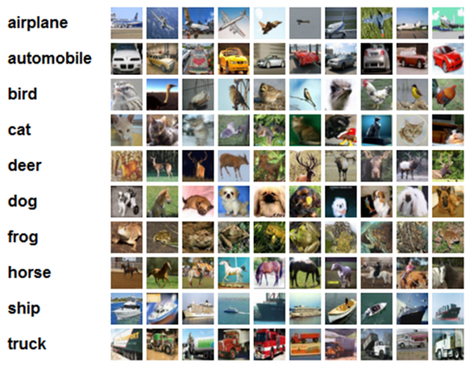

========
Dataset
========

ImageNet
=========

(작성 예정)

CIFAR-10
=========

CIFAR-10 영상 데이터는 토론토 대학교의 Alex Krizhevsky, Vinod Niar, Geoffrey Hinton이 수집한 데이터이고, 그 크기가 작아 Computer vision이나 Machine learning 초기 알고리즘의 구조 검증에 많이 사용된다.

32x32 크기의 작은 영상 데이터 집합이며, Training 이미지 5만장과 Test 이미지 1만장으로 구성되어 있다. 총 10개의 Class가 있고, 각 Class에는 Training과 Test 영상을 합쳐 총 6천장의 이미지가 있다. 10개의 Class에 대한 예는 다음 그림과 같다.

.. rst-class:: centered

    출처: `라온피플 (Laon People) <https://laonple.blog.me/220764986252>`_

Reference
==========

* 라온피플 (Laon People) - `ResNet [3] <https://laonple.blog.me/220770760226>`_
