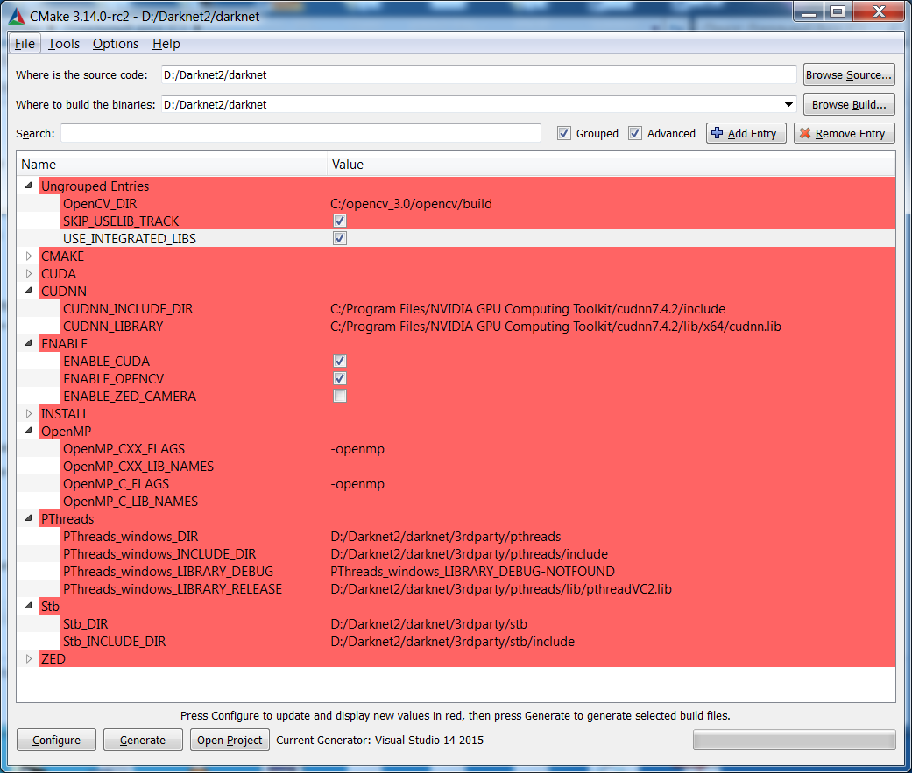

========
Darknet
========

Darknet은 YOLO가 포함된 패키지이다. 아래 링크로 Darknet을 복제하여 사용할 수 있다.

* `Darknet <https://github.com/pjreddie/darknet>`_
* `Yolo-v3 and Yolo-v2 for Windows and Linux <https://github.com/AlexeyAB/darknet>`_

Darkent build
==============

Ubuntu
*******

* `Darknet 공식 GitHub <https://github.com/pjreddie/darknet>`_ 에서 코드를 원하는 위치에 복제

::

    git clone https://github.com/pjreddie/darknet.git

* Darknet build

::

    cd darknet
    make

Windows
********

Darknet을 Build 하기 전에 다음 OS나 Library들을 설치해야 한다.

* Requirements

    * Windows or Linux
    * CMake >= 3.8 for modern CUDA support: https://cmake.org/download/
    * CUDA 10.0: https://developer.nvidia.com/cuda-toolkit-archive (on Linux do Post-installation Actions)
    * OpenCV >= 2.4: use your preferred package manager (brew, apt), build from source using vcpkg or download from OpenCV official site (on Windows set system variable OpenCV_DIR = C:\opencv\build - where are the include and x64 folders image)
    * cuDNN >= 7.0 for CUDA 10.0 https://developer.nvidia.com/rdp/cudnn-archive (on Linux copy cudnn.h,libcudnn.so... as desribed here https://docs.nvidia.com/deeplearning/sdk/cudnn-install/index.html#installlinux-tar , on Windows copy cudnn.h,cudnn64_7.dll, cudnn64_7.lib as desribed here https://docs.nvidia.com/deeplearning/sdk/cudnn-install/index.html#installwindows )
    * GPU with CC >= 3.0: https://en.wikipedia.org/wiki/CUDA#GPUs_supported
    * on Linux GCC or Clang, on Windows MSVC 2015/2017/2019 https://visualstudio.microsoft.com/thank-you-downloading-visual-studio/?sku=Community

* Yolo v3 in other frameworks

    * TensorFlow: convert yolov3.weights/cfg files to yolov3.ckpt/pb/meta: by using mystic123 or jinyu121 projects, and TensorFlow-lite
    * Intel OpenVINO 2019 R1: (Myriad X / USB Neural Compute Stick / Arria FPGA): read this manual
    * OpenCV-dnn the fastest implementation for CPU (x86/ARM-Android), OpenCV can be compiled with OpenVINO-backend for running on (Myriad X / USB Neural Compute Stick / Arria FPGA), use yolov3.weights/cfg with: C++ example or Python example
    * PyTorch > ONNX > CoreML > iOS how to convert cfg/weights-files to pt-file: ultralytics/yolov3 and iOS App
    * TensorRT for YOLOv3 (-70% faster inference): Yolo is natively supported in DeepStream 4.0
    * TVM - compilation of deep learning models (Keras, MXNet, PyTorch, Tensorflow, CoreML, DarkNet) into minimum deployable modules on diverse hardware backends (CPUs, GPUs, FPGA, and specialized accelerators): https://tvm.ai/about
    * Netron - Visualizer for neural networks: https://github.com/lutzroeder/netron

그러고나서 Darknet은 `여기 <https://github.com/AlexeyAB/darknet>`_ 에서 복제할 수 있고, CMake-GUI로 Darknet을 build 할 수 있다.

