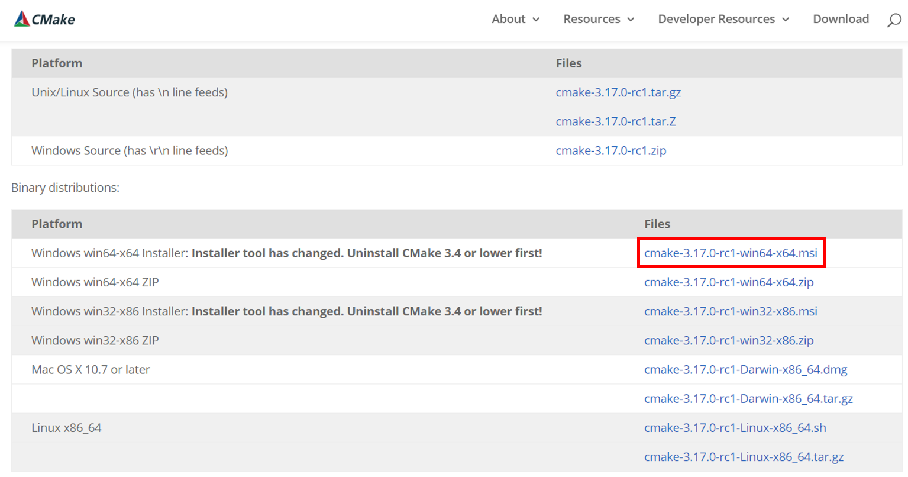

=======
OpenCV
=======

Windows
========

설치
*****

* CMake-GUI 설치 (`Link <https://cmake.org/download/>`_)

* OpenCV 다운로드 후 설치 (`Link <https://opencv.org/releases/>`_)

OpenCV build
*************

* Source와 Build 위치를 설정하기

* configure 버튼 누르기 → 개발 환경에 따라 적절히 선택 후 finish 버튼 누르기

* OpenCV build 구성을 선택하기 (불필요한 구성요소 제거 + 필요한 요소 추가 체크)

    * BUILD_EXAMPLES: opencv 예제 샘플코드들에 대한 실행파일을 컴파일할지 여부
    * BUILD_PACKAGE: 새로 빌드한 opencv 결과 파일들 전체를 하나의 패키지 형태의 파일로 묶을지 여부 (이걸 하면 무지막지하게 빌드 시간이 오래 걸리니 절대로 하면 안됨 → **체크해제**)
    * BUILD_SHARED_LIBS: dll 버전으로 빌드할지 static lib 버전으로 빌드할지 여부 (dll 버전으로 빌드할 경우 체크, static lib로 빌드할 경우 체크해제)
    * BUILD_WITH_STATIC_CRT: 콘솔 입출력, 메모리 관리 등의 CRT(C RunTime library) 모듈을 static으로 포함하여 빌드할지 여부 (이걸 포함시키면 visual c++에서 사용하는 CRT와 엄청난 충돌 메시지를 발생시키므로 **체크해제**)
    * 나머지는 외부 라이브러리를 추가하는 것이므로 본인이 필요한 기능이 있으면 체크해서 빌드 (글 뒷부분 TBB, IPP, GPU 설정 방법 참조)

* 구성요소 설정을 모두 마친 후에는 Generate 버튼을 눌러서 위의 설정이 반영된 Visual C++ 프로젝트를 생성

    * TBB, IPP, CUDA (GPU) 등을 사용하고자 할 때는 필요한 관련 설정을 모두 마친후에 Generate 버튼 누르기
    
    * TBB (Threading Building Blocks)
    
        * 최신 버전의 OpenCV에서는 TBB를 `설치 <https://www.threadingbuildingblocks.org/download>`_ 하지 않아도 멀티 쓰레드 프로그래밍을 기본 지원함
        * TBB 사용할 필요 X (`Link <https://kkokkal.tistory.com/1301>`_)

    * IPP (Intel Integrated Performance Primitives)
    
        * IPP는 인텔 CPU 칩에 최적화된 연산 라이브러리로 이걸 사용하면 OpenCV 처리 속도가 조금 향상된 (`Link <https://software.intel.com/en-us/ipp>`_)
        * IPP도 OpenCV에서 기본적으로 제공되는 걸로 보임

    * CUDA는 따로 설명

* Open Project 버튼을 클릭하여 OpenCV 빌드

    * 생성된 Visual C++ 프로젝트 파일이 열리면 Build solution을 이용하여 OpenCV를 빌드하기

CUDA 설정
**********

* WITH_CUDA를 Check하고 Configurate 버튼을 클릭하면 opencv_contrib 관련 에러가 발생함 (`Link <https://github.com/opencv/opencv_contrib/issues/2057>`_)
* opencv_contrib를 다운받고 (`Link <https://github.com/opencv/opencv_contrib>`_) OPENCV_EXTRA_MODULES_PATH에 opencv_contrib/modules 를 추가해 주기

:h2:`참조`

* `다크프로그래머, OpenCV 설치 및 CMake GPU+TBB+IPP 빌드(컴파일)하기 <https://darkpgmr.tistory.com/102>`_
* `OpenCV Tutorial <https://opencv-python-tutroals.readthedocs.io/en/latest/py_tutorials/py_setup/py_setup_in_windows/py_setup_in_windows.html>`_
