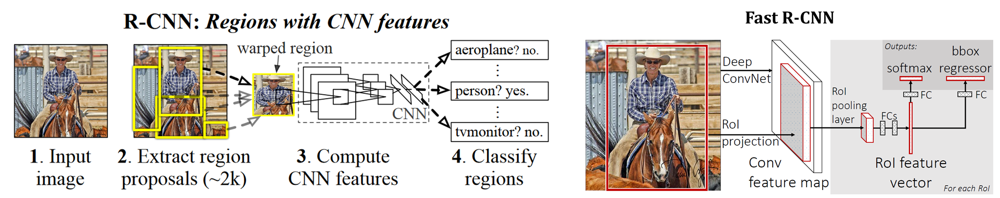
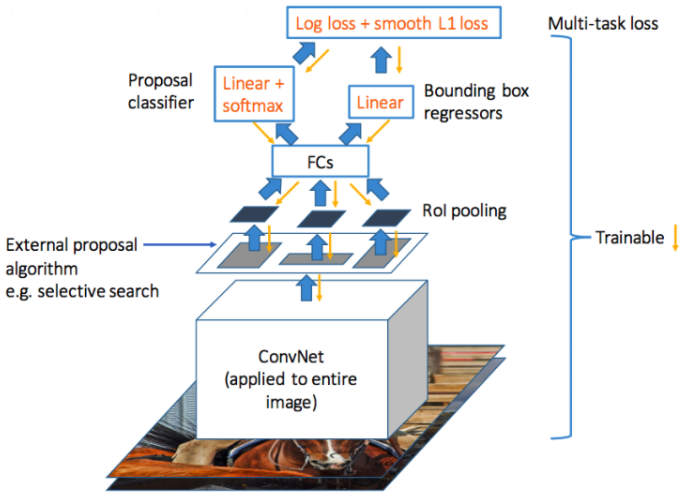
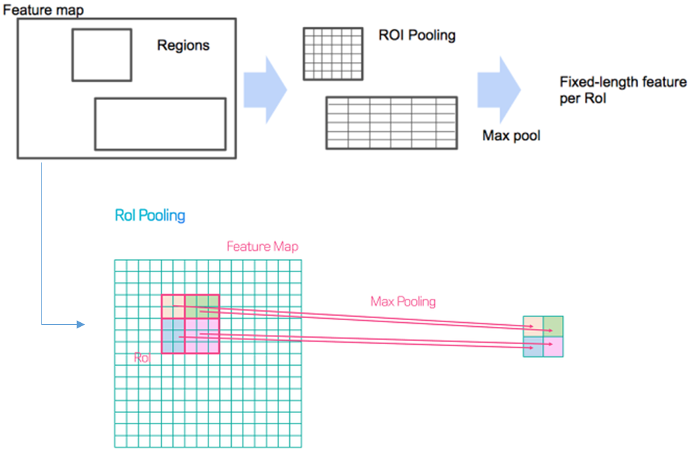
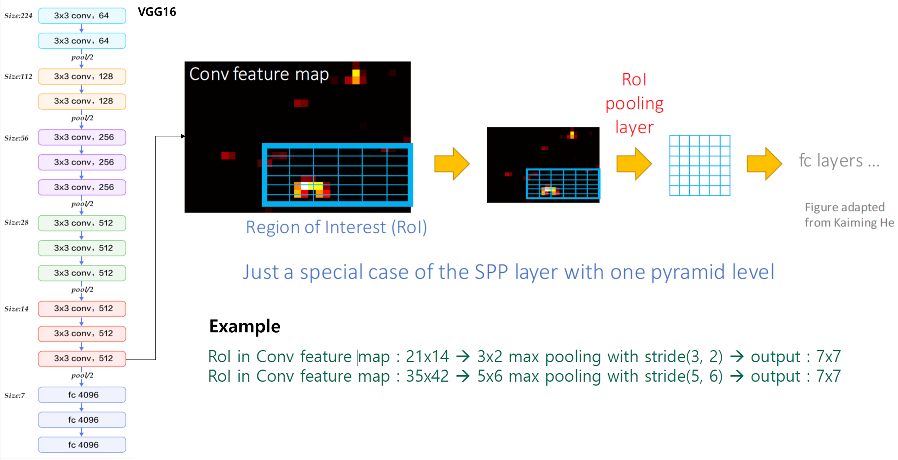
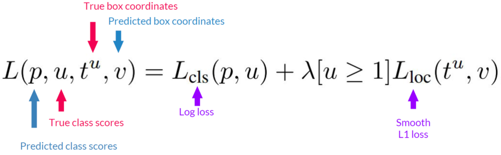
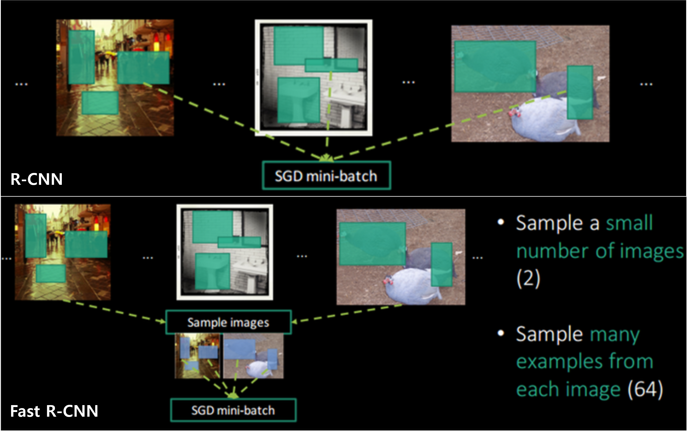
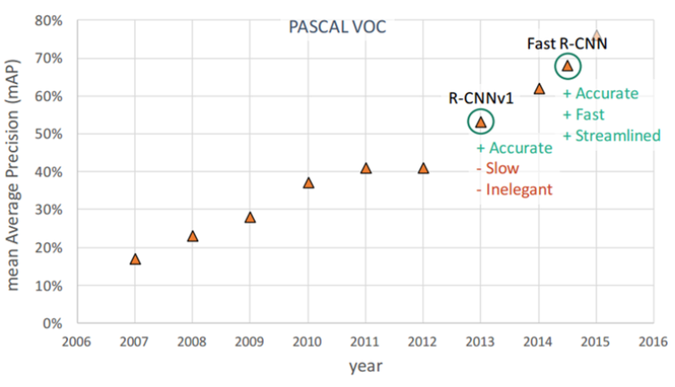
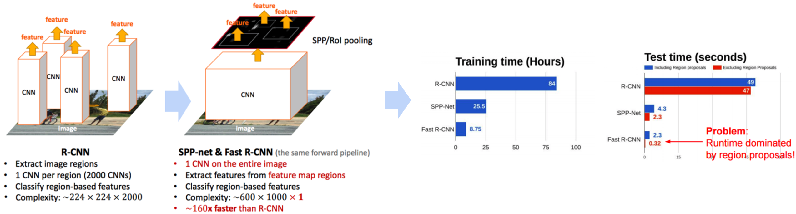
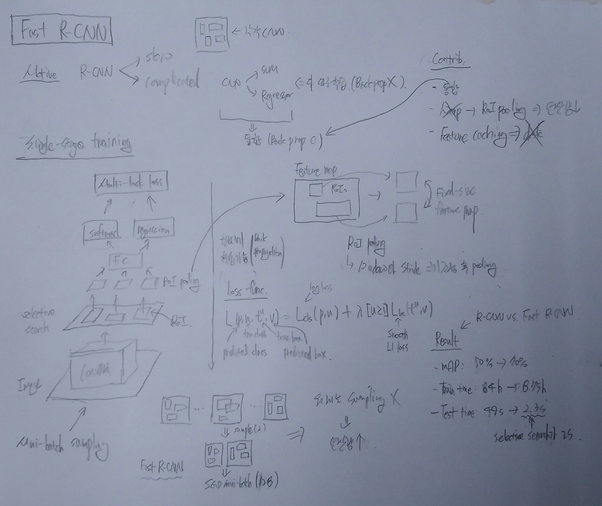

===========
Fast R-CNN
===========

Problem of R-CNN
==================

* Selective search를 통한 Region proposals에 대해 각각 CNN을 적용하여 많은 시간 소요
* CNN, SVM, Regressor 3가지 모델을 사용하여 복잡하고, Backpropagation으로 학습할 수 없음

Contribution
=============

* 3가지 단계 (Feature extraction, Classification, Regression)를 하나로 통합 → Backpropgation을 이용한 한 번의 학습으로 Object detection 할 수 있게 구조 변경
* "Warp → RoI pooling" → Computational cost ↓
* Feature caching → Disk is not required

Materials
==========

(작성 예정)

Model
======

Single-stage training
**********************

.. rst-class:: centered

    출처: Fast R-CNN

기존 R-CNN은 Feature extraction (CNN), Classification (SVM), Bounding box regression 단계를 따로 학습하여 (Fine-tunning) Classificatoin과 Regression 단계에서 학습한 결과를 Feature extraction 단계에 반영할 수 없는 문제가 있었다. 그래서 Fast R-CNN은 Feature extraction (CNN), Classification (Softmax), Bounding box regression 과정을 통합하여 (Unified) 한 번에 학습할 수 있게 (Fine-tunning) 구조를 변경했다. 아래 그림을 살펴보자.

.. rst-class:: centered

    출처: `hwkim94.github.io - Fast R CNN(2015) <https://github.com/hwkim94/hwkim94.github.io/wiki/Fast-R-CNN(2015)>`_

위 그림처럼 Fast R-CNN은 Multi-task loss를 기반으로 Backpropagation하여 모든 Layer를 동시에 학습시킨다.

RoI pooling
************

R-CNN의 또다른 문제점은 Selective search로 Region proposals를 추출하고 각 Region proposal (총 2,000개)에 대해 Warping 후 CNN 연산을 하기 때문에, 중복된 연산을 많이 실시하여 비효율적이고 시간도 오래 걸리는 것이다. 그래서 Fast R-CNN에서는 기존 :doc:`sppnet` 의 Spatial pyramid pooling을 기반으로한 RoI pooling으로 이 문제를 개선했다. 그렇다면 RoI pooling은 어떻게 동작하는 것일까?

.. rst-class:: centered

    출처: `hwkim94.github.io - Fast R CNN(2015) <https://github.com/hwkim94/hwkim94.github.io/wiki/Fast-R-CNN(2015)>`_, `CDM - [Review] Mask R-CNN <https://cdm98.tistory.com/33>`_

먼저, Resion proposal들은 CNN으로부터 추출된 Feature map에 Selective search를 적용하여 추출해낸다. 그러고 나서 RoI pooling을 실시하는데, Feature map의 Region들을 Fixed된 구역 (Bin)으로 나누고 이를 Max/Average pooling 하는 순으로 진행된다. 그 결과, 어떤 크기의 Region이 오더라도 같은 크기의 Feature를 추출할 수 있다.

이번에는 실제 VGGNet의 마지막 Conv. layer에서 RoI pooling을 사용한 예제를 통해 다시 한 번 살펴보자.

.. rst-class:: centered

    출처: `hwkim94.github.io - Fast R CNN(2015) <https://github.com/hwkim94/hwkim94.github.io/wiki/Fast-R-CNN(2015)>`_

위 예제처럼 어떤 21x14 크기의 RoI가 있고, 이를 Stride가 (3, 2)인 3x2 Window로 Max pooling 한다고 해보자. 결과로 나오는 Feature map의 크기는 7x7이 된다. 마찬가지로 35x42 크기의 RoI를 Stride가 (5, 6)인 5x6 Window로 Max pooling 했을 때, 7x7 크기의 Feature map을 얻을 수 있다.

즉, RoI 크기와 상관 없이 Pooling 하는 Window와 Stirde 크기를 조정하면 같은 크기의 Feature map을 얻을 수 있다는 결론이 나오고, 이를 RoI pooling이라고 한다. 결론적으로 RoI pooling을 사용하면 Region proposal의 크기에 상관없이 Classification과 Bounding box regression을 할 수 있기 때문에 Crop이나 Warping을 대체할 수 있게 된다.

Train and test
===============

지금까지 살펴본 내용을 기반으로 Training과 test가 어떻게 진행되는지 정리해보자. 다음 4단계를 통해 정리할 수 있다.

* Takes an input :strike:`and a set of bounding boxes`

* Generate feature maps

* For each bbox, get a fixed-length feature vector from RoI pooling layer

* Outputs have two information

    * K+1 class labels (PASCAL VOC 20 classes + Background class)
    * Bounding box locations

정리하면, Fast R-CNN은 Image → CNN → Feature map → RoI pooling → Fixed feature vector → Two outputs (Class probabilities, Bounding box locations) 순으로 Training과 Test가 진행된다고 할 수 있다. 그렇다면 Fast R-CNN을 학습할 때 사용되는 Loss function은 무엇일까?

Loss function
**************

Training 시 사용되는 Loss fucntion은 Classification과 Regression 결과를 함께 학습하고 이를 Multi-task loss라고 부른다. 아래 수식을 살펴보자.

.. rst-class:: centered

    출처: `SlideShare, Faster R-CNN - PR012 <https://www.slideshare.net/JinwonLee9/pr12-faster-rcnn170528>`_

위 수식은 Fast R-CNN의 Loss function이다. :math:`L_{cls}` 는 Loss function으로 Cross entropy를 사용했고, :math:`L_{loc}` 는 :math:`smooth_{L1}` 을 이용했다고 한다. :math:`L_{loc}` 앞에 있는 :math:`[u \geq 1]` 의 의미는 :math:`u = 0`, 즉 Background class인 경우에는 Regression loss를 반영하지 않겠다는 의미다. 이를 통해 Region proposal들 중 Object가 아닌 경우는 학습에서 제외되는 것으로 이해할 수 있다.

.. rst-class:: centered

    :math:`L_{loc} (t^u, v) = \sum\limits_{i \in \{x, y, w, h\}} smooth_{L1} (t_i^u - v_i)`

    :math:`smooth_{L1} (x) = \begin{cases} 0.5x^2 & if\ |x| < 1 \\ |x| - 0.5 & otherwise, \end{cases}`

위 수식은 :math:`L_{loc}` 에 사용된 :math:`smooth_{L1}` 에 대한 수식이다. 지금까지 설명한 두 가지 결과에 대한 Loss function을 이용하여 Backpropagation을 통해 모든 Layer가 학습될 수 있다.

Mini-batch sampling
********************

Fast R-CNN에서 학습할 때 R-CNN과 다른 Mini-batch로 Sampling을 하여 속도를 향상시켰다.

.. rst-class:: centered

    출처: `hwkim94.github.io - Fast R CNN(2015) <https://github.com/hwkim94/hwkim94.github.io/wiki/Fast-R-CNN(2015)>`_

R-CNN에서는 K개의 이미지에서 랜덤하게 N개의 RoI를 Sampling 하여 Mini-batch를 구성하는 Region-wise sampling 방법을 사용했다. 그 결과 각 RoI의 Feature를 얻기 위해서는 K번의 CNN 연산이 필요했다. :strike:`Fast R-CNN은 R-CNN처럼 224x224 크기로 Scale된 이미지를 Input으로 입력하지 않고 전체 이미지를 입력으로 받기 때문에, 같은 방법을 적용하게 되면 이미지 크기가 커짐에 따라 RoI에 해당하는 영역이 커져 연산량이 많아질 수 있다 (속도 ↓).`

이 문제를 피하기 위해 Fast R-CNN은 1장 또는 2장의 이미지에서 N개의 RoI를 Sampling 하여 Mini-batch를 구성하는 Image-centric sampling (:strike:`Hierarchical sampling`) 방법을 사용했고, 이를 통해 연산량을 줄였다.

Results
========

R-CNN vs. Fast R-CNN
*********************

PASCAL VOC 데이터에서 R-CNN은 mAP가 50%를 넘었고, Fast R-CNN은 mAP가 약 70%에 가까워졌다. 또한, Fast R-CNN은 R-CNN에 비해 엄청나게 속도를 향상시켰다.

.. rst-class:: centered

    출처: `라온피플 (Laon People) - ResNet [4], Fast-RCNN <https://blog.naver.com/laonple/220776743537>`_

Fast R-CNN에서 Image 전체에서 뽑은 Feature map에서 Region proposal 후 RoI pooling 한 결과를 Softmax와 Regression으로 Object의 위치를 찾았다. 결국, 하나의 Image에 대해 한 번의 CNN만 수행하게 되었고 (논문에서는 이를 CNN computation을 Share 했다고 표현함) 이는 엄청난 속도 향상을 가져왔다 (R-CNN은 1장의 이미지에 대해 약 2,000번의 CNN 연산 필요). 

.. rst-class:: centered

    출처: `hwkim94.github.io - Fast R CNN(2015) <https://github.com/hwkim94/hwkim94.github.io/wiki/Fast-R-CNN(2015)>`_

Fast R-CNN은 R-CNN에 비해 Train 시 약 10배 (84시간 → 8.75 시간), Test 시 약 20배 (49초 → 2.3초)이상 속도가 빨라졌다. 하지만 Region proposal 시 CPU를 기반으로 Selective search 작업이 진행되어 약 2초 가량의 시간이 소요된다 (Computational bottleneck). 이는 느린 처리 속도의 원인이다. 이를 해결한 것이 Faster R-CNN이고 다음 Section에서 설명하려고 한다.

Abstract
=========

:h2:`참조`

* Fast R-CNN, Girshick et al., 2015
* `hwkim94.github.io - Fast R CNN(2015) <https://github.com/hwkim94/hwkim94.github.io/wiki/Fast-R-CNN(2015)>`_
* `PR-012: Faster R-CNN : Towards Real-Time Object Detection with Region Proposal Networks <https://youtu.be/kcPAGIgBGRs>`_
* `라온피플 (Laon People) - ResNet [4], Fast-RCNN <https://blog.naver.com/laonple/220776743537>`_
