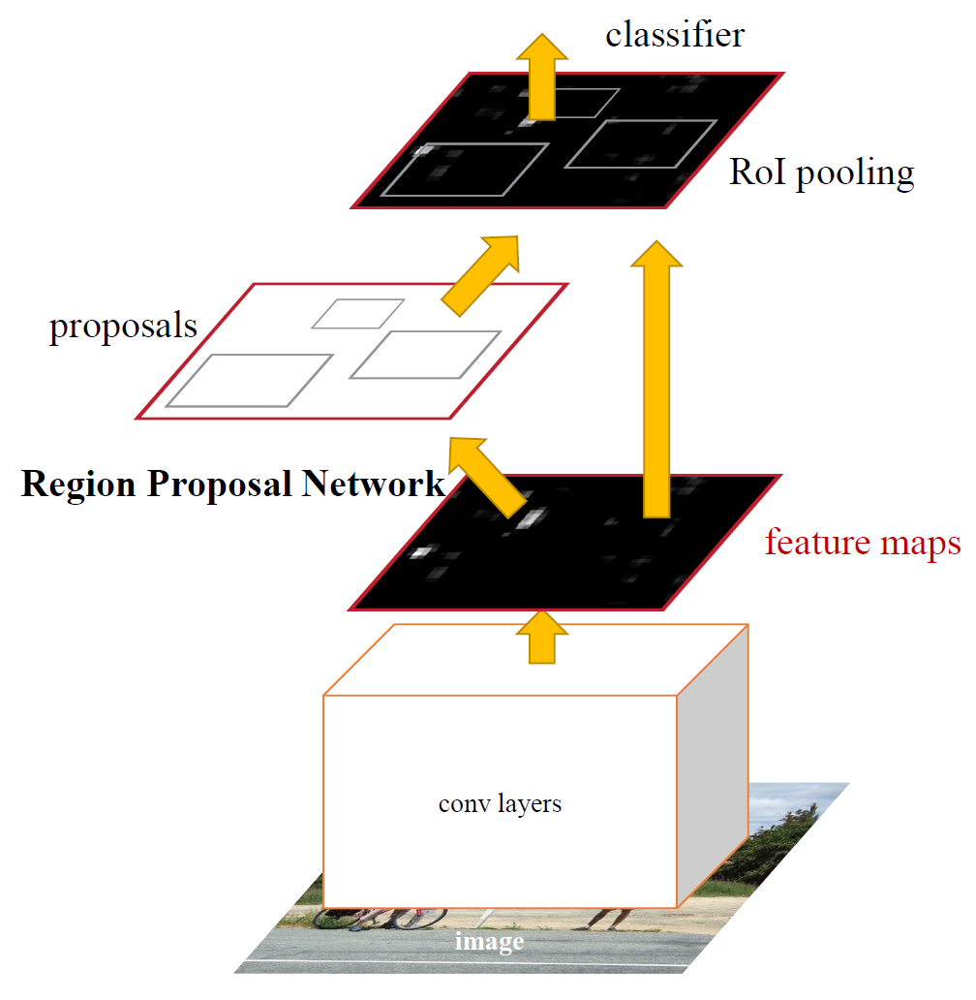
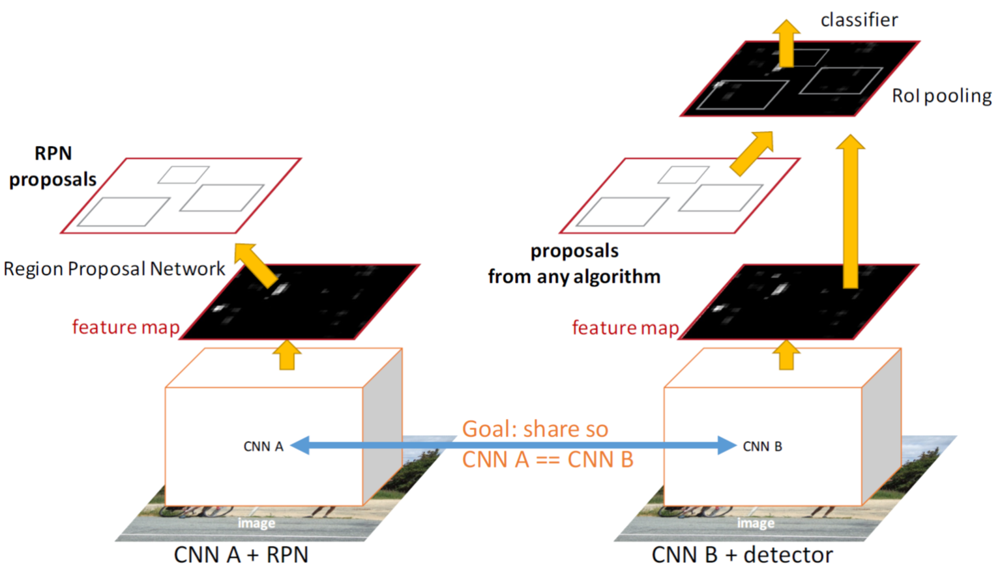
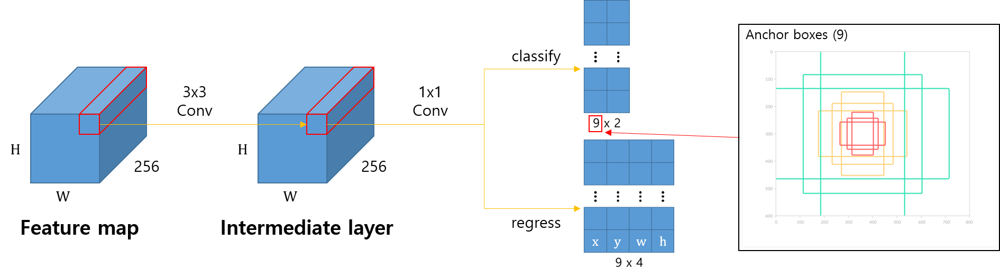
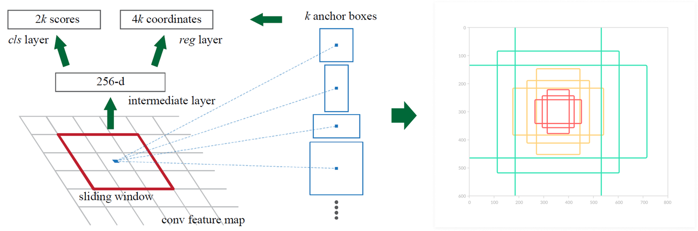
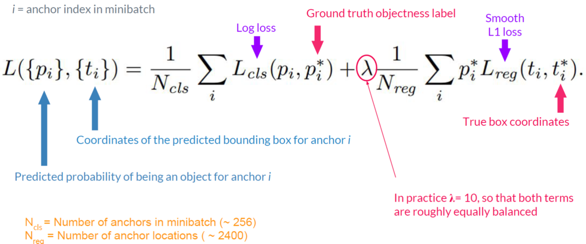
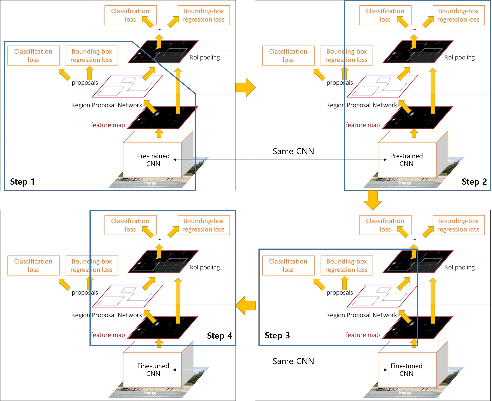
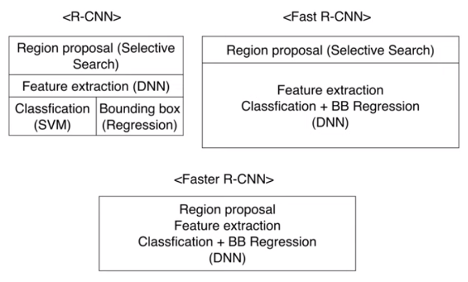
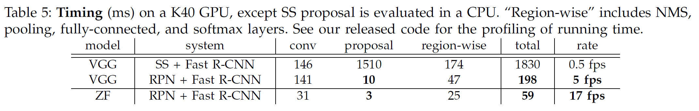

=============
Faster R-CNN
=============

Introduction
============

Fast R-CNN이 RoI pooling을 이용하여 Unified network를 만들어 성능을 높였지만, CPU를 이용하여 Selective search로 Region proposal 하는 부분의 속도가 느려 개선이 필요했다. Faster R-CNN에서 생각한 Main idea는 Region proposal 하는 부분을 Conv. layer 결과인 Feature map에서 GPU를 이용하여 생성하고 이를 학습할 수 있게 만들자는 것이었다. 그래서 기존 Fast R-CNN과 구조는 동일한데 Selective search 대신에 RPN (Region Proposal Network)을 사용했다.

.. rst-class:: centered

    출처: Faster R-CNN: Towards Real-Time Object Detection with Region Proposal Networks

결국 Faster R-CNN의 최종 목적은 Selective search 대신에 RPN을 사용하고 나머지는 Fast R-CNN의 구조를 유지하면서 아래쪽 CNN을 Share 하는 것이다. 또한, Region proposal 하는 부분을 통합하여 end-to-end learning이 가능하게 만드는 것이다.

.. rst-class:: centered

    출처: `YouTube, Lecture 11 | Detection and Segmentation <https://youtu.be/nDPWywWRIRo>`_

그렇다면 Faster R-CNN은 위와 같은 목적을 이루기 위해 어떤 데이터를 사용했을까? 이것부터 먼저 알아보자.

Materials
==========

Faster R-CNN은 RPN과 Fast R-CNN 부분을 Fine-tunning 하게 되는데, 여기서 RPN 학습 시 각 Anchor box에 대한 Label이 필요하다. 즉, 각 Anchor box에 Object가 있는지 없는지 (Positive or negative)에 대한 정답이 필요한데, 이는 다음과 같이 결정한다.

* Positive

    * Anchor box with highest IoU
    * Anchor box with IoU >= 0.7

* Negative

    * Anchor box with IoU <= 0.3

* Not used

    * Anchor box with IoU between 0.3 and 0.7

그리고 각 Mini-batch의 Positive와 Negative anchor 비율은 1:1이 유지되도록 Sampling 했다. 그 이유는 만약 Random sampling을 하게 되면 Object가 아닌 엉뚱한 위치의 Negative anchor일 비율이 높아지기 때문에 Positive와 Negative의 Balance를 맞추기 위해서이다. 그 외 다른 값들은 아래와 같다.

* :math:`i`: Anchor box index
* :math:`N_{cls}`: 사용한 Mini-batch의 수
* :math:`N_{reg}`: 사용한 RoI 개수

(나머지는 추후 정리 예정)

RPN
====

Faster R-CNN의 가장 중요한 아이디어는 RPN (Region Proposal Network)이다. RPN은 Region proposal을 만드는 Network로 마치 Attention처럼 Faster R-CNN이 어디에 주목해야 하는지 알려주는 역할을 한다. RPN의 목적은 생성한 Region proposal이 Object 여부와 Bounding box의 좌표를 예측하면서 적절한 Bounding box를 생성하도록 학습하는 것이다. 이는 다음과 같은 방법으로 학습된다.

    RPN Architecture

* ZFNet 기준으로 CNN의 마지막 :math:`W \times H` Feature map에서 3x3 Conv 256개 (VGG: 512개)를 사용하여 :math:`W \times H` Feature map 256개 (VGG: 512개) 만들기

* 그 결과를 1x1 Conv로 :math:`W \times H` 에 대해 각각 Classification (Object or not)과 Bounding box regression (4 coordinates) 하기

    * Classification: 1x1 Conv 18 (9x2)개 (Stride: 1, Pad: 0)
    * Regression: 1x1 Conv 36 (9x4)개 (Stride: 1, Pad: 0)

* Classification과 Regression 결과를 이용하여 학습하기

위 그림에서 볼 수 있듯이 RPN은 Feature map에서 추출한 Intermediate layer를 이용해 Classification과 Regression 두 가지 작업을 진행한다.

Classification
***************

Classification은 Network가 너무 Heavy하면 안되기 때문에, Classification 시 Bounding box 안에 모든 Class를 구분하는 것이 아니라 Object가 있는지 없는지만 구분하게 만든다. 이 때 그 결과값을 Confidence score 또는 Object score라고 한다.

.. rst-class:: centered

    출처: Faster R-CNN: Towards Real-Time Object Detection with Region Proposal Networks, `missinglink.ai - Faster R-CNN <https://missinglink.ai/guides/convolutional-neural-networks/faster-r-cnn-detecting-objects-without-wait/>`_

Regression
***********

Bounding box를 Regression 하려면 초기 Bounding box 정보가 필요하다. 이 때 사용하는 개념이 Anchor box다. 위 그림으로 설명하면, 3x3 Filter의 중심을 기준으로 :math:`k` 가지 Anchor box에 대해 각각 Classification과 Regression을 실시한다. 이 때 Anchor box는 3가지 Scale (128, 256, 512)과 3가지 Aspect ratio (2:1, 1:1, 1:2)를 이용하여 총 9개 (:math:`k = 9`)를 사용했다 (Multi-scale/size anchors). 이처럼 Anchor box는 사전에 그 값을 정의했기 때문에 Pre-defined reference box라고 부른다.

일반화하면 :math:`k` 개의 Anchor box에 대해 Classification은 :math:`2k` 개의 결과, 즉 :math:`W \times H` Intermediate layer에서 1x1 Conv로 18 (9x2)개의 Classification 결과를 가진다. 또한, :math:`k` 개의 Anchor box에 대해 Regression은 :math:`4k` 개의 결과, 즉 Intermediate layer에서 1x1 Conv로 36 (9x4)개의 Regression 결과가 나오게 된다.

요약하면, :math:`W \times H` Feature map의 각 Pixel에 대해 9개의 Anchor box가 존재하고, 9개 Anchor box에 대해 각각 2개의 Classification 결과와 4개의 Regression 결과가 존재한다고 생각하면 된다.

위 과정을 통해 나온 RoI 중 NMS (Non-Maximum Suppression) 과정을 통해 약 2,000개의 RoI로 줄인다. 여기서 다시 한 번 Sampling으로 Proposal을 뽑아 Fast R-CNN detector로 보내 학습을 진행하게 된다. 결론적으로 Faster R-CNN에서는 위 과정을 통해 가장 적합한 Region proposal을 만들 수 있게 학습하는 것이 주된 목표이다.

Advantage
**********

* Translation invariant (이동 불변성)

    * RPN은 Window sliding을 통해 모델 사이즈를 줄이면서 동시에 이미지 내 Class가 어디에 위치하든 같은 특징을 뽑아내는 이동불변성을 가짐

* Multi-scale anchors

    * SPPNet과 같은 방법들은 다양한 Scale의 이미지나 다양한 크기의 Filter를 사용하여 학습을 진행함
    * 단순히 Anchor box의 Hyperprameter를 다양하게 둠 → 위와 동일한 효과를 냄
    * 이를 Pyramid of anchors라고 부름

Loss function
**************

RPN의 Loss function은 기존 Fast R-CNN의 Loss function과 유사하다.

.. rst-class:: centered

    출처: `SlideShare, Faster R-CNN - PR012 <https://www.slideshare.net/JinwonLee9/pr12-faster-rcnn170528>`_

:math:`L_{cls}` 는 Loss function으로 Log loss를 사용했고, :math:`L_{loc}` 는 :math:`smooth_{L1}` 을 이용했다고 한다. :math:`p_i^*` 는 Object의 존재 여부에 따라 Regression loss를 반영할지 정하는 Parameter이다. 추가로 Normalization term과 :math:`\lambda` 는 논문 저자들이 실험했더니 영향력이 크지 않았다고 한다.

4-step alternative training
============================

Faster R-CNN은 크게 4가지 단계를 거쳐 학습된다.

.. rst-class:: centered

    출처: `YouTube, Lecture 11 | Detection and Segmentation <https://youtu.be/nDPWywWRIRo>`_

* Step 1: Classify object or not and regress box coordinates

    * ImageNet으로 Pre-train된 ConvNet을 이용하여 RPN을 end-to-end로 학습함

* Step 2: Predict Final classification score (object classes) and final box coordinates

    * ImageNet으로 Pre-train된 ConvNet과 Step 1에서 학습된 RPN을 이용하여 Fast R-CNN 모델을 학습시킴

* Step 3: Classify object or not and regress box coordinates with fine-tunned CNN

    * Step 2에서 학습된 ConvNet은 고정시키고 (학습 X), RPN만 학습시킴
    * 여기서 처음으로 Convolution feature를 Share 함

* Step 4: Predict Final classification score (object classes) and final box coordinates with fine-tunned CNN and RPN

    * Step 2에서 학습된 ConvNet과 Step 3에서 학습된 RPN을 이용하여 Fast R-CNN을 다시 학습시킴

추가로 위 과정을 반복하면 성능이 더 좋아질 수 있을 거라 생각할 수 있는데, 논문에서 실험했을 때 반복해도 성능의 변화가 크지 않다고 언급했다.

Codes
******

이번에는 Faster R-CNN의 Training 과정을 코드로 살펴보자. 여기서 M0는 ImageNet에 의해 Pre-trained된 CNN이라고 하자.

.. code::

    train_rpn(M0) → M1

우선, Pre-trained된 M0를 기반으로 RPN M1을 학습시킨다.

.. code::

    generate_proposal(M1) → P1
    train_fast_rcnn(M0, P1) → M2

학습된 RPN M1으로 Region proposal P1을 생성한다. 그리고 P1을 생성하며 학습된 모델이 아닌 Pre-trained된 M0와 P1을 이용하여 Fast R-CNN인 M2를 학습시킨다.

.. code::

    train_rpn_frozen_conv(M2) → M3

이번에는 이전에 학습된 M2를 이용하여 RPN M3를 학습시키는데, 아래쪽 Conv. layer는 학습시키지 않는다.

.. code::

    generate_proposal(M3) → P2
    train_fast_rcnn_frozen_conv(M3, P2) → M4

마찬가지로 학습된 RPN M3로 Region proposal P2를 생성한다. 그리고 M3와 P2를 이용하여 Fast R-CNN M4를 학습시킨는데, 아래쪽 Conv. layer는 학습시키지 않는다.

.. code::

    return add_rpn_layers(M4, M3.RPN)

마지막으로 학습된 Fast R-CNN M4에 RPN M3를 추가하여 최종적으로 학습된 모델을 반환한다.

Results
========

R-CNN vs. Fast R-CNN vs. Faster R-CNN
**************************************

R-CNN에서 나눠져 있던 모델들을 Fast R-CNN과 Faster R-CNN을 거치면서 각 과정을 통합시켰다. 최종적으로 Faster R-CNN에서 하나의 완전한 One-stage 모델을 만들었다.

.. rst-class:: centered

    출처: `YouTube, 양우식 - Fast R-CNN & Faster R-CNN <https://youtu.be/Jo32zrxr6l8>`_

아래 표를 보면 Faster R-CNN은 이전 R-CNN, Fast R-CNN보다 정확도와 성능면에서 모두 개선된 것을 확인할 수 있다.

============  =========  ========  ============  ==============
Model         Test time  Speed up  mAP (VOC07)   mAP (VOC07+12)
============  =========  ========  ============  ==============
R-CNN         50s        1x        66.0          ―
Fast R-CNN    2s         25x       66.9          70.0
Faster R-CNN  0.2s       250x      69.9          73.2
============  =========  ========  ============  ==============

Selective search → RPN
***********************

이번에는 기존 Selective search를 RPN으로 대체했을 때 그 속도의 차를 실험한 결과이다.

.. rst-class:: centered

    출처: Faster R-CNN: Towards Real-Time Object Detection with Region Proposal Networks

위 표에서 단위가 없는 숫자들의 단위는 ms이고, Selective search를 사용하는 경우 전체 1.8s 중 proposal에서 대부분의 시간인 1.5s가 소요됨을 알 수 있다.

Other experiments
*******************

그 외에도 논문에서는 다양한 실험을 진행했다.

* 초기 설정한 Anchor box가 Scale과 Aspect ratio에 따라 학습되어 어떻게 변경되었는지 그 평균을 계산함

    .. figure:: ../img/od/faster_r-cnn/faster_r-cnn_table1.png
        :align: center
        :scale: 50%

    .. rst-class:: centered

        출처: Faster R-CNN: Towards Real-Time Object Detection with Region Proposal Networks

    * 초기 설정한 Anchor box의 크기보다 커진 경우도 있음

* Anchor box의 3가지 Scale과 3가지 Aspect ratio를 다른 경우의 수로 사용했을 때 성능 비교

    .. figure:: ../img/od/faster_r-cnn/faster_r-cnn_table8.png
        :align: center
        :scale: 50%

    .. rst-class:: centered

        출처: Faster R-CNN: Towards Real-Time Object Detection with Region Proposal Networks

    * 3가지 Scale과 1가지 Aspect ratio, 3가지 Aspect ratio를 사용한 결과의 차이가 거의 없음
    * 논문에서는 확장성을 고려하여 최종적으로 3가지 Scale과 3가지 Aspect ratio를 사용했다고 언급함

* Loss function의 :math:`\lambda` 에 따른 성능 비교함

    .. figure:: ../img/od/faster_r-cnn/faster_r-cnn_table9.png
        :align: center
        :scale: 50%

    .. rst-class:: centered

        출처: Faster R-CNN: Towards Real-Time Object Detection with Region Proposal Networks

    * :math:`\lambda` 가 1, 10, 100 일 때, 큰 차이가 없음 → :math:`\lambda` 영향력 ↓

* Shared, NMS, cls, reg 여부에 따른 성능 비교

    .. figure:: ../img/od/faster_r-cnn/faster_r-cnn_table2.png
        :align: center
        :scale: 50%

    .. rst-class:: centered

        출처: Faster R-CNN: Towards Real-Time Object Detection with Region Proposal Networks

    * Conv. layers를 Share 하지 않으면 성능이 약간 떨어짐
    * NMS (겹치는 Bounding box merge하는 방법) 사용 여부에 따라 큰 차이가 없음
    * cls와 reg 중에는 reg가 더 중요함

* PASCAL VOC 2007과 2012로 Test 결과 비교

    .. figure:: ../img/od/faster_r-cnn/faster_r-cnn_table3,4.png
        :align: center
        :scale: 50%

    .. rst-class:: centered

        출처: Faster R-CNN: Towards Real-Time Object Detection with Region Proposal Networks

Faster R-CNN vs. Others
************************

아래 그림은 Fater R-CNN과 다른 Object detection 방법들을 비교해 놓은 그래프이다.

.. figure:: ../img/od/faster_r-cnn/comparison_speed_and_map_in_faster_r-cnn.png
    :align: center
    :scale: 60%

.. rst-class:: centered

    출처: `Medium, Object detection: speed and accuracy comparison <https://medium.com/@jonathan_hui/object-detection-speed-and-accuracy-comparison-faster-r-cnn-r-fcn-ssd-and-yolo-5425656ae359>`_

위 그래프에서 알 수 있듯이, 전반적으로 Faster R-CNN이 mAP가 더 높고 GPU time이 더 짧은 경우가 많은 것을 볼 수 있다.

Conclusion
===========

Faster R-CNN은 기존에 CPU를 사용하던 Selective search가 아닌 GPU 단에서 RPN을 이용하여 GPU를 활용한 Region proposal 했고, 이를 통해 정확도와 속도를 모두 향상시켰다.

Problem
========

RPN을 이용해 추출한 Region proposal에 Window와 Stride 크기를 조정해 RoI pooling을 적용하면 Fixed 된 크기의 Feature map을 추출할 수 있다. 하지만 예를 들어 RoI pooling으로 7x7 Feature map을 추출 할 때 Region proposal이 7의 배수가 아닌 경우, 버림 또는 Rounding을 해야하고 여기서 오차가 발생할 수 있다. 따라서 Classification은 문제가 안될 수도 있지만, Bounding box regression 할 때 정확한 좌표를 예측하는데 문제가 생길 수 있다. 이러한 문제를 Mask R-CNN에서 해결했다고 한다.

:h2:`참조`

* Faster R-CNN: Towards Real-Time Object Detection with Region Proposal Networks, Shaoqing Ren et al., 2016
* `YouTube, Lecture 11 | Detection and Segmentation <https://youtu.be/nDPWywWRIRo>`_
* `YouTube, 양우식 - Fast R-CNN & Faster R-CNN <https://youtu.be/Jo32zrxr6l8>`_
* Fast campus, 올인원 패키지: 딥러닝/인공지능
