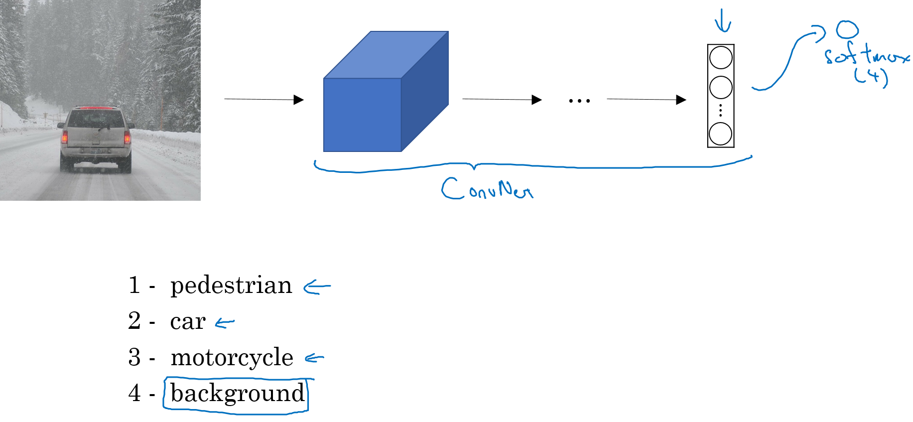
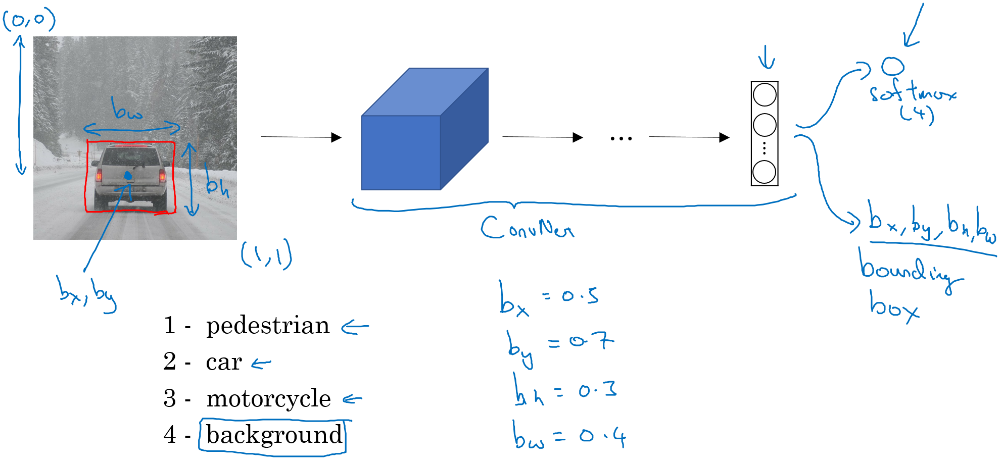
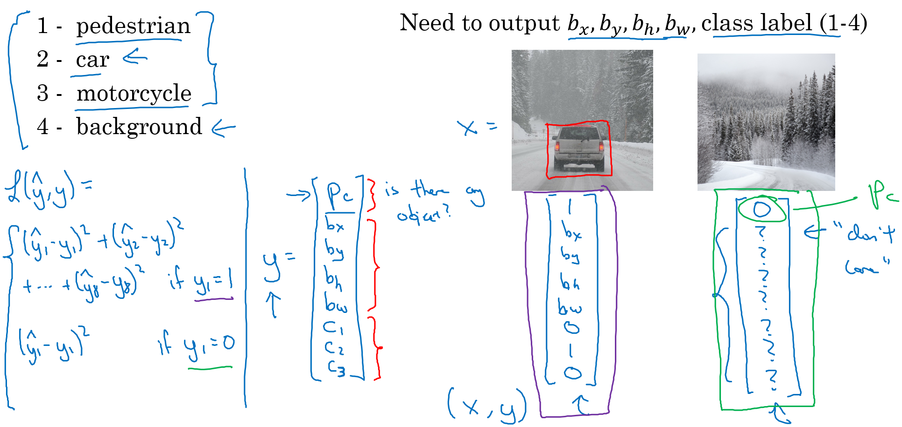
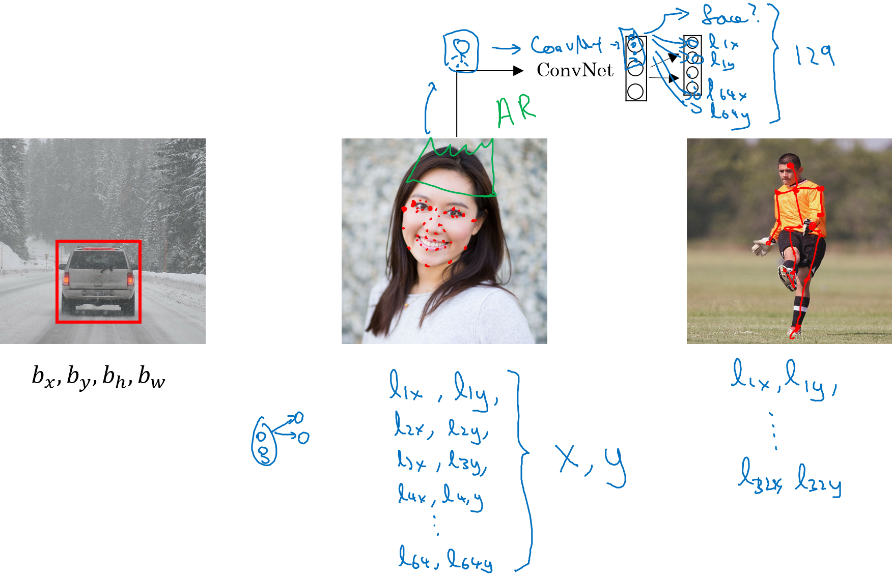

===========================
Finding an object location
===========================

Object 위치를 파악하는 방법에는 Object localization과 Landmark detection이 있다. 하나씩 살펴보자.

Object localization
====================

아래 첫 번째 그림이 차인지 아닌지를 구분하는 것은 Classification이고, 두 번째 그림처럼 그림 내의 차에 위치를 Bounding box로 표시하는 작업이 Localization이다. 이후에 다룰 부분이지만 세 번째 그림처럼 모든 Object들을 Localization 하는 것이 Object detection이다.

.. figure:: ../img/od/ol_and_ld/cls_ol_od.png
    :align: center
    :scale: 50%

.. rst-class:: centered

    출처: `Coursera, Convolutional Neural Network <https://www.coursera.org/learn/convolutional-neural-networks>`_

위 그림처럼 Clasification과 Localization 문제들은 주로 1개의 Object를 다루지만, Detection 문제들은 여러 개의 다른 Object를 가질 수 있다. 3가지 개념은 서로 연관되어 있고, Classification → Localization → Detection 순으로 각 부분에 배웠던 개념을 다음 개념을 이해하는데 적용할 수 있다.

그럼 먼저 Classification 개념을 이용해 Localization을 이해해보자. 아래 그림은 4개의 Class를 분류하는 CNN 모델이다.

.. rst-class:: centered

    출처: `Coursera, Convolutional Neural Network <https://www.coursera.org/learn/convolutional-neural-networks>`_

여기에서 자동차의 위치를 알아내려면 어떻게 해야 될까? 위치를 알기 위해서는 자동차의 중심점 위치와 가로, 세로 길이를 알면 자동차의 위치를 알 수 있다.

.. rst-class:: centered

    출처: `Coursera, Convolutional Neural Network <https://www.coursera.org/learn/convolutional-neural-networks>`_

결론적으로 변경이 필요한 부분은 예측하고자 정답인 Label y이다. Label y에 필요한 정보는 자동차 위치에 해당하는 중심점 (:math:`b_x`, :math:`b_y`)과 가로/세로 길이 (:math:`b_h`, :math:`b_w`), 그리고 어떤 Object인지에 대한 Class 정보와 해당 Class가 존재하는지 여부에 대한 정보 (:math:`p_c`)가 필요하다. 그래야 어떤 Object가 비디오나 사진 내 어디에 몇 %의 확률로 존재하는지 알 수 있기 때문이다. 이를 정리하면 아래 그림과 같다.

.. rst-class:: centered

    출처: `Coursera, Convolutional Neural Network <https://www.coursera.org/learn/convolutional-neural-networks>`_

(예시에 대한 설명은 추후에 작성 예정). 그리고 하나의 Object를 구분하는 것을 가정했기 때문에 Label y를 위와 같이 나타냈음을 알고 있어야 한다.

이번에는 Cost function을 살펴보자. 먼저, Object가 존재하는 경우에는 일반적인 Cross entropy를 사용했다. 하지만 Object가 존재하지 않는 경우에는 :math:`p_c` 값만 차이가 나는지 확인하면 된다. 왜냐하면 Object가 없으면 나머지 값들은 무의미하기 때문이다. 또한, 각 항목에 따라 다르게 Cost function을 적용할 수 있는데 이 부분은 추후에 다시 언급하려고 한다.

Landmark detection
===================

Landmark detection은 비디오나 사진 내에서 Object의 Landmark (특징점) 위치를 찾아내는 것을 의미한다. Landmark detection도 이전에 했던 Object localization과 유사한 형태를 띈다. 아래 그림을 살펴보자.

.. rst-class:: centered

    출처: `Coursera, Convolutional Neural Network <https://www.coursera.org/learn/convolutional-neural-networks>`_

Object localization에서도 Class에 대한 정보와 해당 Class의 그림 내 중심점 및 가로/세로 길이를 예측하여 Object의 위치를 예측하는 모델을 만들었다. Landmark detection을 할 때도 마찬가지로 Landmark의 Class에 대한 정보와 각 Landmark의 위치를 Output으로 하는 ConvNet 모델을 만들면 Landmark의 위치를 예측하는 모델을 만들 수 있다.

Concolusion
============

지금까지 Object localization과 Landmark detection에 대해서 살펴봤다. Object localization은 기존 Classification 모델을 변형하여 Object의 중심점과 가로/세로 길이를 예측하게 함으로써, Object의 위치를 예측하는 모델을 만들 수 있었다. 마찬가지로 Landmark detection 할 때도, ConvNet이 각 Landmark Class와 위치를 예측하게 변형하여 Landmark의 위치를 예측하는 모델을 만들 수 있었다.

지금부터는 이 두 가지 개념을 이용해서 어떻게 Object detection을 하는지는 다음 페이지에서 알아보려고 한다.

:h2:`참조`

* `Coursera, Convolutional Neural Network <https://www.coursera.org/learn/convolutional-neural-networks>`_
