=================
Object detection
=================

이전에도 언급한 것처럼 Object detction은 비디오나 사진에서 Object를 감지하는 작업이고, 그 과정은 크게 Classification과 Localization으로 나뉜다. Object detection에는 여러 가지 방법들이 있지만, 딥러닝을 사용하기 전에 많이 사용된 Sliding window detection에 대해 언급하려고 한다.

Sliding window detection
=========================

일반적인 ConvNet을 이용하여 자동차를 분류하는 모델을 만들면 아래와 같은 결과를 얻는다.

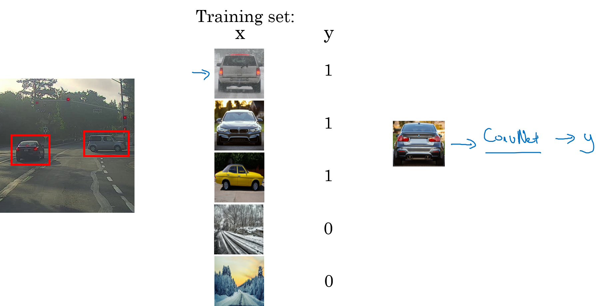

.. rst-class:: centered

    출처: `Coursera, Convolutional Neural Network <https://www.coursera.org/learn/convolutional-neural-networks>`_

이렇게 학습된 ConvNet을 이용하여 이미지를 Sliding 하면서 각 부분이 자동차인지 아닌지를 분류하면서 자동차의 위치를 찾을 수 있다. 하지만 이 방법은 수 많은 영역을 잘라내고 ConvNet으로 계산해야 되기 때문에, Computational cost가 많이 든다. 이를 줄이기 위해 Slide 간격을 크게 하여 띄엄띄엄 확인하면 성능이 저하될 수 있다.

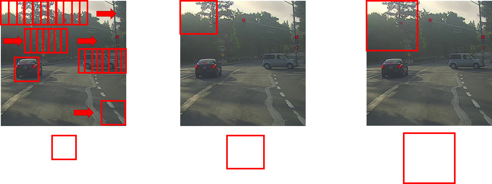

.. rst-class:: centered

    출처: `Coursera, Convolutional Neural Network <https://www.coursera.org/learn/convolutional-neural-networks>`_

그래서 이전에는 Neural network가 성공하기 전에는 사람들이 Object detection을 위해 많은 연산을 요하지 않는 Linear classifier를 사용하거나 직접 특징을 설정했다. 하지만 이러한 방법은 한계가 있다. 그렇다면 ConvNet의 Computational cost 문제를 해결하는 방법은 없을까? Convolution을 이용하여 이 문제를 해결할 수 있는 방법이 있다.

FC layer → Conv. layer
=======================

Computational cost 감소를 위해 아래 그림과 같이 FC layer를 Convolutional layer로 바꿀 수 있다.

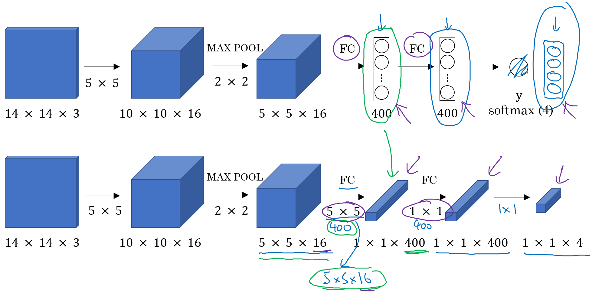

.. rst-class:: centered

    출처: `Coursera, Convolutional Neural Network <https://www.coursera.org/learn/convolutional-neural-networks>`_

변경된 ConvNet에서 Sliding window를 적용시키면 아래 그림과 같다.

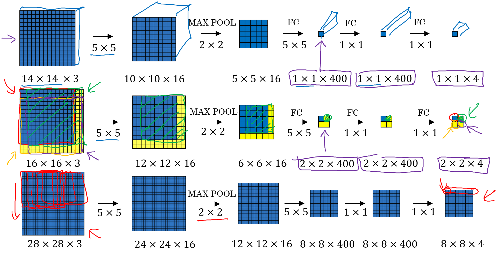

.. rst-class:: centered

    출처: `Coursera, Convolutional Neural Network <https://www.coursera.org/learn/convolutional-neural-networks>`_

결론적으로 FC layer를 Conv. layer로 바꾼 ConvNet으로 Sliding window를 적용하는 경우, 여러 번 Sliding window를 적용하는 것이 아니라 한 번에 해결할 수 있다 (?)

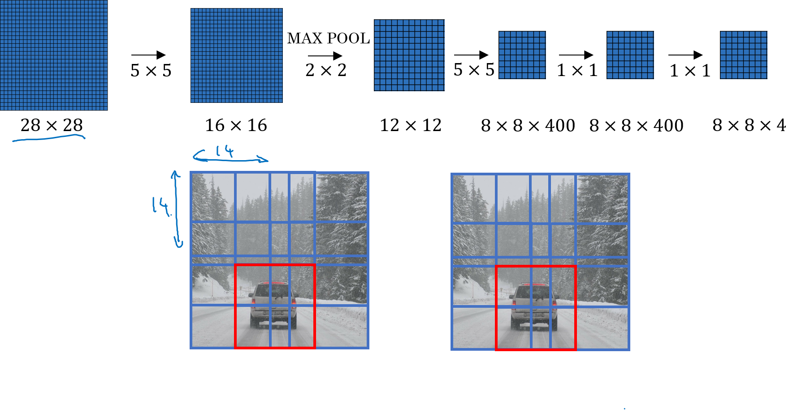

.. rst-class:: centered

    출처: `Coursera, Convolutional Neural Network <https://www.coursera.org/learn/convolutional-neural-networks>`_

하지만 이 방법도 Bounding box의 위치가 정확하지 않을 수 있다는 문제점을 가지고 있다.

Non-max suppresion
====================

Object detection에 발생할 수 있는 또 다른 문제점은 알고리즘이 같은 Object를 여러 번 감지하는 것이다. Non-max suppresion은 알고리즘이 각 Object를 한 번씩만 감지하게 보장하는 방법이다.

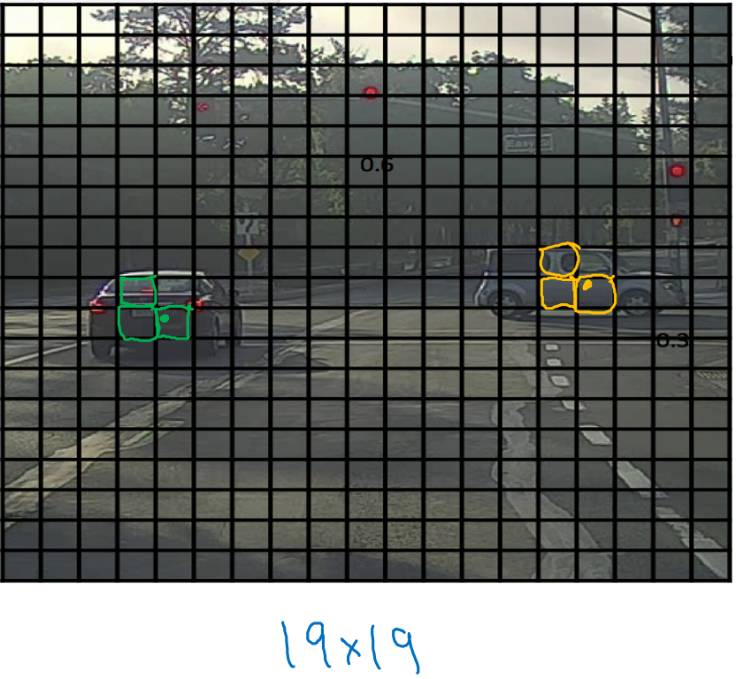

.. rst-class:: centered

    출처: `Coursera, Convolutional Neural Network <https://www.coursera.org/learn/convolutional-neural-networks>`_

위 그림에서 Object를 감지하려고 할 때 19x19 Grid를 이용할 수 있다. 그리고 그림의 각 차는 하나의 중심점을 가지고 있으므로 하나의 Grid에 중심점이 할당되어야 한다. 하지만 실제 Object detection 시 각 Grid에서는 자신이 차의 중심점이라고 판단할 수 있다. 이러한 문제를 Non-max suppression으로 어떻게 해결할 수 있는지 아래 그림을 보자.

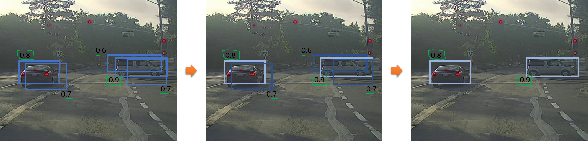

.. rst-class:: centered

    출처: `Coursera, Convolutional Neural Network <https://www.coursera.org/learn/convolutional-neural-networks>`_

위 첫 번째 그림처럼 각 Object에 대해 여러 개의 Bounding box가 감지될 수 있다. 이 때 각 Bounding box의 확률 중 가장 높은 것만 밝게 표시한다. 그리고나서 선택된 Bounding box와 IoU가 높은 Bounding box를 찾아 어둡게 표현한다. 그 후 어둡게 표시된 Bounding box를 제거하면 남은 Bounding box가 해당 Object의 최종 Bounding box가 된다.

정리하면, Non-max suppresion은 Bounding box 중 확률이 최대인 경우를 찾고 그렇지 않은 것들은 IoU를 활용하여 억제하는 방법이다.

Algorithm
**********

지금까지 언급한 내용을 알고리즘으로 나타내면 다음과 같다.

.. figure:: ../img/od/od/non-max_sup_algo.png
    :align: center
    :scale: 40%

.. rst-class:: centered

    출처: `Coursera, Convolutional Neural Network <https://www.coursera.org/learn/convolutional-neural-networks>`_

* :math:`p_c <= 0.6` 인 Bounding box는 모두 제거함

* 다음 과정을 남아있는 Bounding box가 없을 때까지 반복함

    * :math:`p_c` 가 가장 큰 Bounding box 선택
    * 선택된 Bounding box와 :math:`IoU >= 0.5` 인 Bounding box 모두 삭제

위 알고리즘은 하나의 Object를 감지할 때 실시한 Non-max suppression이다. 따라서 여러 개의 Object를 검출하려고 한다면, 여러 개의 Class에 대해서는 독립적으로 3번의 Non-max suppression을 실시해야 한다.

Anchor boxes
=============

지금까지 다룬 Object detection의 문제점은 각 Grid가 하나의 Object만 감지할 수 있는지 여부다. 이게 중요한 이유는 여러 개의 Grid에서 하나의 Object을 감지하면 어떤 Grid가 감지했다고 판단해야 되는지 애매할 수 있기 때문이다. 그렇다면 하나의 Grid로 여러 개의 Object를 감지하려면 어떻게 해야 할까? Anchor box를 사용하면 된다.

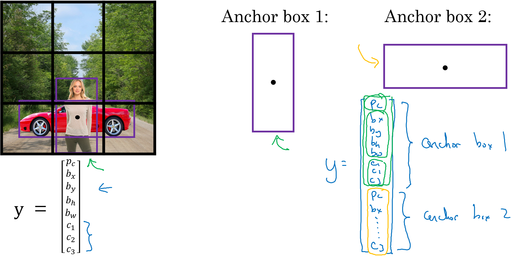

.. rst-class:: centered

    출처: `Coursera, Convolutional Neural Network <https://www.coursera.org/learn/convolutional-neural-networks>`_

기존에는 Label y가 하나의 Object에 대한 Bounding box 정보를 담고 있었는데, Anchor box 개념을 이용하면 Label y가 2개의 Object에 대한 Bounding box 정보를 담고 있다. 여기서는 2개의 Anchor box만 이용해서 한 Grid에서 2개의 Object를 판단할 수 있게 된다. 물론 더 많은 Anchor box를 사용할 수도 있다.

다시 한 번 설명하면, 기존에는 하나의 Grid에 하나의 Object에 대한 정보를 예측했다면, 이번에는 하나의 Grid에 Anchor box와 IoU가 가장 유사한 Object에 대한 정보를 예측하는 것이다. 그래서 기존에는 예를 들어 3x3x8의 Output을 가졌다면, 이제는 3x3x2x8 = 3x3x16인 Output을 가지게 된다 (Grid와 Anchor box 쌍).

다음 예시를 통해 이해도를 높여보자.

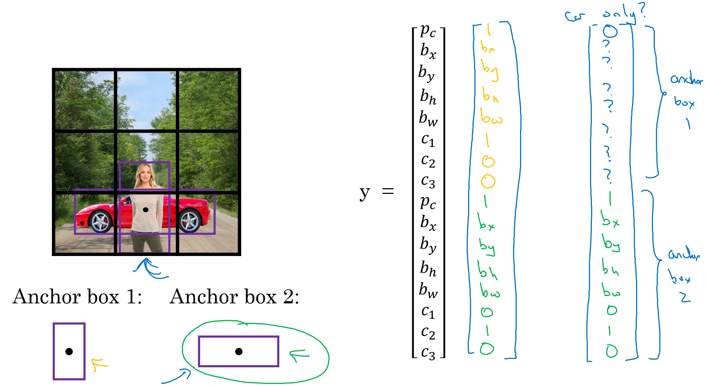

.. rst-class:: centered

    출처: `Coursera, Convolutional Neural Network <https://www.coursera.org/learn/convolutional-neural-networks>`_

하나의 Grid에 사람과 자동차가 모두 있다면 위와 같이 두 개의 Object에 대한 정보가 y에 해당한다. 하지만 자동차만 가지고 있는 Grid의 경우 Anchor box 2에 대한 요소만 가지고 Anchor box1에 대한 요소는 :math:`p_c` 만 0으로 두고 나머지는 신경쓰지 않는다.

그렇다면 만약 2개의 Anchor box를 가졌는데, 하나의 Grid에 3개의 Object가 존재한다면 어떻게 될까? 이런 경우에는 2개의 Object만 구분할 수 있고, 나머지 1개의 Object는 구분할 수 없다. 그렇다면 만약 두 Object가 하나의 Grid에 존재하고 하나의 Anchor box만 가진다면 어떻게 될까? 이 경우도 Anchor box 알고리즘에서는 다루지 않는 부분이다. 그래서 이 부분은 문제가 안 되도록 구현할 때 조정해야 한다.

정리하면 Anchor box는 하나의 Grid에 2개 이상의 Object가 감지되었을 때 해결하는 방법이다. 실제로 하나의 Grid에 2개의 Object가 나오는 일은 드물게 발생하지만 Grid를 3x3에서 19x19로 늘리면 더 줄어든다고 한다. 그럼에도 Anchor box가 주는 좋은 점은 Learning algorithm을 더 특화시킬 수 있다는 점이다. 예를 들어 보행자 같은 길쭉한 Object는 자동차 같은 넓은 Object를 감지하는데 더 특화되게 모델을 학습시킬 수 있다.

그렇다면 Anchor box는 어떻게 선택하는 걸까? 심화된 YOLO에서 이러한 부분을 다루는데, K-means 알고리즘으로 얻을 것으로 생각되는 Object 모양을 그룹 지어 Anchor box를 찾았다고 한다. 그 외에도 자동으로 Anchor box를 고르는 방법들이 존재한다.

Object detction flow
=====================

지금까지 Object detection과 관련된 여러 문제를 해결하는 방법에 대해서 알아봤다. 그렇다면 이러한 Object detection은 어떻게 발전해 왔을까? Object detection 방법은 크게 1-stage detector와 2-statge detector로 나눌 수 있고 그 흐름은 다음 그림과 같다.

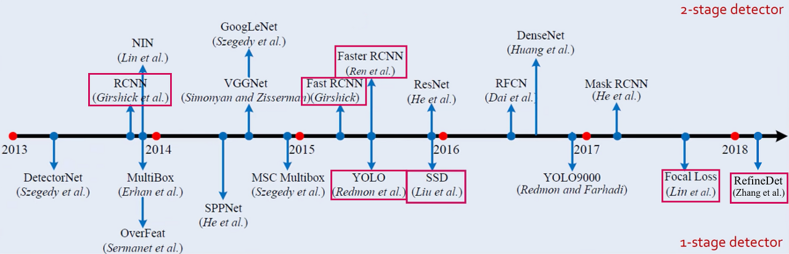

.. rst-class:: centered

    출처: `제이스핀, Object Detection <https://nuggy875.tistory.com/20?category=860935>`_

Object detection은 위에서 언급한 것처럼 Object를 분류하는 Classification 문제와 Object의 위치를 찾는 Localization 문제를 합한 것이다. 이 때, 1-stage detector는 두 문제를 동시에 진행하는 방법이고, 2-stage detector는 두 문제를 순차적으로 진행하는 방법이다.

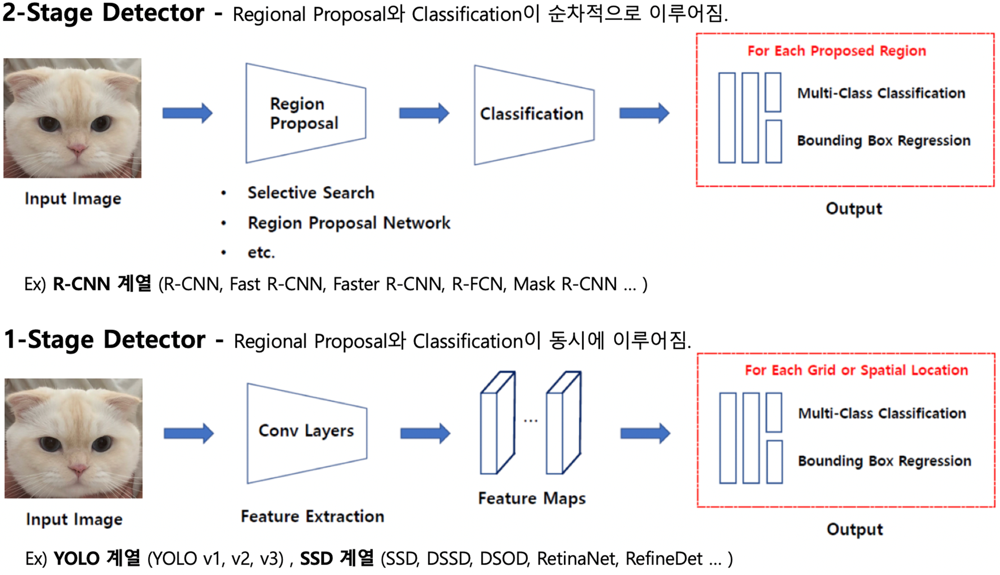

.. rst-class:: centered

    출처: `제이스핀, Object Detection <https://nuggy875.tistory.com/20?category=860935>`_

따라서 1-stage detector가 빠르지만 정확도가 떨어지고 2-stage detector는 상대적으로 느리지만 정확도가 더 높은 경향이 있다. 그리고 아래 그림이 Computer vision 분야 주요 학회에서 소개된 Object detction 논문 흐름을 나타내고 있다.

.. figure:: ../img/od/od/od_papers.png
    :align: center
    :scale: 70%

.. rst-class:: centered

    출처: `제이스핀, Object Detection <https://nuggy875.tistory.com/20?category=860935>`_

Concolusion
============

(작성 예정).

지금부터는 Object detection flow에서 언급한 Object detection 논문들에 대해 하나씩 언급하려고 한다.

:h2:`참조`

* `Coursera, Convolutional Neural Network <https://www.coursera.org/learn/convolutional-neural-networks>`_
