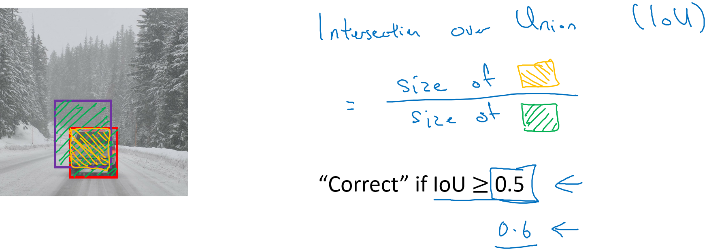
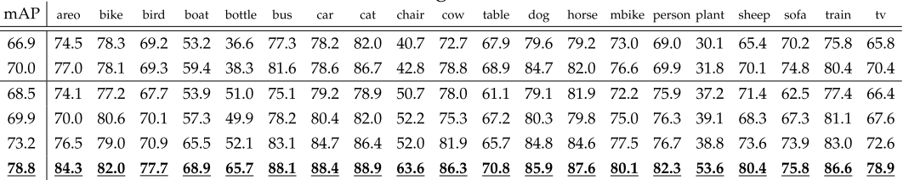

====================
Performance metrics
====================

Object detection의 성능이 좋은지는 어떻게 나타낼 수 있을까? 하나씩 살펴보자.

IoU
====

Object localization으로 찾은 Bounding box가 좋은지 나쁜지는 Intersection Over Union (IoU)를 통해 판단할 수 있다. 아래 그림을 살펴보자.

.. rst-class:: centered

    출처: `Coursera, Convolutional Neural Network <https://www.coursera.org/learn/convolutional-neural-networks>`_

위 그림에서 초록색으로 표현된 부분인 예측한 Bounding box의 영역이고, 노란색으로 색칠된 부분이 정답 Bounding box이다. 이 때 초록 영역 중에서 노란 영역이 차지하는 비율이 바로 IoU이다. 여기서 초록 영역이 두 Bounding box의 합집합 영역이고 노란 영역이 두 Bounding box의 교집합 영역이라서 이 비율이 IoU라고 명명되었다.

보통은 관습적으로 IoU가 0.5 이상인 경우 올바른 Bounding box라고 판단하는데, 더 엄격하게 0.6 또는 0.7을 사용하는 경우도 있다. 정리하면 예측한 Bounding box와 정답 Bounding box가 많이 겹칠수록 IoU가 커지고 그만큼 Object localization 성능이 좋다고 말할 수 있다.

mAP
====

mAP (mean Average Precision)는 Precision의 평균으로 많이 사용하는 지표 중 한가지이다. 이를 계산하기 위해서는 다른 개념을 알아야 하는데 하나씩 살펴보자.

* Precision

    * 주로 예측된 결과가 얼마나 정확한지를 나타내는데 사용이 되며 계산 식은 그림에 나와있는 것과 같이 True Positive(실제 Positive를 Positive로 잘 예측한 경우, 이하 TP)를 TP와 False Positive(실제 Negative를 Positive로 잘못 예측한 경우, 이하 FP)의 합으로 나눠줘서 계산을 하게 됩니다.
    * 즉 Precision을 높이기 위해선 모델이 예측 Box를 신중하게 쳐서 FP를 줄여야 합니다.

* Recall

    * Recall은 Precision과는 다르게 입력으로 Positive를 주었을 때 얼마나 잘 Positive로 예측하는지를 나타내는데 사용이 되며, 계산식은 그림과 같이 TP를 TP와 False Negative(실제 Positive를 Negative로 잘못 예측한 경우, 이하 FN)의 합으로 나눠줘서 계산을 하게 됩니다.
    * 즉 Recall을 높이기 위해선 모델 입장에서는 되도록 Box를 많이 쳐서 정답을 맞혀서 FN을 줄여야 합니다.
    * 그러므로 잘 아시다시피 Precision과 Recall은 반비례 관계를 갖게 되며, 두 값이 모두 높은 모델이 좋은 모델이라 할 수 있습니다.

* AP (Average Precision), mAP (mean Average Precision)

    * 앞서 말씀드린 것처럼 Precision과 Recall은 반비례 관계를 갖기 때문에 Object Detection에서는 Average Precision, 이하 AP 라는 지표를 주로 사용합니다.
    * Average Precision의 계산은 Recall을 0부터 0.1 단위로 증가시켜서 1까지(0, 0.1, 0.2, …, 1) 증가시킬 때 필연적으로 Precision이 감소하는데, 각 단위마다 Precision 값을 계산하여 평균을 내어 계산을 합니다.
    * 즉 11가지의 Recall 값에 따른 Precision 값들의 평균이 AP를 의미하며, 하나의 Class마다 하나의 AP 값을 계산할 수 있습니다.
    * 이렇게 전체 Class에 대해 AP를 계산하여 평균을 낸 값이 바로 저희가 논문에서 자주 보는 mean Average Precision, 이하 mAP 입니다.

Example: Fater R-CNN
*********************

.. rst-class:: centered

    출처: `HOYA012'S RESEARCH BLOG <https://hoya012.github.io/blog/Tutorials-of-Object-Detection-Using-Deep-Learning-how-to-measure-performance-of-object-detection/>`_

위의 그림은 Faster R-CNN 논문에서 결과로 제시한 표를 가져온 것입니다. VOC 데이터셋의 20가지 Class마다 구한 AP 값이 표의 오른쪽 column을 의미하며, 그 값들을 평균 낸 값이 바로 표의 mAP 값입니다. 즉 논문을 쓸 때 mAP 뿐만 아니라 각 Class 마다 AP 값을 제시하기도 하며 Class가 많은 데이터셋(ex, COCO)은 거의 mAP 지표만 제시하는 경우가 많습니다.

FPS
====

보통 논문에서는 주로 정확도에 초점을 둬서 성능을 올리는데, 실제로 사용하는 입장에서는 정확도뿐만 아니라 속도도 굉장히 중요한 issue입니다. 속도를 나타낼 때는 보통 초당 몇 장의 이미지가 처리 가능한지를 나타내는 FPS (Frame Per Second)를 사용합니다.

정확도는 각 방법론마다 비교하기가 수월하지만 속도는 어떤 하드웨어를 사용하였는지에 따라, 혹은 어떤 size의 이미지를 사용하였는지에 따라 수치가 달라지기 때문에 상대적인 비교만 가능하다는 단점이 있습니다. 하지만 정확도만큼이나 중요한 성능 지표이며 최근 논문들에서는 정확도 못지않게 속도에도 집중을 하는 경향이 있습니다.

:h2:`참조`

* `HOYA012'S RESEARCH BLOG <https://hoya012.github.io/blog/Tutorials-of-Object-Detection-Using-Deep-Learning-how-to-measure-performance-of-object-detection/>`_
