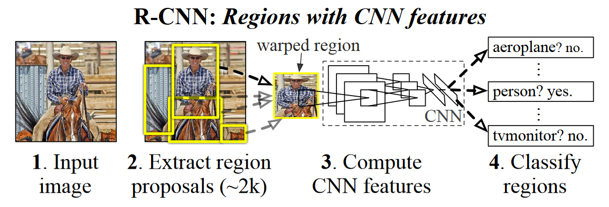
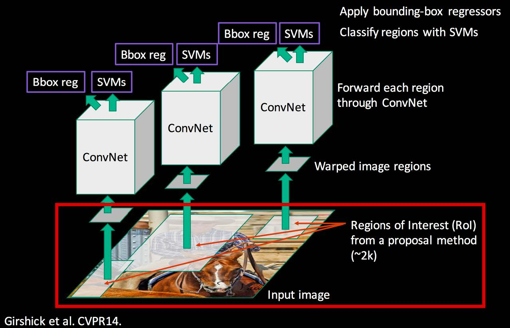
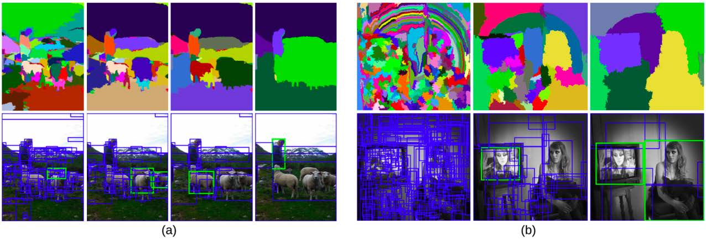
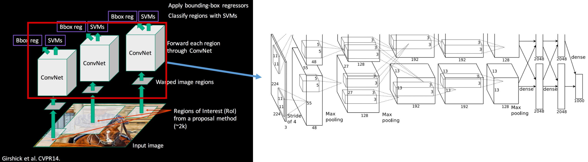
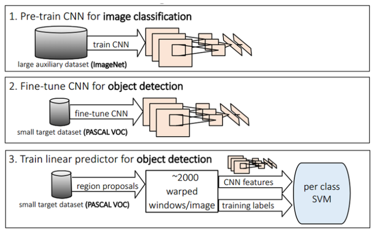
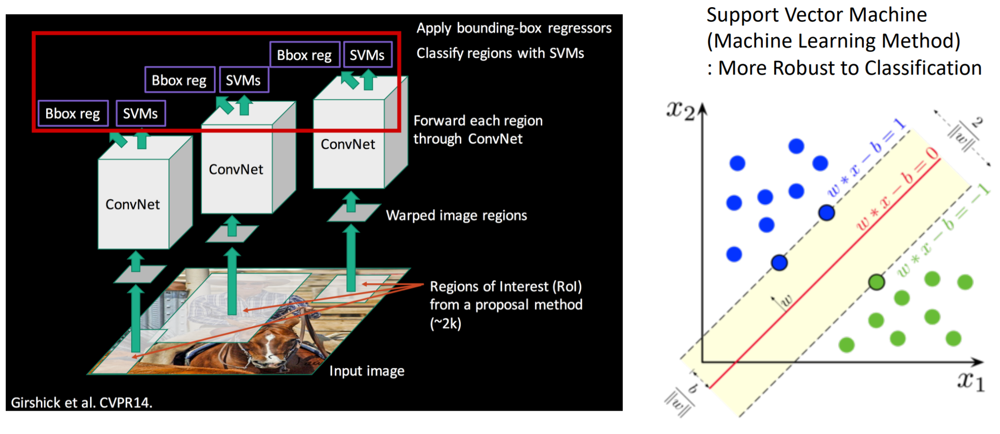
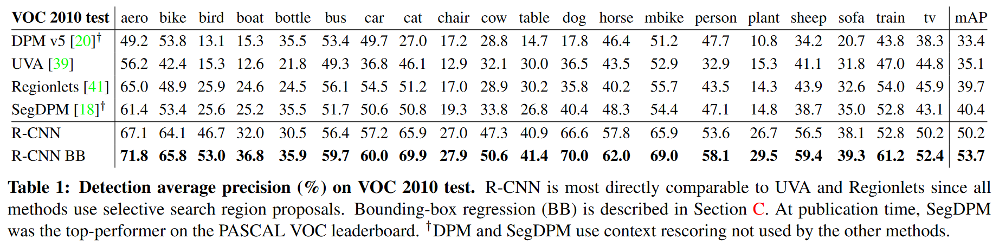
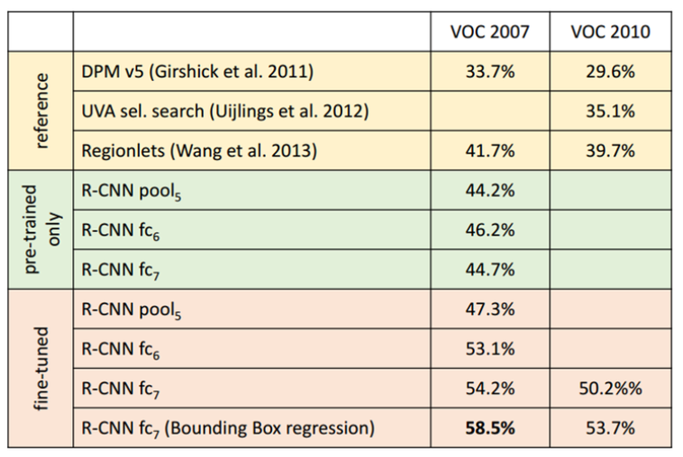
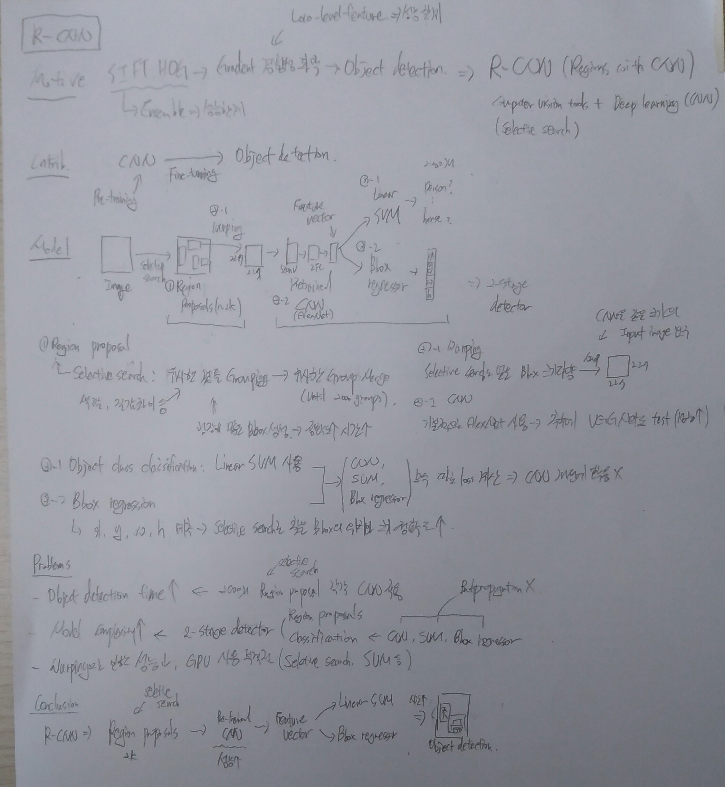

======
R-CNN
======

Introduction
=============

R-CNN이 등장하기 이전에는 Object detection 하는 방법은 SIFT (Scale Invariant Feature Transform)나 HOG (Histogram of Gradient)에 기반한 알고리즘들이 대부분이었다. SIFT나 HOG는 이미지 내 존재하는 Gradient 성분을 일정 Block으로 나누고 그 경향성을 이용하여 Object를 검출하는 방법이다.

하지만 Low-level feature를 기반으로 하기 때문에 성능의 한계가 있었고, 이를 보완하기 위해 여러 알고리즘들을 Ensemble에서 사용했지만 이것도 한계가 있어 Object detection 분야의 성능이 정체되어 있었다. 이 때 당시 Berkeley 연구팀은 DPM (Deformable Part Model)이나 HOG 등을 연구했는데, 2012년 AlexNet에 영향을 받아 CNN을 이용한 Object detection 연구를 진행한 것으로 보인다. 이 때 등장한 모델이 R-CNN이다.

R-CNN (Regions with CNN) 은 2014년 CVPR (Computer Vision and Pattern Recognition)에서 제안된 모델로 Classic한 Computer vision 방법과 Deep learning (CNN) 기법을 결합하여 성능을 높인 방법이다. 그렇다면 R-CNN은 어떤 모델일까? 우선 R-CNN의 Contribution을 먼저 살펴보자.

Contribution
=============

* Pretrained 된 CNN을 Object detection을 위해 Fine-tuning하여 성능을 높임

Materials
==========

Fine-tunning을 위한 데이터는 Ground truth와 0.5 IoU (Intersection over Union) 이상 되는 Region만 Positive sample로 하고 나머지는 Negative sample로 했다. 최종적으로 모든 Class에 대해 32개의 Positive window와 98개의 Background window를 적용하여 총 128개의 Mini batch로 데이터를 구성했다.

(추후 보충 예정)

Moudel design
==============

R-CNN은 Input image로 약 2,000개의 Region proposals를 만들기 위해 Selective search라는 방법을 사용한다. 이렇게 선택된 Region proposals를 224x224 크기로 warping 된 Image가 AlexNet에 입력된 후 Feature vector가 추출된다. 이렇게 추출한 Feature vector는 Linear SVM을 이용하여 어떤 Class인지 판단하고 Bounding box regressor를 이용하여 Bounding box를 찾아낸다.

.. rst-class:: centered

    출처: Rich feature hierarchies for accurate object detection and semantic segmentation

위 그림에서도 볼 수 있듯이 Region proposal을 거치고 Classification을 하기 때문에 R-CNN은 2-stage detector이다. R-CNN은 크게 아래와 같이 3단계로 나눌 수 있다.

* Region proposal

    * Category와 무관하게 Object의 Region을 찾는 모듈

* CNN

    * 각 Region에서 Fixed된 Feature vector 생성

* Classification and regression

    * 추출된 Feature vector를 이용하여 Object의 Class를 Linear SVM으로 분류
    * 추출된 Feature vector를 이용하여 Bounding box의 위치와 크기를 Regression으로 예측

위 과정을 그림으로 표현하면 아래와 같다.

.. rst-class:: centered

    출처: Fast campus, 올인원 패키지: 딥러닝/인공지능

Image가 입력되면 관심있는 영역인 Region of Interest (RoI)를 Proposal하고 이는 Selective search를 이용해서 진행할 수 있다. 그렇게 생성된 Image를 Warping 하여 CNN에 입력하여 Feature vector를 추출한다. 그리고 이를 Linear SVM을 이용해서 Class를 구분하고, Bbox regressor로 Bounding box의 위치를 예측한다.

Selective search
*****************

.. rst-class:: centered

    출처: Fast campus, 올인원 패키지: 딥러닝/인공지능

먼저, 객체와 주변 간의 색감 (Color), 질감 (Texture) 차이, 다른 물체에 에워싸여 있는지 (Enclosed) 등을 파악해서 경향성이 같은 것들끼리 Grouping을 한다. 그리고 유사한 Group끼리 특정 개수의 Group이 나올 때까지 Merge한다. 최종적으로 얻어지는 Group의 Boundary를 따라서 Object에 대한 Bounding box를 추출해낼 수 있고, 이러한 방법이 Selective search 방법이다.

위 그림에서 볼 수 있듯이 Selective search를 통해 굉장히 많은 Bounding box를 만들어내어 정확한 Bounding box를 찾을 수 있다. 하지만 이렇게 많은 Bounding box를 Search 하는데 시간이 오래 걸리는 문제가 있다. 그래서 보통 Detection 보다는 Segmentation에서 많이 쓴다고 한다.

Feature extraction
*******************

--------------
Warping image
--------------

Selective search를 통해서 Bounding box의 후보군을 추출하다 보면 굉장히 다양한 Ratio의 Bounding box가 만들어진다. 하지만 CNN은 동일한 Ratio의 Image를 입력으로 요구하기 때문에, R-CNN은 Warping을 통해 Fixed 된 크기로 Image를 왜곡했다. 이에 따라 이미지의 위치나 비율이 변해 성능을 떨어뜨리는 요인이 된다.

----
CNN
----

Warping을 통해 Fixed 된 이미지들은 CNN을 통해 Feature extraction을 하게 된다. 그리고 이 때 CNN은 AlexNet을 사용했다.

.. rst-class:: centered

    출처: Fast campus, 올인원 패키지: 딥러닝/인공지능

Object detection을 위한 PASCAL VOC는 ILSVRC에 비해 데이터 수가 적었기 때문에, 먼저 CNN을 ILSVRC의 ImageNet 데이터를 이용하여 Pre-training 시켰다. 그리고 나서 Object detection을 위한 Dataset인 PASCAL VOC을 이용하여 Fine-tunning 시키는데, 이 때 Dataset의 Class가 총 20개이기 때문에 AlexNet의 마지막 FC layer의 Neuron 수를 1000개에서 20개로 변경하여 Fine-tuning한다 (Softmax + Log loss).

.. rst-class:: centered

    출처: `라온피플 (Laon People), GoogLeNet [6] <https://blog.naver.com/laonple/220731472214>`_

그리고 나서 마지막 이전의 FC layer의 Feature를 Disk에 모두 Dumping 한고, 다시 읽어와서 Linear SVM (Hinge loss)과 Bounding box regressor (Neural network, Squared loss)를 학습시킨다. 따라서 SVM과 Bounding box regression 학습 시 CNN까지 Backpropagation을 할 수 없기 때문에 학습 결과가 CNN에 반영되지 않는 문제점이 있다. 추가로 Linear SVM의 성능을 개선하기 위해 Hard negative mining 방법을 적용시켰다고 한다.

Classification and regression
******************************

---------------
Classification
---------------

CNN에서 추출된 Feature vector를 Linaer SVM을 이용하여 Class를 분류했다. :strike:`이 때 SVM을 사용한 이유는 R-CNN이 나올 당시 Overfitting에 대응하는 전략이 부족했고 (예: Regularizaion, Dropout 등), 머신러닝 방법이 Overfitting을 줄이고 General한 방법이라고 인식했기 때문이라고 한다.` 그에 따라 CNN 학습과 SVM 학습이 별도 작업이 되어 통합적으로 학습시킬 수 없는 문제가 있다.

.. rst-class:: centered

    출처: Fast campus, 올인원 패키지: 딥러닝/인공지능

-------------------------
Bounding box regression
-------------------------

Selective search로 찾은 Bounding box는 정확하지 않을 수 있기 때문에 더 정확하게 Object를 감쌀 수 있게 사용하는 것이 Bounding box regression이다. Bounding box regression은 Neural network로 구성되어 있고 이를 진행하면 아래와 같은 결과를 얻게 된다.

.. rst-class:: centered

    :math:`{(P^i, G^i)}_{i=1, \cdots, N},\ where\ P^i = (P^i_x, P^i_y, P^i_w, P^i_h)`

여기서 :math:`x,\ y,\ w,\ h` 는 각각 Bounding box의 중심점 (:math:`x,\ y`), Width, Height에 해당한다. 그리고 :math:`P` 는 선택된 Bounding box이고, :math:`G` 는 Ground truth인 실제 Bounding box를 의미한다. 따라서 예측한 Bounding box 정보와 Ground truth의 Bounding box 정보의 차가 최소한이 되도록 학습된다.

.. rst-class:: centered

    :math:`\hat{G_x} = P_w d_x(P) + P_x\ ↔\ G_x = P_w t_x + P_x`

    :math:`\hat{G_y} = P_h d_y(P) + P_y\ ↔\ G_y = P_h t_y + P_y`

    :math:`\hat{G_w} = P_w exp(d_w(P))\ ↔\ G_w = P_w exp(d_w(P))`

    :math:`\hat{G_h} = P_h exp(d_h(P))\ ↔\ G_h = P_h exp(d_h(P))`

조금 더 자세히 살펴보면, 예측한 Bounding box 정보인 :math:`P` 를 적절히 변경하여 만든 :math:`\hat{G}` 과 Ground turth인 :math:`G` 의 차를 최소화하는, 즉 :math:`d` 와 :math:`t` 의 차를 최소화시키는 :math:`d` 들을 찾아내는 것이 Bounding box regression의 목표다. 여기에서 :math:`d_{\mathbf{*}}(P) = \mathbf{w_*}^T \phi_5(P)`, :math:`where\ \mathbf{*}\ is\ one\ of\ x,\ y,\ w,\ h` 는 :math:`pool_5` 의 Feature를 이용하여 값을 추출하는 함수이다. 그리고 위 식에서도 알 수 있듯이 :math:`x,\ y` 값 보다는 Width와 Height 값이 더 많이 조절될 수 있게 만들었다.

학습할 때 사용하는 Loss function은 아래와 같고, 조금 더 자세한 내용은 추후에 보충할 예정이다.

.. figure:: ../img/od/r-cnn/bbox_regressor_in_r-cnn.png
    :align: center
    :scale: 40%

.. rst-class:: centered

    출처: Fast campus, 올인원 패키지: 딥러닝/인공지능

Results
========

R-CNN과 다른 Object detection 방법의 성능을 비교해보면 다음과 같고, 성능이 크게 개선되는 것을 확인할 수 있다.

.. rst-class:: centered

    출처: Rich feature hierarchies for accurate object detection and semantic segmentation

.. rst-class:: centered

    출처: `라온피플 (Laon People), GoogLeNet [6] <https://blog.naver.com/laonple/220731472214>`_

Problems
=========

* Object detection 시간이 오래 걸림

    * Selective search로 추출한 약 2,000개의 Region proposal들에 대해 각각 CNN과 SVM, Regression 작업을 해야되기 때문에 시간이 오래 걸림
    
    * Training
    
        * 모듈이 다 따로 학습됨

            * Fine-tune CNN with softmax: Log loss
            * Linear SVM: Hinge loss
            * Bbox regressor: Least square

        * 84 hours

        * 많은 Disk 공간을 필요로함 (Feature를 모두 Disk에 저장했음)
    
    * Test time
    
        * 하나의 Image에 수천 개의 Forward propagation을 해야해서 오래 걸림
        * GPU K40: 13s per image
        * CPU: 53s per image

* 모델이 복잡함

    * 2-stage detector이고, CNN, SVM, Bbox regressor 모델 필요
    * 위 3개 모델이 모두 분리되어 학습되는 Loss가 연결되어 있지 않은데 한꺼번에 다뤄야 해서 복잡함
    * Backpropagation 안됨 → SVM, Bbox regressor에서 학습한 결과를 CNN에 반영할 수 없음

* Warping으로 인한 성능 저하

    * Pre-trained 된 AlexNet에 입력되는 이미지의 크기를 wrapping이나 crop을 통해 강제로 224x224로 맞춤
    * 이미지 변형 또는 손실로 성능 저하 발생 가능성 존재

* GPU 사용에 부적절

    * Selective search, SVM tunning 등이 GPU를 사용하기 적절하지 않음

Conclusion
===========

R-CNN은 Selective search를 통해 Region proposal로 Object 위치의 후보군 정보를 추출하고, 이를 Pre-train 된 CNN을 이용하여 Feature vector를 추출한 뒤, Linear SVM을 통해 Class를 예측하거나 Bounding box regressor를 통해 Bounding box의 위치를 예측했다. Pre-train된 CNN을 Domain-speicific한 데이터로 Fine-tunning하는 방법으로 Object detection 성능을 많이 향상시켰다.

하지만 여전히 실행 시간이 긴 문제점이 있다. 이러한 문제를 해결하기 위해서 나온 것이 SPPNet (Spatial Pyramid Pooling in Deep Convolutional Neural Network for Visual Recognition)이고 다음 페이지에서 다룰 예정이다.

Q&A
====

* RoI가 Rectangle일 이유가 있는지 여부

    * Non-region인 것들을 감싸는게 어려움
    * Segmentation에서 Rectangle이 아닌 RoI를 얻을 수 있음

* Regression으로 예측된 Offset이 항상 RoI 안에 존재하는지 여부

    * 그렇지 않음
    * 예를 들어 사람에 대한 Region proposal이 머리를 제외한 Region으로 선택된 경우, Offset을 통해 Bbox를 약간 위로 이동시킬 수 있음
    * 그래서 최종적인 Bbox가 RoI 밖에 있을 수 있음

* 실제 Object와 매칭되지 않는 RoI가 많은 경우 문제 여부

    * Background class가 따로 있고, 이를 이용하여 RoI가 Object가 아니라고 예측함
    * Regression 할 때 Background class의 경우 Penalty를 준다고 함
    * 관련 내용 보충 필요

Abstract
=========

:h2:`참조`

* `라온피플 (Laon People), GoogLeNet [6] <https://blog.naver.com/laonple/220731472214>`_
* Rich feature hierarchies for accurate object detection and semantic segmentation, Girshick et al., 2014
* Fast campus, 올인원 패키지: 딥러닝/인공지능
