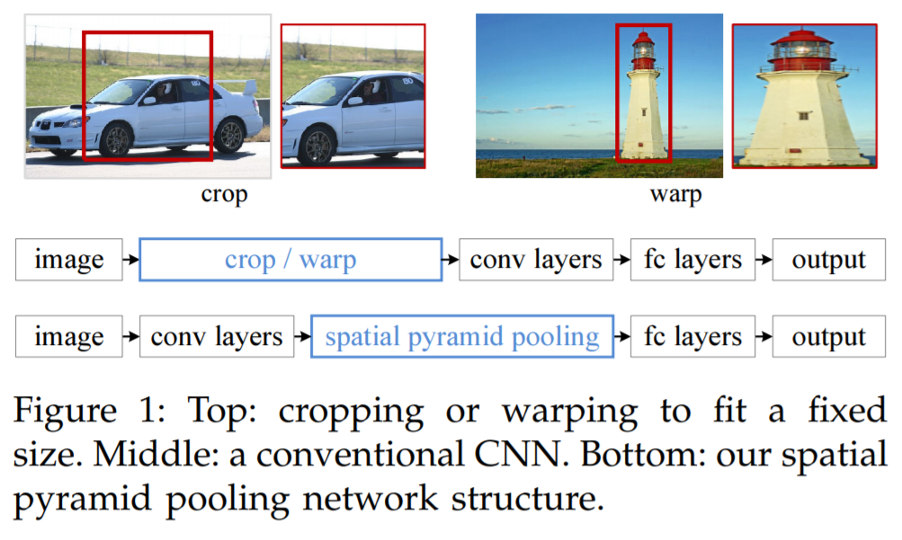
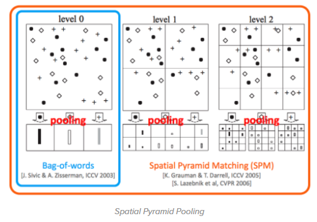
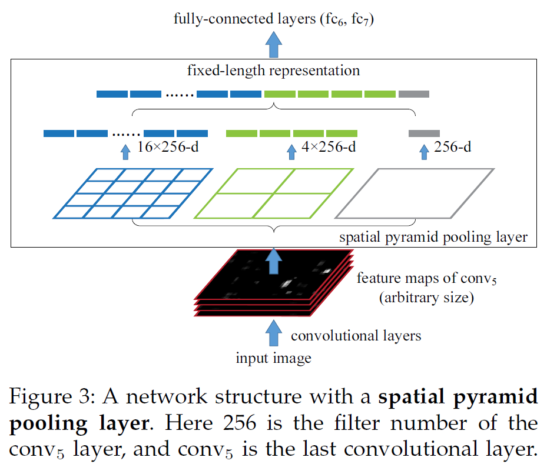
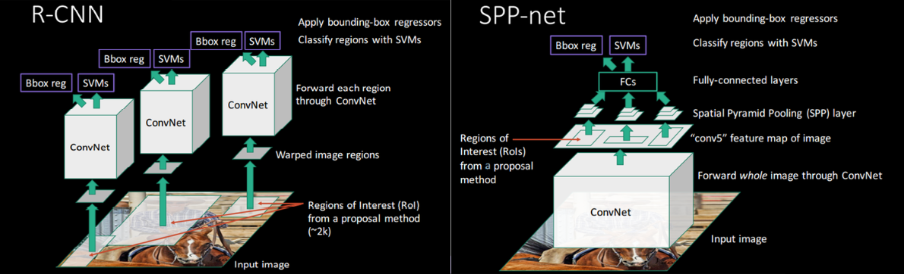

=======
SPPNet
=======

Problem of R-CNN
=================

R-CNN은 Pre-train된 CNN을 사용하여 성능을 개선했지만, 아래와 같은 문제점을 가지고 있다.

* Image를 Warping과 crop 하는 과정으로 인한 정보 손실
* Train, test 시 시간과 공간 비용이 너무 많이 듦 (Selective search로 2,000개의 Region proposal 추출 & 각 Region proposal에 대해 CNN, SVM, Regression을 적용)
* Selective search나 SVM이 GPU 사용에 적합하지 않음

이러한 문제점을 해결하기 위해 나온 것이 SPPNet (Spatial Pyramid Pooling in Deep Convolutional Networks for Visual Recognition)이다. 그렇다면 SPPNet의 가장 큰 Contribution은 무엇일까?

Contribution
==============

* Spatial pyramid pooling을 통해 Warping 시 생기는 성능 문제 개선

Spatial pyramid pooling
========================

기존 R-CNN에서 CNN 입력으로 Region proposal을 넣기 위해 Warping을 하게 되는데 이 때 아래 그림처럼 정보 (예: 위치)가 상실될 수 있다 (Crop도 마찬가지). 이 때, Warping 하는 이유는 CNN에 고정된 크기의 입력이 필요하기 때문이다.

.. rst-class:: centered

    출처: Spatial Pyramid Pooling in Deep Convolutional Networks for Visual Recognition

그래서 Conv. layer 다음에 Spatial pyramid pooling을 적용하여 같은 크기의 Feature map을 생성하여, 크기 조정을 위해 Image에 바로 Crop이나 Warping 하는 작업을 대체한다. 아래 그림은 그 구체적인 내용이다.

.. rst-class:: centered

    출처: `adioshun.gitbooks.io <https://adioshun.gitbooks.io/semantic-segmentation/ref02pooling-c5d0-b300-d55c-ace0-cc30.html>`_

다양한 크기의 입력으로부터 일정한 크기의 feature를 추출해 낼 수 있는 방법 중 Bag-of-words (BoW)라는 방법이 있다. 하지만 BoW는 이미지가 지닌 특징들의 위치 정보를 모두 잃어버린다는 단점이 있다. 그래서 이를 보완하기 위해 Spatial Pyramid Pooling은 이미지를 여러 개의 일정 개수의 지역으로 나눈 뒤 각 지역에 BoW를 적용하여, 지역적인 정보를 어느 정도 유지할 수 있게 된다.

.. rst-class:: centered

    출처: Spatial Pyramid Pooling in Deep Convolutional Networks for Visual Recognition

조금 더 자세한 내용은 추후 보충할 예정이다.

R-CNN vs. SPPNet
=================

두 모델의 가장 큰 차이점은 CNN의 Input이다. 아래 그림처럼 R-CNN은 Region proposal을 CNN의 Input으로 사용했는데, SPPNet은 Image 전체를 CNN의 Input으로 사용했다.

.. rst-class:: centered

    출처: `hwkim94.github.io, Fast R CNN(2015) <https://github.com/hwkim94/hwkim94.github.io/wiki/Fast-R-CNN(2015)>`_

Pros and cons
==============

* R-CNN에 비해 Train은 3배, Test는 10 ~ 100배 빨라졌다고 함
* R-CNN과 Spatail pyramid pooling 이외의 구조는 같아 학습 단계가 여러 번 적용되어야 하고 대용량 저장 공간 필요

:h2:`참조`

* Spatial Pyramid Pooling in Deep Convolutional Networks for Visual Recognition, Kaming He et al., 2015
* `라온피플 (Laon People), GoogLeNet [6] <https://blog.naver.com/laonple/220731472214>`_
* `YouTube, 양우식 - Fast R-CNN & Faster R-CNN <https://youtu.be/Jo32zrxr6l8>`_
* `Lunit Tech Blog, R-CNNs Tutorial <https://blog.lunit.io/2017/06/01/r-cnns-tutorial/>`_
