=====
YOLO
=====

Introduction
=============

사람은 어떤 이미지를 봤을 때 Object의 특징을 한눈에 파악할 수 있다. 하지만 Deformable Parts Models (DPM)이나 R-CNN based methods 등과 같은 기존 방법들은 잠재적 Bounding box들에 대해 Classifier로 추려내는 방식이기 때문에 문제가 많다. 예를 들면  DPM의 Sliding window detection 방법은 다음 그림과 같이 정확한 Bounding box를 찾는데 어려움이 있다. 또한, R-CNN based 방법들은 Object detction 하는 과정이 복잡해 (Complex pipeline) 시간이 오래 걸린다.

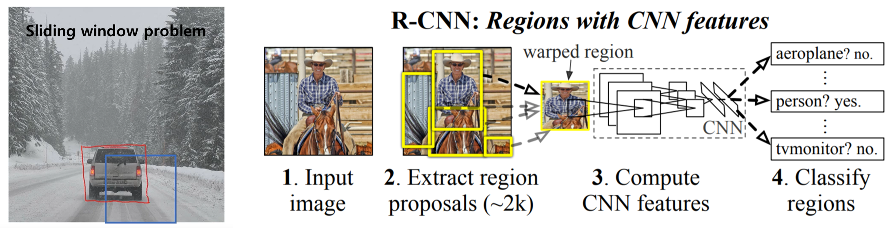

.. rst-class:: centered

    출처: `Coursera, Convolutional Neural Network <https://www.coursera.org/learn/convolutional-neural-networks>`_

이러한 문제를 해결하기 위해 만들어진 것이 YOLO (You Only Look Once)다. YOLO는 아래 그림처럼 Resize한 이미지를 ConvNet을 이용해 Object를 감지하는 방법이다. 이는 기존 Object detection 방법들보다 그 과정이 단순하여 Bounding box를 그리는 속도가 더 빠르면서 정확성을 유지하는 방법이다.

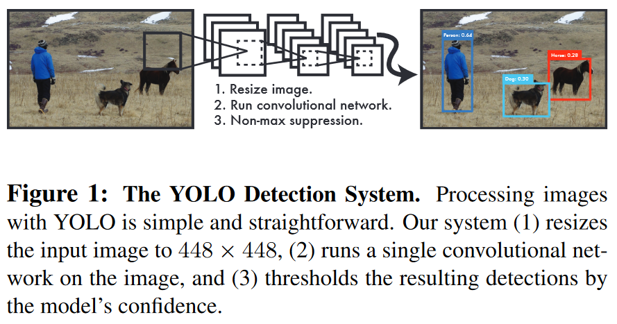

.. rst-class:: centered

    출처: You Only Look Once: Unified, Real-Time Object Detection

그렇다면 YOLO의 주요 Contribution은 무엇일까?

Contribution
=============

* Localization + Classification problem → Regression problem (Bounding box 위치와 Class probability 예측)

* Only one feedforward using whole image → Global context

* Unified detection → Fast → Real-time detection

* Generalizable representation → Other domain works (예: Art works)

지금부터 하나씩 살펴보자.

Unified detection
==================

YOLO는 이미지를 Grid로 나누고 각 Grid에 대해 Bounding box의 위치와 그 확률 그리고 어떤 Class에 해당하는지 확률 정보를 예측해서 Bounding box를 찾아내는 방법이다. 예를 들어 아래 그림처럼 9개의 영역으로 나누고 각 영역에 대해 8가지 정보 (Object 중심점, Object 가로/세로 길이 등)를 예측하도록 모델을 만들면, Object가 있는 경우 정확한 위치를 알아낼 수 있다.

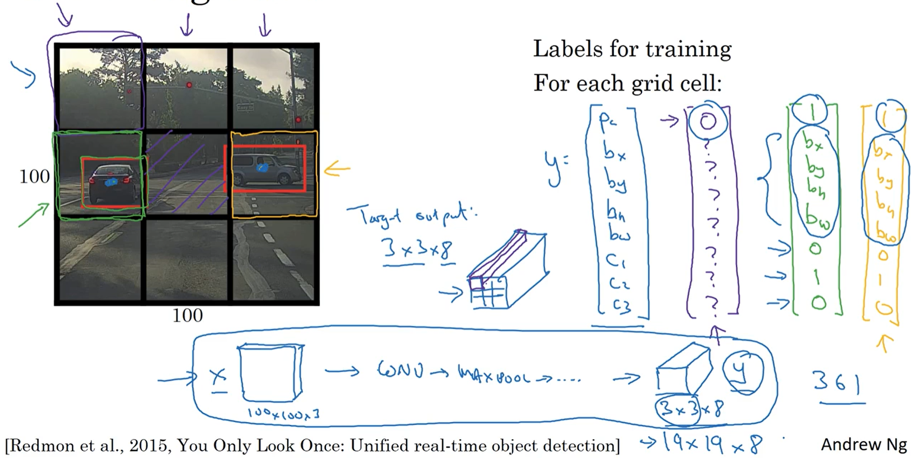

.. rst-class:: centered

    출처: `Coursera, Convolutional Neural Network <https://www.coursera.org/learn/convolutional-neural-networks>`_, You Only Look Once: Unified, Real-Time Object Detection

조금 더 일반화하여 단계별로 표현하면 다음과 같고, YOLO는 S = 7, B = 2, C = 20으로 사용하여 최종 Output은 크기가 7x7x30 Tensor가 된다.

* Image → S x S grids

* Each Grid cell

    * B: Bounding box location and confidence score
        
        * :math:`x,\ y,\ w,\ h` 는 Bounding box의 위치
        * Confidence score는 해당 Bounding box가 Object를 얼마나 많이 포함하고 있는지 정도
        * :math:`Confidence = Pr(Object) \times IOU_{pred}^{truth}`
        * 아래 그림에서 Confidence score가 높은 Bounding box는 더 진하게 표기됨

    * C: Class probabilities

        * 특정 Object에 대해 각 Class가 얼마나 나타날 수 있는지 확률
        * :math:`Pr(Class_i | Object)`
        * 아래 그림에서 각 Object 별 나타날 확률이 높은 것을 Class probability map으로 표현함

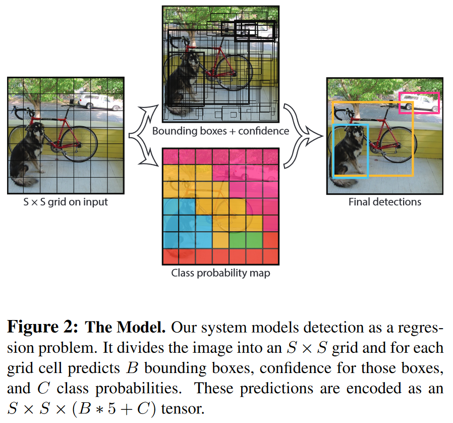

.. rst-class:: centered

    출처: You Only Look Once: Unified, Real-Time Object Detection

또한, 예측할 때는 하나의 Grid에 Class들에 대한 확률을 예측하여 각 Class에 대한 Confidence score를 계산할 수 있다. 이를 기반으로 Bounding box가 어떤 Class의 Bounding box인지 알아낼 수 있다. 그 수식은 아래와 같다.

.. rst-class:: centered

    :math:`Pr(Class_i|Object) \times Pr(Object) \times IOU_{pred}^{truth} = Pr(Class_i) \times IOU_{pred}^{truth}`

Network design
===============

YOLO는 GoogLeNet을 약간 변형하여 사용했다고 한다.

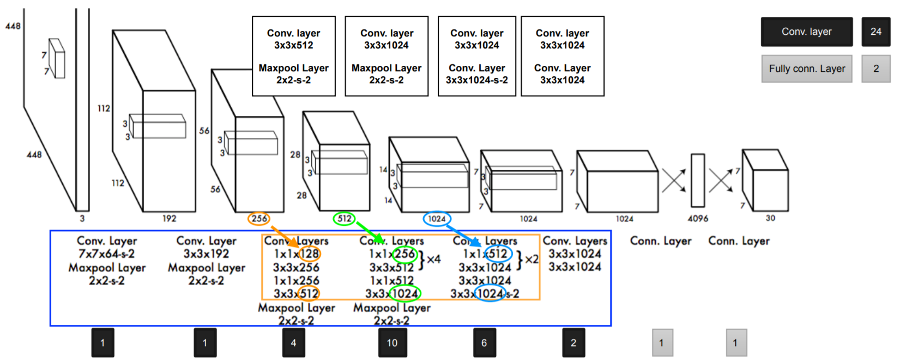

.. rst-class:: centered

    출처: `YouTube, PR-016: YOLO <https://youtu.be/eTDcoeqj1_w>`_

위 그림에서 볼 수 있듯이 1x1 Conv. layer로 이전 Layer보다 Channel 수를 줄여 Parameter 수를 줄였다. 초반 20개의 Conv. layer는 GoogLeNet의 구조를 반영했고, 그 뒤에 4개의 Conv. layer와 FC layer를 사용하고 있다. 하지만 위 그림으로 완전히 이해가 되지 않아 직접 그려봤다.

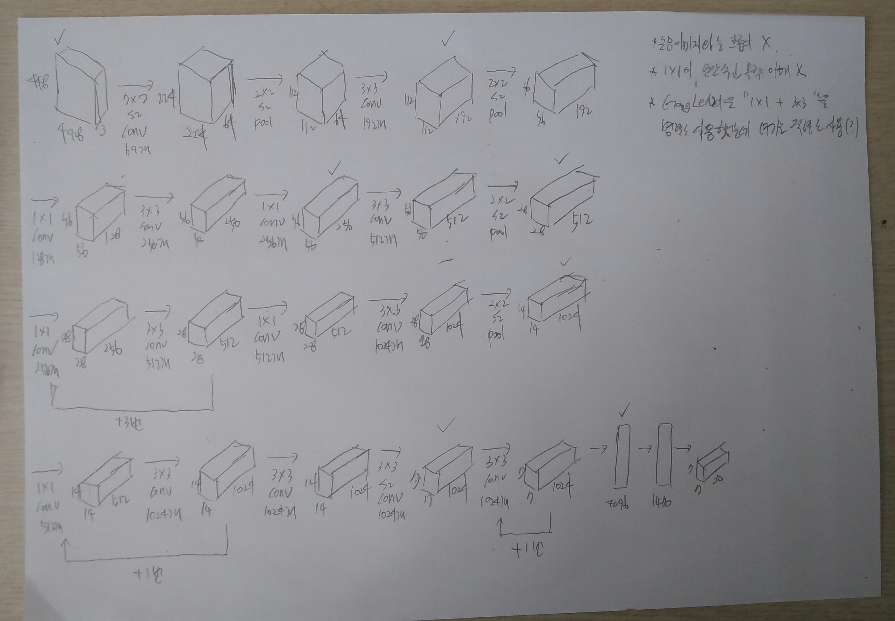

하지만 아직 논문에서 제공한 중간 결과 (?)에 해당하는 Layer들이 직접 그린 Layer들과 완전히 Mapping 되지 않는다. 또한, GoogLeNet처럼 여러 개의 Conv. layer를 병렬로 연결한 것이 아니라 직렬로 연결되어 있다. 더 자세한 차이점들은 다시 확인하고 정리할 예정이다.

다음은 YOLO의 속도를 더 높이기 위해 24개의 Conv. layer를 9개로 줄인 Fast YOLO (YOLO-Tiny)의 구조다.

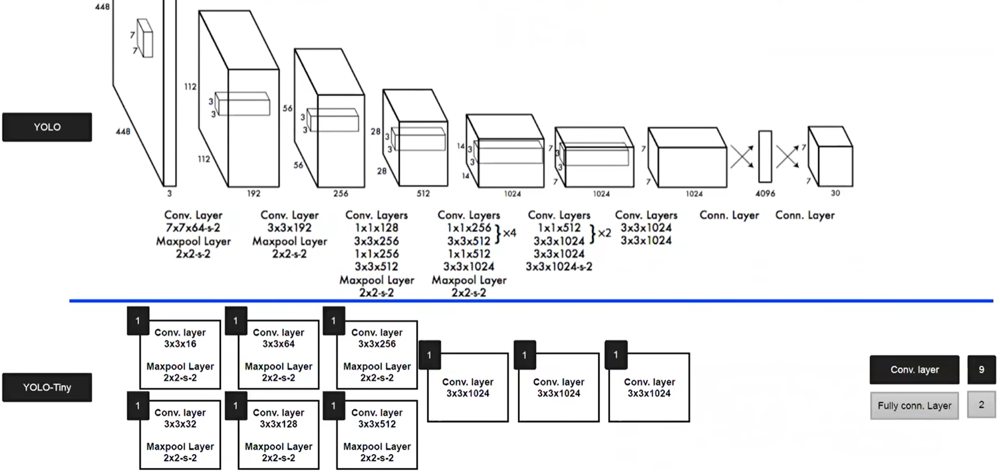

.. rst-class:: centered

    출처: `YouTube, PR-016: YOLO <https://youtu.be/eTDcoeqj1_w>`_

위 그림에서도 볼 수 있듯이 중간에 있는 1x1 Conv. layer와 일부 3x3 Conv. layer를 삭제했지만 Max pooling은 그대로 사용하고 있다.

Training
=========

지금까지 설명한 YOLO가 어떻게 학습되는지 알아보자. 우선 앞에 있는 20개의 Conv. layer는 ImageNet 1000-class competition dataset을 활용하여 pretraining 해서 사용한다. 이렇게 Pretraining된 Layer 뒤에 4개의 Conv. layer와 2개의 FC layer를 추가한 뒤, VOC dataset으로 Fine tuning 한다. 그리고 Input은 기존처럼 224x224 Image를 사용하는 것이 아니라 Resolution을 높인 448x448 Image를 사용하면서 조금 더 세밀한 정보도 파악하려고 했다.

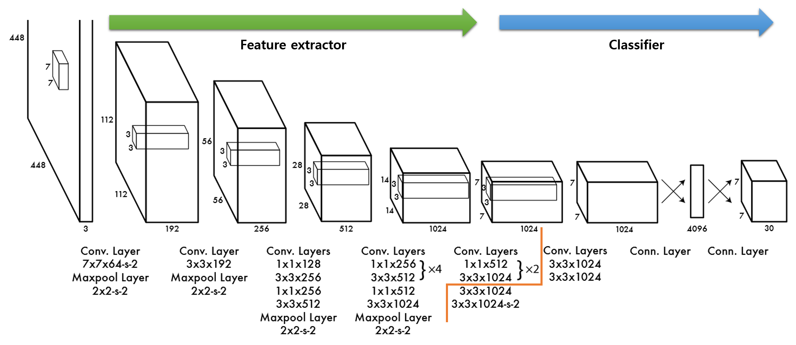

.. rst-class:: centered

    출처: You Only Look Once: Unified, Real-Time Object Detection

위 그림을 조금 더 간소화해서 표현하면 아래 그림과 같다.

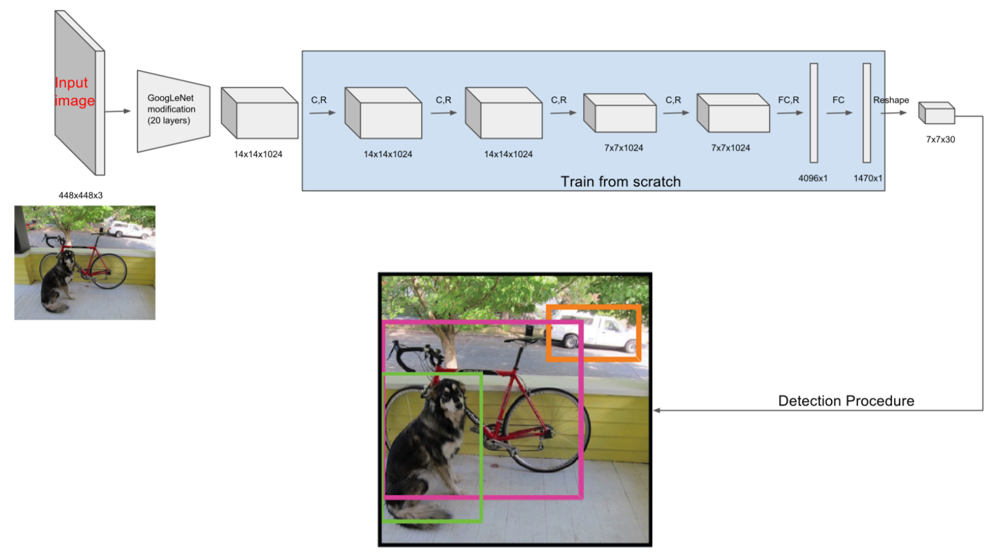

.. rst-class:: centered

    출처: `YouTube, PR-016: YOLO <https://youtu.be/eTDcoeqj1_w>`_

448x448 Image는 수정된 GoogLeNet 모델의 20개 Layer들을 거쳐 Feature map이 나온다. 여기에 4개의 Conv. layer와 2개의 FC layer를 거쳐 최종적으로 7x7x30인 Tensor를 얻을 수 있고, 이것이 Object detection에 활용된다. 우선 간단한 예제를 통해 이해해보자.

먼저 보행자 (Pedestrian), 차 (Car), 오토바이 (Motocycle)을 구분하는 YOLO 모델을 학습시킨다고 가정해보자. 또한, 2개의 Anchor box를 가지고 세로로 긴 Bounding box와 가로로 긴 Bounding box 각각을 첫 번째, 두 번째 Anchor box라고 해보자.

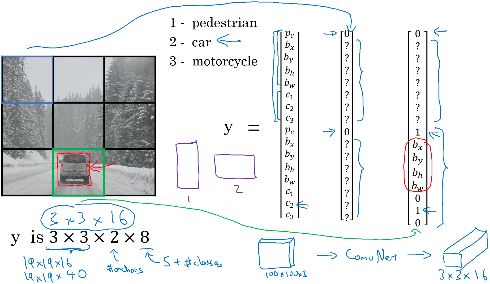

.. rst-class:: centered

    출처: `Coursera, Convolutional Neural Network <https://www.coursera.org/learn/convolutional-neural-networks>`_

첫 번째 Grid에는 Object가 존재하지 않기 때문에 Label y의 두 Anchor box 모두 :math:`p_c` 값이 0으로 할당된다. 차가 있는 8번째 Grid의 Object는 가로로 조금 더 길기 때문에 Anchor box 2와의 IoU가 더 크게 나오고 Anchor box 2로 할당된다. 그래서 위 그림 우측처럼 Label y의 Anchor box 1 부분에는 :math:`p_c` 값이 0이고, Anchor box 2 부분의 :math:`p_c` 값은 1이고 나머지 Object 위치 정보 (Object 중심점, Bounding box 가로/세로 길이)와 Class 정보가 할당된 것을 볼 수 있다.

이번에는 실제 YOLO에서 어떻게 Training 되는지 하나씩 상세하게 살펴보자.

.. figure:: ../img/od/yolo/training_yolo_detail.png
    :align: center
    :scale: 70%

.. rst-class:: centered

    출처: `Deep Systems, YOLO <https://docs.google.com/presentation/d/1aeRvtKG21KHdD5lg6Hgyhx5rPq_ZOsGjG5rJ1HP7BbA>`_

하나의 Grid cell에서 하나의 Class에 대한 하나의 Object에 대해 2개의 Bounding box 중 어떤 것이 더 나은지 판단하는 구조로 만들어졌다. :math:`x` 와 :math:`y` 는 Bounding box의 중심점이고, :math:`w` 와 :math:`h` 는 Bounding box의 가로, 세로 길이다. 그리고 :math:`c` 는 이 Bounding box 내에 Object가 있을 확률을 의미한다.

Loss function
**************

(추후 작성 예정)

Prediction
===========

학습된 모델을 이용하여 입력으로 이미지를 넣으면 Object에 해당하는 Bounding box를 그릴 수 있다. 먼저 간단한 예시로 이해해보자.

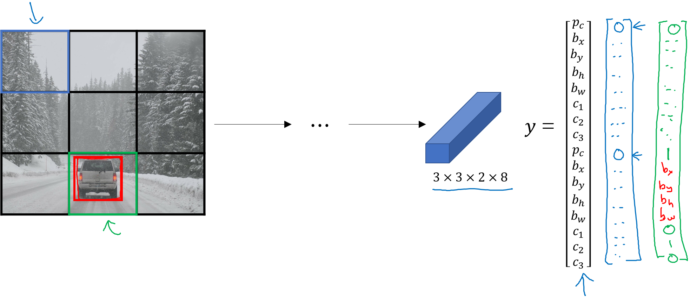

.. rst-class:: centered

    출처: `Coursera, Convolutional Neural Network <https://www.coursera.org/learn/convolutional-neural-networks>`_

첫 번째 Grid를 먼저 예측해보면 파란 Vector처럼 :math:`p_c` 값이 0으로 나와 Object 없다고 판단할 수 있다. 이번에는 차가 있는 Grid를 예측했을 때 Bounding box 정보가 초록 Vector처럼 :math:`p_c = 1` 로 나오고 나머지 :math:`b_x,\ b_y,\ b_h,\ b_w` 값들과 Class에 대한 확률값이 나온다. 이를 통해 Object에 대한 Bounding box를 그릴 수 있다. 그렇다면 실제 YOLO에서는 어떻게 Bounding box를 그릴 수 있을까? 지금부터 살펴보자.

.. figure:: ../img/od/yolo/training_yolo_detail.png
    :align: center
    :scale: 70%

.. rst-class:: centered

    출처: `Deep Systems, YOLO <https://docs.google.com/presentation/d/1aeRvtKG21KHdD5lg6Hgyhx5rPq_ZOsGjG5rJ1HP7BbA>`_

이미지를 학습된 모델에 입력하면 7x7x30 크기의 Tensor가 결과로 나온다. 그 중 하나의 Vector만 살펴보자. 처음 5개는 첫 번째 Bounding box에 대한 정보이고, 다음 5개는 두 번째 Bounding box에 대한 정보다. 그리고 그 다음 20개는 현재 Grid에 해당하는 Object가 어떤 Class인지 그 정도를 확률로 나타낸 값들이다.

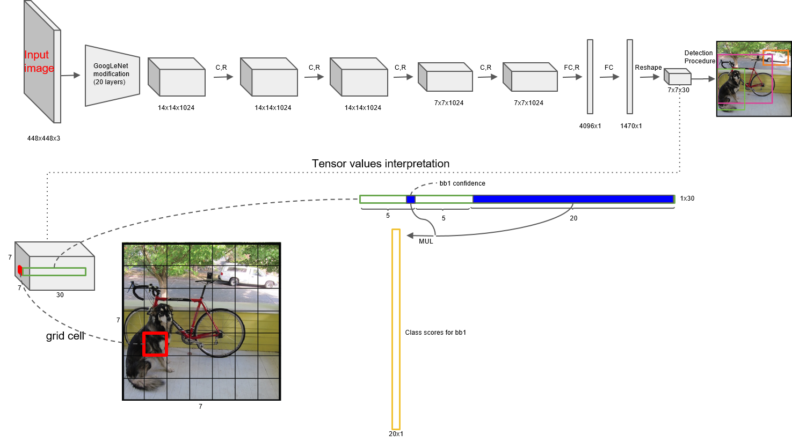

.. rst-class:: centered

    출처: `Deep Systems, YOLO <https://docs.google.com/presentation/d/1aeRvtKG21KHdD5lg6Hgyhx5rPq_ZOsGjG5rJ1HP7BbA>`_

모든 Grid에 대해 각 Grid에서 각 Bounding box의 Conference score와 Class probability 20개를 곱하면 20x1 크기 Vector를 98개 얻을 수 있다. 여기서 곱한 값의 의미는 각 Grid에서 하나의 Bounding box에 특정 Class의 Object가 나타날 확률을 의미한다.

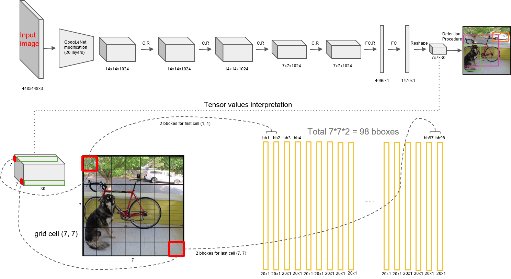

.. rst-class:: centered

    출처: `Deep Systems, YOLO <https://docs.google.com/presentation/d/1aeRvtKG21KHdD5lg6Hgyhx5rPq_ZOsGjG5rJ1HP7BbA>`_

이렇게 추출한 98개의 20차원 Vector를 이용하여 최종 Object의 위치를 나타낼 Bounding box를 선별하게 된다. 그 과정에 대해 조금 더 자세히 살펴보자.

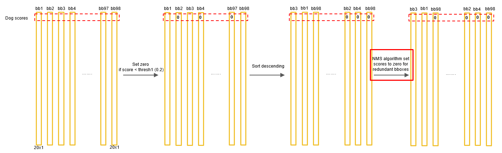

.. rst-class:: centered

    출처: `Deep Systems, YOLO <https://docs.google.com/presentation/d/1aeRvtKG21KHdD5lg6Hgyhx5rPq_ZOsGjG5rJ1HP7BbA>`_

위 그림에서 98개의 Vector에 첫 번째 차원의 값들은 모두 하나의 Class에 해당하는 Bounding box에 대한 정보다. 이 중에서 값이 0.2보다 작은 경우에는 모두 값을 0으로 변경한다. 그리고 나서 현재 Class의 Object를 가장 잘 감지한 Bounding box 순으로 내림차순 정렬한다. 그리고 Non-max suppresion을 적용하여 중복되는 Bounding box의 값을 0으로 변경한다. 그렇다면 Non-max suppresion은 어떻게 적용될까?

Non-max suppresion
*******************

YOLO에서 Non-max suppresion을 적용한 이유는 하나의 Object가 여러 개의 Grid에서 감지될 수 있어 이를 해결하기 위함이다. 먼저 간단한 예제를 통해 Non-max suppresion이 어떻게 적용되는지 살펴보자.

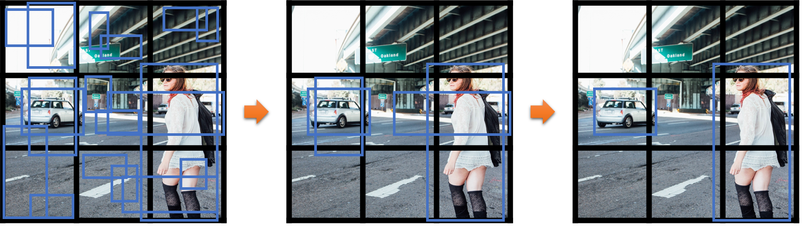

.. rst-class:: centered

    출처: `Coursera, Convolutional Neural Network <https://www.coursera.org/learn/convolutional-neural-networks>`_

각 Grid 마다 2개의 Bounding box를 예측했다. 이 중에서 먼저 확률값이 낮은 것을 먼저 제거한다. 그리고 나서 각 Class의 Bounding box 중 나타날 값이 가장 큰 값과 많이 겹치는 Bounding box를 모두 제거한다. 이것이 Non-max suppresion이고 위 예제에서는 Class가 3개이므로 Non-max suppresion을 3번 실시한다. 그 결과 위 우측 끝에 있는 그림처럼 확률이 높은 Bounding box가 차와 사람을 감지할 수 있다.

위 과정이 실제 YOLO에서 어떻게 진행되는지 조금 더 상세히 살펴보자.

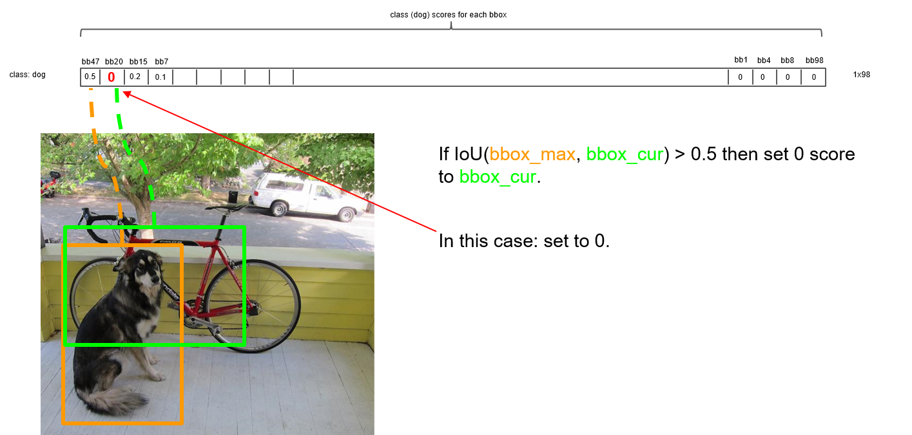

.. rst-class:: centered

    출처: `Deep Systems, YOLO <https://docs.google.com/presentation/d/1aeRvtKG21KHdD5lg6Hgyhx5rPq_ZOsGjG5rJ1HP7BbA>`_

위 그림처럼 가장 가능성이 높은 Bounding box가 가장 왼쪽에 위치하게 된다. 그리고 다음 Bounding box를 확인하면서 가장 값이 높은 Bounding box와 IOU값이 0.5를 초과하는 경우 그 값을 모두 0으로 바꾼다. 이 과정을 모든 Bounding box에 대해 실시하면 중복되는 Bounding box의 값을 모두 0으로 만들 수 있다.

그리고 나서 아래 그림처럼 각 Bounding box에 대해 가장 큰 Score를 찾고 존재하는 경우의 Bounding box만 추출해낸다. 그리고나서 최종적으로 남은 Bounding box들만 그리면 Object detection이 끝난다.

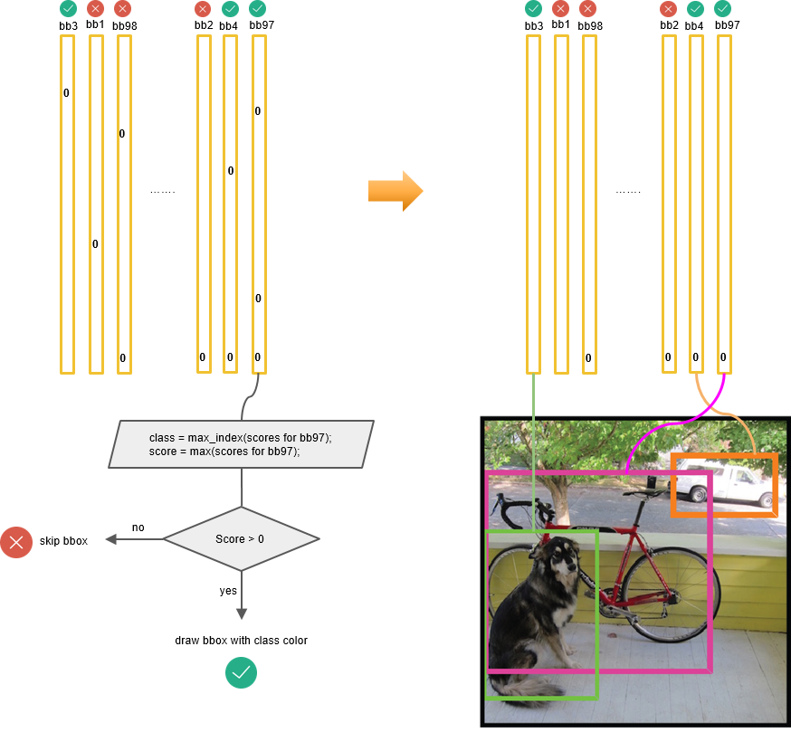

.. rst-class:: centered

    출처: `Deep Systems, YOLO <https://docs.google.com/presentation/d/1aeRvtKG21KHdD5lg6Hgyhx5rPq_ZOsGjG5rJ1HP7BbA>`_

Pros and cons
==============

Advantage
**********
 
지금까지 언급한 YOLO의 장점은 다음과 같다.

* Object의 중앙점과 Bounding box의 가로/세로 길이를 예측하여 정확한 Bounding box의 좌표를 얻을 수 있다는 점

* :strike:`FC layer 대신에 Convolutional layer를 사용`

    * :strike:`한 번에 전체 Object를 판별하여 Computational cost를 줄인 점 (FC layer 사용 → ConvNet을 여러 번 반복하며 Object 분류함)`
    * :strike:`속도가 빠름 → 실시간 Object detection 가능`
    
Problems
*********

YOLO는 위와 같은 장점을 가지고 있지만 한계가 있다. 그 문제점은 다음과 같다.

* Grid라는 공간적인 제약을 두고 Bounding box를 예측하고 있기 때문에 가까이 있는 Object들을 감지할 수 있는 수가 제한되어 있음

    * 특히 그룹으로 여러 개의 작은 Object가 나타나는 경우 문제가 됨
    * 예: 새 떼 (Flock of birds)

* 일정한 크기의 Bounding box만 예측하다보니, 새로운 Ratio의 Bounding box에 대해 예측을 잘 못함

* Pooling layer를 많이 사용하여 Downsampling이 많다보니 Feature의 질이 다소 떨어짐 (Coarse features)

* 하나의 Grid에 여러 개의 Object가 있는 경우 문제가 있음

    * 공통

        * Output 크기를 3x3에서 19x19로 더 늘리면 하나의 Grid에 여러 개의 Object가 올 확률을 낮출 수 있음

    * Class가 같은 경우

        * 하나의 Grid에서 2개의 Bounding box를 감지할 수 있게 만들어 약간 해결함

    * Class가 다른 경우

        * 각 Grid에서 각 Object에 대한 Class probability를 이용함
        * 특정 Grid에서는 특정 Class의 Object가 높게 나옴을 반영해 약간 해결함

* 하나의 Object가 여러 개의 Grid에서 감지되는 경우

    * Non-max suppression으로 조금 해결
    
* :strike:`하나의 Object가 여러 개의 Grid에 걸쳐 표현되는 경우 → 전체 중 하나의 Grid만 선택되는 문제점`

* :strike:`Loss fucntion 관련 Bounding box에 대한 Localization error가 발생한다고 함`

:strike:`그 외에 유의할 점은 Object의 중앙점은 0과 1사이의 값인데, Bounding box의 Height와 Width는 1보다 더 클 수 있다는 점이다.`

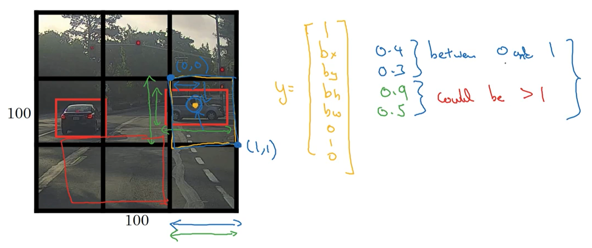

.. rst-class:: centered

    출처: `Coursera, Convolutional Neural Network <https://www.coursera.org/learn/convolutional-neural-networks>`_

:strike:`그 이유는 중앙점이 0과 1사이인 이유는 YOLO는 하나의 Grid에는 하나의 Object만 포함할 수 있기 때문에, 각 Grid에서 중앙점은 0과 1사이의 값을 가질 수 밖에 없다. 만약 1보다 크면 그 Object는 다른 Grid에 소속된 Object라고 볼 수 있다. 그리고 Bounding box가 1 이상일 수 있는 이유는 Bounding box가 여러 Grid에 걸쳐서 표현될 수 있기 때문이다.`

Reulsts
========

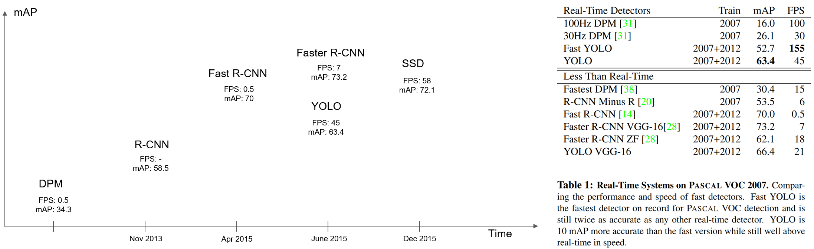

.. rst-class:: centered

    출처: You Only Look Once: Unified, Real-Time Object Detection

YOLO는 속도 개선에 초점을 맞춰 정확도는 다소 떨어지지만 Real-time detection이 가능하다. 다른 Object detection 논문과 비교해도 속도가 빠름을 알 수 있다. 그리고 YOLO는 논문 저자인 Redmon이 TED에서 Webcam을 이용하여 강연장의 Object를 직접 감지하는 시연을 한 적이 있다.

.. raw:: html

    

        <iframe width="560" height="315" src="https://www.youtube.com/embed/Cgxsv1riJhI"
        frameborder="0" allow="accelerometer; encrypted-media; gyroscope; picture-in-picture" allowfullscreen></iframe>
    

또한, Background error를 많이 개선했고, 속도에 비해 성능이 떨어지는 문제를 Fast R-CNN과 Combined 해서 극복한 결과를 볼 수 있다. 조금 더 자세한 내용은 추후 정리할 예정이다.

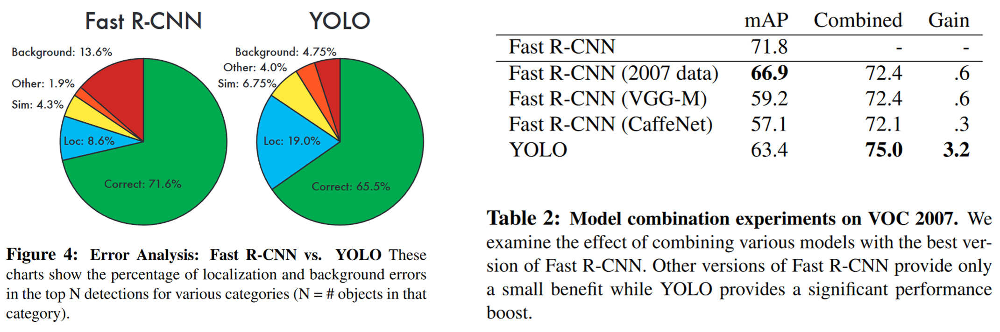

.. rst-class:: centered

    출처: You Only Look Once: Unified, Real-Time Object Detection

논문 작성 당시의 VOC 2012 Leaderboard에서도 Fast R-CNN과 결합한 YOLO가 상당히 괜찮은 결과를 보여주고 있다.

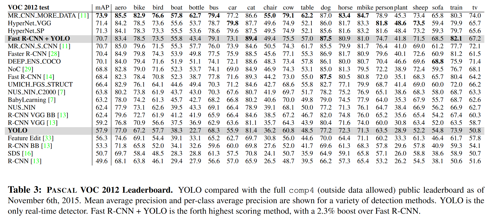

.. rst-class:: centered

    출처: You Only Look Once: Unified, Real-Time Object Detection

마지막으로 학습되지 않은 Domain (예: Picasso, People-Art Dataset)에서도 Object detection이 어느 정도 진행되는 것을 볼 수 있고, 기존 다른 Object detection 모델보다 F1-measure가 높은 것을 볼 수 있다.

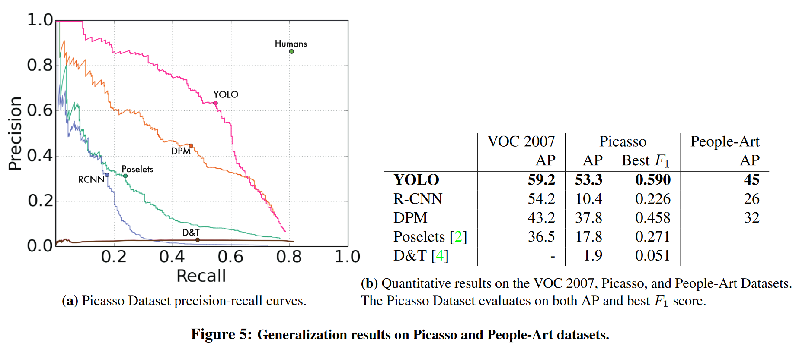

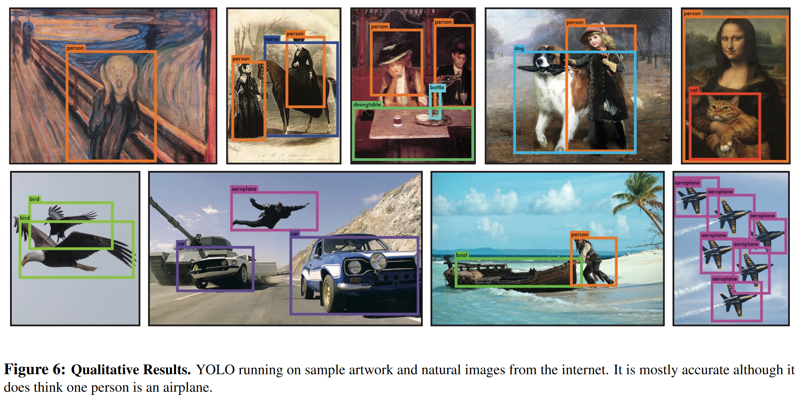

.. rst-class:: centered

    출처: You Only Look Once: Unified, Real-Time Object Detection

Conclusion
===========

YOLO는 Object detection 속도가 빨라 (YOLO: 45fps, Fast-YOLO: 155fps) Real time detection이 가능하지만 상대적으로 정확도가 떨어진다. 그래서 이를 개선한 Fast R-CNN과 결합하여 성능을 높였다. 그리고 다른 Domain에서도 잘 동작하는 General한 representation을 가지고 있다. 하지만 여전히 성능 개선이 필요하므로 다음에는 이를 개선한 YOLO V2에 대해 알아보려고 한다.

:h2:`참조`

* `Coursera, Convolutional Neural Network <https://www.coursera.org/learn/convolutional-neural-networks>`_
* You Only Look Once_Unified, Real-Time Object Detection, Redmon et al., 2016
* `YouTube, PR-016: YOLO <https://youtu.be/eTDcoeqj1_w>`_
* `Deep Systems, YOLO <https://docs.google.com/presentation/d/1aeRvtKG21KHdD5lg6Hgyhx5rPq_ZOsGjG5rJ1HP7BbA>`_
