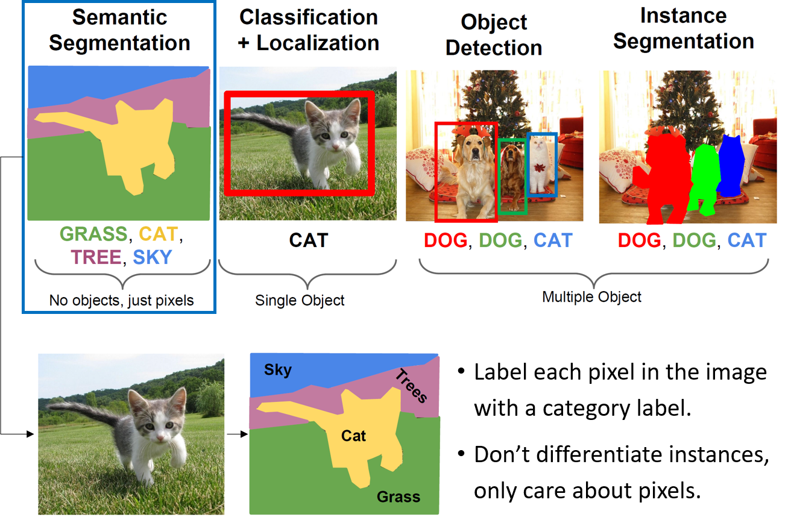
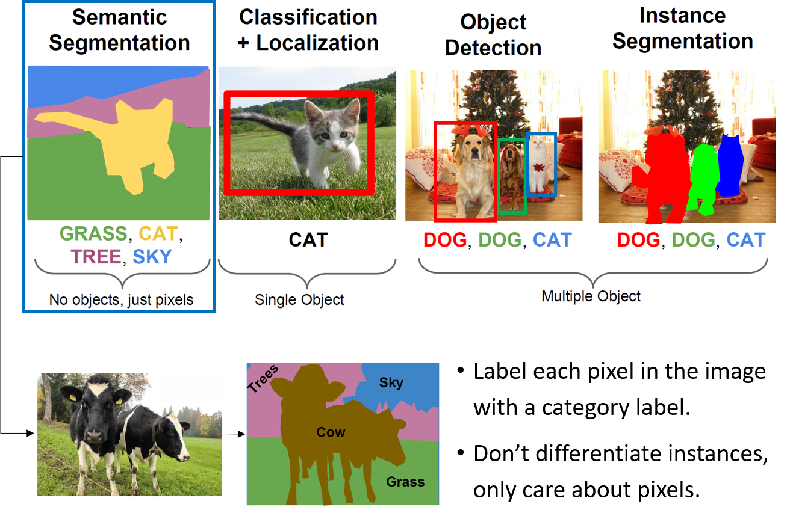
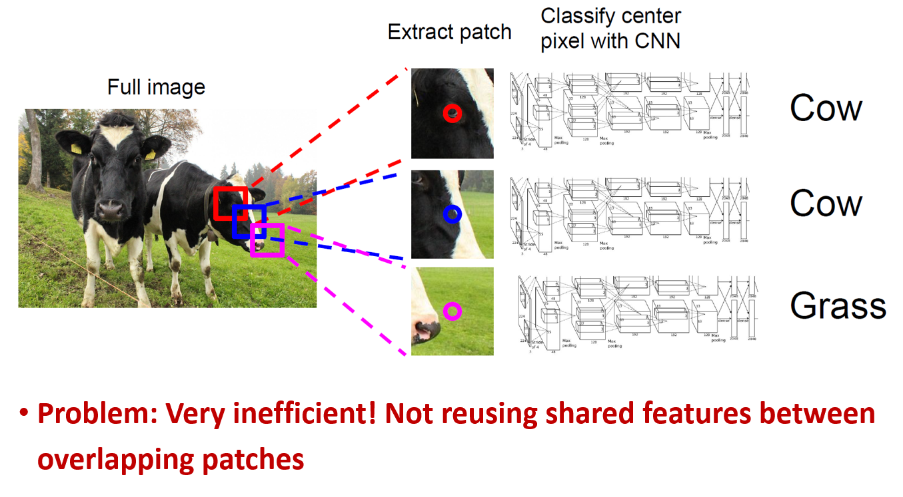
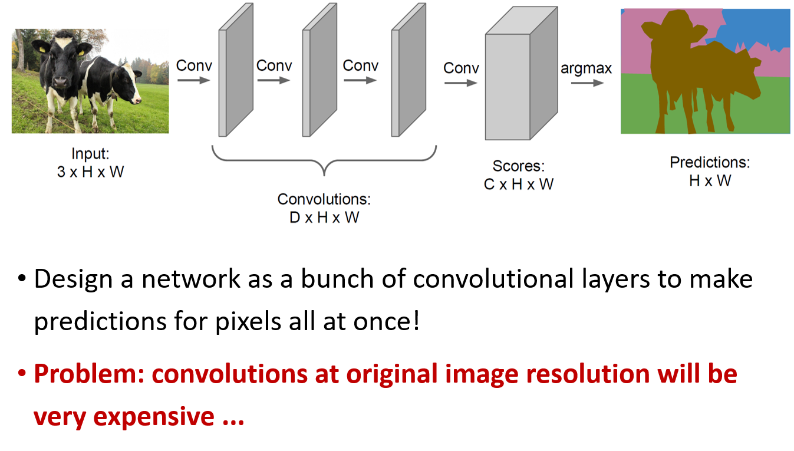
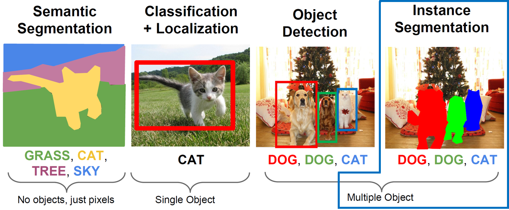
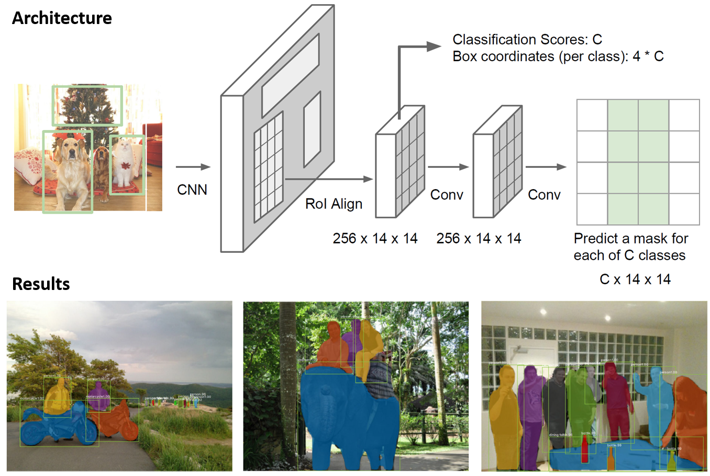

=============
Segmentation
=============

Semantic segmentation
======================

Sliding window
***************

Fully convolutional
********************

    

Instance segmentation
======================

    
Mask R-CNN
***********

조사해야 할 자료들
==================

* Laon People (`Link <https://blog.naver.com/laonple/220873446440>`_)

* Wikipedia (`Link <https://en.wikipedia.org/wiki/Image_segmentation#Other_methods>`_)

* Common

    * Semantic vs. Instance (`Link <https://www.analyticsvidhya.com/blog/2019/04/introduction-image-segmentation-techniques-python/>`_)
    * Image Segmentation in Deep Learning: Methods and Applications (`Link <https://missinglink.ai/guides/computer-vision/image-segmentation-deep-learning-methods-applications/>`_)

* Semantic segmentation

    * CNN을 활용한 주요 Model - (4) : Semantic Segmentation (`Link <https://reniew.github.io/18/>`_)
    * 1편: Semantic Segmentation 첫걸음! (`Link <https://medium.com/hyunjulie/1%ED%8E%B8-semantic-segmentation-%EC%B2%AB%EA%B1%B8%EC%9D%8C-4180367ec9cb>`_)
    * Deep Semantic Segmentation of Natural and Medical Images: A Review (`Link <https://arxiv.org/pdf/1910.07655.pdf>`_)
    * Recente progress in semantic image segmentation (`Link <https://link.springer.com/article/10.1007/s10462-018-9641-3>`_)
    * A review of semantic segmentation using deep neural networks (`Link <https://link.springer.com/article/10.1007/s13735-017-0141-z>`_)
    * An overview of semantic image segmentation (`Link <https://www.jeremyjordan.me/semantic-segmentation/>`_)
    * A Survey of Semantic Segmentation (`Link <https://arxiv.org/pdf/1602.06541.pdf>`_)
    * Methods and datasets on semantic segmentation: A review (`Link <https://www.sciencedirect.com/science/article/pii/S0925231218304077>`_)
    * A Review of Computer Vision Segmentation Algorithms (`Link <https://courses.cs.washington.edu/courses/cse576/12sp/notes/remote.pdf>`_)

    * Image Segmentation Using Computational Intelligence Techniques: Review (`Link <Image Segmentation Using Computational Intelligence Techniques: Review>`_)

* Medium

    * Common

        * Image Classification vs. Object Detection vs. Image Segmentation (`Link <https://medium.com/analytics-vidhya/image-classification-vs-object-detection-vs-image-segmentation-f36db85fe81>`_)

    * Semantic segmentation

        * Semantic Segmentation with Deep Learning (`Link <https://towardsdatascience.com/semantic-segmentation-with-deep-learning-a-guide-and-code-e52fc8958823>`_)
        * A Simple Guide to Semantic Segmentation (`Link <https://medium.com/beyondminds/a-simple-guide-to-semantic-segmentation-effcf83e7e54>`_)
        * Review of Deep Learning Algorithms for Image Semantic Segmentation (`Link <https://medium.com/@arthur_ouaknine/review-of-deep-learning-algorithms-for-image-semantic-segmentation-509a600f7b57>`_)
        * A 2019 Guide to Semantic Segmentation (`Link <https://heartbeat.fritz.ai/a-2019-guide-to-semantic-segmentation-ca8242f5a7fc>`_)

* Application

    * TensorFlow (`Link <https://www.tensorflow.org/tutorials/images/segmentation>`_)

* Othres

    * Segmentation for Object-Based Image Analysis (OBIA): A review of algorithms and challenges from remote sensing perspective (`Link <https://www.sciencedirect.com/science/article/pii/S0924271619300425>`_)
    * Object Co-segmentation (`Link <https://en.wikipedia.org/wiki/Object_Co-segmentation>`_)
    * R-CNN, Fast R-CNN, Faster R-CNN, YOLO — Object Detection Algorithms (`Link <https://towardsdatascience.com/r-cnn-fast-r-cnn-faster-r-cnn-yolo-object-detection-algorithms-36d53571365e>`_)
    * Region Proposal Network — A detailed view (`Link <https://towardsdatascience.com/region-proposal-network-a-detailed-view-1305c7875853>`_)

:h2:`참조`

* `YouTube, Lecture 11 | Detection and Segmentation <https://youtu.be/nDPWywWRIRo>`_
* `Lecture slides for cs231n (Lecture 11), <http://cs231n.stanford.edu/slides/2017/cs231n_2017_lecture11.pdf>`_
