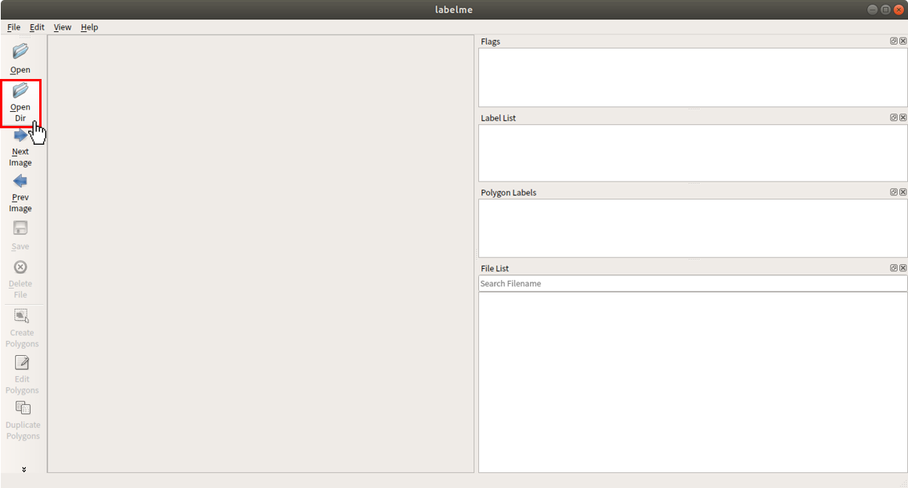
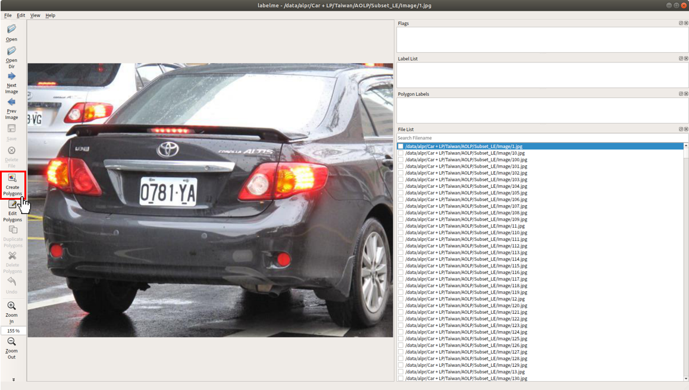
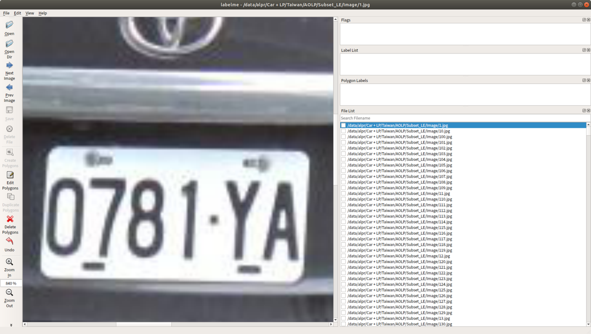
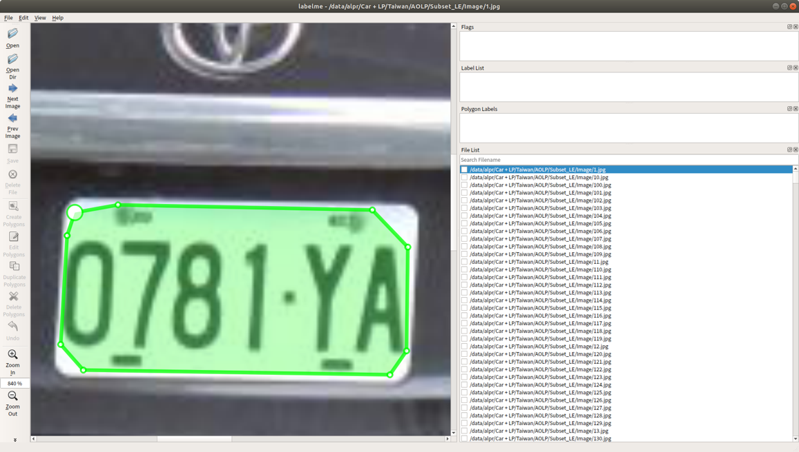
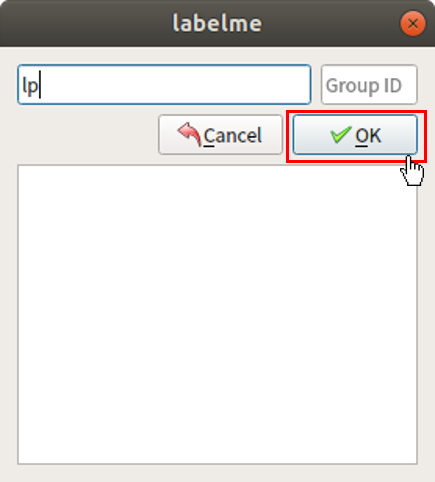
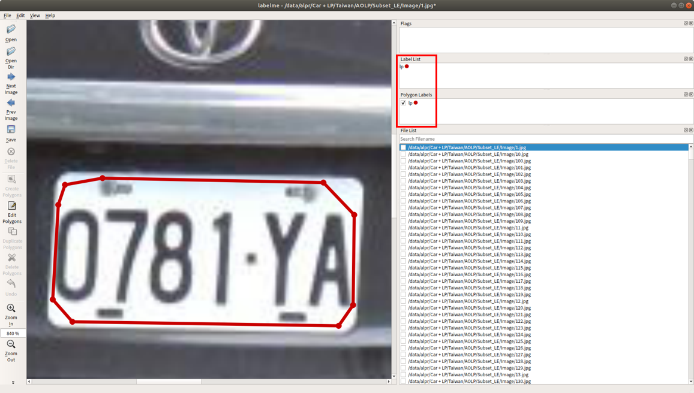
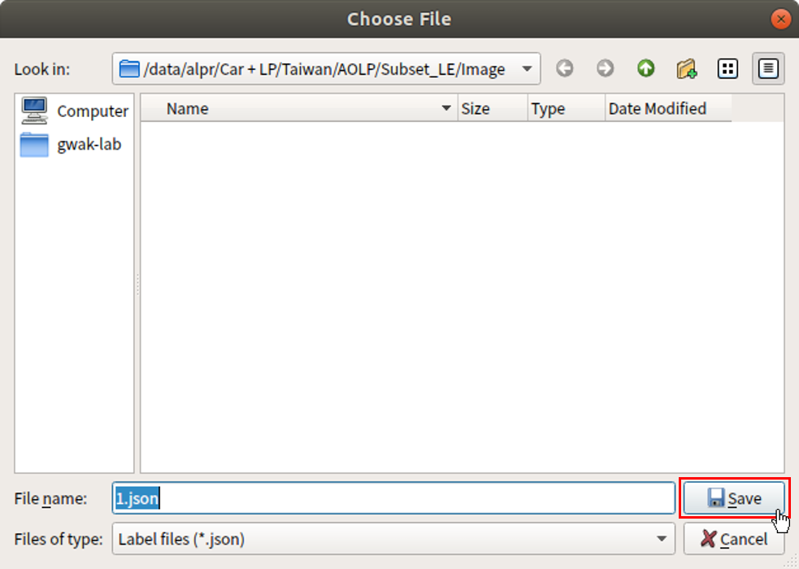
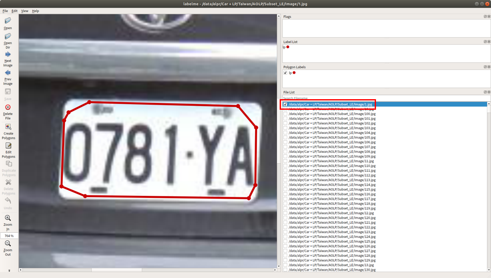

======
Tools
======

여기에서는 Computer vision 관련 연구 시 필요한 Tool에 대해 살펴보려고 한다.

labelme
========

Labelme is a graphical image annotation tool inspired by http://labelme.csail.mit.edu. It is written in Python and uses Qt for its graphical interface.

Installation
*************

You can install labelme to execute 3 commands on the terminal. After that, you can use labelme if you enter labelme on the terminal.

.. code::

    conda create --name=labelme python=3.6
    source activate labelme
    pip install labelme

    labelme

Usage
******

labelme를 실행시키면 아래와 같은 화면이 나온다. 좌측 메뉴의 Open Dir이라는 아이콘을 클릭하여 Annotation 할 폴더를 선택한다.

폴더를 선택한 후 Choose 버튼을 클릭한다.

.. figure:: ../img/tools/labelme_02.png

Annotation 할 이미지들이 로드되는 것을 확인할 수 있고, 좌측 메뉴의 Create Polygons 아이콘을 클릭하여 Annotation을 시작한다.

이미지 스크롤로 화면을 확대하여 Annotation 하기 편하게 만든다.

좌상단 모서리부터 한땀한땀 (?) Annotation을 하고, 시작점과 연결시킨다.

연결이 완료되면 아래와 같은 창이 뜨고, 입력창에 lp라고 입력한 후 OK 버튼을 클릭한다 (여기서 lp는 해당 Annotation의 ID임).

그러면 우측 상단에서 현재 Annotation의 ID가 설정된 것을 확인할 수 있다.

이제 만든 Annotation을 저장하면 되는데, 단축키 :code:`Ctrl + S` 를 이용하면 된다. 아래와 같은 창이 뜨면 바로 Save 버튼을 클릭하면 된다.

저장이 완료되면 우측 하단의 File list의 이미지 경로명 왼쪽에 체크 표시가 된다. 이는 이미지에 Annotation 한 결과가 잘 저장된 것을 의미한다.

:h3:`Reference`

* `GitHub, wkentaro/labelme <https://github.com/wkentaro/labelme>`_

imgaug
=======

This python library helps you with augmenting images for your machine learning projects. It converts a set of input images into a new, much larger set of slightly altered images.

You can see details in `GitHub, aleju/imgaug <https://github.com/aleju/imgaug>`_.
