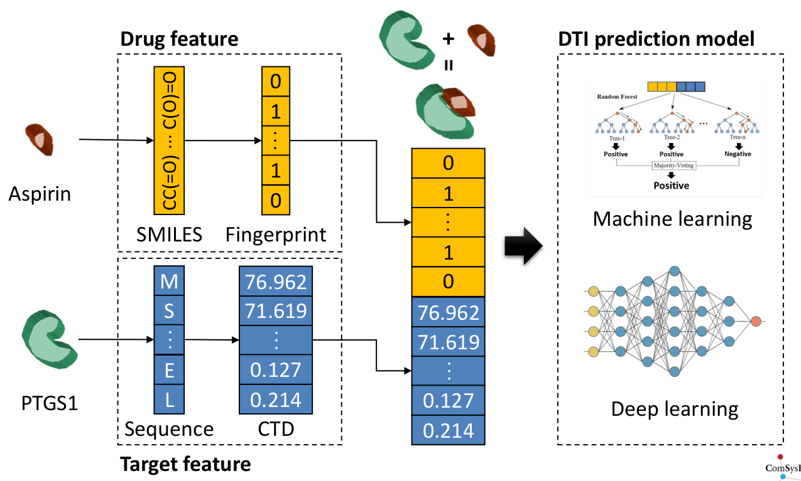

============
DeepCombDTI
============

DeepCombDTI is a model for **drug-target interaction prediction** using deep learning and various `molecular fingerprints <#molecular-fingerprint>`_. Drugs can be represented by a molecular fingerprint like :doc:`ECFP <ecfp>` and Protein can be represented a feature vector like CTD.

Overview
=========

.. figure:: img/deepcombdti/deepcombdti_overview.png
  :align: center
  :scale: 50%

Dataset
=======

.. figure:: img/deepcombdti/dataset.png
  :align: center
  :scale: 50%

Features
========

Molecular fingerprint
**********************

Molecular fingerprint는 약물을 표현하는 Feature이고, 예로는 ECFP, Mol2vec, Neural fingerprint, Seq2seq fingerprint 등이 있다.

.. toctree::
    :maxdepth: 1

    ecfp
    mol2vec
    neural_fp
    seq2seq_fp
    maccs
    pubchem_fp
    daylight_fp

Protvec
********

.. toctree::
    :maxdepth: 1

    protvec

Code
=====

DeepCombDTI is implemented in GitHub and this is a `link <https://github.com/hwkim89/DeepCombDTI>`_.

