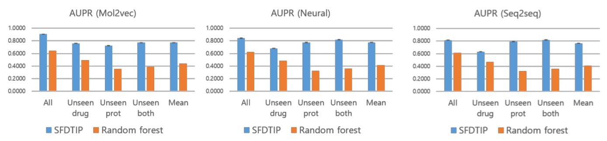
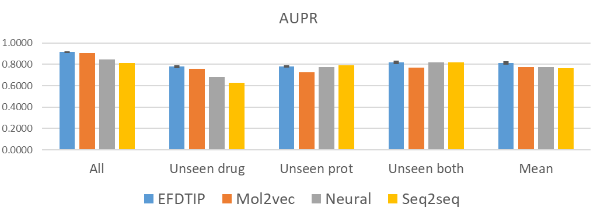
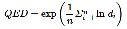

============
DeepCombDTI
============

DeepCombDTI is a model for **drug-target interaction prediction** using deep learning and various `molecular fingerprints <#molecular-fingerprint>`_. Drugs can be represented by a molecular fingerprint like :doc:`ECFP <ecfp>` and Protein can be represented a feature vector like CTD.

.. figure:: img/deepcombdti/deepcombdti.png
  :align: center
  :scale: 50%

Overview
=========

.. figure:: img/deepcombdti/deepcombdti_overview.png
  :align: center
  :scale: 50%

Dataset
=======

.. figure:: img/deepcombdti/dataset.png
  :align: center
  :scale: 50%

Test dataset types
*******************

* All

    * All drugs and targets in the test dataset

* Unseen drug

    * Drugs are not included in the training dataset

* Unseen prot

    * Proteins are not included in the training dataset

* Unseen both

    * Drugs and proteins are not included in the training dataset

Features
========

Molecular fingerprint
**********************

Molecular fingerprint는 약물을 표현하는 Feature이고, 예로는 ECFP, Mol2vec, Neural fingerprint, Seq2seq fingerprint 등이 있다.

.. toctree::
    :maxdepth: 1

    /bioinfo/mol_fp/ecfp
    /bioinfo/mol_fp/mol2vec
    /bioinfo/mol_fp/neural_fp
    /bioinfo/mol_fp/seq2seq_fp
    /bioinfo/mol_fp/maccs
    /bioinfo/mol_fp/pubchem_fp
    /bioinfo/mol_fp/daylight_fp

Protein representation
***********************

.. toctree::
    :maxdepth: 1

    /bioinfo/mol_fp/protvec

Results
========

SFDTIP vs. Random forest
*************************

SFDTIP vs. EFDTIP
******************

Property prediction
********************

--------------------
Performance measure
--------------------

* RMSE: 편차 제곱의 평균
* Pearson correlation: 두 변수의 공분산을 표준 편차의 곱으로 나눈 값

--------------------------------------------
Qualitative Estimate of Drug-likeness (QED)
--------------------------------------------

Qualitative Estimate of Drug-likeness (QED) is a measure of a binding abilitity. This is a equation of QED:

The QED is achieved by taking the geometric mean of the individual functions. A series of desirability functions (d) are derived, each corresponding to a different molecular descriptor:

* Molecular weight (MW)
* Octanol-water partition coefficient (ALOGP)
* The number of hydrogen bond donors (HBD)
* The number of hydrogen bond acceptors (HBA)
* The molecular polar surface area (PSA)
* The number of rotatable bonds (ROTB)
* The number of aromatic rings (AROM)
* The number of structural alerts (ALERTS)

This is a result of QED predictions:

.. figure:: img/deepcombdti/prop_pred_qed_rmse.png
  :align: center
  :scale: 50%

-----------
Solubility
-----------

--------------
Melting point
--------------

-----
LogP
-----

LogP는 섞이지 않는 두 용매인 물과 옥탄올(octanol)에 화합물을 녹였을 때 물과 옥탄올층에 녹아있는 화합물 농도의 비를 분배계수로 나타낸 것입니다.

이 값을 통하여 화합물이 친수성(hydrophilicity)을 갖는지 소수성(hydrophobicity)을 갖는지 예상할 수 있으며 값이 클수록 소수성이 강한 옥탄올층에 화합물의 분배가 많이 되어있는 것이므로 소수성이 큰 것으로 예상할 수 있습니다.

Code
=====

DeepCombDTI is implemented in GitHub and this is a `link <https://github.com/hwkim89/DeepCombDTI>`_.

Reference
==========

* `CHEMDB, <http://chemdb.kisti.re.kr/help/09_info.html#a10>`_
