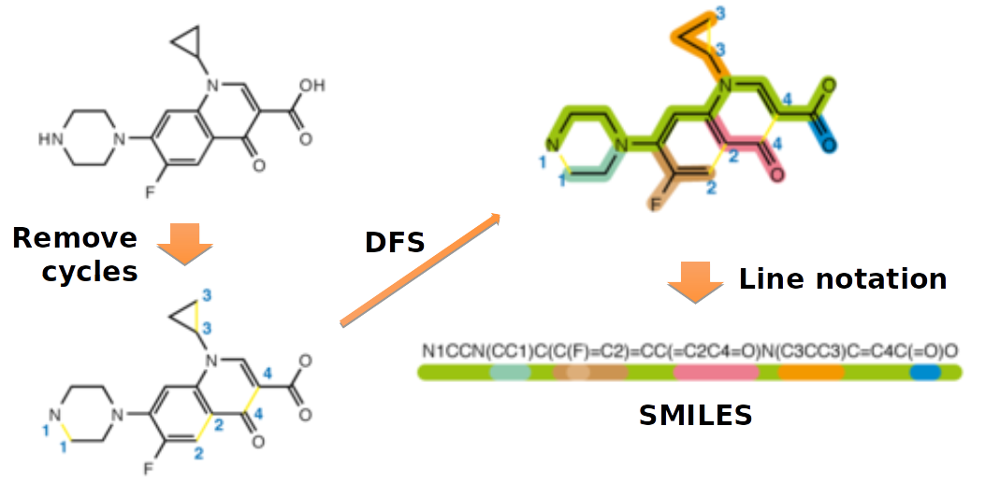

SMILES
=======

SMILES (Simplified Molecular Input Line Entry System) is a **line notation** (a typographical method using printable characters) for entering and representing molecules and reactions.

Reference
==========

* http://www.daylight.com/dayhtml/doc/theory/theory.smiles.html
