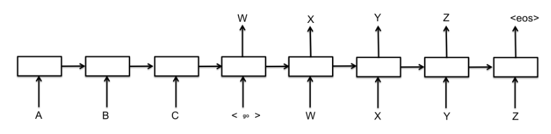
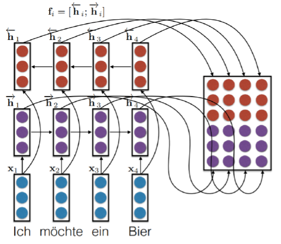

====================
Attention mechanism
====================

어텐션 (Attention) 매커니즘은 딥러닝 모델이 특정 벡터에 주목하게 만들어 모델의 성능을 높이는 기법이다. 

어텐션 매커니즘은 기계번역 (Machine translation)을 위한 Sequence-to-sequence (S2S) 모델에 처음 도입되었다. S2S 아키텍처는 소스 언어의 표현 (:math:`A,\ B,\ C`)를 입력으로 해서 벡터로 만드는 인코더 (Encoder)와 인코더가 출력한 벡터를 입력으로 해서 타겟 언어 (:math:`W,\ X,\ Y,\ Z`)로 출력하는 디코더 (Decoder)로 구성되어 있다.

그런데 여기에서 소스 언어와 타겟 언어의 길이가 길어질수록 모델의 성능이 나빠진다. :math:`W` 를 예측할 때 :math:`A,\ B,\ C` 모두에 집중해 보게 되면 정확도가 떨어질 수 있으므로, 모델이 ‘중요한 부분만 집중 (Attention)하게 만들자’가 어텐션 매커니즘의 핵심 아이디어다.

예제: 독일어 → 영어
=================

예를 들어 독일어 “Ich mochte ein bier”를 영어 “I’d like a beer”로 번역하는 S2S 모델을 만든다고 하자. 모델이 네번째 단어인 ‘beer’를 예측할 때 ‘bier’에 주목하게 만들고자 합니다. 어텐션 매커니즘의 가정은 인코더가 ‘bier’를 받아서 벡터로 만든 결과 (인코더 출력)는 디코더가 ‘beer’를 예측할 때 쓰는 벡터 (디코더 입력)와 유사할 것이라는 점이다.

인코더 계산과정
*************

인코더는 :math:`i` 번째 단어벡터 :math:`x_i` 를 받아서 그에 해당하는 Hidden state 벡터 :math:`h_i` 를 만든다. 이후 :math:`h_i` 가 :math:`i` 번째 열벡터가 되도록 행렬 형태로 차곡차곡 쌓는다. 이 행렬을 :math:`F` 라고 했을 때, 다음 그림과 같이 나타낼 수 있다 (Bi-directional model).

디코더 계산과정
*************

:math:`e_{ij}` 는 디코더가 :math:`i` 번째 단어를 예측할 때 쓰는 직전 스텝의 히든스테이트 벡터 :math:`s_{i−1}` 이 인코더의 :math:`j` 번째 열벡터 :math:`h_j` 와 얼마나 유사한지를 나타내는 스코어 (스칼라) 값이다. 예를 들어 어텐션 매커니즘이 제대로 작동한다면 ‘bier’에 해당하는 디코더 출력 벡터와 ‘beer’를 예측할 때 쓰이는 인코더 입력벡터의 유사도가 높게 나타날 것이다.

.. rst-class:: centered

    :math:`e_{ij} = a(s_{i−1}, h_j)`

위 식에서 :math:`a` 는 Alignment model이고, :math:`s_{i−1}` 과 :math:`h_j` 간 유사도를 잘 뽑아낼 수 있다면 다양한 변형이 가능하다고 한다. 실제로 :math:`e_{ij}` 를 구할 때 쓰이는 :math:`a` 는 (1) :math:`F^TVs_{i-1}` (2) :math:`v^T\tanh{(WF+Vs_{i-1})}` 등 다양하게 쓰이고, :math:`v,\ V,\ W` 등은 어텐션을 적용하기 위한 학습 파라미터이다. 이렇게 구한 :math:`e_{ij}` 에 Softmax 함수를 적용해 합이 1이 되도록 확률값으로 변환한다 (:math:`T_x:` 인코더 입력 단어 수).

.. rst-class:: centered

    :math:`\alpha _{ ij }=\frac { exp\left( { e }_{ ij } \right)  }{ \sum _{ k=1 }^{ { T }_{ x } }{ exp\left( { e }_{ ik } \right)  }  }`
    
그리고 :math:`\alpha_{ij}` 들로 디코더가 :math:`i` 번째 단어를 예측할 때 쓰이는 Attention vector :math:`a_i` 를 정의할 수 있다.

.. rst-class:: centered

    :math:`\overrightarrow { \alpha _{ i } } =\left[ { \alpha  }_{ i1 },{ \alpha  }_{ i2 },...,{ \alpha  }_{ i{ T }_{ x } } \right]`
    
또한, 디코더가 :math:`i` 번째 단어를 예측할 때 쓰이는 Context vector :math:`c_i` 는 다음과 같이 정의되고, 이는 인코더의 :math:`j` 번째 열벡터를 어텐션 확률값으로 가중합을 한 것이라고 볼 수 있다.

.. rst-class:: centered

    :math:`\overrightarrow { { c }_{ i } } =\sum _{ j=1 }^{ { T }_{ x } }{ { \alpha  }_{ ij }{ h }_{ j } } =F \overrightarrow { { \alpha  }_{ i } }`

------------
실제 계산 예시
------------

디코더에서 실제로 계산되는 과정은 다음과 같다. Alignment model :math:`a` 는 디코더가 2번째 단어 ‘like’를 예측할 때 쓰이는 첫번째 Hidden state 벡터 :math:`s_1` 과 가장 유사한 인코더의 열벡터가 :math:`h_2` 라고 판단했다. 디코더가 2번째 단어를 예측할 때 쓰이는 Attention vector :math:`α_2` 를 보면 두번째 요소값이 가장 높기 때문이다.

.. figure:: ../img/sm/attention/decoding.png
  :align: center
  :scale: 70%

디코더가 2번째 단어를 예측할 때 쓰이는 Context vector :math:`c_2` 는 인코더 출력벡터들로 구성된 행렬 :math:`F` 에 :math:`α_2` 를 내적해 구한다. 인코더 모델은 타겟 언어 단어벡터 (I’d)와 :math:`c_2` 를 Concat해서 현 시점의 히든스테이트 벡터 :math:`s_i` 를 만들어낸다.

Reference
==========

* `ratsgo's blog <https://ratsgo.github.io/from%20frequency%20to%20semantics/2017/10/06/attention/>`_
* `Wikidocs <https://wikidocs.net/22893>`_
