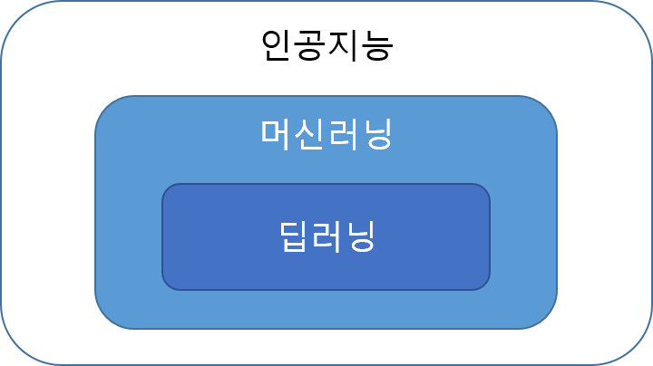

========
머신러닝
========

인공지능, 머신러닝, 딥러닝
==========================

딥러닝을 알아보기 전에 일반 사람들이 헷갈리는 부분을 먼저 살펴보자. 사람들이 인공지능, 머신러닝, 딥러닝을 혼용해서 많이 사용하는데 이를 한 마디로 정리하면 다음 그림과 같다.

즉, 인공지능의 한 종류가 머신러닝이고, 머신러닝의 한 종류가 딥러닝이다. 조금 더 자세히 말하자면 인공지능은 인간의 능력들은 컴퓨터로 표현한 기술이고, 머신러닝은 인간의 능력 중 하나인 경험을 통해 학습하여 자동으로 개선하는 능력을 컴퓨터로 표현한 기술이다. 마지막으로 딥러닝은 머신러닝 중에서 인간의 신경망을 기반으로 만든 인공신경망을 확장시킨 방법이라고 할 수 있다. 아직은 추상적이지만 지금부터 하나씩 더 구체화 해보도록 하자.

먼저 머신러닝부터!!

머신러닝이란
============

머신러닝은 간단히 말하면 **데이터에서 모델을 찾아내는 기법** 이라고 할 수 있다. 여기서 사람이 데이터로부터 모델을 찾는게 아니라, **머신러닝 기법이 스스로 데이터를 분석해 모델을 찾기 때문에** 머신러닝이라는 이름이 만들어졌다. 이 때 사용하는 데이터를 학습 데이터 (Training data)라고 하고, 머신러닝 기법이 찾은 모델은 우리가 원하는 목적을 이루기 위해 사용할 수 있다 (예: 스팸 분류기).

그렇다면 왜 데이터에서 모델을 찾아내는 기법이 나타나게 된 걸까? 지금부터 그 이유를 하나씩 설명하려고 한다.

머신러닝의 출현 배경
===================

앞서 언급한 것처럼 머신러닝은 **머신러닝 기법이 스스로 데이터를 분석해 모델을 찾아내는 기법** 을 의미한다. 그렇다면 머신러닝과 같은 방법이 왜 생겨나게 된 것일까? 다음 예제를 통해 그 이유를 살펴보자.

.. figure:: img/ml/numbers.png
    :align: center
    :scale: 100%

.. rst-class:: centered

    출처: `http://neuralnetworksanddeeplearning.com <http://neuralnetworksanddeeplearning.com/images/mnist_100_digits.png>`_

예를 들어 위와 같은 여러 가지 숫자 이미지를 보면, 사람은 이미지에서 어떤 숫자들이 있는지 쉽게 알 수 있다. 하지만 컴퓨터로 위 숫자를 인식하기 위해 전통적인 모델링 방법을 사용하면, 각 숫자를 구분하는 법칙이나 알고리즘을 사람이 찾아야 한다. 하지만 이는 굉장히 어렵고 복잡하다. 그러면 관점을 바꿔서 생각해보자. 우리는 실제로 숫자를 어떻게 인식하고 있는 걸까?

우리가 실제로 숫자를 인식할 때 명확한 기준이나 법칙을 사용한게 아니라, 0이나 1의 모양을 띄고 있으면 그냥 0이나 1이다라고 받아들인 것이다. 그 후로 다양한 숫자들을 보면서 점점 잘 구별하게 된 것이다.

컴퓨터로 숫자를 인식할 때도 비슷한 방법을 사용하면 좋지 않을까라고 생각해서 만들어진 것이 머신러닝이다. 한 마디로 머신러닝은 위 사례처럼 **명시적으로 기준이나 법칙을 가진 모델을 구하기 어려운 경우, 학습 데이터에서 머신러닝 기법 스스로 모델을 찾는 방법** 이다.

머신러닝의 문제점
================

지금까지 설명한 내용을 그림으로 표현하면 다음 그림의 세로축 흐름과 같고, 이는 머신러닝이 스스로 데이터로부터 모델을 찾아내는 과정을 의미한다.

.. figure:: img/ml/ml_process.png
    :align: center
    :scale: 50%

그렇다면 가로축의 흐름은 무엇일까? 이는 세로축 과정으로 학습된 모델을 이용하여 실제 현장 데이터를 이용해 추론 (Inference)하는 과정을 의미한다. 즉, **실제 데이터를 머신러닝 기법으로 찾아낸 (=학습된) 모델에 적용하여 원하는 결과를 도출해내는 과정** 이다 (예: 스팸 필터).

이러한 구조가 머신러닝의 근본적인 문제점이다. 예를 들어 학습 데이터가 **실제 데이터의 특성을 잘 반영하고 있지 않은 경우**, 학습 데이터에서 머신러닝 기법으로 열심히 모델을 찾아내도 실제로 작동하지 않을 수 있다.

그래서 실제 데이터의 특성이 잘 반영되어 있고 편향되지 않은 학습 데이터를 구하는 것이 중요하다. 결국 **학습 데이터로 찾아낸 모델이 다른 실제 데이터에서도 잘 동작하게 하는 것** 이 궁극적인 목표이고, 이러한 모델이 **일반화 (Generalization)** 가 잘 된 모델이라고 할 수 있다. 그래서 일반화가 잘 된 모델이 성능이 좋다고 해도 과언이 아니다.

.. _overfitting:

과적합
=======

일반화된 머신러닝 모델을 만드는데 가장 큰 걸림돌 중 하나는 **과적합 (Overfitting)** 이다. 말 그대로 모델이 학습 데이터에 과도하게 적합되어 있는 상태를 의미한다. 예를 들어 도자기인지 아닌지 구분하는 모델이 있다고 하자.

.. figure:: img/ml/overfitting_ex.png
    :align: center
    :scale: 50%

상단 좌측 그림과 같은 모양의 도자기를 모델이 반복적으로 학습한 후 상단 우측 그림과 같은 새로운 형태의 도자기를 구분하라고 했을 때, 모델은 도자기인지 아닌지 구분을 잘 못할 수 있다. 이러한 상황에서 학습된 모델은 좌측 도자기 이미지에 과적합되어 있다고 할 수 있다.

이처럼 **학습 데이터로 학습한 모델이 주어진 학습 데이터에 과도하게 적합되어 있는 상태** 를 과적합이라고 한다. 즉, 모델이 일부 데이터가 마치 전체 데이터를 의미하는 것으로 받아들이고 학습되어, 학습 데이터와 다른 실제 데이터에서 학습된 모델이 작동하지 않는 문제가 생길 수 있다.

그렇다면 과적합 문제를 어떻게 해결할 수 있을까?

정칙화와 검증
=============

과적합 문제를 해결하는 대표적인 방법으로 정칙화 또는 규제 (Reularization)와 검증 (Validation)이 있다.

정칙화
******

정칙화는 모델의 형태를 간단하게 만들려는 수치해석적 기법으로, 학습 데이터에 대한 모델의 성능이 약간 떨어져도 모델을 간단하게 만들어 과적합 되지 않게 만드는 방법이다. 자세한 내용은 뒤에서 알아보려고 한다.

검증
*****

간단한 문제에서는 과적합 여부를 쉽게 판단할 수 있지만, 실제 문제에서의 고차원 데이터는 직관적으로 알기 어렵다. 그래서 생긴 방법이 검증이다.

검증시 사용하는 데이터는 학습에 사용하지 않을 학습 데이터의 일부이거나 학습 데이터와 다른 데이터를 사용해야 한다. 검증 데이터를 이렇게 구성하는 이유는 학습 데이터로 학습된 모델을 검증 데이터로 테스트하여, 모델이 학습 데이터에 과적합 되어 있는지 여부를 판단하고자 하기 때문이다. 검증 결과가 좋지 않으면 모델이 학습 데이터에 과적합되어 있다고 볼 수 있고 적절한 조치가 필요하다.

일반적으로 검증하는 과정은 다음과 같다.

* 학습 데이터를 학습용/검증용 데이터로 나누거나 (이 때 나누는 비율은 보통 8:2임), 학습 데이터에 포함되지 않는 검증 데이터를 구하기.
* 학습용 데이터로 모델 학습 시키기
* 검증용 데이터 모델 테스트 하기
    
    * 성능이 떨어지면 모델을 수정하여 다시 학습 후 검증하기

또 다른 검증 방법에는 교차 검증 (Cross validation)이 있다. 이 방법은 학습 데이터를 학습용/검증용으로 나눌 때, 두 데이터를 고정하지 않고 계속 바꿔주는 방법이다. 아래 그림을 보면 이해하기 쉬울 것이다.

.. figure:: img/ml/k-fold_cross_validation.png
    :align: center
    :scale: 60%

.. rst-class:: centered

    출처: `ethen8181.github.io, Model Selection <http://ethen8181.github.io/machine-learning/model_selection/model_selection.html>`_

위 그림은 5-fold cross validation이다. 이런 식으로 검증하는 이뉴는 검증용 데이터를 고정시키면 검증용 데이터에 과적합 될 가능성도 있기 때문이다.

머신러닝의 종류
===============

머신러닝 기법은 크게 지도학습, 비지도학습, 강화학습으로 나눌 수 있다.

지도학습
********

지도학습은 정답이 있는 학습 데이터로 모델을 학습시키는 방법이다. 실제 우리가 학교에서 공부하는 것과 유사하다. 예를 들어 수학 공부를 한다고 하면 문제를 풀고 정답과 비교하여 틀린 부분을 고치면서 학습한다. 이러한 과정을 반복하여 사람이 수학을 공부하는 것처럼 머신러닝 모델도 학습 데이터와 그에 대한 정답을 비교하면서 둘 간의 차이가 줄어들게 학습한다. 그래서 지도학습 시 사용하는 학습 데이터는 입력과 정답의 쌍으로 구성되어 있다.

비지도학습
**********

비지도학습은

분류와 회귀
===========

:h2:`참조`

* 딥러닝 첫걸음, 김성필 지음, 한빛미디어, 2018
* `모두를 위한 머신러닝/딥러닝 강의 <http://hunkim.github.io/ml/>`_
