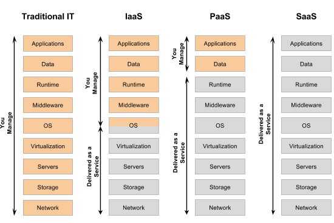

===========
Serverless
===========

Cloud의 패러다임이 서버리스 (Serverless)의 형태로 변환하고 있는데, Serverless란 무엇일까?

일단 이름만 들었을 때는 Server + less로 서버가 없는 형태인가 하고 생각할 수 있는데 아니다. 서버가 있어야 어떤 요청에 대해 처리할 수 있기 때문이다.

그렇다면 서버리스는 무엇일까? 서버리스는 직접 관리할 필요가 없는 서버를 의미한다. Amazon, Google, MS에서 서버를 제공해 줄 뿐만 아니라 관리까지 해주는 서비스를 의미한다. 그러면 이러한 서버리스는 왜 등장하게 된 것일까? 기존의 다양한 클라우드 서비스를 살펴보면 그 이유를 알 수 있다.

Cloud paradigm
===============

.. rst-class:: centered

    출처: `specify.io <https://specify.io/concepts/serverless-baas-faas>`_

전통적으로는 가장 좌측에 있는 Traditional IT에 해당하는 Stack처럼 하드웨어 장치부터 소프트웨어 부분까지 모든 부분을 다 관리해야 했다. 그래서 그 중에서 하드웨어와 관련된 부분을 Amazon, Google, Microsoft가 제공하고, 사용자는 나머지 소프트웨어 부분에 대해서만 관리하는 IaaS (Infrastructure as a Service)가 등장했다. 대표적인 예로는 Amazon의 `EC2 <https://aws.amazon.com/ko/ec2/>`_, Google의 `Compute engine <https://cloud.google.com/compute?hl=ko>`_ 등이 있다.

하지만 IaaS 형태로 하드웨어를 제공받아도 실제로 개발을 하기 위해서는 그 환경을 직접 설정해야 한다. 그리고 사용자 Traffic에 따라 Load balancing을 통해 작업을 여러 서버에 작업을 분산시켜 주거나, 저장 용량이 부족한 경우에는 그에 따라 Storage 용량도 조절해야 한다. 그 뿐만 아니라 운영체제를 업데이트 해야 하는 경우 직접 해야한다. 이러한 부분에 대해 사용자가 신경쓰지 않고 오로지 앱 개발에만 집중할 수 있게 만들어 준 서비스가 PaaS (Platform as a Service)라고 할 수 있다. 대표적인 예로는 `Google의 App engine <https://cloud.google.com/appengine?hl=ko>`_, `Heroku <https://www.heroku.com/>`_ 등이 있다.

위 두 가지 서비스처럼 직접 개발할 필요가 없고 원하는 서비스를 사용만 하면 되는 경우에는 SasS (Software as a Service)를 이용하면 된다. SaaS는 소프트웨어 자체를 서비스로 제공하는 형태이다. 그래서 우리가 많이 쓰고 있는 다양한 Evernote, Google drive 등이 SaaS라고 할 수 있다. SaaS는 사용자가 하드웨어나 소프트웨어에 대해 전혀 신경쓸 필요 없이 비용을 지불하고 사용하기만 하면 된다.

Serverless
===========

.. figure:: img/serverless/cloud_stack_with_serverless.png
    :align: center

.. rst-class:: centered

    출처: `specify.io <https://specify.io/concepts/serverless-baas-faas>`_

여기서 Serverless는 PaaS와 Sass의 중간 정도로 자동화해주는 서비스다. 즉, Application을 직접 개발을 하는데 Backend 직접 관리하지 않거나 일부만 관리하는 것이다. 위 그림처럼 Application을 두 부분으로 나누면 App Client와 App Backend로 나눌 수 있다.

* Client: An application that runs in the browser or on a mobile phone and talks to backends which provide an API.
* Server (a.k.a. Backend): A server that handles requests form clients. Those servers mostly provide webservices with a RESTfull API.

결론적으로 Client가 요청하는 부분을 개발하고 이에 대해 응답하는 Backend 부분을 일부 개발하거나 Amazon이나 Google과 같은 회사가 제공해주는 API만 사용하는 것이다.

조금 더 구체적으로 Serverless를 나누어 보면 크게 BaaS (Backend as a Service)와 FaaS (Function as a Service)로 구분할 수 있다.

BaaS
*****

BaaS는 Backend를 API 형태로 제공하는 서비스다. 기존에는 앱을 개발할 때마다 Database와 연동, 사용자 관리 및 접속 제어, 위치 서비스 등의 기능들을 Backend에 직접 구현해서 사용해야 했다. 하지만 이러한 부분을 API 형태로 제공하여 개발자는 단순히 API를 호출하기만 하여 해당 기능을 사용할 수 있게 만든 것이다. 대표적인 예로는 Google의 `Firebase <https://firebase.google.com/?hl=ko>`_ 가 있다.

FaaS
*****

FaaS는 BaaS보다 조금 더 많은 부분을 제어할 수 있는데, 말 그대로 Backend 부분을 Function 형태로 개발자가 정의할 수 있고 해당하는 Function을 Client에서 요청할 때에만 깨워서 응답할 수 있게 만든 서비스이다. 그래서 해당 Function을 사용할 때만 비용이 지불되어 서버 비용을 줄일 수 있다. 대표적인 예로 Amazon의 AWS Lambda, Google의 Cloud Function이 있고, AWS Lambda는 백만개의 함수를 수행하는데 드는 비용이 20센트라고 한다.

서버리스의 장단점
================

장점
*****

서버리스는 다음과 같은 장점들을 가지고 있다.

* 운영 비용 절감 효과

    * IaaS나 PaaS와 같이 상시 운영 중인 서버와 달리 요청에 따라 호출되어 처리되기 때문에 유휴 자원 X

* 유연한 확장성
    
    * 일반적인 클라우드 서비스와 같이 특정 조건 (예를 들어 CPU, RAM 임계치 도달과 같은)에 따라 확장되는 방식이 아닌, 호출될 때마다 새로운 인스턴스가 기동되어 동작하기 때문에 특정 조건을 설정하지 않아도 급격한 트래픽 변화에 유연한 대응이 가능함

* 빠른 출시

    * 제공되는 API를 사용하거나 기능이 함수 단위로 개발되기 때문에 서비스를 빠르고 간단하게 출시할 수 있음

단점
*****

하지만 다음과 같은 단점들도 있기 때문에 제약사항을 고려하여 서버리스를 사용해야 한다.

* 벤더 종속성 (Vendor lock-in)

    * 사용할 수 있는 운영체제, 언어, 함수 내에서 사용할 수 있는 최대 메모리, 최대 처리 가능 시간 등의 제약이 존재함
    
        * 원하는 운영체제나 언어가 없는 경우에는 서버리스를 사용하기 어려움
        * 제약에 따라 큰 기능을 잘게 나누어 구현해야 함 (이를 준수하지 않고서는 서버리스로 이전 X)

    * 벤더사가 제공하는 서버리스 서비스에 맞게 개발한 경우 타 벤더사의 서버리스 서비스로 이전하기가 쉽지 않음

* 콜드 스타드 (Cold Start)

    * 실행되는 함수가 호출되기 위해 컨테이너가 실행되는 대기 시간이 존재함
    * 빠른 응답이 필요한 제품의 경우 서버리스로의 전환은 부적합할 수 있음

* 지속시간 (Duration)의 제한

    * 서버리스 컴퓨팅은 ‘이메일 발송’, ‘결제 처리’ 등의 과 같이 짧은 지속 시간을 가진 프로세스에 적합한 모델임

    * AWS Lambda의 경우 최대 5분이라는 시간 제한이 존재하고, 해당 시간 내에 작업이 완료되지 않을 경우 새로이 함수를 호출해야 함
    
        * 지속시간이 긴 작업으로 인하여 특정 함수가 반복적으로 실행된다면, 일반적인 아키텍처 보다 더 많은 비용을 지출하게 될 수 있음

* 무상태 (Stateless)한 구현

    * 하나의 작은 기능으로 나뉘어진 함수들은 요청마다 새로 기동되어 호출되기 때문에 전후 상태를 공유할 수 없음
    * 또한 변수와 데이터의 공유가 불가능하며, 데이터를 로컬 스토리지에서 읽고 쓸 수 없음
        
        * 이는 서버리스 벤더에 따라 추가 서비스를 통해 극복이 가능하지만, AWS S3, Azure Storage등 일반적인 서버리스는 불가능함
    

서버리스 사용 사례
=================

서버리스는 자동화 작업에 적용이 가능하다. 넷플릭스는 동영상 업로드 시 파일의 인코딩과 검증, 태깅 이후에 공개되는 작업을 AWS Lambda를 통해 자동화 했다. 실시간 비디오 스트리밍 앱 개발사인 페리스코프 (Periscope)도 동영상의 유해성 여부를 확인하는 기능을 Lambda에서 운영하고 있다.

분석과 모니터링 기능에도 서버리스가 적합하다. 예를 들면 CPU 사용량이 임계치에 도달했을 때 알림을 받거나 지속적으로 기록되는 로그를 분석하고 리포팅 하는데 사용할 수 있다. 미국 온라인 패션 매거진 버슬(Bustle)은 하루 1억건의 이벤트 처리와 데이터 분석 리포팅에 서버리스를 적용해 84%의 비용을 절감했다.

챗봇(Chat-Bot) 서비스에 서버리스를 적용하면 API 호출 시 요청을 처리하고 유연한 확장이 가능해 많은 사용자에게 안정적인 서비스를 제공할 수 있다. 슬랙(Slack)을 기반으로 하는 챗봇 어플리케이션이나 Amazon Echo 그리고 AWS Lambda를 이용한 음성인식 어플리케이션이 늘어나고 있다.

대표적인 서버리스 서비스
=======================

대표적인 서버리스 서비스에는 AWS Lambda와 Google의 Cloud Functions가 있다. 여기에서는 각 서비스를 이용하는 방법을 간단히 언급해보려고 한다.

AWS Lambda
***********
    
AWS Lambda를 실제로 사용하여 간단한 웹 서버를 만드는 과정은 다음과 같다.

.. raw:: html

    

        <iframe width="560" height="315" src="https://www.youtube.com/embed/7uEDep9DFJs"
        frameborder="0" allow="accelerometer; encrypted-media; gyroscope; picture-in-picture" allowfullscreen></iframe>
    

조금 더 상세한 내용을 이해하고 싶은 경우에는 `YouTube, AWS Lambda 자세히 살펴보기 - 조성열 시스템 엔지니어(AWS Managed Services) <https://youtu.be/I_HuqdIXHEg>`_ 의 내용을 확인하면 좋을 것 같다.

Google Cloud Functions
***********************
    
Google Cloud Functions를 실제로 사용하여 간단한 웹 서버를 만드는 과정은 다음과 같다.

.. raw:: html

    

        <iframe width="560" height="315" src="https://www.youtube.com/embed/vM-2O-uKBNQ"
        frameborder="0" allow="accelerometer; encrypted-media; gyroscope; picture-in-picture" allowfullscreen></iframe>
    

결론
=====

IaaS부터 PaaS 그리고 현재의 서버리스에 이르기까지 컴퓨팅 자원의 효율적인 사용이라는 클라우드 서비스의 발전 목표는 기업의 요구사항에 한층 더 가까워졌다. AWS가 Lambda를 발표한 이후 마이크로소프트의 Azure Functions, 구글의 Google Cloud Functions 등 대형 벤더들이 서비스를 출시했고, 이는 클라우드의 패러다임이 전환되고 있음을 암시한다.

클라우드 서비스 시장에서 서버리스는 값싸고 빠르게 아이디어를 테스트하고 구현할 수 있는 환경을 제공한다. 물론 PaaS는 여전히 매력적인 서비스이고 서버리스가 가진 제약을 수용할 수 없는 경우에 좋은 대안이 될 수 있다. 그럼에도 불구하고 서버리스는 복잡한 기능을 간결화 할 수 있고, 보다 민첩한 서비스를 구현할 수 있을 뿐 아니라, 운영 비용의 절감 효과까지 얻을 수 있기에 관심을 가지고 검토해 볼만한 가치가 있다.

:h2:`참조`

* `specify.io, Serverless Architecture in Short <https://specify.io/concepts/serverless-baas-faas>`_
* `ojava, SAAS, PAAS, IAAS <https://ojava.tistory.com/146>`_
* `SAMSUNG SDS, 클라우드 패러다임의 전환 - 서버리스 컴퓨팅 <https://www.samsungsds.com/global/ko/support/insights/1209610_2284.html>`_
* `Shared IT, 서버리스(Severless) 컴퓨팅 도입에 앞서 고려할 사항들 <https://www.sharedit.co.kr/posts/6005>`_
* `YouTube, 서버리스는 서버가 없는걸까? 8분 개념 설명! <https://youtu.be/ufLmReluPww>`_
* `YouTube, 201520 577 Chapter 01 서버리스 한계점 및 장단점 <https://youtu.be/suD86HBhX1w>`_
* `YouTube, AWS Lambda 개요 - 순식간에 웹 서버 만들어 보기 [AWS Lambda 강좌] <https://youtu.be/7uEDep9DFJs>`_
* `YouTube, Getting Started: Cloud Functions quickstart <https://youtu.be/vM-2O-uKBNQ>`_
