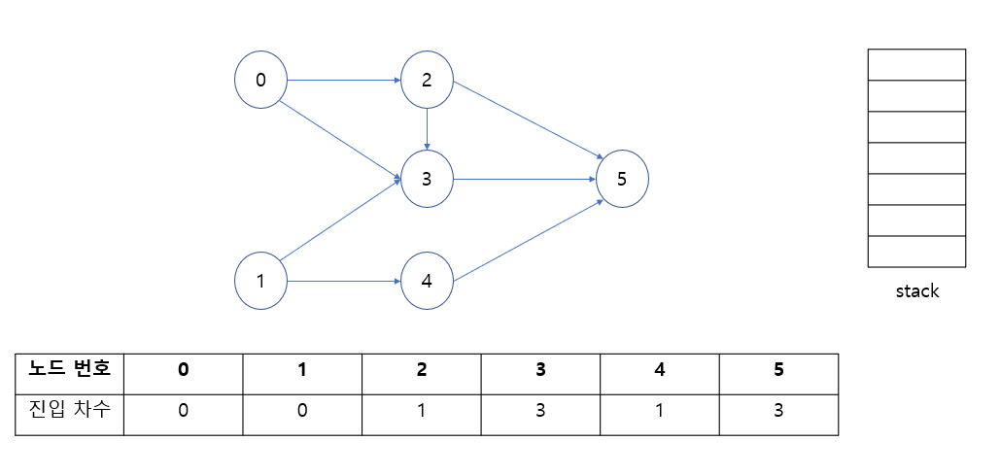
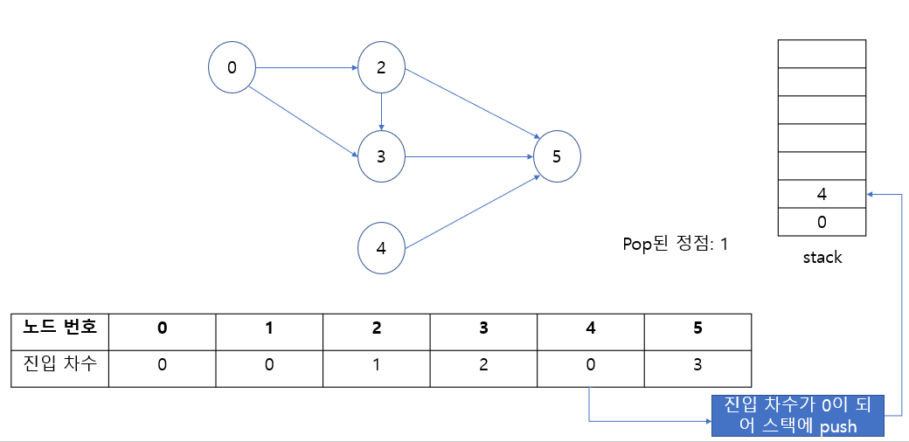
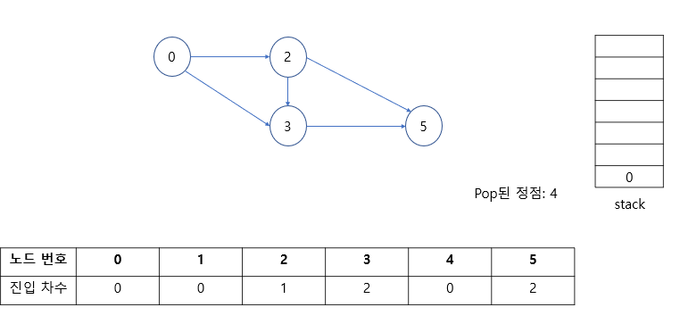
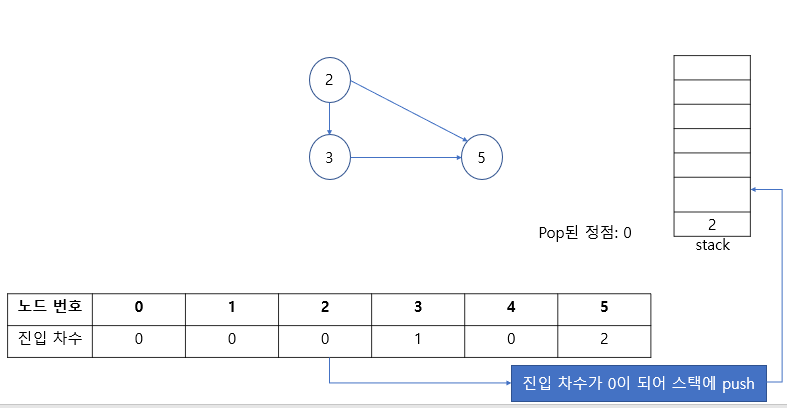
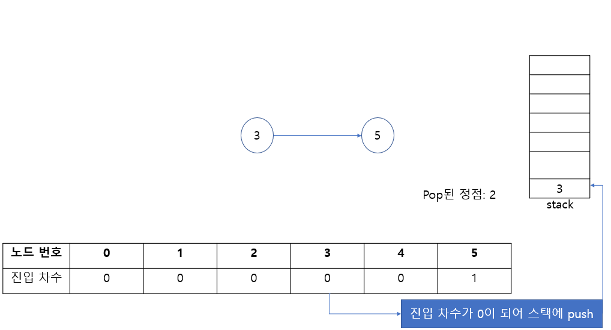
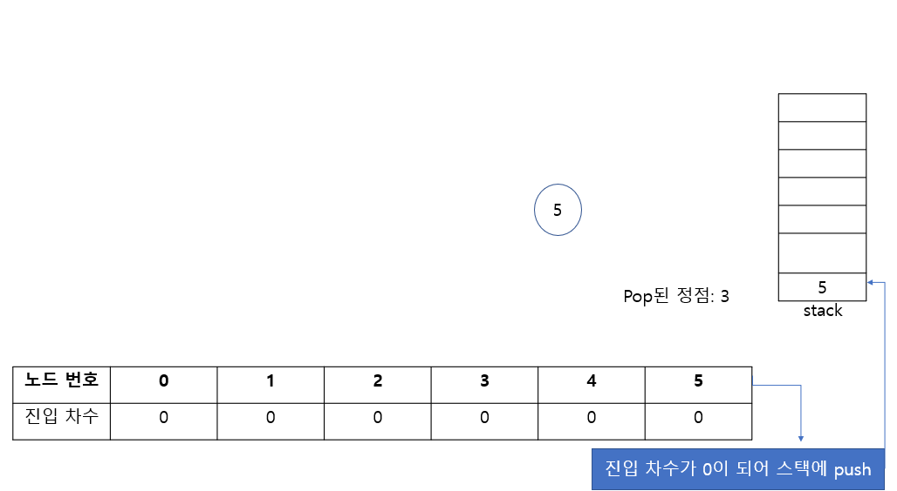
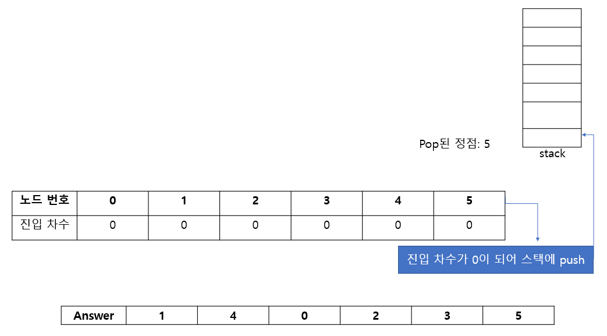

==========
위상 정렬
==========

위키피디아에서 위상 정렬에 대한 개념을 찾아보면, "유향 그래프의  꼭짓점들(vertex)을 변의 방향을 거스르지 않도록 나열하는 것을 의미한다."라고 적혀있다. 도대체 무슨 소린지...

그래서 검색하던 잘 정리되어 있는 사이트를 발견해서 그 내용을 정리해본다.

위상 정렬이란?
==============

위상이라 함은, **'어떤 사물이 다른 사물과의 관계 속에서 가지는 위치나 상태'** 를 말한다. 여기서 사물이라는 말을 정점으로 바꾸면, **'어떤 정점이 다른 정점과의 관계속에서 가지는 위치나 상태'** 가 된다.

이를 조금 더 쉽게 말하면 위상 정렬이란 각 정점들이 가지는 위상 (다른 정점과의 관계, 즉 간선)에 따라서, 그래프를 구성하는 정점들을 순서대로 정렬해서 결과값으로 출력하는 것이다. 

그래서 어떤 그래프를 위상 정렬하게 되면, 그 결과로 정점들을 위상적 순서대로 정렬한 배열이 나오게 된다.

위상 정렬의 조건
================

주어진 그래프에서 위상 정렬을 하려면, 아래와 같은 조건을 만족하는 그래프여야 한다. 

* 위상 정렬을 할 그래프는 간선이 방향성을 가지는(유향) 그래프여야 한다.
* 그래프 내부에 순환(cycle)이 있으면 안된다. 

알고리즘
========

위상 정렬의 기본 아이디어는 다음과 같다.

* 초기 스택에 진입 차수가 0인 노드를 집어넣는다.

    * 한 정점으로 들어오는 간선의 갯수를 말한다 (↔ 진출 차수).

* 하나씩 꺼내보면서 꺼낸 노드에서 갈 수 있는 노드의 진입 차수를 1 감소시킨다.
* 진입 차수가 0이 되면 그 노드를 스택에 집어넣는 것이다.

그림으로 나타내면 아래와 같다. 

위 그래프를 위상 정렬할 것이다. 말했듯이, 진입 차수가 0인 노드 0, 1을 스택에 넣는다. 

.. figure:: img/topological_sort/topsort_algo_2.png
    :align: center

stack에서 하나의 정점을 pop한다. 그럼 1이 나오게 되는데, 그 1과 인접한 정점의 진입차수를 1씩 감소시킨다. 그리고 진입 차수가 0이 된 정점을 스택에 집어넣는다. 그럼 아래와 같은 결과가 나온다. 

그리고 다음엔 4가 pop되고, 4와 인접한 노드의 진입 차수를 1 감소시킨다. 

그리고, stack에 있는 0에 pop 되고, 0에서 갈 수 있는 2, 3번 정점의 진입 차수를 1 감소시킨다. 그럼 2번 정점의 진입 차수가 0이 되어 스택에 들어간다. 

 
2를 pop하고, 연결된 노드의 진입 차수를 1씩 감소시킨다. 그럼 3이 진입 차수가 0이 되어 스택에 들어간다. 

 
3를 pop하고, 연결된 노드의 진입 차수를 1씩 감소시킨다. 그럼 5가 진입 차수가 0이 되어 스택에 들어간다. 

 
5가 스택에 들어갔다가 pop되고, 연결된 노드가 없어서 더이상 스택에 원소를 집어넣지 못하므로 반복이 종료된다. 이때 pop된 노드들을 순서대로 answer 배열에 담아놓으면 정답이 나온다. 

 
지금까지 언급한 내용을 의사 코드로 나타내면 아래와 같다. 

* in_degrees 배열에 각 정점의 진입 차수를 저장한다.

* 진입 차수가 0인 정점을 stack (또는 queue)에 저장한다.

* stack에 원소가 있을 동안, 아래 과정을 반복한다.

    * stack에서 pop한 정점을 node에 저장한다. 
    * node에서 갈 수 있는 정점을 adj_node라 할 때, 가능한 모든 adj_node에 대한 in_degrees[adj_node]의 값을 1 감소시킨다. 즉, adj_node 정점의 진입 차수를 1 감소시킨다. 
    * adj_node의 진입 차수가 0이 되었다면, adj_node를 stack에 넣는다. 

코드
=====

다음 코드는 Queue를 이용하여 위상 정렬한 내용이다.

.. code:: python

    def topological_sort(graph, in_degree):
        # Calculate indegrees of graph
        for cur_node, adj_nodes in graph.items():
            for adj_node in adj_nodes:
                if cur_node in graph[adj_node]:
                    in_degree[cur_node] += 1

        # Add nodes whose indegree is 0 to stack
        stack = []
        for node in range(len(in_degree)):
            if in_degree[node] == 0:
                stack.append(node)

        # Do topological sort
        tsort_results = []
        while stack:
            node = stack.pop()
            tsort_results.append(str(node+1))

            for adj_node in graph[node]:
                in_degree[adj_node] -= 1
                if in_degree[adj_node] == 0:
                    stack.append(adj_node)

        return tsort_results

:h2:`참조`

* `섹시한 개발자의 기록 > [알고리즘 자습]그래프(Graph) - 3. 위상 정렬, 파이썬(Python3) <https://sexy-developer.tistory.com/56>`_
