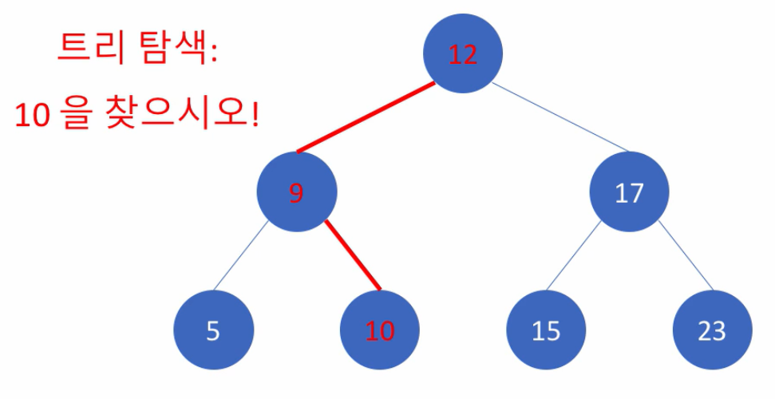
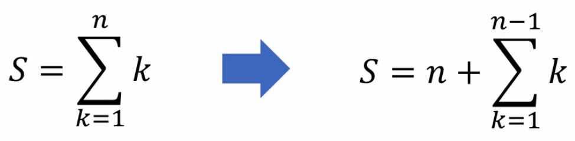
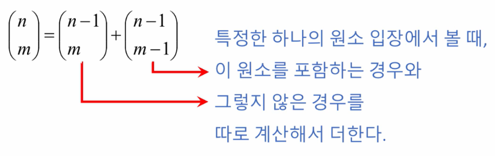
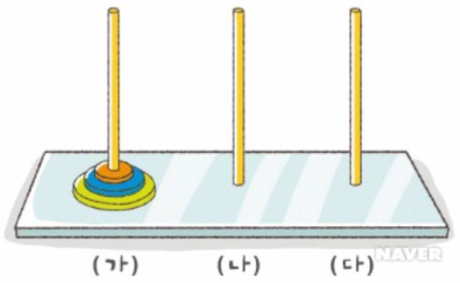
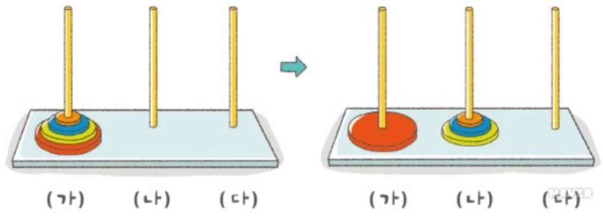
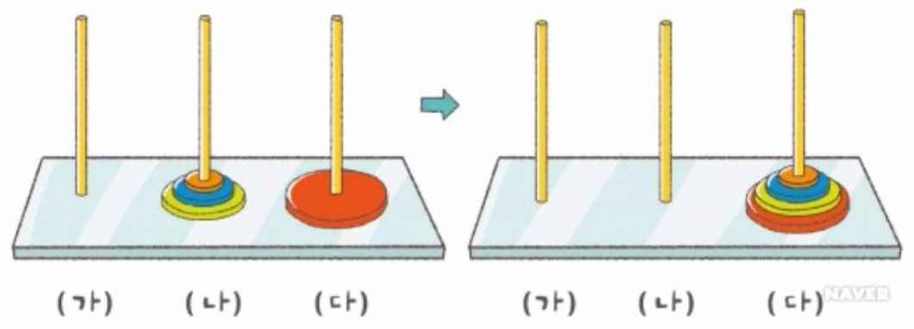
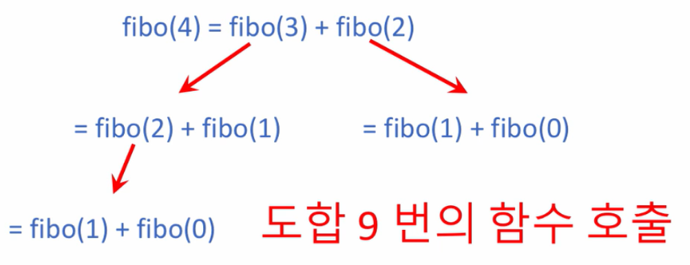
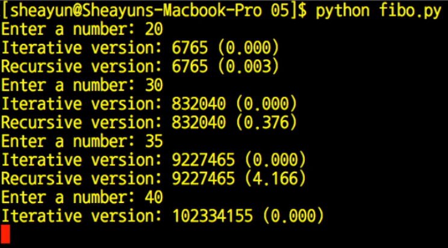

=============
재귀 알고리즘
=============

재귀함수 (Recursive function)이란 하나의 함수에서 자신을 다시 호출하여 작업을 수행하는 것이고, 많은 종류의 문제가 재귀적으로 (Recursively) 해결 가능하다.

또한, 재귀 함수에서 재귀 호출의 종결 조건 (if)이 매우 중요하다 왜냐하면 종결조건이 있어야 재귀 함수가 끝나기 때문이다.

.. code-block:: python

    def sum(n):
        if n <= 1:
            ...
            # 매우 중요!!

        else:
            ...
            sum(...)

예제
=====

예제 1: 이진 트리
*****************

이진 트리는 아래와 같은 조건을 만족하는 트리이다.

* 왼쪽 서브 트리의 원소들은 모두 루트보다 작거나 같을 것
* 오른쪽 서브 트리의 원소들은 모두 루트보다 클 것

이러한 이진 트리를 활용하면 다음과 같은 문제를 해결할 수 있다.

예제2: 자연수의 합 구하기
************************

* 문제: 1부터 n까지 모든 자연수의 합을 구하시오.

-------------------
재귀 알고리즘의 효율
-------------------

* Recursive version: :math:`O(n)`

.. code-block:: python

    def sum(n):
        if n <= 1:
            return 1
        else:
            return n + sum(n-1)

* Iterative version: :math:`O(n)`

.. code-block:: python

    def sum(n):
        s = 0
        while n >= 0:
            s += n
            n -= 1
        return s

* More effective algorithm: :math:`O(1)`

.. code-block:: python
    def sum(n):
        return n * (n+1) // 2

예제 3: :math:`n!`
*******************

.. code-block:: python

    def what(n):
        if n <= 1:
            return 1
        else:
            return n * what(n-1)

예제 4: Fibonacci 순열
**********************

* 문제 설명

.. code-block:: text

    인자로 0 또는 양의 정수인 x 가 주어질 때, Fibonacci 순열의 해당 값을 구하여 반환하는 함수 solution() 을 완성하세요.

    Fibonacci 순열은 아래와 같이 정의됩니다.
    F0 = 0
    F1 = 1
    Fn = Fn - 1 + Fn - 2, n >= 2

    재귀함수 작성 연습을 의도한 것이므로, 재귀적 방법으로도 프로그래밍해 보고, 반복적 방법으로도 프로그래밍해 보시기 바랍니다.

.. code-block:: python

    def fibonacci(n):
        if n == 0:
            return 0
        elif n == 1:
            return 1
        
        return fibonacci(n-1) + fibonacci(n-2)

    fibonacci(x)

예제 5: 조합의 수 계산
*********************

* 문제: n개의 서로 다른 원소에서 m 개를 택하는 경우의 수

* Factorial

:math:`\begin{pmatrix} n \\ m \end{pmatrix} \frac{n!}{m! (n-m)!}`

.. code-block:: python

    from math import factorial as f

    def combi(n, m):
        return f(n) / (f(m) * f(n-m))

* Recursive

.. code-block:: python

    def comb(n, m):
        if n == m:
            return 1
        elif m == 0:
            return 1
        else:
            return comb(n-1, m) + comb(n-1, m-1)

예제 6: 하노이 탑
*****************

하노이 탑과 같은 문제를 해결할 때, 재귀 알고리즘이 유용하다.

재귀 알고리즘의 효율
===================

.. code-block:: python

    import time

    def rec(n):
        if n <= 1:
            return n
        return rec(n - 1) + rec(n - 2)

    def iter(n):
        if n <= 1:
            return n

        i = 2
        t0 = 0
        t1 = 1
        while i <= n:
            t0, t1 = t1, t0 + t1
            i += 1
        return t1

    while True:
        n = int(input('Enter a number: '))
        if n == -1:
            break

        ts = time.time()
        fib = iter(n)
        print('Iterative: %d (%.3f)' % (fib, time.time() - ts))

        ts = time.time()
        fib = rec(n)
        print('Recursive: %d (%.3f)' % (fib, time.time() - ts))

연습 문제
=========

* 문제 설명

.. code-block:: text

    리스트 L 과, 그 안에서 찾으려 하는 원소 x 가 인자로 주어지고, 또한 탐색의 대상이 되는 리스트 내에서의 범위 인덱스가 l 부터 u 까지로 (인자로) 정해질 때, x 와 같은 값을 가지는 원소의 인덱스를 리턴하는 함수 solution() 을 완성하세요. 만약 리스트 L 안에 x 와 같은 값을 가지는 원소가 존재하지 않는 경우에는 -1 을 리턴합니다. 리스트 L 은 자연수 원소들로 이루어져 있으며, 크기 순으로 정렬되어 있다고 가정합니다. 또한, 동일한 원소는 두 번 이상 나타나지 않습니다.

    인덱스 범위를 나타내는 l 과 u 가 인자로 주어지는 이유는, 이 함수를 재귀적인 방법으로 구현하기 위함입니다. 빈 칸에 알맞은 내용을 채워서 재귀 함수인 solution() 을 완성하세요.

    예를 들어,
    L = [2, 3, 5, 6, 9, 11, 15]
    x = 6
    l = 0
    u = 6
    의 인자들이 주어지면, L[3] == 6 이므로 3 을 리턴해야 합니다.

    또 다른 예로,
    L = [2, 5, 7, 9, 11]
    x = 4
    l = 0
    u = 4
    로 주어지면, 리스트 L 내에 4 의 원소가 존재하지 않으므로 -1 을 리턴해야 합니다.

* 코드

.. code-block:: python

    def solution(L, x, l, u):
        if l > u:
            return -1

        mid = (l + u) // 2
        if x == L[mid]:
            return mid
        elif x < L[mid]:
            return solution(L, x, l, mid-1)
        else:
            return solution(L, x, mid+1, u)

참조
====

* https://programmers.co.kr/learn/courses/57
