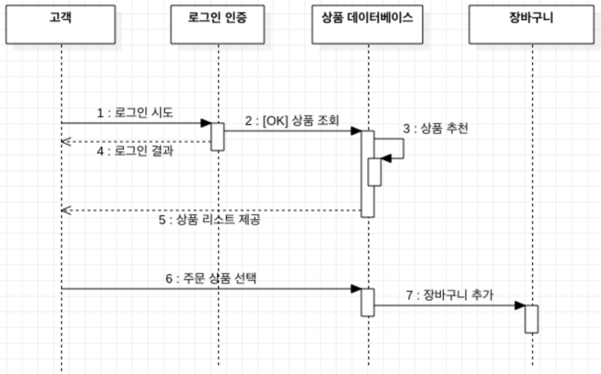

UML
====

통합 모델링 언어(UML, 영어: Unified Modeling Language)는 소프트웨어 공학에서 사용되는 표준화된 범용 모델링 언어이다. 이 표준은 UML을 고안한 객체 관리 그룹에서 관리 하고 있다. UML은 소프트웨어 집약 시스템의 시각적 모델을 만들기 위한 도안 표기법을 포함한다.

================
Sequence diagram
================

문제 해결을 위한 객체를 정의하고 객체 간의 상호작용 메시지 시퀀스를 시간의 흐름에 따라 나타내는 다이어그램

**Example: 쇼핑몰**

==========
Reference
==========

* https://ko.wikipedia.org/wiki/%ED%86%B5%ED%95%A9_%EB%AA%A8%EB%8D%B8%EB%A7%81_%EC%96%B8%EC%96%B4
* https://thinking-jmini.tistory.com/29